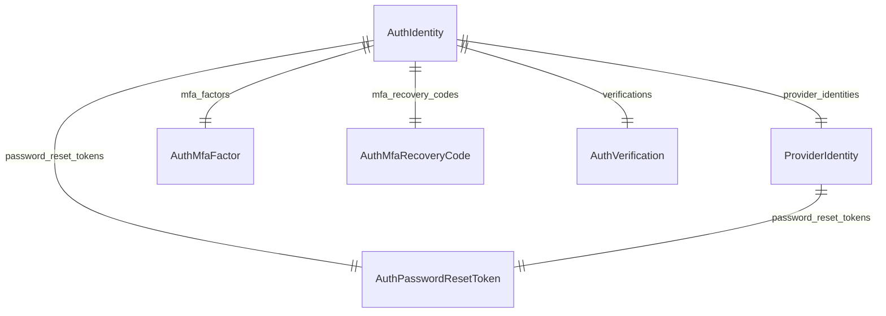

This documentation provides a reference to the data models in the Auth Module

## Relations Overview

## Data Models

- [AuthIdentity](/resources/references/auth/models/AuthIdentity)
- [AuthMfaFactor](/resources/references/auth/models/AuthMfaFactor)
- [AuthMfaRecoveryCode](/resources/references/auth/models/AuthMfaRecoveryCode)
- [AuthPasswordResetToken](/resources/references/auth/models/AuthPasswordResetToken)
- [AuthVerification](/resources/references/auth/models/AuthVerification)
- [ProviderIdentity](/resources/references/auth/models/ProviderIdentity)
