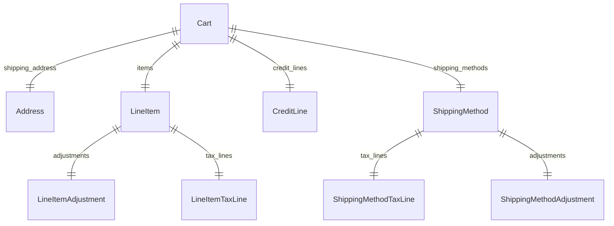

This documentation provides a reference to the data models in the Cart Module

## Relations Overview

## Data Models

- [Address](/resources/references/cart/models/Address)
- [Cart](/resources/references/cart/models/Cart)
- [CreditLine](/resources/references/cart/models/CreditLine)
- [LineItem](/resources/references/cart/models/LineItem)
- [LineItemAdjustment](/resources/references/cart/models/LineItemAdjustment)
- [LineItemTaxLine](/resources/references/cart/models/LineItemTaxLine)
- [ShippingMethod](/resources/references/cart/models/ShippingMethod)
- [ShippingMethodAdjustment](/resources/references/cart/models/ShippingMethodAdjustment)
- [ShippingMethodTaxLine](/resources/references/cart/models/ShippingMethodTaxLine)
