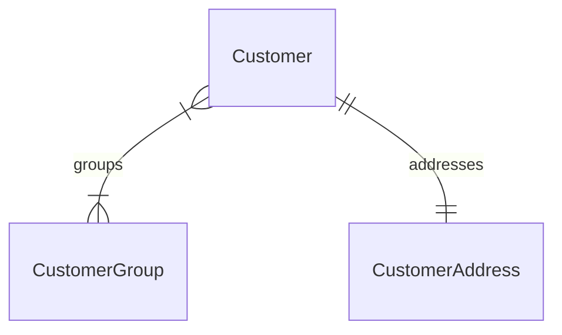

This documentation provides a reference to the data models in the Customer Module

## Relations Overview

## Data Models

- [Customer](/resources/references/customer/models/Customer)
- [CustomerAddress](/resources/references/customer/models/CustomerAddress)
- [CustomerGroup](/resources/references/customer/models/CustomerGroup)
- [CustomerGroupCustomer](/resources/references/customer/models/CustomerGroupCustomer)
