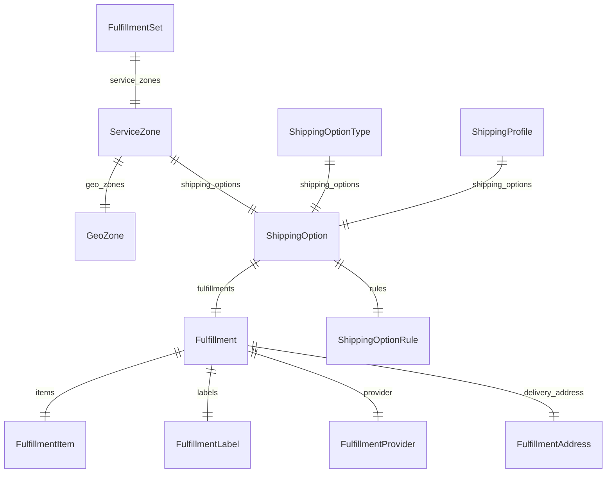

This documentation provides a reference to the data models in the Fulfillment Module

## Relations Overview

## Type Aliases

- [GeoZoneSchema](/resources/references/fulfillment/models/GeoZoneSchema)
- [ServiceZoneSchema](/resources/references/fulfillment/models/ServiceZoneSchema)

## Data Models

- [Fulfillment](/resources/references/fulfillment/models/Fulfillment)
- [FulfillmentAddress](/resources/references/fulfillment/models/FulfillmentAddress)
- [FulfillmentItem](/resources/references/fulfillment/models/FulfillmentItem)
- [FulfillmentLabel](/resources/references/fulfillment/models/FulfillmentLabel)
- [FulfillmentProvider](/resources/references/fulfillment/models/FulfillmentProvider)
- [FulfillmentSet](/resources/references/fulfillment/models/FulfillmentSet)
- [GeoZone](/resources/references/fulfillment/models/GeoZone)
- [ServiceZone](/resources/references/fulfillment/models/ServiceZone)
- [ShippingOption](/resources/references/fulfillment/models/ShippingOption)
- [ShippingOptionRule](/resources/references/fulfillment/models/ShippingOptionRule)
- [ShippingOptionType](/resources/references/fulfillment/models/ShippingOptionType)
- [ShippingProfile](/resources/references/fulfillment/models/ShippingProfile)
