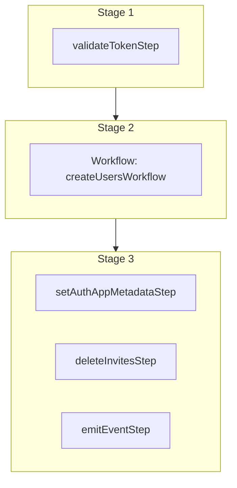

This documentation provides a reference to the `acceptInviteWorkflow`. It belongs to the `@medusajs/medusa/core-flows` package.

This workflow accepts an invite and creates a user. It's used by the
[Accept Invite Admin API Route](/api/admin/invites/accept-invite).

The workflow throws an error if the specified token is not valid. Also, the workflow
requires an auth identity to be created previously. You can create an auth identity
using the [Retrieve Registration JWT Token API Route](/api/admin/auth/retrieve-registration-jwt-token).

You can use this workflow within your customizations or your own custom workflows, allowing you to
accept invites within your custom flows.

[View source code](https://github.com/medusajs/medusa/blob/0ed927bdb7a396a8fd5f6447ed69b7b354b150d3/packages/core/core-flows/src/invite/workflows/accept-invite.ts#L46)

## Examples

**API Route**

```ts title="src/api/workflow/route.ts"
import type {
  MedusaRequest,
  MedusaResponse,
} from "@medusajs/framework/http"
import { acceptInviteWorkflow } from "@medusajs/medusa/core-flows"

export async function POST(
  req: MedusaRequest,
  res: MedusaResponse
) {
  const { result } = await acceptInviteWorkflow(req.scope)
    .run({
      input: {
        invite_token: "sk_123",
        auth_identity_id: "au_123",
        user: {
          email: "example@gmail.com",
          first_name: "John",
          last_name: "Doe",
        }
      }
    })

  res.send(result)
}
```

**Subscriber**

```ts title="src/subscribers/order-placed.ts"
import {
  type SubscriberConfig,
  type SubscriberArgs,
} from "@medusajs/framework"
import { acceptInviteWorkflow } from "@medusajs/medusa/core-flows"

export default async function handleOrderPlaced({
  event: { data },
  container,
}: SubscriberArgs < { id: string } > ) {
  const { result } = await acceptInviteWorkflow(container)
    .run({
      input: {
        invite_token: "sk_123",
        auth_identity_id: "au_123",
        user: {
          email: "example@gmail.com",
          first_name: "John",
          last_name: "Doe",
        }
      }
    })

  console.log(result)
}

export const config: SubscriberConfig = {
  event: "order.placed",
}
```

**Scheduled Job**

```ts title="src/jobs/message-daily.ts"
import { MedusaContainer } from "@medusajs/framework/types"
import { acceptInviteWorkflow } from "@medusajs/medusa/core-flows"

export default async function myCustomJob(
  container: MedusaContainer
) {
  const { result } = await acceptInviteWorkflow(container)
    .run({
      input: {
        invite_token: "sk_123",
        auth_identity_id: "au_123",
        user: {
          email: "example@gmail.com",
          first_name: "John",
          last_name: "Doe",
        }
      }
    })

  console.log(result)
}

export const config = {
  name: "run-once-a-day",
  schedule: "0 0 * * *",
}
```

**Another Workflow**

```ts title="src/workflows/my-workflow.ts"
import { createWorkflow } from "@medusajs/framework/workflows-sdk"
import { acceptInviteWorkflow } from "@medusajs/medusa/core-flows"

const myWorkflow = createWorkflow(
  "my-workflow",
  () => {
    const result = acceptInviteWorkflow
      .runAsStep({
        input: {
          invite_token: "sk_123",
          auth_identity_id: "au_123",
          user: {
            email: "example@gmail.com",
            first_name: "John",
            last_name: "Doe",
          }
        }
      })
  }
)
```

<a id="acceptinviteworkflow-steps" />

## Steps



Stages follow the order in the workflow definition. Conditional steps run only when their condition is met. The step descriptions below include the conditions and reference links.

- [validateTokenStep](/resources/references/medusa-workflows/steps/validateTokenStep): This step validates a specified token and returns its associated invite. If not valid, the step throws an error.
  - [createUsersWorkflow](/resources/references/medusa-workflows/createUsersWorkflow): Create one or more users with optional role assignment.
    - [setAuthAppMetadataStep](/resources/references/medusa-workflows/steps/setAuthAppMetadataStep): This step sets the `app_metadata` property of an auth identity. This is useful to associate a user (whether it's an admin user or customer) with an auth identity that allows them to authenticate into Medusa. You can learn more about auth identites in [this documentation](/resources/commerce-modules/auth/auth-identity-and-actor-types). To use this for a custom actor type, check out [this guide](/resources/commerce-modules/auth/create-actor-type) that explains how to create a custom `manager` actor type and manage its users.
    - [deleteInvitesStep](/resources/references/medusa-workflows/steps/deleteInvitesStep): This step deletes one or more invites.
    - [emitEventStep](/resources/references/medusa-workflows/steps/emitEventStep): This step emits an event, which you can listen to in a [subscriber](/learn/fundamentals/events-and-subscribers). You can pass data to the subscriber by including it in the `data` property. The event is only emitted after the workflow has finished successfully. So, even if it's executed in the middle of the workflow, it won't actually emit the event until the workflow has completed successfully. If the workflow fails, it won't emit the event at all.

<a id="acceptinviteworkflow-input" />

## Input

**acceptInviteWorkflow**

- `AcceptInviteWorkflowInputDTO`: [AcceptInviteWorkflowInputDTO](/resources/references/types/WorkflowTypes/InviteWorkflow/interfaces/typesWorkflowTypesInviteWorkflowAcceptInviteWorkflowInputDTO)
  - `invite_token`: `string` — The invite token.
  - `auth_identity_id`: `string` — The ID of the auth identity to associate the user with.
  - `user`: `object` — The user to create.
    - `email`: `string` (optional) — The email of the user.
    - `first_name`: `null` | `string` (optional) — The first name of the user.
    - `last_name`: `null` | `string` (optional) — The last name of the user.
    - `avatar_url`: `null` | `string` (optional) — The avatar URL of the user.
    - `metadata`: `null` | `Record<string, unknown>` (optional) — Custom key-value pairs of data to store in the user.

<a id="acceptinviteworkflow-output" />

## Output

**acceptInviteWorkflow**

- `UserDTO[]`: [UserDTO](/resources/references/user/interfaces/userUserDTO)\[]
  - `id`: `string` — The ID of the user.
  - `email`: `string` — The email of the user.
  - `first_name`: `null` | `string` — The first name of the user.
  - `last_name`: `null` | `string` — The last name of the user.
  - `avatar_url`: `null` | `string` — The avatar URL of the user.
  - `metadata`: `null` | `Record<string, unknown>` — Holds custom data in key-value pairs.
  - `roles`: `null` | `string`\[] (optional) — The RBAC roles assigned to the user.
  - `created_at`: `Date` — The creation date of the user.
  - `updated_at`: `Date` — The updated date of the user.
  - `deleted_at`: `null` | `Date` — The deletion date of the user.

<a id="acceptinviteworkflow-emitted-events" />

## Emitted Events

- `user.created`: Emitted when users are created.

  ```ts
  {
    id, // The ID of the user
  }
  ```
- `invite.accepted`: Emitted when an invite is accepted.

  ```ts
  {
    id, // The ID of the invite
  }
  ```
