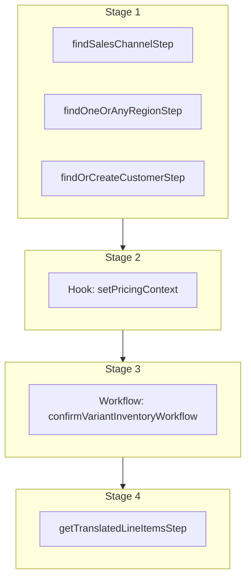

This documentation provides a reference to the `addOrderLineItemsWorkflow`. It belongs to the `@medusajs/medusa/core-flows` package.

This workflow adds line items to an order. This is useful when making edits to
an order. It's used by other workflows, such as [orderEditAddNewItemWorkflow](/resources/references/medusa-workflows/orderEditAddNewItemWorkflow).

You can use this workflow within your customizations or your own custom workflows, allowing you to wrap custom logic around adding items to
an order.

[View source code](https://github.com/medusajs/medusa/blob/0ed927bdb7a396a8fd5f6447ed69b7b354b150d3/packages/core/core-flows/src/order/workflows/add-line-items.ts#L103)

## Examples

**API Route**

```ts title="src/api/workflow/route.ts"
import type {
  MedusaRequest,
  MedusaResponse,
} from "@medusajs/framework/http"
import { addOrderLineItemsWorkflow } from "@medusajs/medusa/core-flows"

export async function POST(
  req: MedusaRequest,
  res: MedusaResponse
) {
  const { result } = await addOrderLineItemsWorkflow(req.scope)
    .run({
      input: {
        order_id: "order_123",
        items: [{
          variant_id: "variant_123",
          quantity: 1,
        }]
      }
    })

  res.send(result)
}
```

**Subscriber**

```ts title="src/subscribers/order-placed.ts"
import {
  type SubscriberConfig,
  type SubscriberArgs,
} from "@medusajs/framework"
import { addOrderLineItemsWorkflow } from "@medusajs/medusa/core-flows"

export default async function handleOrderPlaced({
  event: { data },
  container,
}: SubscriberArgs < { id: string } > ) {
  const { result } = await addOrderLineItemsWorkflow(container)
    .run({
      input: {
        order_id: "order_123",
        items: [{
          variant_id: "variant_123",
          quantity: 1,
        }]
      }
    })

  console.log(result)
}

export const config: SubscriberConfig = {
  event: "order.placed",
}
```

**Scheduled Job**

```ts title="src/jobs/message-daily.ts"
import { MedusaContainer } from "@medusajs/framework/types"
import { addOrderLineItemsWorkflow } from "@medusajs/medusa/core-flows"

export default async function myCustomJob(
  container: MedusaContainer
) {
  const { result } = await addOrderLineItemsWorkflow(container)
    .run({
      input: {
        order_id: "order_123",
        items: [{
          variant_id: "variant_123",
          quantity: 1,
        }]
      }
    })

  console.log(result)
}

export const config = {
  name: "run-once-a-day",
  schedule: "0 0 * * *",
}
```

**Another Workflow**

```ts title="src/workflows/my-workflow.ts"
import { createWorkflow } from "@medusajs/framework/workflows-sdk"
import { addOrderLineItemsWorkflow } from "@medusajs/medusa/core-flows"

const myWorkflow = createWorkflow(
  "my-workflow",
  () => {
    const result = addOrderLineItemsWorkflow
      .runAsStep({
        input: {
          order_id: "order_123",
          items: [{
            variant_id: "variant_123",
            quantity: 1,
          }]
        }
      })
  }
)
```

<a id="addorderlineitemsworkflow-steps" />

## Steps



Stages follow the order in the workflow definition. Conditional steps run only when their condition is met. The step descriptions below include the conditions and reference links.

- [findSalesChannelStep](/resources/references/medusa-workflows/steps/findSalesChannelStep): This step either retrieves a sales channel either using the ID provided as an input, or, if no ID is provided, the default sales channel of the first store.
- [findOneOrAnyRegionStep](/resources/references/medusa-workflows/steps/findOneOrAnyRegionStep): This step retrieves a region either by the provided ID or the first region in the first store.
- [findOrCreateCustomerStep](/resources/references/medusa-workflows/steps/findOrCreateCustomerStep): This step finds or creates a customer based on the provided ID or email. It prioritizes finding the customer by ID, then by email. The step creates a new customer either if: - No customer is found with the provided ID and email; - Or if it found the customer by ID but their email does not match the email in the input. The step returns the details of the customer found or created, along with their email.
  - [setPricingContext](/resources/references/medusa-workflows/addOrderLineItemsWorkflow#setpricingcontext): This hook is executed after the order is retrieved and before the line items are created. You can consume this hook to return any custom context useful for the prices retrieval of the variants to be added to the order. For example, assuming you have the following custom pricing rule: `json { "attribute": "location_id", "operator": "eq", "value": "sloc_123", } ` You can consume the `setPricingContext` hook to add the `location_id` context to the prices calculation: `ts import { addOrderLineItemsWorkflow } from "@medusajs/medusa/core-flows"; import { StepResponse } from "@medusajs/workflows-sdk"; addOrderLineItemsWorkflow.hooks.setPricingContext(( { order, variantIds, region, customerData, additional_data }, { container } ) => { return new StepResponse({ location_id: "sloc_123", // Special price for in-store purchases }); }); ` The variants' prices will now be retrieved using the context you return. :::note Learn more about prices calculation context in the [Prices Calculation](/resources/commerce-modules/pricing/price-calculation) documentation. :::
    - [confirmVariantInventoryWorkflow](/resources/references/medusa-workflows/confirmVariantInventoryWorkflow): Validate that a variant is in-stock before adding to the cart.
      - [getTranslatedLineItemsStep](/resources/references/medusa-workflows/steps/getTranslatedLineItemsStep): This step translates cart line items based on their associated variant and product IDs. It fetches translations for the product (title, description, subtitle) and variant (title), then applies them to the corresponding line item fields.

<a id="addorderlineitemsworkflow-input" />

## Input

**addOrderLineItemsWorkflow**

- `OrderAddLineItemWorkflowInput & AdditionalData`: [OrderAddLineItemWorkflowInput](/resources/references/types/WorkflowTypes/OrderWorkflow/interfaces/typesWorkflowTypesOrderWorkflowOrderAddLineItemWorkflowInput) & [AdditionalData](/resources/references/types/HttpTypes/types/typesHttpTypesAdditionalData)
  - `OrderAddLineItemWorkflowInput`: `object` — The details of the line items to add to the order.
  - `AdditionalData`: `object` — Additional data, passed through the `additional_data` property accepted in HTTP requests, that allows passing custom data and handle them in hooks. Learn more in [this documentation](/learn/fundamentals/api-routes/additional-data).

<a id="addorderlineitemsworkflow-output" />

## Output

**addOrderLineItemsWorkflow**

- `OrderLineItemDTO[]`: [OrderLineItemDTO](/resources/references/fulfillment/interfaces/fulfillmentOrderLineItemDTO)\[]
  - `original_total`: [BigNumberValue](/resources/references/fulfillment/types/fulfillmentBigNumberValue) — The original total of the order line item.
    - `numeric`: `number`
    - `raw`: [BigNumberRawValue](/resources/references/fulfillment/types/fulfillmentBigNumberRawValue) (optional)
    - `bigNumber`: `BigNumber` (optional)
  - `original_subtotal`: [BigNumberValue](/resources/references/fulfillment/types/fulfillmentBigNumberValue) — The original subtotal of the order line item.
    - `numeric`: `number`
    - `raw`: [BigNumberRawValue](/resources/references/fulfillment/types/fulfillmentBigNumberRawValue) (optional)
    - `bigNumber`: `BigNumber` (optional)
  - `original_tax_total`: [BigNumberValue](/resources/references/fulfillment/types/fulfillmentBigNumberValue) — The original tax total of the order line item.
    - `numeric`: `number`
    - `raw`: [BigNumberRawValue](/resources/references/fulfillment/types/fulfillmentBigNumberRawValue) (optional)
    - `bigNumber`: `BigNumber` (optional)
  - `item_total`: [BigNumberValue](/resources/references/fulfillment/types/fulfillmentBigNumberValue) — The item total of the order line item.
    - `numeric`: `number`
    - `raw`: [BigNumberRawValue](/resources/references/fulfillment/types/fulfillmentBigNumberRawValue) (optional)
    - `bigNumber`: `BigNumber` (optional)
  - `item_subtotal`: [BigNumberValue](/resources/references/fulfillment/types/fulfillmentBigNumberValue) — The item subtotal of the order line item.
    - `numeric`: `number`
    - `raw`: [BigNumberRawValue](/resources/references/fulfillment/types/fulfillmentBigNumberRawValue) (optional)
    - `bigNumber`: `BigNumber` (optional)
  - `item_tax_total`: [BigNumberValue](/resources/references/fulfillment/types/fulfillmentBigNumberValue) — The item tax total of the order line item.
    - `numeric`: `number`
    - `raw`: [BigNumberRawValue](/resources/references/fulfillment/types/fulfillmentBigNumberRawValue) (optional)
    - `bigNumber`: `BigNumber` (optional)
  - `total`: [BigNumberValue](/resources/references/fulfillment/types/fulfillmentBigNumberValue) — The total of the order line item.
    - `numeric`: `number`
    - `raw`: [BigNumberRawValue](/resources/references/fulfillment/types/fulfillmentBigNumberRawValue) (optional)
    - `bigNumber`: `BigNumber` (optional)
  - `subtotal`: [BigNumberValue](/resources/references/fulfillment/types/fulfillmentBigNumberValue) — The subtotal of the order line item.
    - `numeric`: `number`
    - `raw`: [BigNumberRawValue](/resources/references/fulfillment/types/fulfillmentBigNumberRawValue) (optional)
    - `bigNumber`: `BigNumber` (optional)
  - `tax_total`: [BigNumberValue](/resources/references/fulfillment/types/fulfillmentBigNumberValue) — The tax total of the order line item.
    - `numeric`: `number`
    - `raw`: [BigNumberRawValue](/resources/references/fulfillment/types/fulfillmentBigNumberRawValue) (optional)
    - `bigNumber`: `BigNumber` (optional)
  - `discount_total`: [BigNumberValue](/resources/references/fulfillment/types/fulfillmentBigNumberValue) — The discount total of the order line item.
    - `numeric`: `number`
    - `raw`: [BigNumberRawValue](/resources/references/fulfillment/types/fulfillmentBigNumberRawValue) (optional)
    - `bigNumber`: `BigNumber` (optional)
  - `discount_tax_total`: [BigNumberValue](/resources/references/fulfillment/types/fulfillmentBigNumberValue) — The discount tax total of the order line item.
    - `numeric`: `number`
    - `raw`: [BigNumberRawValue](/resources/references/fulfillment/types/fulfillmentBigNumberRawValue) (optional)
    - `bigNumber`: `BigNumber` (optional)
  - `refundable_total`: [BigNumberValue](/resources/references/fulfillment/types/fulfillmentBigNumberValue) — The refundable total of the order line item.
    - `numeric`: `number`
    - `raw`: [BigNumberRawValue](/resources/references/fulfillment/types/fulfillmentBigNumberRawValue) (optional)
    - `bigNumber`: `BigNumber` (optional)
  - `refundable_total_per_unit`: [BigNumberValue](/resources/references/fulfillment/types/fulfillmentBigNumberValue) — The refundable total per unit of the order line item.
    - `numeric`: `number`
    - `raw`: [BigNumberRawValue](/resources/references/fulfillment/types/fulfillmentBigNumberRawValue) (optional)
    - `bigNumber`: `BigNumber` (optional)
  - `raw_original_total`: [BigNumberRawValue](/resources/references/fulfillment/types/fulfillmentBigNumberRawValue) — The raw original total of the order line item.
    - `value`: `string` | `number`
  - `raw_original_subtotal`: [BigNumberRawValue](/resources/references/fulfillment/types/fulfillmentBigNumberRawValue) — The raw original subtotal of the order line item.
    - `value`: `string` | `number`
  - `raw_original_tax_total`: [BigNumberRawValue](/resources/references/fulfillment/types/fulfillmentBigNumberRawValue) — The raw original tax total of the order line item.
    - `value`: `string` | `number`
  - `raw_item_total`: [BigNumberRawValue](/resources/references/fulfillment/types/fulfillmentBigNumberRawValue) — The raw item total of the order line item.
    - `value`: `string` | `number`
  - `raw_item_subtotal`: [BigNumberRawValue](/resources/references/fulfillment/types/fulfillmentBigNumberRawValue) — The raw item subtotal of the order line item.
    - `value`: `string` | `number`
  - `raw_item_tax_total`: [BigNumberRawValue](/resources/references/fulfillment/types/fulfillmentBigNumberRawValue) — The raw item tax total of the order line item.
    - `value`: `string` | `number`
  - `raw_total`: [BigNumberRawValue](/resources/references/fulfillment/types/fulfillmentBigNumberRawValue) — The raw total of the order line item.
    - `value`: `string` | `number`
  - `raw_subtotal`: [BigNumberRawValue](/resources/references/fulfillment/types/fulfillmentBigNumberRawValue) — The raw subtotal of the order line item.
    - `value`: `string` | `number`
  - `raw_tax_total`: [BigNumberRawValue](/resources/references/fulfillment/types/fulfillmentBigNumberRawValue) — The raw tax total of the order line item.
    - `value`: `string` | `number`
  - `raw_discount_total`: [BigNumberRawValue](/resources/references/fulfillment/types/fulfillmentBigNumberRawValue) — The raw discount total of the order line item.
    - `value`: `string` | `number`
  - `raw_discount_tax_total`: [BigNumberRawValue](/resources/references/fulfillment/types/fulfillmentBigNumberRawValue) — The raw discount tax total of the order line item.
    - `value`: `string` | `number`
  - `raw_refundable_total`: [BigNumberRawValue](/resources/references/fulfillment/types/fulfillmentBigNumberRawValue) — The raw refundable total of the order line item..
    - `value`: `string` | `number`
  - `raw_refundable_total_per_unit`: [BigNumberRawValue](/resources/references/fulfillment/types/fulfillmentBigNumberRawValue) — The raw  refundable total per unit of the order line item.
    - `value`: `string` | `number`
  - `id`: `string` — The ID of the line item.
  - `title`: `string` — The title of the line item.
  - `subtitle`: `null` | `string` (optional) — The subtitle of the line item.
  - `thumbnail`: `null` | `string` (optional) — The thumbnail of the line item.
  - `variant_id`: `null` | `string` (optional) — The ID of the variant associated with the line item.
  - `product_id`: `null` | `string` (optional) — The ID of the product associated with the line item.
  - `product_title`: `null` | `string` (optional) — The title of the product associated with the line item.
  - `product_description`: `null` | `string` (optional) — The description of the product associated with the line item.
  - `product_subtitle`: `null` | `string` (optional) — The subtitle of the product associated with the line item.
  - `product_type_id`: `null` | `string` (optional) — The ID of the type of the product associated with the line item.
  - `product_type`: `null` | `string` (optional) — The type of the product associated with the line item.
  - `product_collection`: `null` | `string` (optional) — The collection of the product associated with the line item.
  - `product_handle`: `null` | `string` (optional) — The handle of the product associated with the line item.
  - `variant_sku`: `null` | `string` (optional) — The SKU (stock keeping unit) of the variant associated with the line item.
  - `variant_barcode`: `null` | `string` (optional) — The barcode of the variant associated with the line item.
  - `variant_title`: `null` | `string` (optional) — The title of the variant associated with the line item.
  - `variant_option_values`: `null` | `Record<string, unknown>` (optional) — The option values of the variant associated with the line item.
  - `requires_shipping`: `boolean` — Indicates whether the line item requires shipping.
  - `is_discountable`: `boolean` — Indicates whether the line item is discountable.
  - `is_giftcard`: `boolean` — Indicates whether the line item is a gift card.
  - `is_tax_inclusive`: `boolean` — Indicates whether the line item price is tax inclusive.
  - `compare_at_unit_price`: `number` (optional) — The compare at unit price of the line item.
  - `raw_compare_at_unit_price`: [BigNumberRawValue](/resources/references/fulfillment/types/fulfillmentBigNumberRawValue) (optional) — The raw compare at unit price of the line item.
    - `value`: `string` | `number`
  - `unit_price`: `number` — The unit price of the line item.
  - `raw_unit_price`: [BigNumberRawValue](/resources/references/fulfillment/types/fulfillmentBigNumberRawValue) — The raw unit price of the line item.
    - `value`: `string` | `number`
  - `quantity`: `number` — The quantity of the line item.
  - `raw_quantity`: [BigNumberRawValue](/resources/references/fulfillment/types/fulfillmentBigNumberRawValue) — The raw quantity of the line item.
    - `value`: `string` | `number`
  - `tax_lines`: [OrderLineItemTaxLineDTO](/resources/references/fulfillment/interfaces/fulfillmentOrderLineItemTaxLineDTO)\[] (optional) — The associated tax lines.
    - `id`: `string` — The ID of the tax line.
    - `description`: `string` (optional) — The description of the tax line.
    - `tax_rate_id`: `string` (optional) — The ID of the associated tax rate.
    - `code`: `string` — The code of the tax line.
    - `rate`: `number` — The rate of the tax line.
    - `provider_id`: `string` (optional) — The ID of the associated provider.
    - `data`: `null` | `Record<string, unknown>` (optional) — Holds data returned by the tax provider in key-value pairs.
    - `metadata`: `null` | `Record<string, unknown>` (optional) — Holds custom data in key-value pairs.
    - `created_at`: `string` | `Date` — When the tax line was created.
    - `updated_at`: `string` | `Date` — When the tax line was updated.
    - `item`: [OrderLineItemDTO](/resources/references/fulfillment/interfaces/fulfillmentOrderLineItemDTO) — The associated line item.
    - `item_id`: `string` — The ID of the associated line item.
    - `total`: [BigNumberValue](/resources/references/fulfillment/types/fulfillmentBigNumberValue) — The total tax relative to the item.
    - `subtotal`: [BigNumberValue](/resources/references/fulfillment/types/fulfillmentBigNumberValue) — The subtotal tax relative to the item.
  - `adjustments`: [OrderLineItemAdjustmentDTO](/resources/references/fulfillment/interfaces/fulfillmentOrderLineItemAdjustmentDTO)\[] (optional) — The associated adjustments.
    - `id`: `string` — The ID of the adjustment line
    - `code`: `string` (optional) — The code of the adjustment line
    - `amount`: [BigNumberValue](/resources/references/fulfillment/types/fulfillmentBigNumberValue) — The amount of the adjustment line
    - `order_id`: `string` — The ID of the associated order
    - `description`: `string` (optional) — The description of the adjustment line
    - `promotion_id`: `string` (optional) — The ID of the associated promotion
    - `provider_id`: `string` (optional) — The ID of the associated provider
    - `created_at`: `string` | `Date` — When the adjustment line was created
    - `updated_at`: `string` | `Date` — When the adjustment line was updated
    - `item`: [OrderLineItemDTO](/resources/references/fulfillment/interfaces/fulfillmentOrderLineItemDTO) — The associated line item.
    - `item_id`: `string` — The ID of the associated line item.
    - `version`: `number` — The version of the adjustment.
  - `detail`: [OrderItemDTO](/resources/references/fulfillment/interfaces/fulfillmentOrderItemDTO) — The details of the item
    - `id`: `string` — The ID of the order item.
    - `item_id`: `string` — The ID of the associated item.
    - `item`: [OrderLineItemDTO](/resources/references/fulfillment/interfaces/fulfillmentOrderLineItemDTO) — The associated line item.
    - `quantity`: `number` — The quantity of the order line item.
    - `fulfilled_quantity`: `number` — The fulfilled quantity of the order line item.
    - `delivered_quantity`: `number` — The delivered quantity of the order line item.
    - `shipped_quantity`: `number` — The shipped quantity of the order line item.
    - `return_requested_quantity`: `number` — The quantity of return requested for the order line item.
    - `return_received_quantity`: `number` — The quantity of return received for the order line item.
    - `return_dismissed_quantity`: `number` — The quantity of return dismissed for the order line item.
    - `written_off_quantity`: `number` — The quantity of written off for the order line item.
    - `metadata`: `null` | `Record<string, unknown>` — The metadata of the order detail
    - `created_at`: `Date` — The date when the order line item was created.
    - `updated_at`: `Date` — The date when the order line item was last updated.
  - `created_at`: `Date` — The date when the line item was created.
  - `updated_at`: `Date` — The date when the line item was last updated.
  - `metadata`: `null` | `Record<string, unknown>` (optional) — The versioned order item metadata. Holds custom data in key-value pairs.
  - `line_item_metadata`: `null` | `Record<string, unknown>` (optional) — The metadata of the line item. Holds custom data in key-value pairs.

## Hooks

Hooks allow you to inject custom functionalities into the workflow. You'll receive data from the workflow, as well as additional data sent through an HTTP request.

Learn more about [Hooks](/learn/fundamentals/workflows/workflow-hooks) and [Additional Data](/learn/fundamentals/api-routes/additional-data).

### setPricingContext

This hook is executed after the order is retrieved and before the line items are created. You can consume this hook to return any custom context useful for the prices retrieval of the variants to be added to the order.

For example, assuming you have the following custom pricing rule:

```json
{
  "attribute": "location_id",
  "operator": "eq",
  "value": "sloc_123",
}
```

You can consume the `setPricingContext` hook to add the `location_id` context to the prices calculation:

```ts
import { addOrderLineItemsWorkflow } from "@medusajs/medusa/core-flows";
import { StepResponse } from "@medusajs/workflows-sdk";

addOrderLineItemsWorkflow.hooks.setPricingContext((
  { order, variantIds, region, customerData, additional_data }, { container }
) => {
  return new StepResponse({
    location_id: "sloc_123", // Special price for in-store purchases
  });
});
```

The variants' prices will now be retrieved using the context you return.

> **Note**
>
> Learn more about prices calculation context in the [Prices Calculation](/resources/commerce-modules/pricing/price-calculation) documentation.

#### Example

```ts
import { addOrderLineItemsWorkflow } from "@medusajs/medusa/core-flows"

addOrderLineItemsWorkflow.hooks.setPricingContext(
  (async ({ order, variantIds, region, customerData,
    additional_data }, { container }) => {
    //TODO
  })
)
```

<a id="input" />

#### Input

Handlers consuming this hook accept the following input.

**setPricingContext**

- `input`: object — The input data for the hook.
  - `order`: `any`
  - `variantIds`: `string`\[]
  - `region`: `any`
  - `customerData`: [WorkflowDataProperties](/resources/references/workflows/types/workflowsWorkflowDataProperties)\<[FindOrCreateCustomerOutputStepOutput](/resources/references/core_flows/core_core_flows_src/interfaces/core_flowscore_core_flows_srcFindOrCreateCustomerOutputStepOutput)>
  - `additional_data`: `Record<string, unknown> | undefined` — Additional data that can be passed through the `additional_data` property in HTTP requests. Learn more in [this documentation](/learn/fundamentals/api-routes/additional-data).
