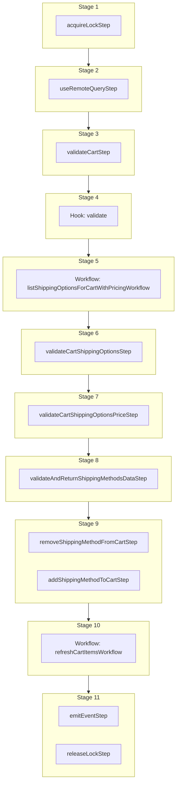

This documentation provides a reference to the `addShippingMethodToCartWorkflow`. It belongs to the `@medusajs/medusa/core-flows` package.

This workflow adds a shipping method to a cart. It's executed by the
[Add Shipping Method Store API Route](/api/store/carts/add-shipping-method).

You can use this workflow within your own customizations or custom workflows, allowing you to wrap custom logic around adding a shipping method to the cart.

> **Note**
>
> If you use this workflow in another, you must acquire a lock before running it and release the lock after. Learn more in the [Locking Operations in Workflows](/learn/fundamentals/workflows/locks#locks-in-nested-workflows) guide.

[View source code](https://github.com/medusajs/medusa/blob/0ed927bdb7a396a8fd5f6447ed69b7b354b150d3/packages/core/core-flows/src/cart/workflows/add-shipping-method-to-cart.ts#L83)

## Examples

**API Route**

```ts title="src/api/workflow/route.ts"
import type {
  MedusaRequest,
  MedusaResponse,
} from "@medusajs/framework/http"
import { addShippingMethodToCartWorkflow } from "@medusajs/medusa/core-flows"

export async function POST(
  req: MedusaRequest,
  res: MedusaResponse
) {
  const { result } = await addShippingMethodToCartWorkflow(req.scope)
    .run({
      input: {
        cart_id: "cart_123",
        options: [{
            id: "so_123",
          },
          {
            id: "so_124",
            data: {
              carrier_code: "fedex",
            }
          }
        ]
      }
    })

  res.send(result)
}
```

**Subscriber**

```ts title="src/subscribers/order-placed.ts"
import {
  type SubscriberConfig,
  type SubscriberArgs,
} from "@medusajs/framework"
import { addShippingMethodToCartWorkflow } from "@medusajs/medusa/core-flows"

export default async function handleOrderPlaced({
  event: { data },
  container,
}: SubscriberArgs < { id: string } > ) {
  const { result } = await addShippingMethodToCartWorkflow(container)
    .run({
      input: {
        cart_id: "cart_123",
        options: [{
            id: "so_123",
          },
          {
            id: "so_124",
            data: {
              carrier_code: "fedex",
            }
          }
        ]
      }
    })

  console.log(result)
}

export const config: SubscriberConfig = {
  event: "order.placed",
}
```

**Scheduled Job**

```ts title="src/jobs/message-daily.ts"
import { MedusaContainer } from "@medusajs/framework/types"
import { addShippingMethodToCartWorkflow } from "@medusajs/medusa/core-flows"

export default async function myCustomJob(
  container: MedusaContainer
) {
  const { result } = await addShippingMethodToCartWorkflow(container)
    .run({
      input: {
        cart_id: "cart_123",
        options: [{
            id: "so_123",
          },
          {
            id: "so_124",
            data: {
              carrier_code: "fedex",
            }
          }
        ]
      }
    })

  console.log(result)
}

export const config = {
  name: "run-once-a-day",
  schedule: "0 0 * * *",
}
```

**Another Workflow**

```ts title="src/workflows/my-workflow.ts"
import { createWorkflow } from "@medusajs/framework/workflows-sdk"
import { addShippingMethodToCartWorkflow } from "@medusajs/medusa/core-flows"

const myWorkflow = createWorkflow(
  "my-workflow",
  () => {
    // Acquire lock from nested workflow here
    // acquireLockStep({  key: input.cart_id,  timeout: 2,  ttl: 10,  })
    const result = addShippingMethodToCartWorkflow
      .runAsStep({
        input: {
          cart_id: "cart_123",
          options: [{
              id: "so_123",
            },
            {
              id: "so_124",
              data: {
                carrier_code: "fedex",
              }
            }
          ]
        }
      })
    // Release lock here
    // releaseLockStep({ key: input.cart_id })
  }
)
```

<a id="addshippingmethodtocartworkflow-steps" />

## Steps



Stages follow the order in the workflow definition. Conditional steps run only when their condition is met. The step descriptions below include the conditions and reference links.

- [acquireLockStep](/resources/references/medusa-workflows/steps/acquireLockStep): This step acquires a lock for a given key. Learn more about locks in the [Locking Module](/resources/infrastructure-modules/locking) guide.
  - [useRemoteQueryStep](/resources/references/medusa-workflows/steps/useRemoteQueryStep): This step fetches data across modules using the remote query. Learn more in the [Remote Query documentation](/learn/fundamentals/module-links/query). :::note This step is deprecated. Use [useQueryGraphStep](/resources/references/medusa-workflows/steps/useQueryGraphStep) instead. :::
    - [validateCartStep](/resources/references/medusa-workflows/steps/validateCartStep): This step validates a cart to ensure it exists and is not completed. If not valid, the step throws an error. :::tip You can use the [retrieveCartStep](/resources/references/medusa-workflows/steps/retrieveCartStep) to retrieve a cart's details. :::
      - [validate](/resources/references/medusa-workflows/addShippingMethodToCartWorkflow#validate): This hook is executed before all operations. You can consume this hook to perform any custom validation. If validation fails, you can throw an error to stop the workflow execution.
        - [listShippingOptionsForCartWithPricingWorkflow](/resources/references/medusa-workflows/listShippingOptionsForCartWithPricingWorkflow): List a cart's shipping options with prices.
          - [validateCartShippingOptionsStep](/resources/references/medusa-workflows/steps/validateCartShippingOptionsStep): This step validates shipping options to ensure they can be applied on a cart. If not valid, the step throws an error.
            - [validateCartShippingOptionsPriceStep](/resources/references/medusa-workflows/steps/validateCartShippingOptionsPriceStep): This step validates shipping options to ensure they have a price. If not valid, the step throws an error.
              - [validateAndReturnShippingMethodsDataStep](/resources/references/medusa-workflows/steps/validateAndReturnShippingMethodsDataStep): This step validates shipping options to ensure they can be applied on a cart. The step either returns the validated data or void.
                - [removeShippingMethodFromCartStep](/resources/references/medusa-workflows/steps/removeShippingMethodFromCartStep): This step removes shipping methods from a cart.
                - [addShippingMethodToCartStep](/resources/references/medusa-workflows/steps/addShippingMethodToCartStep): This step adds shipping methods to a cart.
                  - [refreshCartItemsWorkflow](/resources/references/medusa-workflows/refreshCartItemsWorkflow): Refresh a cart's details after an update.
                    - [emitEventStep](/resources/references/medusa-workflows/steps/emitEventStep): This step emits an event, which you can listen to in a [subscriber](/learn/fundamentals/events-and-subscribers). You can pass data to the subscriber by including it in the `data` property. The event is only emitted after the workflow has finished successfully. So, even if it's executed in the middle of the workflow, it won't actually emit the event until the workflow has completed successfully. If the workflow fails, it won't emit the event at all.
                    - [releaseLockStep](/resources/references/medusa-workflows/steps/releaseLockStep): This step releases a lock for a given key. Learn more about locks in the [Locking Module](/resources/infrastructure-modules/locking) guide.

<a id="addshippingmethodtocartworkflow-input" />

## Input

**addShippingMethodToCartWorkflow**

- `AddShippingMethodToCartWorkflowInput & AdditionalData`: [AddShippingMethodToCartWorkflowInput](/resources/references/core_flows/core_core_flows_src/interfaces/core_flowscore_core_flows_srcAddShippingMethodToCartWorkflowInput) & [AdditionalData](/resources/references/types/HttpTypes/types/typesHttpTypesAdditionalData)
  - `AddShippingMethodToCartWorkflowInput`: [AddShippingMethodToCartWorkflowInput](/resources/references/core_flows/core_core_flows_src/interfaces/core_flowscore_core_flows_srcAddShippingMethodToCartWorkflowInput)
    - `cart_id`: `string` — The ID of the cart to add the shipping method to.
    - `options`: `object`\[] — The shipping options to create the shipping methods from and add to the cart.
      - `id`: `string` — The ID of the shipping option.
      - `data`: `Record<string, unknown>` (optional) — Custom data useful for the fulfillment provider processing the shipping option or method. Learn more in [this documentation](/resources/commerce-modules/fulfillment/shipping-option#data-property).
  - `AdditionalData`: [AdditionalData](/resources/references/types/HttpTypes/types/typesHttpTypesAdditionalData)
    - `additional_data`: `Record<string, unknown>` (optional) — Additional data that can be passed through the `additional_data` property in HTTP requests. Learn more in [this documentation](/learn/fundamentals/api-routes/additional-data).

## Hooks

Hooks allow you to inject custom functionalities into the workflow. You'll receive data from the workflow, as well as additional data sent through an HTTP request.

Learn more about [Hooks](/learn/fundamentals/workflows/workflow-hooks) and [Additional Data](/learn/fundamentals/api-routes/additional-data).

### validate

This hook is executed before all operations. You can consume this hook to perform any custom validation. If validation fails, you can throw an error to stop the workflow execution.

#### Example

```ts
import { addShippingMethodToCartWorkflow } from "@medusajs/medusa/core-flows"

addShippingMethodToCartWorkflow.hooks.validate(
  (async ({ input, cart }, { container }) => {
    //TODO
  })
)
```

<a id="input" />

#### Input

Handlers consuming this hook accept the following input.

**validate**

- `input`: object — The input data for the hook.
  - `input`: [AddShippingMethodToCartWorkflowInput](/resources/references/core_flows/core_core_flows_src/interfaces/core_flowscore_core_flows_srcAddShippingMethodToCartWorkflowInput) & [AdditionalData](/resources/references/types/HttpTypes/types/typesHttpTypesAdditionalData)
    - `cart_id`: `string` — The ID of the cart to add the shipping method to.
    - `options`: `object`\[] — The shipping options to create the shipping methods from and add to the cart.
    - `additional_data`: `Record<string, unknown>` (optional) — Additional data that can be passed through the `additional_data` property in HTTP requests. Learn more in [this documentation](/learn/fundamentals/api-routes/additional-data).
  - `cart`: `any`

<a id="addshippingmethodtocartworkflow-emitted-events" />

## Emitted Events

- `cart.updated`: Emitted when a cart's details are updated.

  ```ts
  {
    id, // The ID of the cart
  }
  ```
