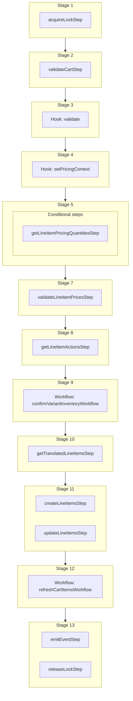

This documentation provides a reference to the `addToCartWorkflow`. It belongs to the `@medusajs/medusa/core-flows` package.

This workflow adds a product variant to a cart as a line item. It's executed by the
[Add Line Item Store API Route](/api/store/carts/add-line-item).

You can use this workflow within your own customizations or custom workflows, allowing you to wrap custom logic around adding an item to the cart.
For example, you can use this workflow to add a line item to the cart with a custom price.

> **Note**
>
> If you use this workflow in another, you must acquire a lock before running it and release the lock after. Learn more in the [Locking Operations in Workflows](/learn/fundamentals/workflows/locks#locks-in-nested-workflows) guide.

[View source code](https://github.com/medusajs/medusa/blob/0ed927bdb7a396a8fd5f6447ed69b7b354b150d3/packages/core/core-flows/src/cart/workflows/add-to-cart.ts#L123)

## Examples

**API Route**

```ts title="src/api/workflow/route.ts"
import type {
  MedusaRequest,
  MedusaResponse,
} from "@medusajs/framework/http"
import { addToCartWorkflow } from "@medusajs/medusa/core-flows"

export async function POST(
  req: MedusaRequest,
  res: MedusaResponse
) {
  const { result } = await addToCartWorkflow(req.scope)
    .run({
      input: {
        cart_id: "cart_123",
        items: [{
            variant_id: "variant_123",
            quantity: 1,
          },
          {
            variant_id: "variant_456",
            quantity: 1,
            unit_price: 20
          }
        ]
      }
    })

  res.send(result)
}
```

**Subscriber**

```ts title="src/subscribers/order-placed.ts"
import {
  type SubscriberConfig,
  type SubscriberArgs,
} from "@medusajs/framework"
import { addToCartWorkflow } from "@medusajs/medusa/core-flows"

export default async function handleOrderPlaced({
  event: { data },
  container,
}: SubscriberArgs < { id: string } > ) {
  const { result } = await addToCartWorkflow(container)
    .run({
      input: {
        cart_id: "cart_123",
        items: [{
            variant_id: "variant_123",
            quantity: 1,
          },
          {
            variant_id: "variant_456",
            quantity: 1,
            unit_price: 20
          }
        ]
      }
    })

  console.log(result)
}

export const config: SubscriberConfig = {
  event: "order.placed",
}
```

**Scheduled Job**

```ts title="src/jobs/message-daily.ts"
import { MedusaContainer } from "@medusajs/framework/types"
import { addToCartWorkflow } from "@medusajs/medusa/core-flows"

export default async function myCustomJob(
  container: MedusaContainer
) {
  const { result } = await addToCartWorkflow(container)
    .run({
      input: {
        cart_id: "cart_123",
        items: [{
            variant_id: "variant_123",
            quantity: 1,
          },
          {
            variant_id: "variant_456",
            quantity: 1,
            unit_price: 20
          }
        ]
      }
    })

  console.log(result)
}

export const config = {
  name: "run-once-a-day",
  schedule: "0 0 * * *",
}
```

**Another Workflow**

```ts title="src/workflows/my-workflow.ts"
import { createWorkflow } from "@medusajs/framework/workflows-sdk"
import { addToCartWorkflow } from "@medusajs/medusa/core-flows"

const myWorkflow = createWorkflow(
  "my-workflow",
  () => {
    // Acquire lock from nested workflow here
    // acquireLockStep({  key: input.cart_id,  timeout: 2,  ttl: 10,  })
    const result = addToCartWorkflow
      .runAsStep({
        input: {
          cart_id: "cart_123",
          items: [{
              variant_id: "variant_123",
              quantity: 1,
            },
            {
              variant_id: "variant_456",
              quantity: 1,
              unit_price: 20
            }
          ]
        }
      })
    // Release lock here
    // releaseLockStep({ key: input.cart_id })
  }
)
```

<a id="addtocartworkflow-steps" />

## Steps



Stages follow the order in the workflow definition. Conditional steps run only when their condition is met. The step descriptions below include the conditions and reference links.

- [acquireLockStep](/resources/references/medusa-workflows/steps/acquireLockStep): This step acquires a lock for a given key. Learn more about locks in the [Locking Module](/resources/infrastructure-modules/locking) guide.
  - [validateCartStep](/resources/references/medusa-workflows/steps/validateCartStep): This step validates a cart to ensure it exists and is not completed. If not valid, the step throws an error. :::tip You can use the [retrieveCartStep](/resources/references/medusa-workflows/steps/retrieveCartStep) to retrieve a cart's details. :::
    - [validate](/resources/references/medusa-workflows/addToCartWorkflow#validate): This hook is executed before all operations. You can consume this hook to perform any custom validation. If validation fails, you can throw an error to stop the workflow execution.
      - [setPricingContext](/resources/references/medusa-workflows/addToCartWorkflow#setpricingcontext): This hook is executed after the order is retrieved and before the line items are created. You can consume this hook to return any custom context useful for the prices retrieval of the variants to be added to the order. For example, assuming you have the following custom pricing rule: `json { "attribute": "location_id", "operator": "eq", "value": "sloc_123", } ` You can consume the `setPricingContext` hook to add the `location_id` context to the prices calculation: `ts import { addOrderLineItemsWorkflow } from "@medusajs/medusa/core-flows"; import { StepResponse } from "@medusajs/workflows-sdk"; addOrderLineItemsWorkflow.hooks.setPricingContext(( { order, variantIds, region, customerData, additional_data }, { container } ) => { return new StepResponse({ location_id: "sloc_123", // Special price for in-store purchases }); }); ` The variants' prices will now be retrieved using the context you return. :::note Learn more about prices calculation context in the [Prices Calculation](/resources/commerce-modules/pricing/price-calculation) documentation. :::
        - **when** (when: \{
          return !!variantIds.length
          })
        - [getLineItemPricingQuantitiesStep](/resources/references/medusa-workflows/steps/getLineItemPricingQuantitiesStep): This step resolves the quantity that each item added to a cart must be priced for. When an item is merged into an existing line item of the cart, its price has to be selected for the resulting total quantity, not only for the added quantity. Otherwise, quantity-based prices (such as price list tiers) are resolved against the wrong quantity. The returned quantities are aligned, by index, with the input items.
          - [validateLineItemPricesStep](/resources/references/medusa-workflows/steps/validateLineItemPricesStep): This step validates the specified line item objects to ensure they have prices. If an item doesn't have a price, the step throws an error.
            - [getLineItemActionsStep](/resources/references/medusa-workflows/steps/getLineItemActionsStep): This step returns lists of cart line items to create or update based on the provided input.
              - [confirmVariantInventoryWorkflow](/resources/references/medusa-workflows/confirmVariantInventoryWorkflow): Validate that a variant is in-stock before adding to the cart.
                - [getTranslatedLineItemsStep](/resources/references/medusa-workflows/steps/getTranslatedLineItemsStep): This step translates cart line items based on their associated variant and product IDs. It fetches translations for the product (title, description, subtitle) and variant (title), then applies them to the corresponding line item fields.
                  - [createLineItemsStep](/resources/references/medusa-workflows/steps/createLineItemsStep): This step creates line item in a cart.
                  - [updateLineItemsStep](/resources/references/medusa-workflows/steps/updateLineItemsStep): This step updates a cart's line items.
                    - [refreshCartItemsWorkflow](/resources/references/medusa-workflows/refreshCartItemsWorkflow): Refresh a cart's details after an update.
                      - [emitEventStep](/resources/references/medusa-workflows/steps/emitEventStep): This step emits an event, which you can listen to in a [subscriber](/learn/fundamentals/events-and-subscribers). You can pass data to the subscriber by including it in the `data` property. The event is only emitted after the workflow has finished successfully. So, even if it's executed in the middle of the workflow, it won't actually emit the event until the workflow has completed successfully. If the workflow fails, it won't emit the event at all.
                      - [releaseLockStep](/resources/references/medusa-workflows/steps/releaseLockStep): This step releases a lock for a given key. Learn more about locks in the [Locking Module](/resources/infrastructure-modules/locking) guide.

<a id="addtocartworkflow-input" />

## Input

**addToCartWorkflow**

- `AddToCartWorkflowInputDTO & AdditionalData`: [AddToCartWorkflowInputDTO](/resources/references/types/interfaces/typesAddToCartWorkflowInputDTO) & [AdditionalData](/resources/references/types/HttpTypes/types/typesHttpTypesAdditionalData)
  - `AddToCartWorkflowInputDTO`: [AddToCartWorkflowInputDTO](/resources/references/types/interfaces/typesAddToCartWorkflowInputDTO) — The details of adding items to the cart.
    - `cart_id`: `string` — The ID of the cart to add items to.
    - `items`: [CreateCartCreateLineItemDTO](/resources/references/types/interfaces/typesCreateCartCreateLineItemDTO)\[] — The items to add to the cart.
      - `quantity`: [BigNumberInput](/resources/references/types/types/typesBigNumberInput) — The quantity of the line item.
      - `variant_id`: `string` (optional) — The ID of the variant to be added to the cart.
      - `title`: `string` (optional) — The title of the line item.
      - `subtitle`: `string` (optional) — The subtitle of the line item.
      - `thumbnail`: `string` (optional) — The thumbnail URL of the line item.
      - `product_id`: `string` (optional) — The ID of the product whose variant is being added to the cart.
      - `product_title`: `string` (optional) — The title of the associated product.
      - `product_description`: `string` (optional) — The description of the associated product.
      - `product_subtitle`: `string` (optional) — The subtitle of the associated product.
      - `product_type`: `string` (optional) — The ID of the associated product's type.
      - `product_collection`: `string` (optional) — The ID of the associated product's collection.
      - `product_handle`: `string` (optional) — The handle of the associated product.
      - `variant_sku`: `string` (optional) — The SKU of the associated variant.
      - `variant_barcode`: `string` (optional) — The barcode of the associated variant.
      - `variant_title`: `string` (optional) — The title of the associated variant.
      - `variant_option_values`: `Record<string, unknown>` (optional) — The associated variant's values for the product's options.
      - `requires_shipping`: `boolean` (optional) — Whether the line item requires shipping.
      - `is_discountable`: `boolean` (optional) — Whether the line item is discountable.
      - `is_tax_inclusive`: `boolean` (optional) — Whether the line item's price is tax inclusive. Learn more in [this documentation](/resources/commerce-modules/pricing/tax-inclusive-pricing)
      - `is_giftcard`: `boolean` (optional) — Whether the line item is a gift card.
      - `compare_at_unit_price`: [BigNumberInput](/resources/references/types/types/typesBigNumberInput) (optional) — The original price of the item before a promotion or sale.
      - `unit_price`: [BigNumberInput](/resources/references/types/types/typesBigNumberInput) (optional) — The price of a single quantity of the item.
      - `metadata`: `null` | `Record<string, unknown>` (optional) — Custom key-value pairs related to the item.
  - `AdditionalData`: [AdditionalData](/resources/references/types/HttpTypes/types/typesHttpTypesAdditionalData)
    - `additional_data`: `Record<string, unknown>` (optional) — Additional data that can be passed through the `additional_data` property in HTTP requests. Learn more in [this documentation](/learn/fundamentals/api-routes/additional-data).

## Hooks

Hooks allow you to inject custom functionalities into the workflow. You'll receive data from the workflow, as well as additional data sent through an HTTP request.

Learn more about [Hooks](/learn/fundamentals/workflows/workflow-hooks) and [Additional Data](/learn/fundamentals/api-routes/additional-data).

### validate

This hook is executed before all operations. You can consume this hook to perform any custom validation. If validation fails, you can throw an error to stop the workflow execution.

#### Example

```ts
import { addToCartWorkflow } from "@medusajs/medusa/core-flows"

addToCartWorkflow.hooks.validate(
  (async ({ input, cart }, { container }) => {
    //TODO
  })
)
```

<a id="input" />

#### Input

Handlers consuming this hook accept the following input.

**validate**

- `input`: object — The input data for the hook.
  - `input`: [AddToCartWorkflowInputDTO](/resources/references/types/interfaces/typesAddToCartWorkflowInputDTO) & [AdditionalData](/resources/references/types/HttpTypes/types/typesHttpTypesAdditionalData)
    - `cart_id`: `string` — The ID of the cart to add items to.
    - `items`: [CreateCartCreateLineItemDTO](/resources/references/types/interfaces/typesCreateCartCreateLineItemDTO)\[] — The items to add to the cart.
    - `additional_data`: `Record<string, unknown>` (optional) — Additional data that can be passed through the `additional_data` property in HTTP requests. Learn more in [this documentation](/learn/fundamentals/api-routes/additional-data).
  - `cart`: `any`

### setPricingContext

This hook is executed after the cart is retrieved and before the line items are created. You can consume this hook to return any custom context useful for the prices retrieval of the variants to be added to the cart.

For example, assuming you have the following custom pricing rule:

```json
{
  "attribute": "location_id",
  "operator": "eq",
  "value": "sloc_123",
}
```

You can consume the `setPricingContext` hook to add the `location_id` context to the prices calculation:

```ts
import { addToCartWorkflow } from "@medusajs/medusa/core-flows";
import { StepResponse } from "@medusajs/workflows-sdk";

addToCartWorkflow.hooks.setPricingContext((
  { cart, variantIds, items, additional_data }, { container }
) => {
  return new StepResponse({
    location_id: "sloc_123", // Special price for in-store purchases
  });
});
```

The variants' prices will now be retrieved using the context you return.

> **Note**
>
> Learn more about prices calculation context in the [Prices Calculation](/resources/commerce-modules/pricing/price-calculation) documentation.

#### Example

```ts
import { addToCartWorkflow } from "@medusajs/medusa/core-flows"

addToCartWorkflow.hooks.setPricingContext(
  (async ({ cart, variantIds, items, additional_data }, { container }) => {
    //TODO
  })
)
```

<a id="input-1" />

#### Input

Handlers consuming this hook accept the following input.

**setPricingContext**

- `input`: object — The input data for the hook.
  - `cart`: `any`
  - `variantIds`: `string`\[]
  - `items`: [CreateCartCreateLineItemDTO](/resources/references/types/interfaces/typesCreateCartCreateLineItemDTO)\[]
    - `quantity`: [BigNumberInput](/resources/references/types/types/typesBigNumberInput) — The quantity of the line item.
    - `variant_id`: `string` (optional) — The ID of the variant to be added to the cart.
    - `title`: `string` (optional) — The title of the line item.
    - `subtitle`: `string` (optional) — The subtitle of the line item.
    - `thumbnail`: `string` (optional) — The thumbnail URL of the line item.
    - `product_id`: `string` (optional) — The ID of the product whose variant is being added to the cart.
    - `product_title`: `string` (optional) — The title of the associated product.
    - `product_description`: `string` (optional) — The description of the associated product.
    - `product_subtitle`: `string` (optional) — The subtitle of the associated product.
    - `product_type`: `string` (optional) — The ID of the associated product's type.
    - `product_collection`: `string` (optional) — The ID of the associated product's collection.
    - `product_handle`: `string` (optional) — The handle of the associated product.
    - `variant_sku`: `string` (optional) — The SKU of the associated variant.
    - `variant_barcode`: `string` (optional) — The barcode of the associated variant.
    - `variant_title`: `string` (optional) — The title of the associated variant.
    - `variant_option_values`: `Record<string, unknown>` (optional) — The associated variant's values for the product's options.
    - `requires_shipping`: `boolean` (optional) — Whether the line item requires shipping.
    - `is_discountable`: `boolean` (optional) — Whether the line item is discountable.
    - `is_tax_inclusive`: `boolean` (optional) — Whether the line item's price is tax inclusive. Learn more in [this documentation](/resources/commerce-modules/pricing/tax-inclusive-pricing)
    - `is_giftcard`: `boolean` (optional) — Whether the line item is a gift card.
    - `compare_at_unit_price`: [BigNumberInput](/resources/references/types/types/typesBigNumberInput) (optional) — The original price of the item before a promotion or sale.
    - `unit_price`: [BigNumberInput](/resources/references/types/types/typesBigNumberInput) (optional) — The price of a single quantity of the item.
    - `metadata`: `null` | `Record<string, unknown>` (optional) — Custom key-value pairs related to the item.
  - `additional_data`: `Record<string, unknown> | undefined` — Additional data that can be passed through the `additional_data` property in HTTP requests. Learn more in [this documentation](/learn/fundamentals/api-routes/additional-data).

<a id="addtocartworkflow-emitted-events" />

## Emitted Events

- `cart.updated`: Emitted when a cart's details are updated.

  ```ts
  {
    id, // The ID of the cart
  }
  ```
