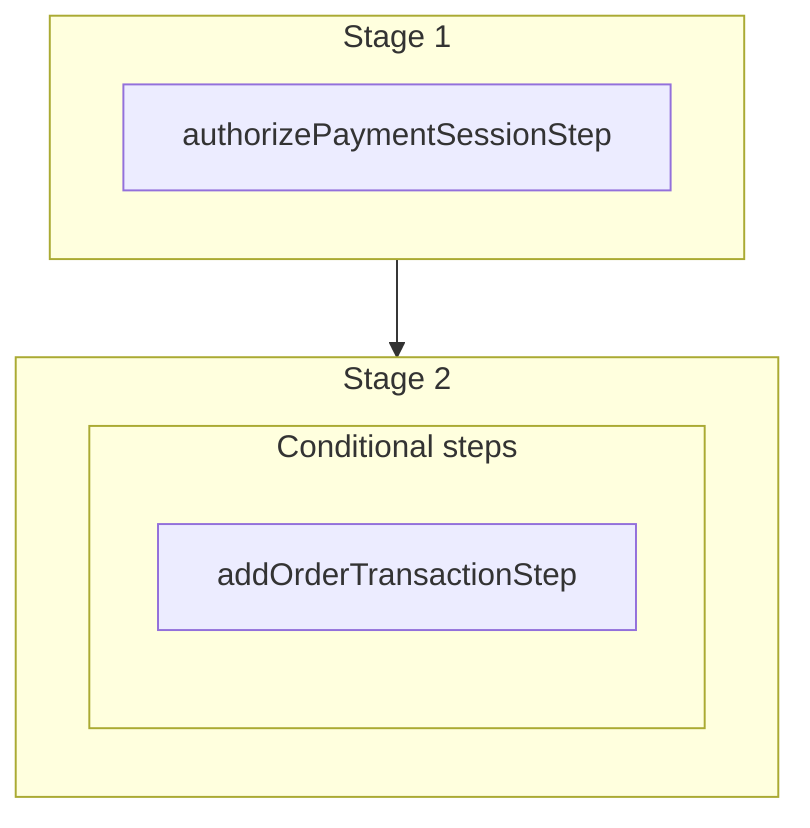

This documentation provides a reference to the `authorizePaymentSessionForOrderWorkflow`. It belongs to the `@medusajs/medusa/core-flows` package.

This workflow authorizes a payment session that is in pending\_authorization status,
typically triggered by an admin action when a deferred payment (bank transfer,
payment link) needs to be manually checked or authorized.

If the provider confirms authorization, a Payment record is created and order
transactions are added for any captures. If the provider still returns
pending\_authorization, no changes are made.

[View source code](https://github.com/medusajs/medusa/blob/0ed927bdb7a396a8fd5f6447ed69b7b354b150d3/packages/core/core-flows/src/payment/workflows/authorize-payment-session-for-order.ts#L58)

## Examples

**API Route**

```ts title="src/api/workflow/route.ts"
import type {
  MedusaRequest,
  MedusaResponse,
} from "@medusajs/framework/http"
import { authorizePaymentSessionForOrderWorkflow } from "@medusajs/medusa/core-flows"

export async function POST(
  req: MedusaRequest,
  res: MedusaResponse
) {
  const { result } = await authorizePaymentSessionForOrderWorkflow(req.scope)
    .run({
      input: {
        "payment_session_id": "{value}"
      }
    })

  res.send(result)
}
```

**Subscriber**

```ts title="src/subscribers/order-placed.ts"
import {
  type SubscriberConfig,
  type SubscriberArgs,
} from "@medusajs/framework"
import { authorizePaymentSessionForOrderWorkflow } from "@medusajs/medusa/core-flows"

export default async function handleOrderPlaced({
  event: { data },
  container,
}: SubscriberArgs < { id: string } > ) {
  const { result } = await authorizePaymentSessionForOrderWorkflow(container)
    .run({
      input: {
        "payment_session_id": "{value}"
      }
    })

  console.log(result)
}

export const config: SubscriberConfig = {
  event: "order.placed",
}
```

**Scheduled Job**

```ts title="src/jobs/message-daily.ts"
import { MedusaContainer } from "@medusajs/framework/types"
import { authorizePaymentSessionForOrderWorkflow } from "@medusajs/medusa/core-flows"

export default async function myCustomJob(
  container: MedusaContainer
) {
  const { result } = await authorizePaymentSessionForOrderWorkflow(container)
    .run({
      input: {
        "payment_session_id": "{value}"
      }
    })

  console.log(result)
}

export const config = {
  name: "run-once-a-day",
  schedule: "0 0 * * *",
}
```

**Another Workflow**

```ts title="src/workflows/my-workflow.ts"
import { createWorkflow } from "@medusajs/framework/workflows-sdk"
import { authorizePaymentSessionForOrderWorkflow } from "@medusajs/medusa/core-flows"

const myWorkflow = createWorkflow(
  "my-workflow",
  () => {
    const result = authorizePaymentSessionForOrderWorkflow
      .runAsStep({
        input: {
          "payment_session_id": "{value}"
        }
      })
  }
)
```

<a id="authorizepaymentsessionfororderworkflow-steps" />

## Steps



Stages follow the order in the workflow definition. Conditional steps run only when their condition is met. The step descriptions below include the conditions and reference links.

- [authorizePaymentSessionStep](/resources/references/medusa-workflows/steps/authorizePaymentSessionStep): This step authorizes a payment session.
  - **when** (when: \{
    return !!payment && !!orderPaymentCollection?.order?.id
    })
  - [addOrderTransactionStep](/resources/references/medusa-workflows/steps/addOrderTransactionStep): This step creates order transactions.

<a id="authorizepaymentsessionfororderworkflow-input" />

## Input

**authorizePaymentSessionForOrderWorkflow**

- `AuthorizePaymentSessionForOrderInput`: [AuthorizePaymentSessionForOrderInput](/resources/references/core_flows/core_core_flows_src/types/core_flowscore_core_flows_srcAuthorizePaymentSessionForOrderInput)
  - `payment_session_id`: `string` — The ID of the payment session to authorize.

<a id="authorizepaymentsessionfororderworkflow-output" />

## Output

**authorizePaymentSessionForOrderWorkflow**

- `null \| PaymentDTO`: `null` | [PaymentDTO](/resources/references/payment/interfaces/paymentPaymentDTO)
  - `null \| PaymentDTO`: `null` | [PaymentDTO](/resources/references/payment/interfaces/paymentPaymentDTO)
