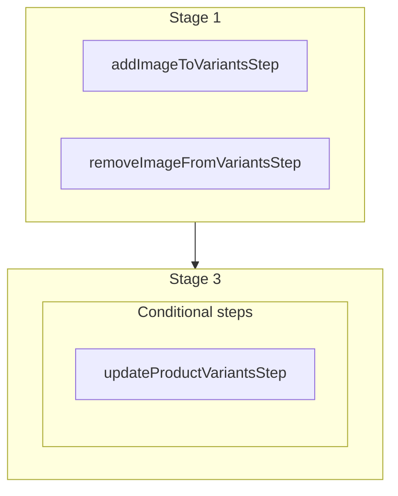

This documentation provides a reference to the `batchImageVariantsWorkflow`. It belongs to the `@medusajs/medusa/core-flows` package.

This workflow manages the association between product images and variants in bulk.
It's used by the [Batch Image Variants Admin API Route](/api/admin/products/manage-variants-of-product-image).

You can use this workflow within your own customizations or custom workflows to manage image-variant associations in bulk.
This is also useful when writing a [seed script](/learn/fundamentals/custom-cli-scripts/seed-data) or a custom import script.

> **Note**
>
> This is available starting from [Medusa v2.11.2](https://github.com/medusajs/medusa/releases/tag/v2.11.2).

[View source code](https://github.com/medusajs/medusa/blob/0ed927bdb7a396a8fd5f6447ed69b7b354b150d3/packages/core/core-flows/src/product/workflows/batch-image-variants.ts#L74)

## Examples

**API Route**

```ts title="src/api/workflow/route.ts"
import type {
  MedusaRequest,
  MedusaResponse,
} from "@medusajs/framework/http"
import { batchImageVariantsWorkflow } from "@medusajs/medusa/core-flows"

export async function POST(
  req: MedusaRequest,
  res: MedusaResponse
) {
  const { result } = await batchImageVariantsWorkflow(req.scope)
    .run({
      input: {
        image_id: "img_123",
        add: ["variant_123", "variant_456"],
        remove: ["variant_789"]
      }
    })

  res.send(result)
}
```

**Subscriber**

```ts title="src/subscribers/order-placed.ts"
import {
  type SubscriberConfig,
  type SubscriberArgs,
} from "@medusajs/framework"
import { batchImageVariantsWorkflow } from "@medusajs/medusa/core-flows"

export default async function handleOrderPlaced({
  event: { data },
  container,
}: SubscriberArgs < { id: string } > ) {
  const { result } = await batchImageVariantsWorkflow(container)
    .run({
      input: {
        image_id: "img_123",
        add: ["variant_123", "variant_456"],
        remove: ["variant_789"]
      }
    })

  console.log(result)
}

export const config: SubscriberConfig = {
  event: "order.placed",
}
```

**Scheduled Job**

```ts title="src/jobs/message-daily.ts"
import { MedusaContainer } from "@medusajs/framework/types"
import { batchImageVariantsWorkflow } from "@medusajs/medusa/core-flows"

export default async function myCustomJob(
  container: MedusaContainer
) {
  const { result } = await batchImageVariantsWorkflow(container)
    .run({
      input: {
        image_id: "img_123",
        add: ["variant_123", "variant_456"],
        remove: ["variant_789"]
      }
    })

  console.log(result)
}

export const config = {
  name: "run-once-a-day",
  schedule: "0 0 * * *",
}
```

**Another Workflow**

```ts title="src/workflows/my-workflow.ts"
import { createWorkflow } from "@medusajs/framework/workflows-sdk"
import { batchImageVariantsWorkflow } from "@medusajs/medusa/core-flows"

const myWorkflow = createWorkflow(
  "my-workflow",
  () => {
    const result = batchImageVariantsWorkflow
      .runAsStep({
        input: {
          image_id: "img_123",
          add: ["variant_123", "variant_456"],
          remove: ["variant_789"]
        }
      })
  }
)
```

<a id="batchimagevariantsworkflow-steps" />

## Steps



Stages follow the order in the workflow definition. Conditional steps run only when their condition is met. The step descriptions below include the conditions and reference links.

- [addImageToVariantsStep](/resources/references/medusa-workflows/steps/addImageToVariantsStep): This step adds an image to one or more product variants.
- [removeImageFromVariantsStep](/resources/references/medusa-workflows/steps/removeImageFromVariantsStep): This step removes an image from one or more product variants.
  - **when** (when: data.updateData !== null && typeof data.updateData !== "undefined")
  - [updateProductVariantsStep](/resources/references/medusa-workflows/steps/updateProductVariantsStep): This step updates one or more product variants.

<a id="batchimagevariantsworkflow-input" />

## Input

**batchImageVariantsWorkflow**

- `BatchImageVariantsWorkflowInput`: [BatchImageVariantsWorkflowInput](/resources/references/core_flows/core_core_flows_src/interfaces/core_flowscore_core_flows_srcBatchImageVariantsWorkflowInput)
  - `image_id`: `string` — The ID of the image to manage variants for.
  - `add`: `string`\[] (optional) — The variant IDs to add to the image.
  - `remove`: `string`\[] (optional) — The variant IDs to remove from the image.

<a id="batchimagevariantsworkflow-output" />

## Output

**batchImageVariantsWorkflow**

- `BatchImageVariantsWorkflowOutput`: [BatchImageVariantsWorkflowOutput](/resources/references/core_flows/core_core_flows_src/interfaces/core_flowscore_core_flows_srcBatchImageVariantsWorkflowOutput)
  - `added`: `string`\[] — The variant IDs that were added to the image.
  - `removed`: `string`\[] — The variant IDs that were removed from the image.
