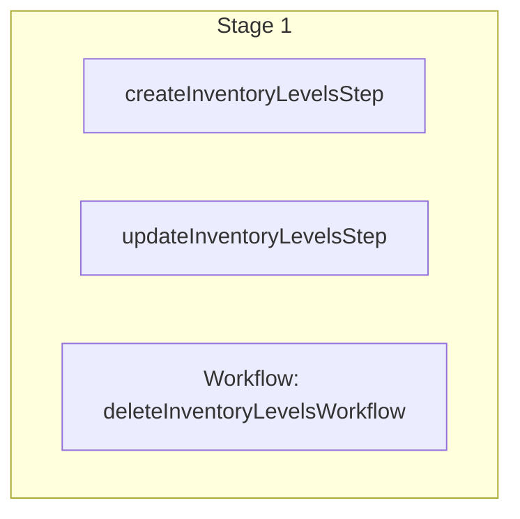

This documentation provides a reference to the `batchInventoryItemLevelsWorkflow`. It belongs to the `@medusajs/medusa/core-flows` package.

This workflow creates, updates and deletes inventory levels in bulk.

You can use this workflow within your own customizations or custom workflows, allowing you
to manage inventory levels in your custom flows.

[View source code](https://github.com/medusajs/medusa/blob/0ed927bdb7a396a8fd5f6447ed69b7b354b150d3/packages/core/core-flows/src/inventory/workflows/batch-inventory-item-levels.ts#L89)

## Examples

**API Route**

```ts title="src/api/workflow/route.ts"
import type {
  MedusaRequest,
  MedusaResponse,
} from "@medusajs/framework/http"
import { batchInventoryItemLevelsWorkflow } from "@medusajs/medusa/core-flows"

export async function POST(
  req: MedusaRequest,
  res: MedusaResponse
) {
  const { result } = await batchInventoryItemLevelsWorkflow(req.scope)
    .run({
      input: {
        create: [{
          inventory_item_id: "iitem_123",
          location_id: "sloc_123"
        }],
        update: [{
          id: "iilev_123",
          inventory_item_id: "iitem_123",
          location_id: "sloc_123",
          stocked_quantity: 10
        }],
        delete: ["iilev_321"]
      }
    })

  res.send(result)
}
```

**Subscriber**

```ts title="src/subscribers/order-placed.ts"
import {
  type SubscriberConfig,
  type SubscriberArgs,
} from "@medusajs/framework"
import { batchInventoryItemLevelsWorkflow } from "@medusajs/medusa/core-flows"

export default async function handleOrderPlaced({
  event: { data },
  container,
}: SubscriberArgs < { id: string } > ) {
  const { result } = await batchInventoryItemLevelsWorkflow(container)
    .run({
      input: {
        create: [{
          inventory_item_id: "iitem_123",
          location_id: "sloc_123"
        }],
        update: [{
          id: "iilev_123",
          inventory_item_id: "iitem_123",
          location_id: "sloc_123",
          stocked_quantity: 10
        }],
        delete: ["iilev_321"]
      }
    })

  console.log(result)
}

export const config: SubscriberConfig = {
  event: "order.placed",
}
```

**Scheduled Job**

```ts title="src/jobs/message-daily.ts"
import { MedusaContainer } from "@medusajs/framework/types"
import { batchInventoryItemLevelsWorkflow } from "@medusajs/medusa/core-flows"

export default async function myCustomJob(
  container: MedusaContainer
) {
  const { result } = await batchInventoryItemLevelsWorkflow(container)
    .run({
      input: {
        create: [{
          inventory_item_id: "iitem_123",
          location_id: "sloc_123"
        }],
        update: [{
          id: "iilev_123",
          inventory_item_id: "iitem_123",
          location_id: "sloc_123",
          stocked_quantity: 10
        }],
        delete: ["iilev_321"]
      }
    })

  console.log(result)
}

export const config = {
  name: "run-once-a-day",
  schedule: "0 0 * * *",
}
```

**Another Workflow**

```ts title="src/workflows/my-workflow.ts"
import { createWorkflow } from "@medusajs/framework/workflows-sdk"
import { batchInventoryItemLevelsWorkflow } from "@medusajs/medusa/core-flows"

const myWorkflow = createWorkflow(
  "my-workflow",
  () => {
    const result = batchInventoryItemLevelsWorkflow
      .runAsStep({
        input: {
          create: [{
            inventory_item_id: "iitem_123",
            location_id: "sloc_123"
          }],
          update: [{
            id: "iilev_123",
            inventory_item_id: "iitem_123",
            location_id: "sloc_123",
            stocked_quantity: 10
          }],
          delete: ["iilev_321"]
        }
      })
  }
)
```

<a id="batchinventoryitemlevelsworkflow-steps" />

## Steps



Stages follow the order in the workflow definition. Conditional steps run only when their condition is met. The step descriptions below include the conditions and reference links.

- [createInventoryLevelsStep](/resources/references/medusa-workflows/steps/createInventoryLevelsStep): This step creates one or more inventory levels.
- [updateInventoryLevelsStep](/resources/references/medusa-workflows/steps/updateInventoryLevelsStep): This step updates one or more inventory levels.
- [deleteInventoryLevelsWorkflow](/resources/references/medusa-workflows/deleteInventoryLevelsWorkflow): Delete one or more inventory levels.

<a id="batchinventoryitemlevelsworkflow-input" />

## Input

**batchInventoryItemLevelsWorkflow**

- `BatchInventoryItemLevelsWorkflowInput`: [BatchInventoryItemLevelsWorkflowInput](/resources/references/core_flows/core_core_flows_src/interfaces/core_flowscore_core_flows_srcBatchInventoryItemLevelsWorkflowInput)
  - `force`: `boolean` (optional) — If true, the workflow will force the deletion of the inventory levels, even if they have a non-zero stocked quantity. If false, the workflow will not delete the inventory levels if they have a non-zero stocked quantity. Inventory levels that have reserved or incoming items at the location will not be deleted even if the force flag is set to true.
  - `create`: [CreateInventoryLevelInput](/resources/references/types/InventoryTypes/interfaces/typesInventoryTypesCreateInventoryLevelInput)\[] (optional) — The inventory levels to create.
    - `inventory_item_id`: `string` — The ID of the associated inventory item.
    - `location_id`: `string` — The ID of the associated location.
    - `stocked_quantity`: `number` (optional) — The stocked quantity of the associated inventory item in the associated location.
    - `incoming_quantity`: `number` (optional) — The incoming quantity of the associated inventory item in the associated location.
  - `update`: [UpdateInventoryLevelInput](/resources/references/types/InventoryTypes/interfaces/typesInventoryTypesUpdateInventoryLevelInput)\[] (optional) — The inventory levels to update.
    - `id`: `string` (optional) — ID of the inventory level to update
    - `inventory_item_id`: `string` — The ID of the associated inventory item.
    - `location_id`: `string` — The ID of the associated location.
    - `stocked_quantity`: `number` (optional) — The stocked quantity of the associated inventory item in the associated location.
    - `incoming_quantity`: `number` (optional) — The incoming quantity of the associated inventory item in the associated location.
  - `delete`: `string`\[] (optional) — The IDs of inventory levels to delete.

<a id="batchinventoryitemlevelsworkflow-output" />

## Output

**batchInventoryItemLevelsWorkflow**

- `BatchInventoryItemLevelsWorkflowOutput`: [BatchInventoryItemLevelsWorkflowOutput](/resources/references/core_flows/core_core_flows_src/interfaces/core_flowscore_core_flows_srcBatchInventoryItemLevelsWorkflowOutput)
  - `created`: [InventoryLevelDTO](/resources/references/types/InventoryTypes/interfaces/typesInventoryTypesInventoryLevelDTO)\[] — The inventory levels that were created.
    - `id`: `string` — The ID of the inventory level.
    - `inventory_item_id`: `string` — The associated inventory item's ID.
    - `location_id`: `string` — The associated location's ID.
    - `stocked_quantity`: `number` — The stocked quantity of the inventory level.
    - `reserved_quantity`: `number` — The reserved quantity of the inventory level.
    - `incoming_quantity`: `number` — The incoming quantity of the inventory level.
    - `available_quantity`: `number` — The available quantity of the inventory level.
    - `metadata`: `null` | `Record<string, unknown>` — Holds custom data in key-value pairs.
    - `created_at`: `string` | `Date` — The creation date of the inventory level.
    - `updated_at`: `string` | `Date` — The update date of the inventory level.
    - `deleted_at`: `null` | `string` | `Date` — The deletion date of the inventory level.
  - `updated`: [InventoryLevelDTO](/resources/references/types/InventoryTypes/interfaces/typesInventoryTypesInventoryLevelDTO)\[] — The inventory levels that were updated.
    - `id`: `string` — The ID of the inventory level.
    - `inventory_item_id`: `string` — The associated inventory item's ID.
    - `location_id`: `string` — The associated location's ID.
    - `stocked_quantity`: `number` — The stocked quantity of the inventory level.
    - `reserved_quantity`: `number` — The reserved quantity of the inventory level.
    - `incoming_quantity`: `number` — The incoming quantity of the inventory level.
    - `available_quantity`: `number` — The available quantity of the inventory level.
    - `metadata`: `null` | `Record<string, unknown>` — Holds custom data in key-value pairs.
    - `created_at`: `string` | `Date` — The creation date of the inventory level.
    - `updated_at`: `string` | `Date` — The update date of the inventory level.
    - `deleted_at`: `null` | `string` | `Date` — The deletion date of the inventory level.
  - `deleted`: `string`\[] — The IDs of the inventory levels that were deleted.

<a id="batchinventoryitemlevelsworkflow-emitted-events" />

## Emitted Events

- `inventory-level.created` (since v2.18.0): Emitted when inventory levels are created.

  ```ts
  {
    id, // The ID of the inventory level
  }
  ```
- `inventory-level.updated` (since v2.18.0): Emitted when inventory levels are updated. This includes adjustments to the stocked or reserved quantity, such as during order fulfillment.

  ```ts
  {
    id, // The ID of the inventory level
    order_id, // (optional) The ID of the order, if the update was triggered by an order flow
  }
  ```
- `inventory-level.deleted` (since v2.18.0): Emitted when inventory levels are deleted.

  ```ts
  {
    id, // The ID of the inventory level
  }
  ```
