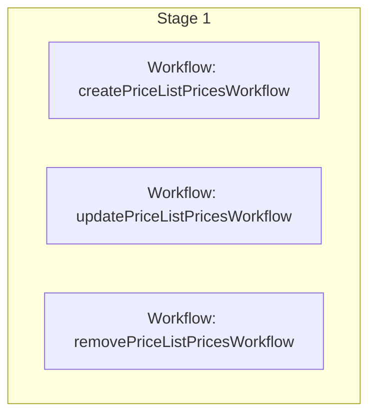

This documentation provides a reference to the `batchPriceListPricesWorkflow`. It belongs to the `@medusajs/medusa/core-flows` package.

This workflow manages a price list's prices by creating, updating, or removing them. It's used by the
[Manage Prices in Price List Admin API Route](/api/admin/price-lists/manage-prices).

You can use this workflow within your customizations or your own custom workflows, allowing you to
manage price lists' prices in your custom flows.

[View source code](https://github.com/medusajs/medusa/blob/0ed927bdb7a396a8fd5f6447ed69b7b354b150d3/packages/core/core-flows/src/price-list/workflows/batch-price-list-prices.ts#L64)

## Examples

**API Route**

```ts title="src/api/workflow/route.ts"
import type {
  MedusaRequest,
  MedusaResponse,
} from "@medusajs/framework/http"
import { batchPriceListPricesWorkflow } from "@medusajs/medusa/core-flows"

export async function POST(
  req: MedusaRequest,
  res: MedusaResponse
) {
  const { result } = await batchPriceListPricesWorkflow(req.scope)
    .run({
      input: {
        data: {
          id: "plist_123",
          create: [{
            amount: 10,
            currency_code: "usd",
            variant_id: "variant_123"
          }],
          update: [{
            id: "price_123",
            amount: 10,
            currency_code: "usd",
            variant_id: "variant_123"
          }],
          delete: ["price_321"]
        }
      }
    })

  res.send(result)
}
```

**Subscriber**

```ts title="src/subscribers/order-placed.ts"
import {
  type SubscriberConfig,
  type SubscriberArgs,
} from "@medusajs/framework"
import { batchPriceListPricesWorkflow } from "@medusajs/medusa/core-flows"

export default async function handleOrderPlaced({
  event: { data },
  container,
}: SubscriberArgs < { id: string } > ) {
  const { result } = await batchPriceListPricesWorkflow(container)
    .run({
      input: {
        data: {
          id: "plist_123",
          create: [{
            amount: 10,
            currency_code: "usd",
            variant_id: "variant_123"
          }],
          update: [{
            id: "price_123",
            amount: 10,
            currency_code: "usd",
            variant_id: "variant_123"
          }],
          delete: ["price_321"]
        }
      }
    })

  console.log(result)
}

export const config: SubscriberConfig = {
  event: "order.placed",
}
```

**Scheduled Job**

```ts title="src/jobs/message-daily.ts"
import { MedusaContainer } from "@medusajs/framework/types"
import { batchPriceListPricesWorkflow } from "@medusajs/medusa/core-flows"

export default async function myCustomJob(
  container: MedusaContainer
) {
  const { result } = await batchPriceListPricesWorkflow(container)
    .run({
      input: {
        data: {
          id: "plist_123",
          create: [{
            amount: 10,
            currency_code: "usd",
            variant_id: "variant_123"
          }],
          update: [{
            id: "price_123",
            amount: 10,
            currency_code: "usd",
            variant_id: "variant_123"
          }],
          delete: ["price_321"]
        }
      }
    })

  console.log(result)
}

export const config = {
  name: "run-once-a-day",
  schedule: "0 0 * * *",
}
```

**Another Workflow**

```ts title="src/workflows/my-workflow.ts"
import { createWorkflow } from "@medusajs/framework/workflows-sdk"
import { batchPriceListPricesWorkflow } from "@medusajs/medusa/core-flows"

const myWorkflow = createWorkflow(
  "my-workflow",
  () => {
    const result = batchPriceListPricesWorkflow
      .runAsStep({
        input: {
          data: {
            id: "plist_123",
            create: [{
              amount: 10,
              currency_code: "usd",
              variant_id: "variant_123"
            }],
            update: [{
              id: "price_123",
              amount: 10,
              currency_code: "usd",
              variant_id: "variant_123"
            }],
            delete: ["price_321"]
          }
        }
      })
  }
)
```

<a id="batchpricelistpricesworkflow-steps" />

## Steps



Stages follow the order in the workflow definition. Conditional steps run only when their condition is met. The step descriptions below include the conditions and reference links.

- [createPriceListPricesWorkflow](/resources/references/medusa-workflows/createPriceListPricesWorkflow): Create prices in price lists.
- [updatePriceListPricesWorkflow](/resources/references/medusa-workflows/updatePriceListPricesWorkflow): Update price lists' prices.
- [removePriceListPricesWorkflow](/resources/references/medusa-workflows/removePriceListPricesWorkflow): Remove prices.

<a id="batchpricelistpricesworkflow-input" />

## Input

**batchPriceListPricesWorkflow**

- `BatchPriceListPricesWorkflowInput`: [BatchPriceListPricesWorkflowInput](/resources/references/core_flows/core_core_flows_src/types/core_flowscore_core_flows_srcBatchPriceListPricesWorkflowInput)
  - `data`: [BatchPriceListPricesWorkflowDTO](/resources/references/types/interfaces/typesBatchPriceListPricesWorkflowDTO) — The data to manage the prices of a price list.
    - `id`: `string` — The ID of the price list.
    - `create`: [CreatePriceListPriceWorkflowDTO](/resources/references/types/interfaces/typesCreatePriceListPriceWorkflowDTO)\[] — The prices to create.
      - `amount`: `number` — The amount for the price.
      - `currency_code`: `string` — The currency code for the price.

        Example:

        ```
        usd
        ```
      - `variant_id`: `string` — The ID of the variant that this price applies to.
      - `max_quantity`: `null` | `number` (optional) — The maximum quantity of the variant allowed in the cart for this price to be applied.
      - `min_quantity`: `null` | `number` (optional) — The minimum quantity of the variant required in the cart for this price to be applied.
      - `rules`: `Record<string, string>` (optional) — Additional rules for the price list.
    - `update`: [UpdatePriceListPriceWorkflowDTO](/resources/references/types/interfaces/typesUpdatePriceListPriceWorkflowDTO)\[] — The prices to update.
      - `id`: `string` — The ID of the price.
      - `variant_id`: `string` — The ID of the product variant that this price belongs to.
      - `amount`: `number` (optional) — The amount of the price.
      - `currency_code`: `string` (optional) — The currency code of the price.

        Example:

        ```
        usd
        ```
      - `max_quantity`: `null` | `number` (optional) — The maximum quantity of the variant allowed in the cart for this price to be applied.
      - `min_quantity`: `null` | `number` (optional) — The minimum quantity of the variant required in the cart for this price to be applied.
      - `rules`: `Record<string, string>` (optional) — Additional rules for the price.
    - `delete`: `string`\[] — The IDs of prices to delete.

<a id="batchpricelistpricesworkflow-output" />

## Output

**batchPriceListPricesWorkflow**

- `BatchPriceListPricesWorkflowResult`: [BatchPriceListPricesWorkflowResult](/resources/references/types/interfaces/typesBatchPriceListPricesWorkflowResult) — The result of managing a price list's prices.
  - `created`: [PriceDTO](/resources/references/pricing/interfaces/pricingPriceDTO)\[] — The prices that were created.
    - `id`: `string` — The ID of a price.
    - `title`: `string` (optional) — The title of the price.
    - `currency_code`: `string` (optional) — The currency code of this price.
    - `amount`: [BigNumberValue](/resources/references/pricing/types/pricingBigNumberValue) (optional) — The price of this price.
      - `numeric`: `number`
      - `raw`: [BigNumberRawValue](/resources/references/pricing/types/pricingBigNumberRawValue) (optional)
      - `bigNumber`: `BigNumber` (optional)
    - `min_quantity`: [BigNumberValue](/resources/references/pricing/types/pricingBigNumberValue) (optional) — The minimum quantity required to be purchased for this price to be applied.
      - `numeric`: `number`
      - `raw`: [BigNumberRawValue](/resources/references/pricing/types/pricingBigNumberRawValue) (optional)
      - `bigNumber`: `BigNumber` (optional)
    - `max_quantity`: [BigNumberValue](/resources/references/pricing/types/pricingBigNumberValue) (optional) — The maximum quantity required to be purchased for this price to be applied.
      - `numeric`: `number`
      - `raw`: [BigNumberRawValue](/resources/references/pricing/types/pricingBigNumberRawValue) (optional)
      - `bigNumber`: `BigNumber` (optional)
    - `price_set`: [PriceSetDTO](/resources/references/pricing/interfaces/pricingPriceSetDTO) (optional) — The price set associated with the price.
      - `id`: `string` — The ID of the price set.
      - `prices`: [MoneyAmountDTO](/resources/references/pricing/interfaces/pricingMoneyAmountDTO)\[] (optional) — The prices that belong to this price set.
      - `calculated_price`: [CalculatedPriceSet](/resources/references/pricing/interfaces/pricingCalculatedPriceSet) (optional) — The calculated price based on the context.
    - `price_list`: [PriceListDTO](/resources/references/pricing/interfaces/pricingPriceListDTO) (optional) — The price list associated with the price.
      - `id`: `string` — The price list's ID.
      - `title`: `string` (optional) — The price list's title.
      - `description`: `string` (optional) — The price list's description.
      - `starts_at`: `null` | `string` (optional) — The price list is enabled starting from this date.
      - `status`: [PriceListStatus](/resources/references/pricing/types/pricingPriceListStatus) (optional) — The price list's status.
      - `type`: [PriceListType](/resources/references/pricing/types/pricingPriceListType) (optional) — The price list's type.
      - `ends_at`: `null` | `string` (optional) — The price list expires after this date.
      - `rules_count`: `number` (optional) — The number of rules associated with this price list.
      - `prices`: [PriceDTO](/resources/references/pricing/interfaces/pricingPriceDTO)\[] (optional) — The associated price list money amounts.
      - `money_amounts`: [MoneyAmountDTO](/resources/references/pricing/interfaces/pricingMoneyAmountDTO)\[] (optional) — The associated money amounts.
      - `price_list_rules`: [PriceListRuleDTO](/resources/references/pricing/interfaces/pricingPriceListRuleDTO)\[] (optional) — The price list's rules.
      - `metadata`: `null` | `Record<string, unknown>` (optional) — Holds custom data in key-value pairs.
    - `price_set_id`: `string` (optional) — The ID of the associated price set.
    - `price_rules`: [PriceRuleDTO](/resources/references/pricing/interfaces/pricingPriceRuleDTO)\[] (optional) — The price rules associated with the price.
      - `id`: `string` — The ID of the price rule.
      - `price_set_id`: `string` — The ID of the associated price set.
      - `price_set`: [PriceSetDTO](/resources/references/pricing/interfaces/pricingPriceSetDTO) — The associated price set.
      - `attribute`: `string` — The attribute of the price rule
      - `value`: `string` — The value of the price rule.
      - `priority`: `number` — The priority of the price rule in comparison to other applicable price rules.
      - `price_id`: `string` — The ID of the associated price.
      - `price_list_id`: `string` — The ID of the associated price list.
      - `created_at`: `Date` — When the price\_rule was created.
      - `updated_at`: `Date` — When the price\_rule was updated.
      - `deleted_at`: `null` | `Date` — When the price\_rule was deleted.
    - `created_at`: `Date` — When the price was created.
    - `updated_at`: `Date` — When the price was updated.
    - `deleted_at`: `null` | `Date` — When the price was deleted.
  - `updated`: [PriceDTO](/resources/references/pricing/interfaces/pricingPriceDTO)\[] — The prices that were updated.
    - `id`: `string` — The ID of a price.
    - `title`: `string` (optional) — The title of the price.
    - `currency_code`: `string` (optional) — The currency code of this price.
    - `amount`: [BigNumberValue](/resources/references/pricing/types/pricingBigNumberValue) (optional) — The price of this price.
      - `numeric`: `number`
      - `raw`: [BigNumberRawValue](/resources/references/pricing/types/pricingBigNumberRawValue) (optional)
      - `bigNumber`: `BigNumber` (optional)
    - `min_quantity`: [BigNumberValue](/resources/references/pricing/types/pricingBigNumberValue) (optional) — The minimum quantity required to be purchased for this price to be applied.
      - `numeric`: `number`
      - `raw`: [BigNumberRawValue](/resources/references/pricing/types/pricingBigNumberRawValue) (optional)
      - `bigNumber`: `BigNumber` (optional)
    - `max_quantity`: [BigNumberValue](/resources/references/pricing/types/pricingBigNumberValue) (optional) — The maximum quantity required to be purchased for this price to be applied.
      - `numeric`: `number`
      - `raw`: [BigNumberRawValue](/resources/references/pricing/types/pricingBigNumberRawValue) (optional)
      - `bigNumber`: `BigNumber` (optional)
    - `price_set`: [PriceSetDTO](/resources/references/pricing/interfaces/pricingPriceSetDTO) (optional) — The price set associated with the price.
      - `id`: `string` — The ID of the price set.
      - `prices`: [MoneyAmountDTO](/resources/references/pricing/interfaces/pricingMoneyAmountDTO)\[] (optional) — The prices that belong to this price set.
      - `calculated_price`: [CalculatedPriceSet](/resources/references/pricing/interfaces/pricingCalculatedPriceSet) (optional) — The calculated price based on the context.
    - `price_list`: [PriceListDTO](/resources/references/pricing/interfaces/pricingPriceListDTO) (optional) — The price list associated with the price.
      - `id`: `string` — The price list's ID.
      - `title`: `string` (optional) — The price list's title.
      - `description`: `string` (optional) — The price list's description.
      - `starts_at`: `null` | `string` (optional) — The price list is enabled starting from this date.
      - `status`: [PriceListStatus](/resources/references/pricing/types/pricingPriceListStatus) (optional) — The price list's status.
      - `type`: [PriceListType](/resources/references/pricing/types/pricingPriceListType) (optional) — The price list's type.
      - `ends_at`: `null` | `string` (optional) — The price list expires after this date.
      - `rules_count`: `number` (optional) — The number of rules associated with this price list.
      - `prices`: [PriceDTO](/resources/references/pricing/interfaces/pricingPriceDTO)\[] (optional) — The associated price list money amounts.
      - `money_amounts`: [MoneyAmountDTO](/resources/references/pricing/interfaces/pricingMoneyAmountDTO)\[] (optional) — The associated money amounts.
      - `price_list_rules`: [PriceListRuleDTO](/resources/references/pricing/interfaces/pricingPriceListRuleDTO)\[] (optional) — The price list's rules.
      - `metadata`: `null` | `Record<string, unknown>` (optional) — Holds custom data in key-value pairs.
    - `price_set_id`: `string` (optional) — The ID of the associated price set.
    - `price_rules`: [PriceRuleDTO](/resources/references/pricing/interfaces/pricingPriceRuleDTO)\[] (optional) — The price rules associated with the price.
      - `id`: `string` — The ID of the price rule.
      - `price_set_id`: `string` — The ID of the associated price set.
      - `price_set`: [PriceSetDTO](/resources/references/pricing/interfaces/pricingPriceSetDTO) — The associated price set.
      - `attribute`: `string` — The attribute of the price rule
      - `value`: `string` — The value of the price rule.
      - `priority`: `number` — The priority of the price rule in comparison to other applicable price rules.
      - `price_id`: `string` — The ID of the associated price.
      - `price_list_id`: `string` — The ID of the associated price list.
      - `created_at`: `Date` — When the price\_rule was created.
      - `updated_at`: `Date` — When the price\_rule was updated.
      - `deleted_at`: `null` | `Date` — When the price\_rule was deleted.
    - `created_at`: `Date` — When the price was created.
    - `updated_at`: `Date` — When the price was updated.
    - `deleted_at`: `null` | `Date` — When the price was deleted.
  - `deleted`: `string`\[] — The IDs of the prices that were deleted.
