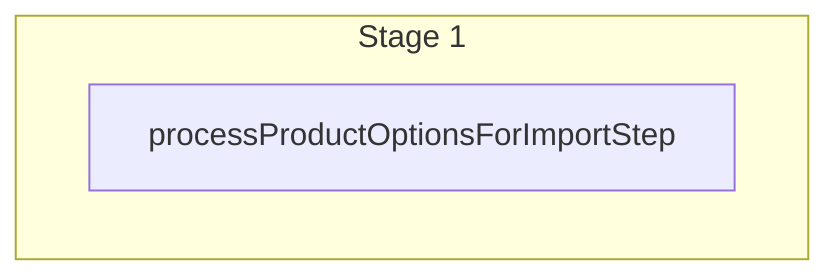

This documentation provides a reference to the `batchProductsWorkflow`. It belongs to the `@medusajs/medusa/core-flows` package.

This workflow creates, updates, or deletes products. It's used by the
[Manage Products Admin API Route](/api/admin/products/manage-products).

You can use this workflow within your own customizations or custom workflows to manage products in bulk. This is
also useful when writing a [seed script](/learn/fundamentals/custom-cli-scripts/seed-data) or a custom import script.

[View source code](https://github.com/medusajs/medusa/blob/0ed927bdb7a396a8fd5f6447ed69b7b354b150d3/packages/core/core-flows/src/product/workflows/batch-products.ts#L81)

## Examples

**API Route**

```ts title="src/api/workflow/route.ts"
import type {
  MedusaRequest,
  MedusaResponse,
} from "@medusajs/framework/http"
import { batchProductsWorkflow } from "@medusajs/medusa/core-flows"

export async function POST(
  req: MedusaRequest,
  res: MedusaResponse
) {
  const { result } = await batchProductsWorkflow(req.scope)
    .run({
      input: {
        create: [{
          title: "Shirt",
          options: [{
            title: "Color",
            values: ["Red", "Brown"]
          }],
          variants: [{
            title: "Red Shirt",
            options: {
              "Color": "Red"
            },
            prices: [{
              amount: 10,
              currency_code: "usd"
            }]
          }]
        }],
        update: [{
          id: "prod_123",
          title: "Pants"
        }],
        delete: ["prod_321"]
      }
    })

  res.send(result)
}
```

**Subscriber**

```ts title="src/subscribers/order-placed.ts"
import {
  type SubscriberConfig,
  type SubscriberArgs,
} from "@medusajs/framework"
import { batchProductsWorkflow } from "@medusajs/medusa/core-flows"

export default async function handleOrderPlaced({
  event: { data },
  container,
}: SubscriberArgs < { id: string } > ) {
  const { result } = await batchProductsWorkflow(container)
    .run({
      input: {
        create: [{
          title: "Shirt",
          options: [{
            title: "Color",
            values: ["Red", "Brown"]
          }],
          variants: [{
            title: "Red Shirt",
            options: {
              "Color": "Red"
            },
            prices: [{
              amount: 10,
              currency_code: "usd"
            }]
          }]
        }],
        update: [{
          id: "prod_123",
          title: "Pants"
        }],
        delete: ["prod_321"]
      }
    })

  console.log(result)
}

export const config: SubscriberConfig = {
  event: "order.placed",
}
```

**Scheduled Job**

```ts title="src/jobs/message-daily.ts"
import { MedusaContainer } from "@medusajs/framework/types"
import { batchProductsWorkflow } from "@medusajs/medusa/core-flows"

export default async function myCustomJob(
  container: MedusaContainer
) {
  const { result } = await batchProductsWorkflow(container)
    .run({
      input: {
        create: [{
          title: "Shirt",
          options: [{
            title: "Color",
            values: ["Red", "Brown"]
          }],
          variants: [{
            title: "Red Shirt",
            options: {
              "Color": "Red"
            },
            prices: [{
              amount: 10,
              currency_code: "usd"
            }]
          }]
        }],
        update: [{
          id: "prod_123",
          title: "Pants"
        }],
        delete: ["prod_321"]
      }
    })

  console.log(result)
}

export const config = {
  name: "run-once-a-day",
  schedule: "0 0 * * *",
}
```

**Another Workflow**

```ts title="src/workflows/my-workflow.ts"
import { createWorkflow } from "@medusajs/framework/workflows-sdk"
import { batchProductsWorkflow } from "@medusajs/medusa/core-flows"

const myWorkflow = createWorkflow(
  "my-workflow",
  () => {
    const result = batchProductsWorkflow
      .runAsStep({
        input: {
          create: [{
            title: "Shirt",
            options: [{
              title: "Color",
              values: ["Red", "Brown"]
            }],
            variants: [{
              title: "Red Shirt",
              options: {
                "Color": "Red"
              },
              prices: [{
                amount: 10,
                currency_code: "usd"
              }]
            }]
          }],
          update: [{
            id: "prod_123",
            title: "Pants"
          }],
          delete: ["prod_321"]
        }
      })
  }
)
```

<a id="batchproductsworkflow-steps" />

## Steps



Stages follow the order in the workflow definition. Conditional steps run only when their condition is met. The step descriptions below include the conditions and reference links.

- [processProductOptionsForImportStep](/resources/references/medusa-workflows/steps/processProductOptionsForImportStep): This step processes products with options during import. It performs the following actions: 1. Links products to existing options when an `id` is provided on the option entry. 2. Creates new options for entries without an `id`, defaulting to `is_exclusive: true` unless the entry specifies otherwise. 3. Transforms `product.options` in the input to `product.option_ids`.

<a id="batchproductsworkflow-input" />

## Input

**batchProductsWorkflow**

- `BatchProductWorkflowInput`: [BatchProductWorkflowInput](/resources/references/core_flows/core_core_flows_src/interfaces/core_flowscore_core_flows_srcBatchProductWorkflowInput)
  - `create`: [CreateProductWorkflowInputDTO](/resources/references/types/types/typesCreateProductWorkflowInputDTO)\[] (optional) — Records to create in bulk.
    - `sales_channels`: `object`\[] (optional) — The sales channels that the product is available in.
      - `id`: `string`
    - `shipping_profile_id`: `string` (optional) — The product's shipping profile.
    - `variants`: [CreateProductVariantWorkflowInputDTO](/resources/references/types/types/typesCreateProductVariantWorkflowInputDTO)\[] (optional) — The product's variants.
      - `product_id`: `string` (optional) — The id of the product
      - `title`: `string` — The tile of the product variant.
      - `sku`: `null` | `string` (optional) — The SKU of the product variant.
      - `barcode`: `null` | `string` (optional) — The barcode of the product variant.
      - `ean`: `null` | `string` (optional) — The EAN of the product variant.
      - `upc`: `null` | `string` (optional) — The UPC of the product variant.
      - `allow_backorder`: `boolean` (optional) — Whether the product variant can be ordered when it's out of stock.
      - `manage_inventory`: `boolean` (optional) — Whether the product variant's inventory should be managed by the core system.
      - `inventory_items`: [CreateProductVariantInventoryKit](/resources/references/product/interfaces/productCreateProductVariantInventoryKit)\[] (optional) — The variant's inventory items. It's only available if `manage_inventory` is enabled.
      - `hs_code`: `null` | `string` (optional) — The HS Code of the product variant.
      - `origin_country`: `null` | `string` (optional) — The origin country of the product variant.
      - `mid_code`: `null` | `string` (optional) — The MID Code of the product variant.
      - `material`: `null` | `string` (optional) — The material of the product variant.
      - `weight`: `null` | `number` (optional) — The weight of the product variant.
      - `length`: `null` | `number` (optional) — The length of the product variant.
      - `height`: `null` | `number` (optional) — The height of the product variant.
      - `width`: `null` | `number` (optional) — The width of the product variant.
      - `options`: `Record<string, string>` (optional) — The options of the variant. Each key is an option's title, and value is an option's value. If an option with the specified title doesn't exist, a new one is created.

        Example:

        ```
        `{ Color: "Blue" }`
        ```
      - `metadata`: [MetadataType](/resources/references/product/types/productMetadataType) (optional) — Holds custom data in key-value pairs.
      - `prices`: [CreateMoneyAmountDTO](/resources/references/pricing/interfaces/pricingCreateMoneyAmountDTO)\[] (optional) — The variant's prices.
  - `update`: [UpdateProductWorkflowInputDTO](/resources/references/types/types/typesUpdateProductWorkflowInputDTO)\[] (optional) — Records to update in bulk.
    - `id`: `string` (optional) — The ID of the product to update. If not provided, a product is created instead. In that case, the `title` property is required.
    - `title`: `string` (optional) — The title of the product.
    - `subtitle`: `null` | `string` (optional) — The subttle of the product.
    - `description`: `null` | `string` (optional) — The description of the product.
    - `is_giftcard`: `boolean` (optional) — Whether the product is a gift card.
    - `discountable`: `boolean` (optional) — Whether the product can be discounted.
    - `thumbnail`: `null` | `string` (optional) — The URL of the product's thumbnail.
    - `handle`: `string` (optional) — The handle of the product. The handle can be used to create slug URL paths. If not supplied, the value of the `handle` attribute of the product is set to the slug version of the `title` attribute.
    - `status`: [ProductStatus](/resources/references/product/types/productProductStatus) (optional) — The status of the product.
    - `images`: [UpsertProductImageDTO](/resources/references/product/interfaces/productUpsertProductImageDTO)\[] (optional) — The associated images to create or update.
      - `id`: `string` (optional) — The product image's ID. If not provided, the image is created. In that case, the `url` property is required.
      - `url`: `string` (optional) — The new URL of the product image.
      - `metadata`: [MetadataType](/resources/references/product/types/productMetadataType) (optional) — Holds custom data in key-value pairs.
    - `external_id`: `null` | `string` (optional) — The id of the product in an external system
    - `type_id`: `null` | `string` (optional) — The product type to associate with the product.
    - `collection_id`: `null` | `string` (optional) — The product collection to associate with the product.
    - `tag_ids`: `string`\[] (optional) — The tags to associate with the product
    - `category_ids`: `string`\[] (optional) — The product categories to associate with the product.
    - `option_ids`: `string`\[] (optional) — The product options to associate with the product.
    - `variants`: [UpsertProductVariantDTO](/resources/references/product/interfaces/productUpsertProductVariantDTO)\[] (optional) — The product variants to be created and associated with the product. You can also update existing product variants associated with the product.
      - `id`: `string` (optional) — The ID of the product variant to update.
      - `title`: `string` (optional) — The tile of the product variant.
      - `sku`: `null` | `string` (optional) — The SKU of the product variant.
      - `barcode`: `null` | `string` (optional) — The barcode of the product variant.
      - `ean`: `null` | `string` (optional) — The EAN of the product variant.
      - `upc`: `null` | `string` (optional) — The UPC of the product variant.
      - `thumbnail`: `null` | `string` (optional) — The thumbnail of the product variant.
      - `allow_backorder`: `boolean` (optional) — Whether the product variant can be ordered when it's out of stock.
      - `manage_inventory`: `boolean` (optional) — Whether the product variant's inventory should be managed by the core system.
      - `hs_code`: `null` | `string` (optional) — The HS Code of the product variant.
      - `origin_country`: `null` | `string` (optional) — The origin country of the product variant.
      - `mid_code`: `null` | `string` (optional) — The MID Code of the product variant.
      - `material`: `null` | `string` (optional) — The material of the product variant.
      - `weight`: `null` | `number` (optional) — The weight of the product variant.
      - `length`: `null` | `number` (optional) — The length of the product variant.
      - `height`: `null` | `number` (optional) — The height of the product variant.
      - `width`: `null` | `number` (optional) — The width of the product variant.
      - `options`: `Record<string, string>` (optional) — The product variant options to associate with the product variant.
      - `metadata`: [MetadataType](/resources/references/product/types/productMetadataType) (optional) — Holds custom data in key-value pairs.
    - `width`: `null` | `number` (optional) — The width of the product.
    - `height`: `null` | `number` (optional) — The height of the product.
    - `length`: `null` | `number` (optional) — The length of the product.
    - `weight`: `null` | `number` (optional) — The weight of the product.
    - `origin_country`: `null` | `string` (optional) — The origin country of the product.
    - `hs_code`: `null` | `string` (optional) — The HS Code of the product.
    - `material`: `null` | `string` (optional) — The material of the product.
    - `mid_code`: `null` | `string` (optional) — The MID Code of the product.
    - `metadata`: [MetadataType](/resources/references/product/types/productMetadataType) (optional) — Holds custom data in key-value pairs.
    - `sales_channels`: `object`\[] (optional)
      - `id`: `string`
    - `shipping_profile_id`: `string` | `null` (optional)
  - `delete`: `string`\[] (optional) — Records to delete in bulk.

<a id="batchproductsworkflow-output" />

## Output

**batchProductsWorkflow**

- `BatchWorkflowOutput`: [BatchWorkflowOutput](/resources/references/types/CommonTypes/types/typesCommonTypesBatchWorkflowOutput)\<[ProductDTO](/resources/references/product/interfaces/productProductDTO)>
  - `id`: `string` — The ID of the product.
  - `title`: `string` — The title of the product.
  - `handle`: `string` — The handle of the product. The handle can be used to create slug URL paths.
  - `subtitle`: `null` | `string` — The subttle of the product.
  - `description`: `null` | `string` — The description of the product.
  - `is_giftcard`: `boolean` — Whether the product is a gift card.
  - `status`: [ProductStatus](/resources/references/product/types/productProductStatus) — The status of the product.
  - `thumbnail`: `null` | `string` — The URL of the product's thumbnail.
  - `width`: `null` | `number` — The width of the product.
  - `weight`: `null` | `number` — The weight of the product.
  - `length`: `null` | `number` — The length of the product.
  - `height`: `null` | `number` — The height of the product.
  - `origin_country`: `null` | `string` — The origin country of the product.
  - `hs_code`: `null` | `string` — The HS Code of the product.
  - `mid_code`: `null` | `string` — The MID Code of the product.
  - `material`: `null` | `string` — The material of the product.
  - `collection`: `null` | [ProductCollectionDTO](/resources/references/product/interfaces/productProductCollectionDTO) — The associated product collection.
    - `id`: `string` — The ID of the product collection.
    - `title`: `string` — The title of the product collection.
    - `handle`: `string` — The handle of the product collection. The handle can be used to create slug URL paths.
    - `metadata`: [MetadataType](/resources/references/product/types/productMetadataType) (optional) — Holds custom data in key-value pairs.
    - `created_at`: `string` | `Date` — When the product collection was created.
    - `updated_at`: `string` | `Date` — When the product collection was updated.
    - `deleted_at`: `string` | `Date` (optional) — When the product collection was deleted.
    - `products`: [ProductDTO](/resources/references/product/interfaces/productProductDTO)\[] (optional) — The associated products.
  - `collection_id`: `null` | `string` — The associated product collection id.
  - `categories`: `null` | [ProductCategoryDTO](/resources/references/product/interfaces/productProductCategoryDTO)\[] (optional) — The associated product categories.
    - `id`: `string` — The ID of the product category.
    - `name`: `string` — The name of the product category.
    - `description`: `string` — The description of the product category.
    - `handle`: `string` — The handle of the product category. The handle can be used to create slug URL paths.
    - `is_active`: `boolean` — Whether the product category is active.
    - `is_internal`: `boolean` — Whether the product category is internal. This can be used to only show the product category to admins and hide it from customers.
    - `rank`: `number` — The ranking of the product category among sibling categories.
    - `external_id`: `null` | `string` — An external identifier for the product category, such as an ID from a third-party system.
    - `metadata`: [MetadataType](/resources/references/product/types/productMetadataType) (optional) — The ranking of the product category among sibling categories.
    - `parent_category`: `null` | [ProductCategoryDTO](/resources/references/product/interfaces/productProductCategoryDTO) — The associated parent category.
    - `parent_category_id`: `null` | `string` — The associated parent category id.
    - `category_children`: [ProductCategoryDTO](/resources/references/product/interfaces/productProductCategoryDTO)\[] — The associated child categories.
    - `products`: [ProductDTO](/resources/references/product/interfaces/productProductDTO)\[] — The associated products.
    - `created_at`: `string` | `Date` — When the product category was created.
    - `updated_at`: `string` | `Date` — When the product category was updated.
    - `deleted_at`: `string` | `Date` (optional) — When the product category was deleted.
  - `type`: `null` | [ProductTypeDTO](/resources/references/product/interfaces/productProductTypeDTO) — The associated product type.
    - `id`: `string` — The ID of the product type.
    - `value`: `string` — The value of the product type.
    - `metadata`: [MetadataType](/resources/references/product/types/productMetadataType) (optional) — Holds custom data in key-value pairs.
    - `created_at`: `string` | `Date` — When the product type was created.
    - `updated_at`: `string` | `Date` — When the product type was updated.
    - `deleted_at`: `string` | `Date` (optional) — When the product type was deleted.
  - `type_id`: `null` | `string` — The associated product type id.
  - `tags`: [ProductTagDTO](/resources/references/product/interfaces/productProductTagDTO)\[] — The associated product tags.
    - `id`: `string` — The ID of the product tag.
    - `value`: `string` — The value of the product tag.
    - `metadata`: [MetadataType](/resources/references/product/types/productMetadataType) (optional) — Holds custom data in key-value pairs.
    - `products`: [ProductDTO](/resources/references/product/interfaces/productProductDTO)\[] (optional) — The associated products.
  - `variants`: [ProductVariantDTO](/resources/references/product/interfaces/productProductVariantDTO)\[] — The associated product variants.
    - `id`: `string` — The ID of the product variant.
    - `title`: `string` — The tile of the product variant.
    - `sku`: `null` | `string` — The SKU of the product variant.
    - `barcode`: `null` | `string` — The barcode of the product variant.
    - `ean`: `null` | `string` — The EAN of the product variant.
    - `upc`: `null` | `string` — The UPC of the product variant.
    - `allow_backorder`: `boolean` — Whether the product variant can be ordered when it's out of stock.
    - `manage_inventory`: `boolean` — Whether the product variant's inventory should be managed by the core system.
    - `thumbnail`: `null` | `string` — The thumbnail of the product variant form the product images.
    - `requires_shipping`: `boolean` — Whether the product variant's requires shipping.
    - `hs_code`: `null` | `string` — The HS Code of the product variant.
    - `origin_country`: `null` | `string` — The origin country of the product variant.
    - `mid_code`: `null` | `string` — The MID Code of the product variant.
    - `material`: `null` | `string` — The material of the product variant.
    - `weight`: `null` | `number` — The weight of the product variant.
    - `length`: `null` | `number` — The length of the product variant.
    - `height`: `null` | `number` — The height of the product variant.
    - `width`: `null` | `number` — The width of the product variant.
    - `options`: [ProductOptionValueDTO](/resources/references/product/interfaces/productProductOptionValueDTO)\[] — The associated product options.
    - `images`: [ProductImageDTO](/resources/references/product/interfaces/productProductImageDTO)\[] — The associated product images.
    - `metadata`: `null` | `Record<string, unknown>` — Holds custom data in key-value pairs.
    - `product`: `null` | [ProductDTO](/resources/references/product/interfaces/productProductDTO) (optional) — The associated product.
    - `product_id`: `null` | `string` — The associated product id.
    - `variant_rank`: `null` | `number` (optional) — he ranking of the variant among other variants associated with the product.
    - `created_at`: `string` | `Date` — When the product variant was created.
    - `updated_at`: `string` | `Date` — When the product variant was updated.
    - `deleted_at`: `string` | `Date` — When the product variant was deleted.
  - `options`: [ProductOptionDTO](/resources/references/product/interfaces/productProductOptionDTO)\[] — The associated product options.
    - `id`: `string` — The ID of the product option.
    - `title`: `string` — The title of the product option.
    - `is_exclusive`: `boolean` — Whether the product option is exclusive to a product or shared across products.
    - `products`: `null` | [ProductDTO](/resources/references/product/interfaces/productProductDTO)\[] (optional) — The associated products.
    - `values`: [ProductOptionValueDTO](/resources/references/product/interfaces/productProductOptionValueDTO)\[] — The associated product option values.
    - `metadata`: [MetadataType](/resources/references/product/types/productMetadataType) (optional) — Holds custom data in key-value pairs.
    - `created_at`: `string` | `Date` — When the product option was created.
    - `updated_at`: `string` | `Date` — When the product option was updated.
    - `deleted_at`: `string` | `Date` (optional) — When the product option was deleted.
  - `images`: [ProductImageDTO](/resources/references/product/interfaces/productProductImageDTO)\[] — The associated product images.
    - `id`: `string` — The ID of the product image.
    - `url`: `string` — The URL of the product image.
    - `rank`: `number` — The rank of the product image.
    - `metadata`: [MetadataType](/resources/references/product/types/productMetadataType) (optional) — Holds custom data in key-value pairs.
    - `created_at`: `string` | `Date` — When the product image was created.
    - `updated_at`: `string` | `Date` — When the product image was updated.
    - `deleted_at`: `string` | `Date` (optional) — When the product image was deleted.
  - `discountable`: `boolean` (optional) — Whether the product can be discounted.
  - `external_id`: `null` | `string` — The ID of the product in an external system. This is useful if you're integrating the product with a third-party service and want to maintain a reference to the ID in the integrated service.
  - `created_at`: `string` | `Date` — When the product was created.
  - `updated_at`: `string` | `Date` — When the product was updated.
  - `deleted_at`: `string` | `Date` — When the product was deleted.
  - `metadata`: [MetadataType](/resources/references/product/types/productMetadataType) (optional) — Holds custom data in key-value pairs.

<a id="batchproductsworkflow-emitted-events" />

## Emitted Events

- `product-variant.created`: Emitted when product variants are created.

  ```ts
  {
    id, // The ID of the product variant
  }
  ```
- `product.updated`: Emitted when products are updated.

  ```ts
  {
    id, // The ID of the product
  }
  ```
- `product.created`: Emitted when products are created.

  ```ts
  {
    id, // The ID of the product
  }
  ```
- `product.deleted`: Emitted when products are deleted.

  ```ts
  {
    id, // The ID of the product
  }
  ```
- `product-option.deleted`: Emitted when product options are deleted.

  ```ts
  {
    id, // The ID of the product option
  }
  ```
- `inventory-item.created` (since v2.18.0): Emitted when inventory items are created.

  ```ts
  {
    id, // The ID of the inventory item
  }
  ```
- `inventory-item.deleted` (since v2.18.0): Emitted when inventory items are deleted.

  ```ts
  {
    id, // The ID of the inventory item
  }
  ```
- `inventory-level.created` (since v2.18.0): Emitted when inventory levels are created.

  ```ts
  {
    id, // The ID of the inventory level
  }
  ```
