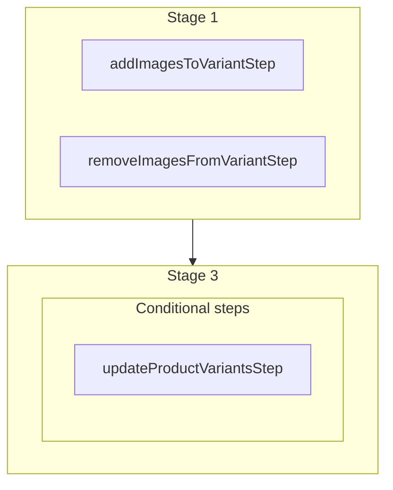

This documentation provides a reference to the `batchVariantImagesWorkflow`. It belongs to the `@medusajs/medusa/core-flows` package.

This workflow manages the association between product variants and images in bulk.
It's used by the [Batch Variant Images Admin API Route](/api/admin/products/manage-images-of-product-variant).

You can use this workflow within your own customizations or custom workflows to manage variant-image associations in bulk.
This is also useful when writing a [seed script](/learn/fundamentals/custom-cli-scripts/seed-data) or a custom import script.

> **Note**
>
> This is available starting from [Medusa v2.11.2](https://github.com/medusajs/medusa/releases/tag/v2.11.2).

[View source code](https://github.com/medusajs/medusa/blob/0ed927bdb7a396a8fd5f6447ed69b7b354b150d3/packages/core/core-flows/src/product/workflows/batch-variant-images.ts#L74)

## Examples

**API Route**

```ts title="src/api/workflow/route.ts"
import type {
  MedusaRequest,
  MedusaResponse,
} from "@medusajs/framework/http"
import { batchVariantImagesWorkflow } from "@medusajs/medusa/core-flows"

export async function POST(
  req: MedusaRequest,
  res: MedusaResponse
) {
  const { result } = await batchVariantImagesWorkflow(req.scope)
    .run({
      input: {
        variant_id: "variant_123",
        add: ["img_123", "img_456"],
        remove: ["img_789"]
      }
    })

  res.send(result)
}
```

**Subscriber**

```ts title="src/subscribers/order-placed.ts"
import {
  type SubscriberConfig,
  type SubscriberArgs,
} from "@medusajs/framework"
import { batchVariantImagesWorkflow } from "@medusajs/medusa/core-flows"

export default async function handleOrderPlaced({
  event: { data },
  container,
}: SubscriberArgs < { id: string } > ) {
  const { result } = await batchVariantImagesWorkflow(container)
    .run({
      input: {
        variant_id: "variant_123",
        add: ["img_123", "img_456"],
        remove: ["img_789"]
      }
    })

  console.log(result)
}

export const config: SubscriberConfig = {
  event: "order.placed",
}
```

**Scheduled Job**

```ts title="src/jobs/message-daily.ts"
import { MedusaContainer } from "@medusajs/framework/types"
import { batchVariantImagesWorkflow } from "@medusajs/medusa/core-flows"

export default async function myCustomJob(
  container: MedusaContainer
) {
  const { result } = await batchVariantImagesWorkflow(container)
    .run({
      input: {
        variant_id: "variant_123",
        add: ["img_123", "img_456"],
        remove: ["img_789"]
      }
    })

  console.log(result)
}

export const config = {
  name: "run-once-a-day",
  schedule: "0 0 * * *",
}
```

**Another Workflow**

```ts title="src/workflows/my-workflow.ts"
import { createWorkflow } from "@medusajs/framework/workflows-sdk"
import { batchVariantImagesWorkflow } from "@medusajs/medusa/core-flows"

const myWorkflow = createWorkflow(
  "my-workflow",
  () => {
    const result = batchVariantImagesWorkflow
      .runAsStep({
        input: {
          variant_id: "variant_123",
          add: ["img_123", "img_456"],
          remove: ["img_789"]
        }
      })
  }
)
```

<a id="batchvariantimagesworkflow-steps" />

## Steps



Stages follow the order in the workflow definition. Conditional steps run only when their condition is met. The step descriptions below include the conditions and reference links.

- [addImagesToVariantStep](/resources/references/medusa-workflows/steps/addImagesToVariantStep): This step adds one or more images to a product variant.
- [removeImagesFromVariantStep](/resources/references/medusa-workflows/steps/removeImagesFromVariantStep): This step removes one or more images from a product variant.
  - **when** (when: !!data.shouldUpdateVariantThumbnail)
  - [updateProductVariantsStep](/resources/references/medusa-workflows/steps/updateProductVariantsStep): This step updates one or more product variants.

<a id="batchvariantimagesworkflow-input" />

## Input

**batchVariantImagesWorkflow**

- `BatchVariantImagesWorkflowInput`: [BatchVariantImagesWorkflowInput](/resources/references/core_flows/core_core_flows_src/interfaces/core_flowscore_core_flows_srcBatchVariantImagesWorkflowInput)
  - `variant_id`: `string` — The ID of the variant to manage images for.
  - `add`: `string`\[] (optional) — The image IDs to add to the variant.
  - `remove`: `string`\[] (optional) — The image IDs to remove from the variant.

<a id="batchvariantimagesworkflow-output" />

## Output

**batchVariantImagesWorkflow**

- `BatchVariantImagesWorkflowOutput`: [BatchVariantImagesWorkflowOutput](/resources/references/core_flows/core_core_flows_src/interfaces/core_flowscore_core_flows_srcBatchVariantImagesWorkflowOutput)
  - `added`: `string`\[] — The image IDs that were added to the variant.
  - `removed`: `string`\[] — The image IDs that were removed from the variant.
