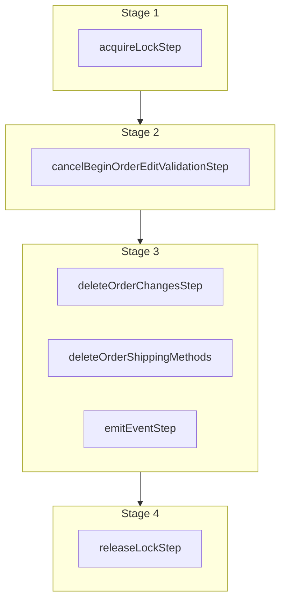

This documentation provides a reference to the `cancelBeginOrderEditWorkflow`. It belongs to the `@medusajs/medusa/core-flows` package.

This workflow cancels a requested edit for an order. It's used by the
[Cancel Order Edit Admin API Route](/api/admin/order-edits/cancel-order-edit).

You can use this workflow within your customizations or your own custom workflows, allowing you to cancel an order edit
in your custom flow.

> **Note**
>
> If you use this workflow in another, you must acquire a lock before running it and release the lock after. Learn more in the [Locking Operations in Workflows](/learn/fundamentals/workflows/locks#locks-in-nested-workflows) guide.

[View source code](https://github.com/medusajs/medusa/blob/0ed927bdb7a396a8fd5f6447ed69b7b354b150d3/packages/core/core-flows/src/order/workflows/order-edit/cancel-begin-order-edit.ts#L101)

## Examples

**API Route**

```ts title="src/api/workflow/route.ts"
import type {
  MedusaRequest,
  MedusaResponse,
} from "@medusajs/framework/http"
import { cancelBeginOrderEditWorkflow } from "@medusajs/medusa/core-flows"

export async function POST(
  req: MedusaRequest,
  res: MedusaResponse
) {
  const { result } = await cancelBeginOrderEditWorkflow(req.scope)
    .run({
      input: {
        order_id: "order_123",
      }
    })

  res.send(result)
}
```

**Subscriber**

```ts title="src/subscribers/order-placed.ts"
import {
  type SubscriberConfig,
  type SubscriberArgs,
} from "@medusajs/framework"
import { cancelBeginOrderEditWorkflow } from "@medusajs/medusa/core-flows"

export default async function handleOrderPlaced({
  event: { data },
  container,
}: SubscriberArgs < { id: string } > ) {
  const { result } = await cancelBeginOrderEditWorkflow(container)
    .run({
      input: {
        order_id: "order_123",
      }
    })

  console.log(result)
}

export const config: SubscriberConfig = {
  event: "order.placed",
}
```

**Scheduled Job**

```ts title="src/jobs/message-daily.ts"
import { MedusaContainer } from "@medusajs/framework/types"
import { cancelBeginOrderEditWorkflow } from "@medusajs/medusa/core-flows"

export default async function myCustomJob(
  container: MedusaContainer
) {
  const { result } = await cancelBeginOrderEditWorkflow(container)
    .run({
      input: {
        order_id: "order_123",
      }
    })

  console.log(result)
}

export const config = {
  name: "run-once-a-day",
  schedule: "0 0 * * *",
}
```

**Another Workflow**

```ts title="src/workflows/my-workflow.ts"
import { createWorkflow } from "@medusajs/framework/workflows-sdk"
import { cancelBeginOrderEditWorkflow } from "@medusajs/medusa/core-flows"

const myWorkflow = createWorkflow(
  "my-workflow",
  () => {
    // Acquire lock from nested workflow here
    // acquireLockStep({  key: input.order_id,  timeout: 2,  ttl: 10,  })
    const result = cancelBeginOrderEditWorkflow
      .runAsStep({
        input: {
          order_id: "order_123",
        }
      })
    // Release lock here
    // releaseLockStep({ key: input.order_id })
  }
)
```

<a id="cancelbeginordereditworkflow-steps" />

## Steps



Stages follow the order in the workflow definition. Conditional steps run only when their condition is met. The step descriptions below include the conditions and reference links.

- [acquireLockStep](/resources/references/medusa-workflows/steps/acquireLockStep): This step acquires a lock for a given key. Learn more about locks in the [Locking Module](/resources/infrastructure-modules/locking) guide.
  - [cancelBeginOrderEditValidationStep](/resources/references/medusa-workflows/cancelBeginOrderEditValidationStep): This step validates that a requested order edit can be canceled. If the order is canceled or the order change is not active, the step will throw an error. :::note You can retrieve an order and order change details using [Query](/learn/fundamentals/module-links/query), or [useQueryGraphStep](/resources/references/medusa-workflows/steps/useQueryGraphStep). :::
    - [deleteOrderChangesStep](/resources/references/medusa-workflows/steps/deleteOrderChangesStep): This step deletes order changes.
    - [deleteOrderShippingMethods](/resources/references/medusa-workflows/steps/deleteOrderShippingMethods): This step deletes order shipping methods.
    - [emitEventStep](/resources/references/medusa-workflows/steps/emitEventStep): This step emits an event, which you can listen to in a [subscriber](/learn/fundamentals/events-and-subscribers). You can pass data to the subscriber by including it in the `data` property. The event is only emitted after the workflow has finished successfully. So, even if it's executed in the middle of the workflow, it won't actually emit the event until the workflow has completed successfully. If the workflow fails, it won't emit the event at all.
      - [releaseLockStep](/resources/references/medusa-workflows/steps/releaseLockStep): This step releases a lock for a given key. Learn more about locks in the [Locking Module](/resources/infrastructure-modules/locking) guide.

<a id="cancelbeginordereditworkflow-input" />

## Input

**cancelBeginOrderEditWorkflow**

- `CancelBeginOrderEditWorkflowInput`: [CancelBeginOrderEditWorkflowInput](/resources/references/core_flows/core_core_flows_src/types/core_flowscore_core_flows_srcCancelBeginOrderEditWorkflowInput)
  - `order_id`: `string` — The ID of the order to cancel the edit for.

<a id="cancelbeginordereditworkflow-emitted-events" />

## Emitted Events

- `order-edit.canceled` (since v2.8.0): Emitted when an order edit request is canceled.

  ```ts
  {
    order_id, // The ID of the order
    actions, // (array) The [actions](https://docs.medusajs.com/resources/references/fulfillment/interfaces/fulfillment.OrderChangeActionDTO) to edit the order
  }
  ```
