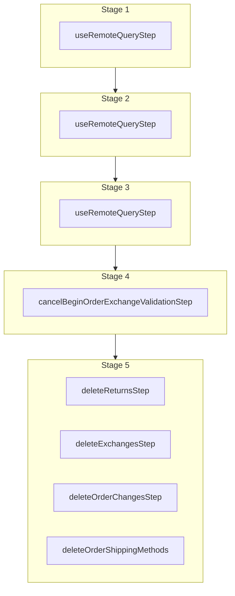

This documentation provides a reference to the `cancelBeginOrderExchangeWorkflow`. It belongs to the `@medusajs/medusa/core-flows` package.

This workflow cancels a requested order exchange. It's used by the
[Cancel Exchange Admin API Route](/api/admin/exchanges/cancel-exchange-request).

You can use this workflow within your customizations or your own custom workflows, allowing you to cancel an exchange
for an order in your custom flow.

[View source code](https://github.com/medusajs/medusa/blob/0ed927bdb7a396a8fd5f6447ed69b7b354b150d3/packages/core/core-flows/src/order/workflows/exchange/cancel-begin-order-exchange.ts#L114)

## Examples

**API Route**

```ts title="src/api/workflow/route.ts"
import type {
  MedusaRequest,
  MedusaResponse,
} from "@medusajs/framework/http"
import { cancelBeginOrderExchangeWorkflow } from "@medusajs/medusa/core-flows"

export async function POST(
  req: MedusaRequest,
  res: MedusaResponse
) {
  const { result } = await cancelBeginOrderExchangeWorkflow(req.scope)
    .run({
      input: {
        exchange_id: "exchange_123",
      }
    })

  res.send(result)
}
```

**Subscriber**

```ts title="src/subscribers/order-placed.ts"
import {
  type SubscriberConfig,
  type SubscriberArgs,
} from "@medusajs/framework"
import { cancelBeginOrderExchangeWorkflow } from "@medusajs/medusa/core-flows"

export default async function handleOrderPlaced({
  event: { data },
  container,
}: SubscriberArgs < { id: string } > ) {
  const { result } = await cancelBeginOrderExchangeWorkflow(container)
    .run({
      input: {
        exchange_id: "exchange_123",
      }
    })

  console.log(result)
}

export const config: SubscriberConfig = {
  event: "order.placed",
}
```

**Scheduled Job**

```ts title="src/jobs/message-daily.ts"
import { MedusaContainer } from "@medusajs/framework/types"
import { cancelBeginOrderExchangeWorkflow } from "@medusajs/medusa/core-flows"

export default async function myCustomJob(
  container: MedusaContainer
) {
  const { result } = await cancelBeginOrderExchangeWorkflow(container)
    .run({
      input: {
        exchange_id: "exchange_123",
      }
    })

  console.log(result)
}

export const config = {
  name: "run-once-a-day",
  schedule: "0 0 * * *",
}
```

**Another Workflow**

```ts title="src/workflows/my-workflow.ts"
import { createWorkflow } from "@medusajs/framework/workflows-sdk"
import { cancelBeginOrderExchangeWorkflow } from "@medusajs/medusa/core-flows"

const myWorkflow = createWorkflow(
  "my-workflow",
  () => {
    const result = cancelBeginOrderExchangeWorkflow
      .runAsStep({
        input: {
          exchange_id: "exchange_123",
        }
      })
  }
)
```

<a id="cancelbeginorderexchangeworkflow-steps" />

## Steps



Stages follow the order in the workflow definition. Conditional steps run only when their condition is met. The step descriptions below include the conditions and reference links.

- [useRemoteQueryStep](/resources/references/medusa-workflows/steps/useRemoteQueryStep): This step fetches data across modules using the remote query. Learn more in the [Remote Query documentation](/learn/fundamentals/module-links/query). :::note This step is deprecated. Use [useQueryGraphStep](/resources/references/medusa-workflows/steps/useQueryGraphStep) instead. :::
  - [useRemoteQueryStep](/resources/references/medusa-workflows/steps/useRemoteQueryStep): This step fetches data across modules using the remote query. Learn more in the [Remote Query documentation](/learn/fundamentals/module-links/query). :::note This step is deprecated. Use [useQueryGraphStep](/resources/references/medusa-workflows/steps/useQueryGraphStep) instead. :::
    - [useRemoteQueryStep](/resources/references/medusa-workflows/steps/useRemoteQueryStep): This step fetches data across modules using the remote query. Learn more in the [Remote Query documentation](/learn/fundamentals/module-links/query). :::note This step is deprecated. Use [useQueryGraphStep](/resources/references/medusa-workflows/steps/useQueryGraphStep) instead. :::
      - [cancelBeginOrderExchangeValidationStep](/resources/references/medusa-workflows/cancelBeginOrderExchangeValidationStep): This step validates that a requested exchange can be canceled. If the order or exchange is canceled, or the order change is not active, the step will throw an error. :::note You can retrieve an order, order exchange, and order change details using [Query](/learn/fundamentals/module-links/query), or [useQueryGraphStep](/resources/references/medusa-workflows/steps/useQueryGraphStep). :::
        - [deleteReturnsStep](/resources/references/medusa-workflows/steps/deleteReturnsStep): This step deletes one or more returns.
        - [deleteExchangesStep](/resources/references/medusa-workflows/steps/deleteExchangesStep): This step deletes one or more exchanges.
        - [deleteOrderChangesStep](/resources/references/medusa-workflows/steps/deleteOrderChangesStep): This step deletes order changes.
        - [deleteOrderShippingMethods](/resources/references/medusa-workflows/steps/deleteOrderShippingMethods): This step deletes order shipping methods.

<a id="cancelbeginorderexchangeworkflow-input" />

## Input

**cancelBeginOrderExchangeWorkflow**

- `CancelBeginOrderExchangeWorkflowInput`: [CancelBeginOrderExchangeWorkflowInput](/resources/references/core_flows/core_core_flows_src/types/core_flowscore_core_flows_srcCancelBeginOrderExchangeWorkflowInput)
  - `exchange_id`: `string` — The ID of the exchange to cancel.
