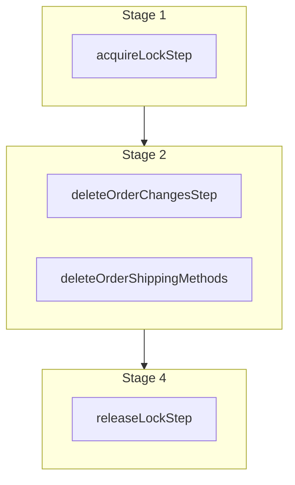

This documentation provides a reference to the `cancelDraftOrderEditWorkflow`. It belongs to the `@medusajs/medusa/core-flows` package.

This workflow cancels a draft order edit. It's used by the
[Cancel Draft Order Edit Admin API Route](/api/admin/draft-orders/cancel-edit).

You can use this workflow within your customizations or your own custom workflows, allowing you to wrap custom logic around
cancelling a draft order edit.

> **Note**
>
> If you use this workflow in another, you must acquire a lock before running it and release the lock after. Learn more in the [Locking Operations in Workflows](/learn/fundamentals/workflows/locks#locks-in-nested-workflows) guide.

[View source code](https://github.com/medusajs/medusa/blob/0ed927bdb7a396a8fd5f6447ed69b7b354b150d3/packages/core/core-flows/src/draft-order/workflows/cancel-draft-order-edit.ts#L58)

## Examples

**API Route**

```ts title="src/api/workflow/route.ts"
import type {
  MedusaRequest,
  MedusaResponse,
} from "@medusajs/framework/http"
import { cancelDraftOrderEditWorkflow } from "@medusajs/medusa/core-flows"

export async function POST(
  req: MedusaRequest,
  res: MedusaResponse
) {
  const { result } = await cancelDraftOrderEditWorkflow(req.scope)
    .run({
      input: {
        order_id: "order_123",
      }
    })

  res.send(result)
}
```

**Subscriber**

```ts title="src/subscribers/order-placed.ts"
import {
  type SubscriberConfig,
  type SubscriberArgs,
} from "@medusajs/framework"
import { cancelDraftOrderEditWorkflow } from "@medusajs/medusa/core-flows"

export default async function handleOrderPlaced({
  event: { data },
  container,
}: SubscriberArgs < { id: string } > ) {
  const { result } = await cancelDraftOrderEditWorkflow(container)
    .run({
      input: {
        order_id: "order_123",
      }
    })

  console.log(result)
}

export const config: SubscriberConfig = {
  event: "order.placed",
}
```

**Scheduled Job**

```ts title="src/jobs/message-daily.ts"
import { MedusaContainer } from "@medusajs/framework/types"
import { cancelDraftOrderEditWorkflow } from "@medusajs/medusa/core-flows"

export default async function myCustomJob(
  container: MedusaContainer
) {
  const { result } = await cancelDraftOrderEditWorkflow(container)
    .run({
      input: {
        order_id: "order_123",
      }
    })

  console.log(result)
}

export const config = {
  name: "run-once-a-day",
  schedule: "0 0 * * *",
}
```

**Another Workflow**

```ts title="src/workflows/my-workflow.ts"
import { createWorkflow } from "@medusajs/framework/workflows-sdk"
import { cancelDraftOrderEditWorkflow } from "@medusajs/medusa/core-flows"

const myWorkflow = createWorkflow(
  "my-workflow",
  () => {
    // Acquire lock from nested workflow here
    // acquireLockStep({  key: input.order_id,  timeout: 2,  ttl: 10,  })
    const result = cancelDraftOrderEditWorkflow
      .runAsStep({
        input: {
          order_id: "order_123",
        }
      })
    // Release lock here
    // releaseLockStep({ key: input.order_id })
  }
)
```

<a id="canceldraftordereditworkflow-steps" />

## Steps



Stages follow the order in the workflow definition. Conditional steps run only when their condition is met. The step descriptions below include the conditions and reference links.

- [acquireLockStep](/resources/references/medusa-workflows/steps/acquireLockStep): This step acquires a lock for a given key. Learn more about locks in the [Locking Module](/resources/infrastructure-modules/locking) guide.
  - [deleteOrderChangesStep](/resources/references/medusa-workflows/steps/deleteOrderChangesStep): This step deletes order changes.
  - [deleteOrderShippingMethods](/resources/references/medusa-workflows/steps/deleteOrderShippingMethods): This step deletes order shipping methods.
    - [releaseLockStep](/resources/references/medusa-workflows/steps/releaseLockStep): This step releases a lock for a given key. Learn more about locks in the [Locking Module](/resources/infrastructure-modules/locking) guide.

<a id="canceldraftordereditworkflow-input" />

## Input

**cancelDraftOrderEditWorkflow**

- `CancelDraftOrderEditWorkflowInput`: [CancelDraftOrderEditWorkflowInput](/resources/references/core_flows/core_core_flows_src/interfaces/core_flowscore_core_flows_srcCancelDraftOrderEditWorkflowInput)
  - `order_id`: `string` — The ID of the draft order to cancel the edit for.
