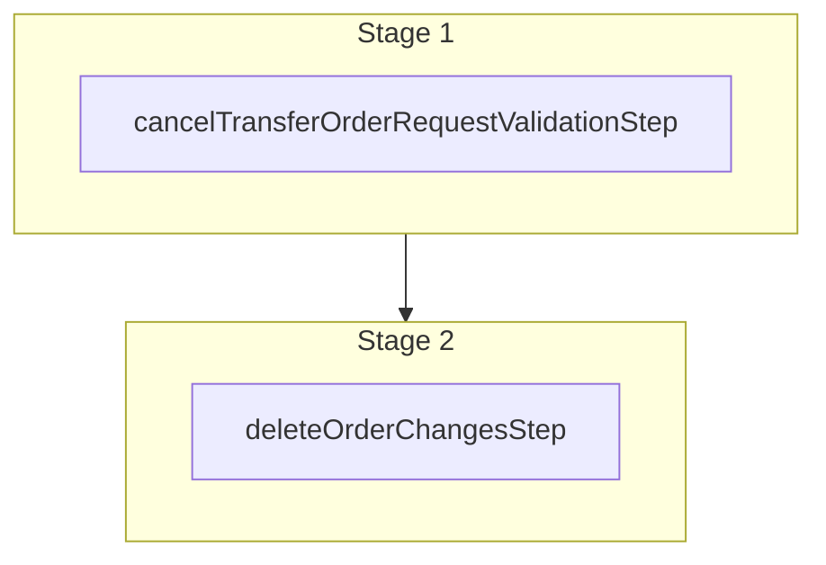

This documentation provides a reference to the `cancelOrderTransferRequestWorkflow`. It belongs to the `@medusajs/medusa/core-flows` package.

This workflow cancels a requested order transfer. This operation is allowed only by admin users and the customer that requested the transfer.
This workflow is used by the [Cancel Order Transfer Store API Route](/api/store/orders/cancel-transfer),
and the [Cancel Transfer Request Admin API Route](/api/admin/orders/cancel-transfer).

You can use this workflow within your customizations or your own custom workflows, allowing you to build a custom flow
around canceling an order transfer.

[View source code](https://github.com/medusajs/medusa/blob/0ed927bdb7a396a8fd5f6447ed69b7b354b150d3/packages/core/core-flows/src/order/workflows/transfer/cancel-order-transfer.ts#L122)

## Examples

**API Route**

```ts title="src/api/workflow/route.ts"
import type {
  MedusaRequest,
  MedusaResponse,
} from "@medusajs/framework/http"
import { cancelOrderTransferRequestWorkflow } from "@medusajs/medusa/core-flows"

export async function POST(
  req: MedusaRequest,
  res: MedusaResponse
) {
  const { result } = await cancelOrderTransferRequestWorkflow(req.scope)
    .run({
      input: {
        order_id: "order_123",
        logged_in_user_id: "cus_123",
        actor_type: "customer"
      }
    })

  res.send(result)
}
```

**Subscriber**

```ts title="src/subscribers/order-placed.ts"
import {
  type SubscriberConfig,
  type SubscriberArgs,
} from "@medusajs/framework"
import { cancelOrderTransferRequestWorkflow } from "@medusajs/medusa/core-flows"

export default async function handleOrderPlaced({
  event: { data },
  container,
}: SubscriberArgs < { id: string } > ) {
  const { result } = await cancelOrderTransferRequestWorkflow(container)
    .run({
      input: {
        order_id: "order_123",
        logged_in_user_id: "cus_123",
        actor_type: "customer"
      }
    })

  console.log(result)
}

export const config: SubscriberConfig = {
  event: "order.placed",
}
```

**Scheduled Job**

```ts title="src/jobs/message-daily.ts"
import { MedusaContainer } from "@medusajs/framework/types"
import { cancelOrderTransferRequestWorkflow } from "@medusajs/medusa/core-flows"

export default async function myCustomJob(
  container: MedusaContainer
) {
  const { result } = await cancelOrderTransferRequestWorkflow(container)
    .run({
      input: {
        order_id: "order_123",
        logged_in_user_id: "cus_123",
        actor_type: "customer"
      }
    })

  console.log(result)
}

export const config = {
  name: "run-once-a-day",
  schedule: "0 0 * * *",
}
```

**Another Workflow**

```ts title="src/workflows/my-workflow.ts"
import { createWorkflow } from "@medusajs/framework/workflows-sdk"
import { cancelOrderTransferRequestWorkflow } from "@medusajs/medusa/core-flows"

const myWorkflow = createWorkflow(
  "my-workflow",
  () => {
    const result = cancelOrderTransferRequestWorkflow
      .runAsStep({
        input: {
          order_id: "order_123",
          logged_in_user_id: "cus_123",
          actor_type: "customer"
        }
      })
  }
)
```

<a id="cancelordertransferrequestworkflow-steps" />

## Steps



Stages follow the order in the workflow definition. Conditional steps run only when their condition is met. The step descriptions below include the conditions and reference links.

- [cancelTransferOrderRequestValidationStep](/resources/references/medusa-workflows/cancelTransferOrderRequestValidationStep): This step validates that a requested order transfer can be canceled. If the customer canceling the order transfer isn't the one that requested the transfer, the step throws an error. Admin users can cancel any order transfer. :::note You can retrieve an order and order change details using [Query](/learn/fundamentals/module-links/query), or [useQueryGraphStep](/resources/references/medusa-workflows/steps/useQueryGraphStep). :::
  - [deleteOrderChangesStep](/resources/references/medusa-workflows/steps/deleteOrderChangesStep): This step deletes order changes.

<a id="cancelordertransferrequestworkflow-input" />

## Input

**cancelOrderTransferRequestWorkflow**

- `CancelTransferOrderRequestWorkflowInput`: [CancelTransferOrderRequestWorkflowInput](/resources/references/types/WorkflowTypes/OrderWorkflow/types/typesWorkflowTypesOrderWorkflowCancelTransferOrderRequestWorkflowInput)
  - `order_id`: `string` — The ID of the order to cancel the transfer for.
  - `logged_in_user_id`: `string` — The ID of the authenticated user requesting to cancel the transfer.
  - `actor_type`: `"customer"` | `"user"` — The actor type requesting to cancel the transfer.
