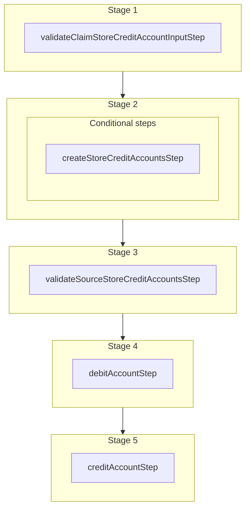

This documentation provides a reference to the `claimStoreCreditAccountWorkflow`. It belongs to the `@medusajs/medusa/core-flows` package.

This workflow claims an anonymous store credit account for a customer. It transfers
the balance from the source account (identified by code) to the customer's store credit
account in the same currency. If the customer does not have an account in that currency,
a new one is created. The customer must have a registered account to claim.

You can use this workflow within your own customizations or custom workflows,
allowing you to wrap custom logic around claiming store credit accounts.

[View source code](https://github.com/medusajs/medusa/blob/0ed927bdb7a396a8fd5f6447ed69b7b354b150d3/packages/plugins/loyalty/src/workflows/store-credit/workflows/claim-store-credit-account.ts#L160)

## Examples

**API Route**

```ts title="src/api/workflow/route.ts"
import type {
  MedusaRequest,
  MedusaResponse,
} from "@medusajs/framework/http"
import { claimStoreCreditAccountWorkflow } from "@medusajs/loyalty-plugin/workflows"

export async function POST(
  req: MedusaRequest,
  res: MedusaResponse
) {
  await claimStoreCreditAccountWorkflow(req.scope)
    .run({
      input: {
        code: "SC-XXXX-XXXX",
        customer_id: "cust_123",
      },
    })

  res.send(result)
}
```

**Subscriber**

```ts title="src/subscribers/order-placed.ts"
import {
  type SubscriberConfig,
  type SubscriberArgs,
} from "@medusajs/framework"
import { claimStoreCreditAccountWorkflow } from "@medusajs/loyalty-plugin/workflows"

export default async function handleOrderPlaced({
  event: { data },
  container,
}: SubscriberArgs < { id: string } > ) {
  await claimStoreCreditAccountWorkflow(container)
    .run({
      input: {
        code: "SC-XXXX-XXXX",
        customer_id: "cust_123",
      },
    })

  console.log(result)
}

export const config: SubscriberConfig = {
  event: "order.placed",
}
```

**Scheduled Job**

```ts title="src/jobs/message-daily.ts"
import { MedusaContainer } from "@medusajs/framework/types"
import { claimStoreCreditAccountWorkflow } from "@medusajs/loyalty-plugin/workflows"

export default async function myCustomJob(
  container: MedusaContainer
) {
  await claimStoreCreditAccountWorkflow(container)
    .run({
      input: {
        code: "SC-XXXX-XXXX",
        customer_id: "cust_123",
      },
    })

  console.log(result)
}

export const config = {
  name: "run-once-a-day",
  schedule: "0 0 * * *",
}
```

**Another Workflow**

```ts title="src/workflows/my-workflow.ts"
import { createWorkflow } from "@medusajs/framework/workflows-sdk"
import { claimStoreCreditAccountWorkflow } from "@medusajs/loyalty-plugin/workflows"

const myWorkflow = createWorkflow(
  "my-workflow",
  () => {
    claimStoreCreditAccountWorkflow
      .runAsStep({
        input: {
          code: "SC-XXXX-XXXX",
          customer_id: "cust_123",
        },
      })
  }
)
```

<a id="claimstorecreditaccountworkflow-steps" />

## Steps



Stages follow the order in the workflow definition. Conditional steps run only when their condition is met. The step descriptions below include the conditions and reference links.

- [validateClaimStoreCreditAccountInputStep](/resources/references/medusa-workflows/validateClaimStoreCreditAccountInputStep): This step validates the input for claiming a store credit account. It throws an error if the code or customer ID is missing, or if the customer does not have a registered account.
  - **when** (when: !existingCustomerStoreCreditAccount)
  - [createStoreCreditAccountsStep](/resources/references/medusa-workflows/steps/createStoreCreditAccountsStep): This step creates store credit accounts. If no code is provided, a unique code prefixed with "SC" is automatically generated. The step supports rollback by deleting the created accounts.
    - [validateSourceStoreCreditAccountsStep](/resources/references/medusa-workflows/validateSourceStoreCreditAccountsStep): This step validates that the source store credit account can be claimed by the customer. It checks that the source account is not already owned by the customer, that it does not belong to another customer, and that it has a balance greater than 0. It throws an error if any of these conditions are not met.
      - [debitAccountStep](/resources/references/medusa-workflows/steps/debitAccountStep): This step debits one or more store credit accounts by creating debit transactions. The step supports rollback by deleting the created transactions.
        - [creditAccountStep](/resources/references/medusa-workflows/steps/creditAccountStep): This step credits one or more store credit accounts with transactions. The step supports rollback by deleting the created transactions.

<a id="claimstorecreditaccountworkflow-input" />

## Input

**claimStoreCreditAccountWorkflow**

- `ClaimStoreCreditAccountWorkflowInput`: [ClaimStoreCreditAccountWorkflowInput](/resources/references/core_flows/plugins_loyalty_src_workflows/types/core_flowsplugins_loyalty_src_workflowsClaimStoreCreditAccountWorkflowInput)
  - `code`: `string` — The code of the anonymous store credit account to claim.
  - `customer_id`: `string` — The ID of the customer claiming the store credit account.
