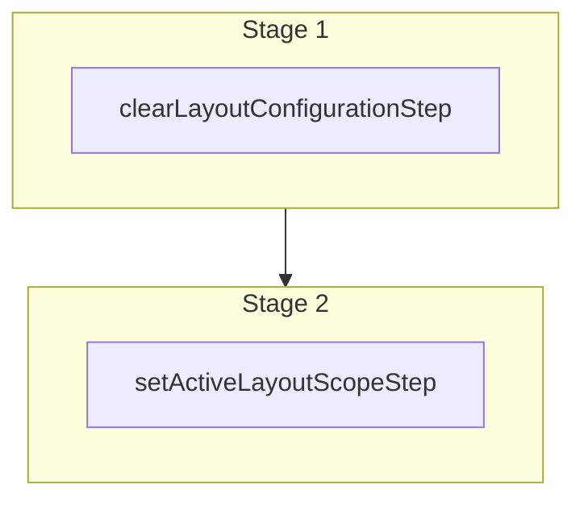

This documentation provides a reference to the `clearLayoutConfigurationWorkflow`. It belongs to the `@medusajs/medusa/core-flows` package.

This workflow clears a user's personal layout configuration for a zone,
reverting them to the system default. It also resets the user's active
layout scope for the zone.

This workflow is used by the
[Clear Layout Configuration Admin API Route](/api/admin/layouts/clear-configuration-of-layout).

You can use this workflow within your own customizations or custom workflows,
allowing you to clear a layout configuration within your custom flows.

> **Note**
>
> This is available starting from [Medusa v2.17.2](https://github.com/medusajs/medusa/releases/tag/v2.17.2).

[View source code](https://github.com/medusajs/medusa/blob/0ed927bdb7a396a8fd5f6447ed69b7b354b150d3/packages/core/core-flows/src/settings/workflows/clear-layout-configuration.ts#L49)

## Examples

**API Route**

```ts title="src/api/workflow/route.ts"
import type {
  MedusaRequest,
  MedusaResponse,
} from "@medusajs/framework/http"
import { clearLayoutConfigurationWorkflow } from "@medusajs/medusa/core-flows"

export async function POST(
  req: MedusaRequest,
  res: MedusaResponse
) {
  const { result } = await clearLayoutConfigurationWorkflow(req.scope)
    .run({
      input: {
        zone: "products",
        user_id: "user_123",
      },
    })

  res.send(result)
}
```

**Subscriber**

```ts title="src/subscribers/order-placed.ts"
import {
  type SubscriberConfig,
  type SubscriberArgs,
} from "@medusajs/framework"
import { clearLayoutConfigurationWorkflow } from "@medusajs/medusa/core-flows"

export default async function handleOrderPlaced({
  event: { data },
  container,
}: SubscriberArgs < { id: string } > ) {
  const { result } = await clearLayoutConfigurationWorkflow(container)
    .run({
      input: {
        zone: "products",
        user_id: "user_123",
      },
    })

  console.log(result)
}

export const config: SubscriberConfig = {
  event: "order.placed",
}
```

**Scheduled Job**

```ts title="src/jobs/message-daily.ts"
import { MedusaContainer } from "@medusajs/framework/types"
import { clearLayoutConfigurationWorkflow } from "@medusajs/medusa/core-flows"

export default async function myCustomJob(
  container: MedusaContainer
) {
  const { result } = await clearLayoutConfigurationWorkflow(container)
    .run({
      input: {
        zone: "products",
        user_id: "user_123",
      },
    })

  console.log(result)
}

export const config = {
  name: "run-once-a-day",
  schedule: "0 0 * * *",
}
```

**Another Workflow**

```ts title="src/workflows/my-workflow.ts"
import { createWorkflow } from "@medusajs/framework/workflows-sdk"
import { clearLayoutConfigurationWorkflow } from "@medusajs/medusa/core-flows"

const myWorkflow = createWorkflow(
  "my-workflow",
  () => {
    const result = clearLayoutConfigurationWorkflow
      .runAsStep({
        input: {
          zone: "products",
          user_id: "user_123",
        },
      })
  }
)
```

<a id="clearlayoutconfigurationworkflow-steps" />

## Steps



Stages follow the order in the workflow definition. Conditional steps run only when their condition is met. The step descriptions below include the conditions and reference links.

- [clearLayoutConfigurationStep](/resources/references/medusa-workflows/steps/clearLayoutConfigurationStep): This step clears a user's personal layout configuration for a zone, reverting them to the system default.
  - [setActiveLayoutScopeStep](/resources/references/medusa-workflows/steps/setActiveLayoutScopeStep): This step sets a user's active layout scope for a zone, which determines whether the user's personal or the system default configuration is shown.

<a id="clearlayoutconfigurationworkflow-input" />

## Input

**clearLayoutConfigurationWorkflow**

- `ClearLayoutConfigurationWorkflowInput`: [ClearLayoutConfigurationWorkflowInput](/resources/references/core_flows/core_core_flows_src/types/core_flowscore_core_flows_srcClearLayoutConfigurationWorkflowInput)
  - `zone`: `string` — The zone that the layout configuration applies to.
  - `user_id`: `string` — The ID of the user whose layout configuration is cleared.
