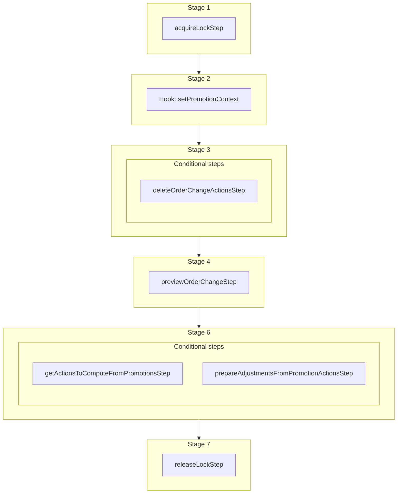

This documentation provides a reference to the `computeDraftOrderAdjustmentsWorkflow`. It belongs to the `@medusajs/medusa/core-flows` package.

This workflow computes the adjustments or promotions for a draft order. It's used by other workflows
to compute new adjustments for the promotions whenever changes are made to the draft order.
Created adjustments are "virtual" meaning they live on the action and no line item adjustments records are created
in the database until the edit is confirmed.

You can use this workflow within your customizations or your own custom workflows, allowing you to wrap custom logic around
computing the adjustments for a draft order.

> **Note**
>
> If you use this workflow in another, you must acquire a lock before running it and release the lock after. Learn more in the [Locking Operations in Workflows](/learn/fundamentals/workflows/locks#locks-in-nested-workflows) guide.

[View source code](https://github.com/medusajs/medusa/blob/0ed927bdb7a396a8fd5f6447ed69b7b354b150d3/packages/core/core-flows/src/draft-order/workflows/compute-draft-order-adjustments.ts#L68)

## Examples

**API Route**

```ts title="src/api/workflow/route.ts"
import type {
  MedusaRequest,
  MedusaResponse,
} from "@medusajs/framework/http"
import { computeDraftOrderAdjustmentsWorkflow } from "@medusajs/medusa/core-flows"

export async function POST(
  req: MedusaRequest,
  res: MedusaResponse
) {
  const { result } = await computeDraftOrderAdjustmentsWorkflow(req.scope)
    .run({
      input: {
        order_id: "order_123",
      }
    })

  res.send(result)
}
```

**Subscriber**

```ts title="src/subscribers/order-placed.ts"
import {
  type SubscriberConfig,
  type SubscriberArgs,
} from "@medusajs/framework"
import { computeDraftOrderAdjustmentsWorkflow } from "@medusajs/medusa/core-flows"

export default async function handleOrderPlaced({
  event: { data },
  container,
}: SubscriberArgs < { id: string } > ) {
  const { result } = await computeDraftOrderAdjustmentsWorkflow(container)
    .run({
      input: {
        order_id: "order_123",
      }
    })

  console.log(result)
}

export const config: SubscriberConfig = {
  event: "order.placed",
}
```

**Scheduled Job**

```ts title="src/jobs/message-daily.ts"
import { MedusaContainer } from "@medusajs/framework/types"
import { computeDraftOrderAdjustmentsWorkflow } from "@medusajs/medusa/core-flows"

export default async function myCustomJob(
  container: MedusaContainer
) {
  const { result } = await computeDraftOrderAdjustmentsWorkflow(container)
    .run({
      input: {
        order_id: "order_123",
      }
    })

  console.log(result)
}

export const config = {
  name: "run-once-a-day",
  schedule: "0 0 * * *",
}
```

**Another Workflow**

```ts title="src/workflows/my-workflow.ts"
import { createWorkflow } from "@medusajs/framework/workflows-sdk"
import { computeDraftOrderAdjustmentsWorkflow } from "@medusajs/medusa/core-flows"

const myWorkflow = createWorkflow(
  "my-workflow",
  () => {
    // Acquire lock from nested workflow here
    // acquireLockStep({  key: input.order_id,  timeout: 2,  ttl: 10,  })
    const result = computeDraftOrderAdjustmentsWorkflow
      .runAsStep({
        input: {
          order_id: "order_123",
        }
      })
    // Release lock here
    // releaseLockStep({ key: input.order_id })
  }
)
```

<a id="computedraftorderadjustmentsworkflow-steps" />

## Steps



Stages follow the order in the workflow definition. Conditional steps run only when their condition is met. The step descriptions below include the conditions and reference links.

- [acquireLockStep](/resources/references/medusa-workflows/steps/acquireLockStep): This step acquires a lock for a given key. Learn more about locks in the [Locking Module](/resources/infrastructure-modules/locking) guide.
  - [setPromotionContext](/resources/references/medusa-workflows/computeDraftOrderAdjustmentsWorkflow#setpromotioncontext): This hook is executed before promotion rules are evaluated for the draft order. You can consume this hook to return any custom context that should be merged on top of the order context when evaluating promotion rules (e.g. `company.id`, `custom_tier`).
    - **when** (when: toDeleteActions.length > 0)
    - [deleteOrderChangeActionsStep](/resources/references/medusa-workflows/steps/deleteOrderChangeActionsStep): This step deletes order change actions.
      - [previewOrderChangeStep](/resources/references/medusa-workflows/steps/previewOrderChangeStep): This step retrieves a preview of an order change.
        - **when** (when: !!order.promotions?.length)
        - [getActionsToComputeFromPromotionsStep](/resources/references/medusa-workflows/steps/getActionsToComputeFromPromotionsStep): This step retrieves the actions to compute based on the promotions applied on items and shipping methods. :::tip You can use the [retrieveCartStep](/resources/references/medusa-workflows/steps/retrieveCartStep) to retrieve items and shipping methods' details. :::
        - [prepareAdjustmentsFromPromotionActionsStep](/resources/references/medusa-workflows/steps/prepareAdjustmentsFromPromotionActionsStep): This step prepares the line item or shipping method adjustments using actions computed by the Promotion Module.
          - [releaseLockStep](/resources/references/medusa-workflows/steps/releaseLockStep): This step releases a lock for a given key. Learn more about locks in the [Locking Module](/resources/infrastructure-modules/locking) guide.

<a id="computedraftorderadjustmentsworkflow-input" />

## Input

**computeDraftOrderAdjustmentsWorkflow**

- `ComputeDraftOrderAdjustmentsWorkflowInput`: [ComputeDraftOrderAdjustmentsWorkflowInput](/resources/references/core_flows/core_core_flows_src/interfaces/core_flowscore_core_flows_srcComputeDraftOrderAdjustmentsWorkflowInput)
  - `order_id`: `string` — The ID of the draft order to refresh the adjustments for.

## Hooks

Hooks allow you to inject custom functionalities into the workflow. You'll receive data from the workflow, as well as additional data sent through an HTTP request.

Learn more about [Hooks](/learn/fundamentals/workflows/workflow-hooks) and [Additional Data](/learn/fundamentals/api-routes/additional-data).

### setPromotionContext

This hook is executed before promotion rules are evaluated for the draft order. You can consume this hook to return any custom context that should be merged on top of the order context when evaluating promotion rules (e.g. `company.id`, `custom_tier`).

#### Example

```ts
import { computeDraftOrderAdjustmentsWorkflow } from "@medusajs/medusa/core-flows"

computeDraftOrderAdjustmentsWorkflow.hooks.setPromotionContext(
  (async ({ order, orderChange }, { container }) => {
    //TODO
  })
)
```

<a id="input" />

#### Input

Handlers consuming this hook accept the following input.

**setPromotionContext**

- `input`: object — The input data for the hook.
  - `order`: `object`
  - `orderChange`: [OrderChangeDTO](/resources/references/fulfillment/interfaces/fulfillmentOrderChangeDTO) — The order change details.
