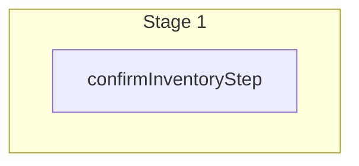

This documentation provides a reference to the `confirmVariantInventoryWorkflow`. It belongs to the `@medusajs/medusa/core-flows` package.

This workflow validates that product variants are in-stock at the specified sales channel, before adding them or updating their quantity in the cart. If a variant doesn't have sufficient quantity in-stock,
the workflow throws an error. If all variants have sufficient inventory, the workflow returns the cart's items with their inventory details.

This workflow is useful when confirming that a product variant has sufficient quantity to be added to or updated in the cart. It's executed
by other cart-related workflows, such as [addToCartWorkflow](/resources/references/medusa-workflows/addToCartWorkflow), to confirm that a product variant can be added to the cart at the specified quantity.

> **Note**
>
> Learn more about the links between the product variant and sales channels and inventory items in [this documentation](/resources/commerce-modules/product/links-to-other-modules).

You can use this workflow within your own customizations or custom workflows, allowing you to check whether a product variant has enough inventory quantity before adding them to the cart.

[View source code](https://github.com/medusajs/medusa/blob/0ed927bdb7a396a8fd5f6447ed69b7b354b150d3/packages/core/core-flows/src/cart/workflows/confirm-variant-inventory.ts#L147)

## Examples

You can retrieve a variant's required details using [Query](/learn/fundamentals/module-links/query):

```ts workflow={false}
const { data: variants } = await query.graph({
  entity: "variant",
  fields: [
    "id",
    "manage_inventory",
    "inventory_items.inventory_item_id",
    "inventory_items.required_quantity",
    "inventory_items.inventory.requires_shipping",
    "inventory_items.inventory.location_levels.stocked_quantity",
    "inventory_items.inventory.location_levels.reserved_quantity",
    "inventory_items.inventory.location_levels.raw_stocked_quantity",
    "inventory_items.inventory.location_levels.raw_reserved_quantity",
    "inventory_items.inventory.location_levels.stock_locations.id",
    "inventory_items.inventory.location_levels.stock_locations.name",
    "inventory_items.inventory.location_levels.stock_locations.sales_channels.id",
    "inventory_items.inventory.location_levels.stock_locations.sales_channels.name",
  ],
  filters: {
    id: ["variant_123"]
  }
})
```

> **Note**
>
> In a workflow, use [useQueryGraphStep](/resources/references/medusa-workflows/steps/useQueryGraphStep) instead.

Then, pass the variant's data with the other required data to the workflow:

**API Route**

```ts title="src/api/workflow/route.ts"
import type {
  MedusaRequest,
  MedusaResponse,
} from "@medusajs/framework/http"
import { confirmVariantInventoryWorkflow } from "@medusajs/medusa/core-flows"

export async function POST(
  req: MedusaRequest,
  res: MedusaResponse
) {
  const { result } = await confirmVariantInventoryWorkflow(req.scope)
    .run({
      input: {
        sales_channel_id: "sc_123",
        // @ts-ignore
        variants,
        items: [{
          variant_id: "variant_123",
          quantity: 1
        }]
      }
    })

  res.send(result)
}
```

**Subscriber**

```ts title="src/subscribers/order-placed.ts"
import {
  type SubscriberConfig,
  type SubscriberArgs,
} from "@medusajs/framework"
import { confirmVariantInventoryWorkflow } from "@medusajs/medusa/core-flows"

export default async function handleOrderPlaced({
  event: { data },
  container,
}: SubscriberArgs < { id: string } > ) {
  const { result } = await confirmVariantInventoryWorkflow(container)
    .run({
      input: {
        sales_channel_id: "sc_123",
        // @ts-ignore
        variants,
        items: [{
          variant_id: "variant_123",
          quantity: 1
        }]
      }
    })

  console.log(result)
}

export const config: SubscriberConfig = {
  event: "order.placed",
}
```

**Scheduled Job**

```ts title="src/jobs/message-daily.ts"
import { MedusaContainer } from "@medusajs/framework/types"
import { confirmVariantInventoryWorkflow } from "@medusajs/medusa/core-flows"

export default async function myCustomJob(
  container: MedusaContainer
) {
  const { result } = await confirmVariantInventoryWorkflow(container)
    .run({
      input: {
        sales_channel_id: "sc_123",
        // @ts-ignore
        variants,
        items: [{
          variant_id: "variant_123",
          quantity: 1
        }]
      }
    })

  console.log(result)
}

export const config = {
  name: "run-once-a-day",
  schedule: "0 0 * * *",
}
```

**Another Workflow**

```ts title="src/workflows/my-workflow.ts"
import { createWorkflow } from "@medusajs/framework/workflows-sdk"
import { confirmVariantInventoryWorkflow } from "@medusajs/medusa/core-flows"

const myWorkflow = createWorkflow(
  "my-workflow",
  () => {
    const result = confirmVariantInventoryWorkflow
      .runAsStep({
        input: {
          sales_channel_id: "sc_123",
          // @ts-ignore
          variants,
          items: [{
            variant_id: "variant_123",
            quantity: 1
          }]
        }
      })
  }
)
```

When updating an item quantity:

**API Route**

```ts title="src/api/workflow/route.ts"
import type {
  MedusaRequest,
  MedusaResponse,
} from "@medusajs/framework/http"
import { confirmVariantInventoryWorkflow } from "@medusajs/medusa/core-flows"

export async function POST(
  req: MedusaRequest,
  res: MedusaResponse
) {
  const { result } = await confirmVariantInventoryWorkflow(req.scope)
    .run({
      input: {
        sales_channel_id: "sc_123",
        // @ts-ignore
        variants,
        items: [{
          variant_id: "variant_123",
          quantity: 1
        }],
        itemsToUpdate: [{
          data: {
            variant_id: "variant_123",
            quantity: 2
          }
        }]
      }
    })

  res.send(result)
}
```

**Subscriber**

```ts title="src/subscribers/order-placed.ts"
import {
  type SubscriberConfig,
  type SubscriberArgs,
} from "@medusajs/framework"
import { confirmVariantInventoryWorkflow } from "@medusajs/medusa/core-flows"

export default async function handleOrderPlaced({
  event: { data },
  container,
}: SubscriberArgs < { id: string } > ) {
  const { result } = await confirmVariantInventoryWorkflow(container)
    .run({
      input: {
        sales_channel_id: "sc_123",
        // @ts-ignore
        variants,
        items: [{
          variant_id: "variant_123",
          quantity: 1
        }],
        itemsToUpdate: [{
          data: {
            variant_id: "variant_123",
            quantity: 2
          }
        }]
      }
    })

  console.log(result)
}

export const config: SubscriberConfig = {
  event: "order.placed",
}
```

**Scheduled Job**

```ts title="src/jobs/message-daily.ts"
import { MedusaContainer } from "@medusajs/framework/types"
import { confirmVariantInventoryWorkflow } from "@medusajs/medusa/core-flows"

export default async function myCustomJob(
  container: MedusaContainer
) {
  const { result } = await confirmVariantInventoryWorkflow(container)
    .run({
      input: {
        sales_channel_id: "sc_123",
        // @ts-ignore
        variants,
        items: [{
          variant_id: "variant_123",
          quantity: 1
        }],
        itemsToUpdate: [{
          data: {
            variant_id: "variant_123",
            quantity: 2
          }
        }]
      }
    })

  console.log(result)
}

export const config = {
  name: "run-once-a-day",
  schedule: "0 0 * * *",
}
```

**Another Workflow**

```ts title="src/workflows/my-workflow.ts"
import { createWorkflow } from "@medusajs/framework/workflows-sdk"
import { confirmVariantInventoryWorkflow } from "@medusajs/medusa/core-flows"

const myWorkflow = createWorkflow(
  "my-workflow",
  () => {
    const result = confirmVariantInventoryWorkflow
      .runAsStep({
        input: {
          sales_channel_id: "sc_123",
          // @ts-ignore
          variants,
          items: [{
            variant_id: "variant_123",
            quantity: 1
          }],
          itemsToUpdate: [{
            data: {
              variant_id: "variant_123",
              quantity: 2
            }
          }]
        }
      })
  }
)
```

<a id="confirmvariantinventoryworkflow-steps" />

## Steps



Stages follow the order in the workflow definition. Conditional steps run only when their condition is met. The step descriptions below include the conditions and reference links.

- [confirmInventoryStep](/resources/references/medusa-workflows/steps/confirmInventoryStep): This step validates that items in the cart have sufficient inventory quantity. If an item doesn't have sufficient inventory, an error is thrown.

<a id="confirmvariantinventoryworkflow-input" />

## Input

**confirmVariantInventoryWorkflow**

- `ConfirmVariantInventoryWorkflowInputDTO`: [ConfirmVariantInventoryWorkflowInputDTO](/resources/references/types/interfaces/typesConfirmVariantInventoryWorkflowInputDTO) — The details necessary to check whether the variant has sufficient inventory.
  - `sales_channel_id`: `string` — The ID of the sales channel to check the inventory availability in.
  - `variants`: `object`\[] — The variants to confirm they have sufficient in-stock quantity.
    - `id`: `string` — The variant's ID.
    - `manage_inventory`: `boolean` — Whether Medusa manages the inventory of the variant. If disabled, the variant is always considered in stock.
    - `inventory_items`: `object`\[] — The variant's inventory items, if manage\_inventory is enabled.
      - `inventory_item_id`: `string` — The ID of the inventory item.
      - `variant_id`: `string` — The ID of the variant.
      - `required_quantity`: [BigNumberInput](/resources/references/types/types/typesBigNumberInput) — The number of units a single quantity is equivalent to. For example, if a customer orders one quantity of the variant, Medusa checks the availability of the quantity multiplied by the value set for `required_quantity`. When the customer orders the quantity, Medusa reserves the ordered quantity multiplied by the value set for `required_quantity`.
      - `inventory`: `object`\[] — The inventory details.
  - `items`: `object`\[] — The items in the cart, or to be added.
    - `variant_id`: `null` | `string` (optional) — The ID of the associated variant.
    - `quantity`: [BigNumberInput](/resources/references/types/types/typesBigNumberInput) — The quantity in the cart.
      - `value`: `string` | `number`
      - `numeric`: `number`
      - `raw`: [BigNumberRawValue](/resources/references/types/types/typesBigNumberRawValue) (optional)
      - `bigNumber`: `BigNumber` (optional)
    - `id`: `string` (optional) — The ID of the line item if it's already in the cart.
    - `allow_backorder`: `boolean` (optional) — Whether the item can be added even if its variant is out of stock. This overrides the variant's `allow_backorder` setting for this item only.
  - `itemsToUpdate`: `object`\[] | `object`\[] (optional) — The new quantity of the variant to be added to the cart. This is useful when updating a variant's quantity in the cart.
    - `data`: `object` — The item update's details.
      - `variant_id`: `string` (optional) — The ID of the associated variant.
      - `quantity`: [BigNumberInput](/resources/references/types/types/typesBigNumberInput) (optional) — The variant's quantity.
    - `variant_id`: `string` (optional) — The ID of the associated variant.
    - `quantity`: [BigNumberInput](/resources/references/types/types/typesBigNumberInput) (optional) — The variant's quantity.
      - `value`: `string` | `number`
      - `numeric`: `number`
      - `raw`: [BigNumberRawValue](/resources/references/types/types/typesBigNumberRawValue) (optional)
      - `bigNumber`: `BigNumber` (optional)

<a id="confirmvariantinventoryworkflow-output" />

## Output

**confirmVariantInventoryWorkflow**

- `ConfirmVariantInventoryWorkflowOutput`: [ConfirmVariantInventoryWorkflowOutput](/resources/references/core_flows/core_core_flows_src/interfaces/core_flowscore_core_flows_srcConfirmVariantInventoryWorkflowOutput)
  - `items`: `object`\[] — The cart's line items with the computed inventory result.
    - `id`: `string` (optional) — The line item's ID.
    - `inventory_item_id`: `string` — The ID of the inventory item used to retrieve the item's available quantity.
    - `required_quantity`: `number` — The number of units a single quantity is equivalent to. For example, if a customer orders one quantity of the variant, Medusa checks the availability of the quantity multiplied by the value set for `required_quantity`. When the customer orders the quantity, Medusa reserves the ordered quantity multiplied by the value set for `required_quantity`.
    - `allow_backorder`: `boolean` — Whether the variant can be ordered even if it's out of stock. If a variant has this enabled, the workflow doesn't throw an error.
    - `quantity`: [BigNumberInput](/resources/references/types/types/typesBigNumberInput) — The quantity in the cart. If you provided `itemsToUpdate` in the input, this will be the updated quantity.
      - `value`: `string` | `number`
      - `numeric`: `number`
      - `raw`: [BigNumberRawValue](/resources/references/types/types/typesBigNumberRawValue) (optional)
      - `bigNumber`: `BigNumber` (optional)
    - `location_ids`: `string`\[] — The ID of the stock locations that the computed inventory quantity is available in.
