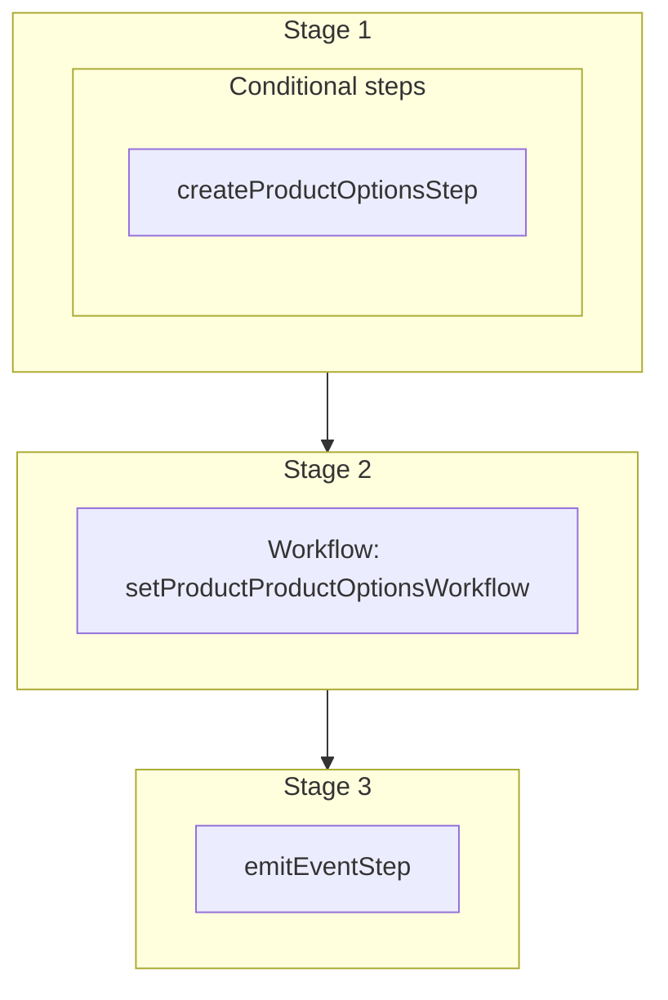

This documentation provides a reference to the `createAndLinkProductOptionsToProductWorkflow`. It belongs to the `@medusajs/medusa/core-flows` package.

This workflow manages one or more product options of a product. It's used by the
[Batch Product Product Options](/api/admin/products/add-options-to-product).
This workflow also creates non-existing product options before adding them to the product.

You can also use this workflow within your customizations or your own custom workflows, allowing you
to wrap custom logic around product-option and product association.

> **Note**
>
> This is available starting from [Medusa v2.16.0](https://github.com/medusajs/medusa/releases/tag/v2.16.0).

[View source code](https://github.com/medusajs/medusa/blob/0ed927bdb7a396a8fd5f6447ed69b7b354b150d3/packages/core/core-flows/src/product/workflows/create-and-link-product-options-to-product.ts#L128)

## Examples

**API Route**

```ts title="src/api/workflow/route.ts"
import type {
  MedusaRequest,
  MedusaResponse,
} from "@medusajs/framework/http"
import { createAndLinkProductOptionsToProductWorkflow } from "@medusajs/medusa/core-flows"

export async function POST(
  req: MedusaRequest,
  res: MedusaResponse
) {
  const { result } = await createAndLinkProductOptionsToProductWorkflow(req
      .scope)
    .run({
      input: {
        product_id: "prod_123"
        add: [
          // Add existing option by ID
          "opt_456",
          // Create new option
          {
            title: "Size",
            values: ["S", "M", "L", "XL"]
          },
          // Add existing option with specific values
          {
            id: "opt_123"
            value_ids: ["optval_1", "optval_2"]
          }
        ],
        remove: ["opt_321"],
        update: [{
          product_option_id: "opt_123",
          add: [
            // add existing value
            "optval_3",
            // add new value
            { value: "optval_4" }
          ],
          remove: ["optval_1"]
        }]
      }
    })

  res.send(result)
}
```

**Subscriber**

```ts title="src/subscribers/order-placed.ts"
import {
  type SubscriberConfig,
  type SubscriberArgs,
} from "@medusajs/framework"
import { createAndLinkProductOptionsToProductWorkflow } from "@medusajs/medusa/core-flows"

export default async function handleOrderPlaced({
  event: { data },
  container,
}: SubscriberArgs < { id: string } > ) {
  const { result } = await createAndLinkProductOptionsToProductWorkflow(
      container)
    .run({
      input: {
        product_id: "prod_123"
        add: [
          // Add existing option by ID
          "opt_456",
          // Create new option
          {
            title: "Size",
            values: ["S", "M", "L", "XL"]
          },
          // Add existing option with specific values
          {
            id: "opt_123"
            value_ids: ["optval_1", "optval_2"]
          }
        ],
        remove: ["opt_321"],
        update: [{
          product_option_id: "opt_123",
          add: [
            // add existing value
            "optval_3",
            // add new value
            { value: "optval_4" }
          ],
          remove: ["optval_1"]
        }]
      }
    })

  console.log(result)
}

export const config: SubscriberConfig = {
  event: "order.placed",
}
```

**Scheduled Job**

```ts title="src/jobs/message-daily.ts"
import { MedusaContainer } from "@medusajs/framework/types"
import { createAndLinkProductOptionsToProductWorkflow } from "@medusajs/medusa/core-flows"

export default async function myCustomJob(
  container: MedusaContainer
) {
  const { result } = await createAndLinkProductOptionsToProductWorkflow(
      container)
    .run({
      input: {
        product_id: "prod_123"
        add: [
          // Add existing option by ID
          "opt_456",
          // Create new option
          {
            title: "Size",
            values: ["S", "M", "L", "XL"]
          },
          // Add existing option with specific values
          {
            id: "opt_123"
            value_ids: ["optval_1", "optval_2"]
          }
        ],
        remove: ["opt_321"],
        update: [{
          product_option_id: "opt_123",
          add: [
            // add existing value
            "optval_3",
            // add new value
            { value: "optval_4" }
          ],
          remove: ["optval_1"]
        }]
      }
    })

  console.log(result)
}

export const config = {
  name: "run-once-a-day",
  schedule: "0 0 * * *",
}
```

**Another Workflow**

```ts title="src/workflows/my-workflow.ts"
import { createWorkflow } from "@medusajs/framework/workflows-sdk"
import { createAndLinkProductOptionsToProductWorkflow } from "@medusajs/medusa/core-flows"

const myWorkflow = createWorkflow(
  "my-workflow",
  () => {
    const result = createAndLinkProductOptionsToProductWorkflow
      .runAsStep({
        input: {
          product_id: "prod_123"
          add: [
            // Add existing option by ID
            "opt_456",
            // Create new option
            {
              title: "Size",
              values: ["S", "M", "L", "XL"]
            },
            // Add existing option with specific values
            {
              id: "opt_123"
              value_ids: ["optval_1", "optval_2"]
            }
          ],
          remove: ["opt_321"],
          update: [{
            product_option_id: "opt_123",
            add: [
              // add existing value
              "optval_3",
              // add new value
              { value: "optval_4" }
            ],
            remove: ["optval_1"]
          }]
        }
      })
  }
)
```

<a id="createandlinkproductoptionstoproductworkflow-steps" />

## Steps



Stages follow the order in the workflow definition. Conditional steps run only when their condition is met. The step descriptions below include the conditions and reference links.

- **when** (when: toCreate.length > 0)
- [createProductOptionsStep](/resources/references/medusa-workflows/steps/createProductOptionsStep): This step creates one or more product options.
  - [setProductProductOptionsWorkflow](/resources/references/medusa-workflows/setProductProductOptionsWorkflow): Manage product options and their values for a product.
    - [emitEventStep](/resources/references/medusa-workflows/steps/emitEventStep): This step emits an event, which you can listen to in a [subscriber](/learn/fundamentals/events-and-subscribers). You can pass data to the subscriber by including it in the `data` property. The event is only emitted after the workflow has finished successfully. So, even if it's executed in the middle of the workflow, it won't actually emit the event until the workflow has completed successfully. If the workflow fails, it won't emit the event at all.

<a id="createandlinkproductoptionstoproductworkflow-input" />

## Input

**createAndLinkProductOptionsToProductWorkflow**

- `LinkProductOptionsToProductWorkflowInput`: [LinkProductOptionsToProductWorkflowInput](/resources/references/core_flows/core_core_flows_src/types/core_flowscore_core_flows_srcLinkProductOptionsToProductWorkflowInput)
  - `product_id`: `string` — The ID of the product to manage its options.
  - `add`: (`string` | `object` | [CreateProductOptionDTO](/resources/references/product/interfaces/productCreateProductOptionDTO))\[] (optional) — The product options to add to the product. You can pass one of the following: 1. The ID of an existing product option as a string. 2. An object with `id` and `value_ids` to add an existing product option with specific values. This is useful when you want to associate only specific option values of an option to the product. 3. An object to create a new product option.
    - `id`: `string` — The ID of the product option to add.
    - `value_ids`: `string`\[] — The IDs of the product option values to associate with the product option.
    - `title`: `string` — The product option's title.
    - `values`: `string`\[] — The product option values.
    - `ranks`: `Record<string, number>` (optional) — The rank for each option value. The key is the option value, and the value is the rank.
    - `is_exclusive`: `boolean` (optional) — Whether the product option is exclusive to a product or shared across products.
    - `metadata`: [MetadataType](/resources/references/product/types/productMetadataType) (optional) — The metadata of the product option.
  - `remove`: `string`\[] (optional) — The product options to remove from the product.
  - `update`: `object`\[] (optional) — The product option values to update for existing product options.
    - `product_option_id`: `string` — The ID of the product option to update values for.
    - `add`: (`string` | `object`)\[] (optional) — The IDs of the product option values to add, or new values to create.
      - `value`: `string` — The value to create on the product option.
    - `remove`: `string`\[] (optional) — The IDs of the product option values to remove.

<a id="createandlinkproductoptionstoproductworkflow-emitted-events" />

## Emitted Events

- `product.updated`: Emitted when products are updated.

  ```ts
  {
    id, // The ID of the product
  }
  ```
