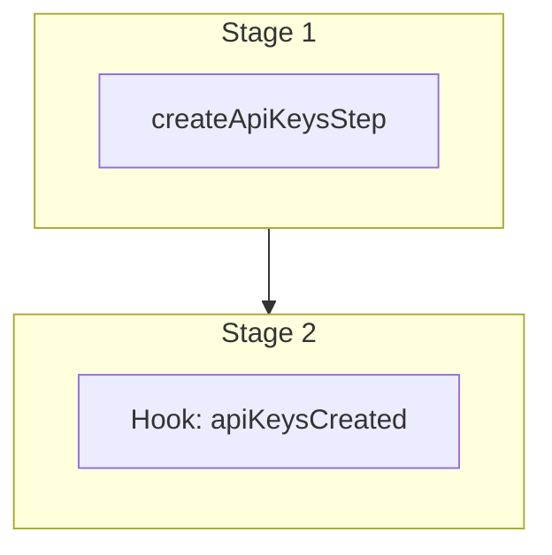

This documentation provides a reference to the `createApiKeysWorkflow`. It belongs to the `@medusajs/medusa/core-flows` package.

This workflow creates one or more API keys, which can be secret or publishable. It's used by the
[Create API Key Admin API Route](/api/admin/api-keys/create-api-key).

You can use this workflow within your customizations or your own custom workflows, allowing you to
create API keys within your custom flows.

[View source code](https://github.com/medusajs/medusa/blob/0ed927bdb7a396a8fd5f6447ed69b7b354b150d3/packages/core/core-flows/src/api-key/workflows/create-api-keys.ts#L51)

## Examples

**API Route**

```ts title="src/api/workflow/route.ts"
import type {
  MedusaRequest,
  MedusaResponse,
} from "@medusajs/framework/http"
import { createApiKeysWorkflow } from "@medusajs/medusa/core-flows"

export async function POST(
  req: MedusaRequest,
  res: MedusaResponse
) {
  const { result } = await createApiKeysWorkflow(req.scope)
    .run({
      input: {
        api_keys: [{
          type: "publishable",
          title: "Storefront",
          created_by: "user_123"
        }]
      }
    })

  res.send(result)
}
```

**Subscriber**

```ts title="src/subscribers/order-placed.ts"
import {
  type SubscriberConfig,
  type SubscriberArgs,
} from "@medusajs/framework"
import { createApiKeysWorkflow } from "@medusajs/medusa/core-flows"

export default async function handleOrderPlaced({
  event: { data },
  container,
}: SubscriberArgs < { id: string } > ) {
  const { result } = await createApiKeysWorkflow(container)
    .run({
      input: {
        api_keys: [{
          type: "publishable",
          title: "Storefront",
          created_by: "user_123"
        }]
      }
    })

  console.log(result)
}

export const config: SubscriberConfig = {
  event: "order.placed",
}
```

**Scheduled Job**

```ts title="src/jobs/message-daily.ts"
import { MedusaContainer } from "@medusajs/framework/types"
import { createApiKeysWorkflow } from "@medusajs/medusa/core-flows"

export default async function myCustomJob(
  container: MedusaContainer
) {
  const { result } = await createApiKeysWorkflow(container)
    .run({
      input: {
        api_keys: [{
          type: "publishable",
          title: "Storefront",
          created_by: "user_123"
        }]
      }
    })

  console.log(result)
}

export const config = {
  name: "run-once-a-day",
  schedule: "0 0 * * *",
}
```

**Another Workflow**

```ts title="src/workflows/my-workflow.ts"
import { createWorkflow } from "@medusajs/framework/workflows-sdk"
import { createApiKeysWorkflow } from "@medusajs/medusa/core-flows"

const myWorkflow = createWorkflow(
  "my-workflow",
  () => {
    const result = createApiKeysWorkflow
      .runAsStep({
        input: {
          api_keys: [{
            type: "publishable",
            title: "Storefront",
            created_by: "user_123"
          }]
        }
      })
  }
)
```

<a id="createapikeysworkflow-steps" />

## Steps



Stages follow the order in the workflow definition. Conditional steps run only when their condition is met. The step descriptions below include the conditions and reference links.

- [createApiKeysStep](/resources/references/medusa-workflows/steps/createApiKeysStep): This step creates one or more API keys.
  - [apiKeysCreated](/resources/references/medusa-workflows/createApiKeysWorkflow#apikeyscreated): This step is a hook that you can inject custom functionality into.

<a id="createapikeysworkflow-input" />

## Input

**createApiKeysWorkflow**

- `CreateApiKeysWorkflowInput`: [CreateApiKeysWorkflowInput](/resources/references/core_flows/core_core_flows_src/types/core_flowscore_core_flows_srcCreateApiKeysWorkflowInput)
  - `api_keys`: [CreateApiKeyDTO](/resources/references/api_key/interfaces/api_keyCreateApiKeyDTO)\[] — The API keys to create.
    - `title`: `string` — The title of the API key.
    - `type`: [ApiKeyType](/resources/references/api_key/types/api_keyApiKeyType) — The type of the API key.
    - `created_by`: `string` — Who created the API key. If the API key type is `secret`, the user can use the created API key's token to authenticate as explained in the [API Reference](/api/admin#2-api-token).

<a id="createapikeysworkflow-output" />

## Output

**createApiKeysWorkflow**

- `ApiKeyDTO[]`: [ApiKeyDTO](/resources/references/api_key/interfaces/api_keyApiKeyDTO)\[]
  - `id`: `string` — The ID of the API key.
  - `token`: `string` — The token of the API key.
  - `redacted`: `string` — The redacted form of the API key's token. This is useful when showing portion of the token. For example `sk_...123`.
  - `title`: `string` — The title of the API key.
  - `type`: [ApiKeyType](/resources/references/api_key/types/api_keyApiKeyType) — The type of the API key.
  - `last_used_at`: `null` | `Date` — The date the API key was last used.
  - `created_by`: `string` — Who created the API key.
  - `created_at`: `Date` — The date the API key was created.
  - `updated_at`: `Date` — The date the API key was updated.
  - `deleted_at`: `null` | `Date` — The date the API key was deleted.
  - `revoked_by`: `null` | `string` — Who revoked the API key. For example, the ID of the user that revoked it.
  - `revoked_at`: `null` | `Date` — The date the API key was revoked.

## Hooks

Hooks allow you to inject custom functionalities into the workflow. You'll receive data from the workflow, as well as additional data sent through an HTTP request.

Learn more about [Hooks](/learn/fundamentals/workflows/workflow-hooks) and [Additional Data](/learn/fundamentals/api-routes/additional-data).

### apiKeysCreated

This step is a hook that you can inject custom functionality into.

#### Example

```ts
import { createApiKeysWorkflow } from "@medusajs/medusa/core-flows"

createApiKeysWorkflow.hooks.apiKeysCreated(
  (async ({ apiKeys }, { container }) => {
    //TODO
  })
)
```

<a id="input" />

#### Input

Handlers consuming this hook accept the following input.

**apiKeysCreated**

- `input`: object — The input data for the hook.
  - `apiKeys`: [WorkflowDataProperties](/resources/references/workflows/types/workflowsWorkflowDataProperties)\<[ApiKeyDTO](/resources/references/api_key/interfaces/api_keyApiKeyDTO)\[]>
    - `__step__`: `string`
