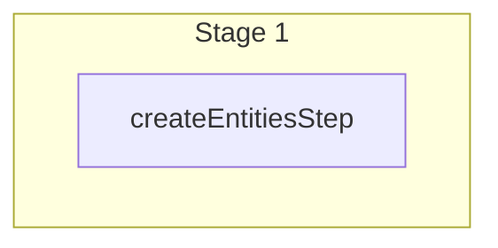

This documentation provides a reference to the `createCartCreditLinesWorkflow`. It belongs to the `@medusajs/medusa/core-flows` package.

This workflow creates one or more credit lines for a cart.

[View source code](https://github.com/medusajs/medusa/blob/0ed927bdb7a396a8fd5f6447ed69b7b354b150d3/packages/core/core-flows/src/cart/workflows/create-cart-credit-lines.ts#L31)

## Examples

**API Route**

```ts title="src/api/workflow/route.ts"
import type {
  MedusaRequest,
  MedusaResponse,
} from "@medusajs/framework/http"
import { createCartCreditLinesWorkflow } from "@medusajs/medusa/core-flows"

export async function POST(
  req: MedusaRequest,
  res: MedusaResponse
) {
  const { result } = await createCartCreditLinesWorkflow(req.scope)
    .run({
      input: {
        cart_id: "cart_123",
        amount: 10,
        reference: "payment",
        reference_id: "payment_123",
        metadata: {
          key: "value",
        },
      }
    })

  res.send(result)
}
```

**Subscriber**

```ts title="src/subscribers/order-placed.ts"
import {
  type SubscriberConfig,
  type SubscriberArgs,
} from "@medusajs/framework"
import { createCartCreditLinesWorkflow } from "@medusajs/medusa/core-flows"

export default async function handleOrderPlaced({
  event: { data },
  container,
}: SubscriberArgs < { id: string } > ) {
  const { result } = await createCartCreditLinesWorkflow(container)
    .run({
      input: {
        cart_id: "cart_123",
        amount: 10,
        reference: "payment",
        reference_id: "payment_123",
        metadata: {
          key: "value",
        },
      }
    })

  console.log(result)
}

export const config: SubscriberConfig = {
  event: "order.placed",
}
```

**Scheduled Job**

```ts title="src/jobs/message-daily.ts"
import { MedusaContainer } from "@medusajs/framework/types"
import { createCartCreditLinesWorkflow } from "@medusajs/medusa/core-flows"

export default async function myCustomJob(
  container: MedusaContainer
) {
  const { result } = await createCartCreditLinesWorkflow(container)
    .run({
      input: {
        cart_id: "cart_123",
        amount: 10,
        reference: "payment",
        reference_id: "payment_123",
        metadata: {
          key: "value",
        },
      }
    })

  console.log(result)
}

export const config = {
  name: "run-once-a-day",
  schedule: "0 0 * * *",
}
```

**Another Workflow**

```ts title="src/workflows/my-workflow.ts"
import { createWorkflow } from "@medusajs/framework/workflows-sdk"
import { createCartCreditLinesWorkflow } from "@medusajs/medusa/core-flows"

const myWorkflow = createWorkflow(
  "my-workflow",
  () => {
    const result = createCartCreditLinesWorkflow
      .runAsStep({
        input: {
          cart_id: "cart_123",
          amount: 10,
          reference: "payment",
          reference_id: "payment_123",
          metadata: {
            key: "value",
          },
        }
      })
  }
)
```

<a id="createcartcreditlinesworkflow-steps" />

## Steps



Stages follow the order in the workflow definition. Conditional steps run only when their condition is met. The step descriptions below include the conditions and reference links.

- [createEntitiesStep](/resources/references/medusa-workflows/steps/createEntitiesStep): This step creates one or more entities using methods in a module's service.

<a id="createcartcreditlinesworkflow-input" />

## Input

**createCartCreditLinesWorkflow**

- `CreateCartCreditLinesWorkflowInput`: [CreateCartCreditLinesWorkflowInput](/resources/references/types/types/typesCreateCartCreditLinesWorkflowInput)
  - `cart_id`: `string` — The ID of the cart that the credit line belongs to.
  - `amount`: `number` — The amount of the credit line.
  - `reference`: `string` | `null` — The reference model name that the credit line is generated from
  - `reference_id`: `string` | `null` — The reference model id that the credit line is generated from
  - `metadata`: `Record<string, unknown>` | `null` — The metadata of the cart detail

<a id="createcartcreditlinesworkflow-output" />

## Output

**createCartCreditLinesWorkflow**

- `CartCreditLineDTO[]`: [CartCreditLineDTO](/resources/references/cart/interfaces/cartCartCreditLineDTO)\[]
  - `id`: `string` — The ID of the cart credit line.
  - `cart_id`: `string` — The ID of the cart that the credit line belongs to.
  - `amount`: [BigNumberValue](/resources/references/cart/types/cartBigNumberValue) — The amount of the credit line.
    - `numeric`: `number`
    - `raw`: [BigNumberRawValue](/resources/references/cart/types/cartBigNumberRawValue) (optional)
      - `value`: `string` | `number`
    - `bigNumber`: `BigNumber` (optional)
  - `raw_amount`: [BigNumberRawValue](/resources/references/cart/types/cartBigNumberRawValue) — The raw amount of the credit line.
    - `value`: `string` | `number`
  - `reference`: `null` | `string` — The reference model name that the credit line is generated from
  - `reference_id`: `null` | `string` — The reference model id that the credit line is generated from
  - `metadata`: `null` | `Record<string, unknown>` — The metadata of the cart detail
  - `created_at`: `Date` — The date when the cart credit line was created.
  - `updated_at`: `Date` — The date when the cart credit line was last updated.
