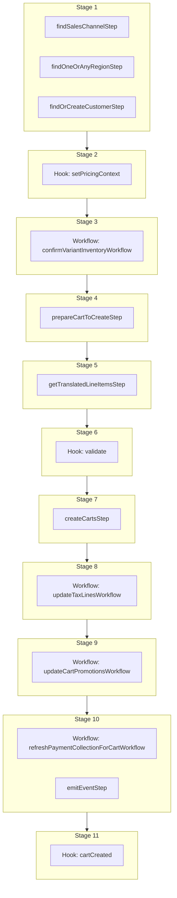

This documentation provides a reference to the `createCartWorkflow`. It belongs to the `@medusajs/medusa/core-flows` package.

This workflow creates and returns a cart. You can set the cart's items, region, customer, and other details. This workflow is executed by the
[Create Cart Store API Route](/api/store/carts/create-cart).

This workflow has a hook that allows you to perform custom actions on the created cart. You can see an example in [this guide](/resources/commerce-modules/cart/extend#step-4-consume-cartcreated-workflow-hook).

You can also use this workflow within your customizations or your own custom workflows, allowing you to wrap custom logic around cart creation.

[View source code](https://github.com/medusajs/medusa/blob/0ed927bdb7a396a8fd5f6447ed69b7b354b150d3/packages/core/core-flows/src/cart/workflows/create-carts.ts#L180)

## Examples

**API Route**

```ts title="src/api/workflow/route.ts"
import type {
  MedusaRequest,
  MedusaResponse,
} from "@medusajs/framework/http"
import { createCartWorkflow } from "@medusajs/medusa/core-flows"

export async function POST(
  req: MedusaRequest,
  res: MedusaResponse
) {
  const { result } = await createCartWorkflow(req.scope)
    .run({
      input: {
        region_id: "reg_123",
        items: [{
          variant_id: "var_123",
          quantity: 1,
        }],
        customer_id: "cus_123",
        additional_data: {
          external_id: "123"
        }
      }
    })

  res.send(result)
}
```

**Subscriber**

```ts title="src/subscribers/order-placed.ts"
import {
  type SubscriberConfig,
  type SubscriberArgs,
} from "@medusajs/framework"
import { createCartWorkflow } from "@medusajs/medusa/core-flows"

export default async function handleOrderPlaced({
  event: { data },
  container,
}: SubscriberArgs < { id: string } > ) {
  const { result } = await createCartWorkflow(container)
    .run({
      input: {
        region_id: "reg_123",
        items: [{
          variant_id: "var_123",
          quantity: 1,
        }],
        customer_id: "cus_123",
        additional_data: {
          external_id: "123"
        }
      }
    })

  console.log(result)
}

export const config: SubscriberConfig = {
  event: "order.placed",
}
```

**Scheduled Job**

```ts title="src/jobs/message-daily.ts"
import { MedusaContainer } from "@medusajs/framework/types"
import { createCartWorkflow } from "@medusajs/medusa/core-flows"

export default async function myCustomJob(
  container: MedusaContainer
) {
  const { result } = await createCartWorkflow(container)
    .run({
      input: {
        region_id: "reg_123",
        items: [{
          variant_id: "var_123",
          quantity: 1,
        }],
        customer_id: "cus_123",
        additional_data: {
          external_id: "123"
        }
      }
    })

  console.log(result)
}

export const config = {
  name: "run-once-a-day",
  schedule: "0 0 * * *",
}
```

**Another Workflow**

```ts title="src/workflows/my-workflow.ts"
import { createWorkflow } from "@medusajs/framework/workflows-sdk"
import { createCartWorkflow } from "@medusajs/medusa/core-flows"

const myWorkflow = createWorkflow(
  "my-workflow",
  () => {
    const result = createCartWorkflow
      .runAsStep({
        input: {
          region_id: "reg_123",
          items: [{
            variant_id: "var_123",
            quantity: 1,
          }],
          customer_id: "cus_123",
          additional_data: {
            external_id: "123"
          }
        }
      })
  }
)
```

<a id="createcartworkflow-steps" />

## Steps



Stages follow the order in the workflow definition. Conditional steps run only when their condition is met. The step descriptions below include the conditions and reference links.

- [findSalesChannelStep](/resources/references/medusa-workflows/steps/findSalesChannelStep): This step either retrieves a sales channel either using the ID provided as an input, or, if no ID is provided, the default sales channel of the first store.
- [findOneOrAnyRegionStep](/resources/references/medusa-workflows/steps/findOneOrAnyRegionStep): This step retrieves a region either by the provided ID or the first region in the first store.
- [findOrCreateCustomerStep](/resources/references/medusa-workflows/steps/findOrCreateCustomerStep): This step finds or creates a customer based on the provided ID or email. It prioritizes finding the customer by ID, then by email. The step creates a new customer either if: - No customer is found with the provided ID and email; - Or if it found the customer by ID but their email does not match the email in the input. The step returns the details of the customer found or created, along with their email.
  - [setPricingContext](/resources/references/medusa-workflows/createCartWorkflow#setpricingcontext): This hook is executed after the order is retrieved and before the line items are created. You can consume this hook to return any custom context useful for the prices retrieval of the variants to be added to the order. For example, assuming you have the following custom pricing rule: `json { "attribute": "location_id", "operator": "eq", "value": "sloc_123", } ` You can consume the `setPricingContext` hook to add the `location_id` context to the prices calculation: `ts import { addOrderLineItemsWorkflow } from "@medusajs/medusa/core-flows"; import { StepResponse } from "@medusajs/workflows-sdk"; addOrderLineItemsWorkflow.hooks.setPricingContext(( { order, variantIds, region, customerData, additional_data }, { container } ) => { return new StepResponse({ location_id: "sloc_123", // Special price for in-store purchases }); }); ` The variants' prices will now be retrieved using the context you return. :::note Learn more about prices calculation context in the [Prices Calculation](/resources/commerce-modules/pricing/price-calculation) documentation. :::
    - [confirmVariantInventoryWorkflow](/resources/references/medusa-workflows/confirmVariantInventoryWorkflow): Validate that a variant is in-stock before adding to the cart.
      - [prepareCartToCreateStep](/resources/references/medusa-workflows/prepareCartToCreateStep): This step prepares the data used to create a cart, resolving the cart's currency, region, customer, sales channel, and a default shipping address when the region has a single country. It throws an error if no region is provided.
        - [getTranslatedLineItemsStep](/resources/references/medusa-workflows/steps/getTranslatedLineItemsStep): This step translates cart line items based on their associated variant and product IDs. It fetches translations for the product (title, description, subtitle) and variant (title), then applies them to the corresponding line item fields.
          - [validate](/resources/references/medusa-workflows/createCartWorkflow#validate): This hook is executed before all operations. You can consume this hook to perform any custom validation. If validation fails, you can throw an error to stop the workflow execution.
            - [createCartsStep](/resources/references/medusa-workflows/steps/createCartsStep): This step creates a cart.
              - [updateTaxLinesWorkflow](/resources/references/medusa-workflows/updateTaxLinesWorkflow): Update a cart's tax lines.
                - [updateCartPromotionsWorkflow](/resources/references/medusa-workflows/updateCartPromotionsWorkflow): Update a cart's applied promotions to add, replace, or remove them.
                  - [refreshPaymentCollectionForCartWorkflow](/resources/references/medusa-workflows/refreshPaymentCollectionForCartWorkflow): Refresh a cart's payment collection details.
                  - [emitEventStep](/resources/references/medusa-workflows/steps/emitEventStep): This step emits an event, which you can listen to in a [subscriber](/learn/fundamentals/events-and-subscribers). You can pass data to the subscriber by including it in the `data` property. The event is only emitted after the workflow has finished successfully. So, even if it's executed in the middle of the workflow, it won't actually emit the event until the workflow has completed successfully. If the workflow fails, it won't emit the event at all.
                    - [cartCreated](/resources/references/medusa-workflows/createCartWorkflow#cartcreated)

<a id="createcartworkflow-input" />

## Input

**createCartWorkflow**

- `CreateCartWorkflowInput`: [CreateCartWorkflowInput](/resources/references/core_flows/core_core_flows_src/types/core_flowscore_core_flows_srcCreateCartWorkflowInput)
  - `region_id`: `string` (optional) — The ID of the region that the cart belongs to. If not provided, the default region of the store is used. If the store doesn't have a default region, an error is thrown.
  - `customer_id`: `string` (optional) — The ID of the customer associated with the cart.
  - `sales_channel_id`: `string` (optional) — The ID of the sales channel through which the cart is created.
  - `email`: `string` (optional) — The email address of the cart's customer.
  - `currency_code`: `string` (optional) — The currency code of the cart. This defaults to the region's currency code.

    Example:

    ```
    usd
    ```
  - `shipping_address_id`: `string` (optional) — The ID of the associated shipping address.
  - `billing_address_id`: `string` (optional) — The ID of the associated billing address.
  - `shipping_address`: `string` | [CreateCartAddressDTO](/resources/references/types/interfaces/typesCreateCartAddressDTO) (optional) — The ID of an existing shipping address, or the details of a shipping address to create.
    - `first_name`: `string` (optional) — The first name of the customer associated with the address.
    - `last_name`: `string` (optional) — The last name of the customer associated with the address.
    - `phone`: `string` (optional) — The address's phone number
    - `company`: `string` (optional) — The address's company name.
    - `address_1`: `string` (optional) — The primary address line.
    - `address_2`: `string` (optional) — The secondary address line.
    - `city`: `string` (optional) — The city of the address.
    - `country_code`: `string` (optional) — The country code of the address.

      Example:

      ```
      us
      ```
    - `province`: `string` (optional) — The lower-case [ISO 3166-2](https://en.wikipedia.org/wiki/ISO_3166-2) province or state of the address.
    - `postal_code`: `string` (optional) — The postal code of the address.
    - `metadata`: `Record<string, unknown>` (optional) — Custom key-value pairs related to the address.
  - `billing_address`: `string` | [CreateCartAddressDTO](/resources/references/types/interfaces/typesCreateCartAddressDTO) (optional) — The ID of an existing billing address, or the details of a billing address to create.
    - `first_name`: `string` (optional) — The first name of the customer associated with the address.
    - `last_name`: `string` (optional) — The last name of the customer associated with the address.
    - `phone`: `string` (optional) — The address's phone number
    - `company`: `string` (optional) — The address's company name.
    - `address_1`: `string` (optional) — The primary address line.
    - `address_2`: `string` (optional) — The secondary address line.
    - `city`: `string` (optional) — The city of the address.
    - `country_code`: `string` (optional) — The country code of the address.

      Example:

      ```
      us
      ```
    - `province`: `string` (optional) — The lower-case [ISO 3166-2](https://en.wikipedia.org/wiki/ISO_3166-2) province or state of the address.
    - `postal_code`: `string` (optional) — The postal code of the address.
    - `metadata`: `Record<string, unknown>` (optional) — Custom key-value pairs related to the address.
  - `metadata`: `Record<string, unknown>` (optional) — Custom key-value pairs related to the cart.
  - `items`: [CreateCartCreateLineItemDTO](/resources/references/types/interfaces/typesCreateCartCreateLineItemDTO)\[] (optional) — The items to be added to the cart.
    - `quantity`: [BigNumberInput](/resources/references/types/types/typesBigNumberInput) — The quantity of the line item.
      - `value`: `string` | `number`
      - `numeric`: `number`
      - `raw`: [BigNumberRawValue](/resources/references/types/types/typesBigNumberRawValue) (optional)
      - `bigNumber`: `BigNumber` (optional)
    - `variant_id`: `string` (optional) — The ID of the variant to be added to the cart.
    - `title`: `string` (optional) — The title of the line item.
    - `subtitle`: `string` (optional) — The subtitle of the line item.
    - `thumbnail`: `string` (optional) — The thumbnail URL of the line item.
    - `product_id`: `string` (optional) — The ID of the product whose variant is being added to the cart.
    - `product_title`: `string` (optional) — The title of the associated product.
    - `product_description`: `string` (optional) — The description of the associated product.
    - `product_subtitle`: `string` (optional) — The subtitle of the associated product.
    - `product_type`: `string` (optional) — The ID of the associated product's type.
    - `product_collection`: `string` (optional) — The ID of the associated product's collection.
    - `product_handle`: `string` (optional) — The handle of the associated product.
    - `variant_sku`: `string` (optional) — The SKU of the associated variant.
    - `variant_barcode`: `string` (optional) — The barcode of the associated variant.
    - `variant_title`: `string` (optional) — The title of the associated variant.
    - `variant_option_values`: `Record<string, unknown>` (optional) — The associated variant's values for the product's options.
    - `requires_shipping`: `boolean` (optional) — Whether the line item requires shipping.
    - `is_discountable`: `boolean` (optional) — Whether the line item is discountable.
    - `is_tax_inclusive`: `boolean` (optional) — Whether the line item's price is tax inclusive. Learn more in [this documentation](/resources/commerce-modules/pricing/tax-inclusive-pricing)
    - `is_giftcard`: `boolean` (optional) — Whether the line item is a gift card.
    - `compare_at_unit_price`: [BigNumberInput](/resources/references/types/types/typesBigNumberInput) (optional) — The original price of the item before a promotion or sale.
      - `value`: `string` | `number`
      - `numeric`: `number`
      - `raw`: [BigNumberRawValue](/resources/references/types/types/typesBigNumberRawValue) (optional)
      - `bigNumber`: `BigNumber` (optional)
    - `unit_price`: [BigNumberInput](/resources/references/types/types/typesBigNumberInput) (optional) — The price of a single quantity of the item.
      - `value`: `string` | `number`
      - `numeric`: `number`
      - `raw`: [BigNumberRawValue](/resources/references/types/types/typesBigNumberRawValue) (optional)
      - `bigNumber`: `BigNumber` (optional)
    - `metadata`: `null` | `Record<string, unknown>` (optional) — Custom key-value pairs related to the item.
  - `promo_codes`: `string`\[] (optional) — The promotional codes applied on the cart.
  - `locale`: `string` (optional) — The locale code of the cart in BCP 47 format.

    Example:

    ```
    "en-US"
    ```
  - `additional_data`: `Record<string, unknown>` (optional) — Additional data that can be passed through the `additional_data` property in HTTP requests. Learn more in [this documentation](/learn/fundamentals/api-routes/additional-data).

<a id="createcartworkflow-output" />

## Output

**createCartWorkflow**

- `CartDTO`: [CartDTO](/resources/references/cart/interfaces/cartCartDTO) — The cart details.
  - `id`: `string` — The ID of the cart.
  - `region_id`: `string` (optional) — The ID of the region the cart belongs to.
  - `customer_id`: `string` (optional) — The ID of the associated customer
  - `sales_channel_id`: `string` (optional) — The ID of the sales channel the cart belongs to.
  - `email`: `string` (optional) — The email of the customer that owns the cart.
  - `currency_code`: `string` — The currency of the cart
  - `locale`: `string` (optional) — The locale code of the cart.
  - `shipping_address`: [CartAddressDTO](/resources/references/cart/interfaces/cartCartAddressDTO) (optional) — The associated shipping address.
    - `id`: `string` — The ID of the address.
    - `customer_id`: `string` (optional) — The customer ID of the address.
    - `first_name`: `string` (optional) — The first name of the address.
    - `last_name`: `string` (optional) — The last name of the address.
    - `phone`: `string` (optional) — The phone number of the address.
    - `company`: `string` (optional) — The company of the address.
    - `address_1`: `string` (optional) — The first address line of the address.
    - `address_2`: `string` (optional) — The second address line of the address.
    - `city`: `string` (optional) — The city of the address.
    - `country_code`: `string` (optional) — The country code of the address.
    - `province`: `string` (optional) — The lower-case [ISO 3166-2](https://en.wikipedia.org/wiki/ISO_3166-2) province/state of the address.
    - `postal_code`: `string` (optional) — The postal code of the address.
    - `metadata`: `null` | `Record<string, unknown>` (optional) — Holds custom data in key-value pairs.
    - `created_at`: `string` | `Date` — When the address was created.
    - `updated_at`: `string` | `Date` — When the address was updated.
  - `billing_address`: [CartAddressDTO](/resources/references/cart/interfaces/cartCartAddressDTO) (optional) — The associated billing address.
    - `id`: `string` — The ID of the address.
    - `customer_id`: `string` (optional) — The customer ID of the address.
    - `first_name`: `string` (optional) — The first name of the address.
    - `last_name`: `string` (optional) — The last name of the address.
    - `phone`: `string` (optional) — The phone number of the address.
    - `company`: `string` (optional) — The company of the address.
    - `address_1`: `string` (optional) — The first address line of the address.
    - `address_2`: `string` (optional) — The second address line of the address.
    - `city`: `string` (optional) — The city of the address.
    - `country_code`: `string` (optional) — The country code of the address.
    - `province`: `string` (optional) — The lower-case [ISO 3166-2](https://en.wikipedia.org/wiki/ISO_3166-2) province/state of the address.
    - `postal_code`: `string` (optional) — The postal code of the address.
    - `metadata`: `null` | `Record<string, unknown>` (optional) — Holds custom data in key-value pairs.
    - `created_at`: `string` | `Date` — When the address was created.
    - `updated_at`: `string` | `Date` — When the address was updated.
  - `items`: [CartLineItemDTO](/resources/references/cart/interfaces/cartCartLineItemDTO)\[] (optional) — The associated line items.
    - `original_total`: [BigNumberValue](/resources/references/cart/types/cartBigNumberValue) — The original total of the cart line item.
      - `numeric`: `number`
      - `raw`: [BigNumberRawValue](/resources/references/cart/types/cartBigNumberRawValue) (optional)
      - `bigNumber`: `BigNumber` (optional)
    - `original_subtotal`: [BigNumberValue](/resources/references/cart/types/cartBigNumberValue) — The original subtotal of the cart line item.
      - `numeric`: `number`
      - `raw`: [BigNumberRawValue](/resources/references/cart/types/cartBigNumberRawValue) (optional)
      - `bigNumber`: `BigNumber` (optional)
    - `original_tax_total`: [BigNumberValue](/resources/references/cart/types/cartBigNumberValue) — The original tax total of the cart line item.
      - `numeric`: `number`
      - `raw`: [BigNumberRawValue](/resources/references/cart/types/cartBigNumberRawValue) (optional)
      - `bigNumber`: `BigNumber` (optional)
    - `item_total`: [BigNumberValue](/resources/references/cart/types/cartBigNumberValue) — The item total of the cart line item.
      - `numeric`: `number`
      - `raw`: [BigNumberRawValue](/resources/references/cart/types/cartBigNumberRawValue) (optional)
      - `bigNumber`: `BigNumber` (optional)
    - `item_subtotal`: [BigNumberValue](/resources/references/cart/types/cartBigNumberValue) — The item subtotal of the cart line item.
      - `numeric`: `number`
      - `raw`: [BigNumberRawValue](/resources/references/cart/types/cartBigNumberRawValue) (optional)
      - `bigNumber`: `BigNumber` (optional)
    - `item_tax_total`: [BigNumberValue](/resources/references/cart/types/cartBigNumberValue) — The item tax total of the cart line item.
      - `numeric`: `number`
      - `raw`: [BigNumberRawValue](/resources/references/cart/types/cartBigNumberRawValue) (optional)
      - `bigNumber`: `BigNumber` (optional)
    - `total`: [BigNumberValue](/resources/references/cart/types/cartBigNumberValue) — The total of the cart line item.
      - `numeric`: `number`
      - `raw`: [BigNumberRawValue](/resources/references/cart/types/cartBigNumberRawValue) (optional)
      - `bigNumber`: `BigNumber` (optional)
    - `subtotal`: [BigNumberValue](/resources/references/cart/types/cartBigNumberValue) — The subtotal of the cart line item.
      - `numeric`: `number`
      - `raw`: [BigNumberRawValue](/resources/references/cart/types/cartBigNumberRawValue) (optional)
      - `bigNumber`: `BigNumber` (optional)
    - `tax_total`: [BigNumberValue](/resources/references/cart/types/cartBigNumberValue) — The tax total of the cart line item.
      - `numeric`: `number`
      - `raw`: [BigNumberRawValue](/resources/references/cart/types/cartBigNumberRawValue) (optional)
      - `bigNumber`: `BigNumber` (optional)
    - `discount_total`: [BigNumberValue](/resources/references/cart/types/cartBigNumberValue) — The discount total of the cart line item.
      - `numeric`: `number`
      - `raw`: [BigNumberRawValue](/resources/references/cart/types/cartBigNumberRawValue) (optional)
      - `bigNumber`: `BigNumber` (optional)
    - `discount_tax_total`: [BigNumberValue](/resources/references/cart/types/cartBigNumberValue) — The discount tax total of the cart line item.
      - `numeric`: `number`
      - `raw`: [BigNumberRawValue](/resources/references/cart/types/cartBigNumberRawValue) (optional)
      - `bigNumber`: `BigNumber` (optional)
    - `raw_original_total`: [BigNumberRawValue](/resources/references/cart/types/cartBigNumberRawValue) — The raw original total of the cart line item.
      - `value`: `string` | `number`
    - `raw_original_subtotal`: [BigNumberRawValue](/resources/references/cart/types/cartBigNumberRawValue) — The raw original subtotal of the cart line item.
      - `value`: `string` | `number`
    - `raw_original_tax_total`: [BigNumberRawValue](/resources/references/cart/types/cartBigNumberRawValue) — The raw original tax total of the cart line item.
      - `value`: `string` | `number`
    - `raw_item_total`: [BigNumberRawValue](/resources/references/cart/types/cartBigNumberRawValue) — The raw item total of the cart line item.
      - `value`: `string` | `number`
    - `raw_item_subtotal`: [BigNumberRawValue](/resources/references/cart/types/cartBigNumberRawValue) — The raw item subtotal of the cart line item.
      - `value`: `string` | `number`
    - `raw_item_tax_total`: [BigNumberRawValue](/resources/references/cart/types/cartBigNumberRawValue) — The raw item tax total of the cart line item.
      - `value`: `string` | `number`
    - `raw_total`: [BigNumberRawValue](/resources/references/cart/types/cartBigNumberRawValue) — The raw total of the cart line item.
      - `value`: `string` | `number`
    - `raw_subtotal`: [BigNumberRawValue](/resources/references/cart/types/cartBigNumberRawValue) — The raw subtotal of the cart line item.
      - `value`: `string` | `number`
    - `raw_tax_total`: [BigNumberRawValue](/resources/references/cart/types/cartBigNumberRawValue) — The raw tax total of the cart line item.
      - `value`: `string` | `number`
    - `raw_discount_total`: [BigNumberRawValue](/resources/references/cart/types/cartBigNumberRawValue) — The raw discount total of the cart line item.
      - `value`: `string` | `number`
    - `raw_discount_tax_total`: [BigNumberRawValue](/resources/references/cart/types/cartBigNumberRawValue) — The raw discount tax total of the cart line item.
      - `value`: `string` | `number`
    - `id`: `string` — The ID of the line item.
    - `title`: `string` — The title of the line item.
    - `subtitle`: `string` (optional) — The subtitle of the line item.
    - `thumbnail`: `string` (optional) — The line item's thumbnail.
    - `quantity`: [BigNumberValue](/resources/references/cart/types/cartBigNumberValue) — The line item's quantity in the cart.
      - `numeric`: `number`
      - `raw`: [BigNumberRawValue](/resources/references/cart/types/cartBigNumberRawValue) (optional)
      - `bigNumber`: `BigNumber` (optional)
    - `product_id`: `string` (optional) — The ID of the associated product.
    - `product_title`: `string` (optional) — The title of the associated product.
    - `product_description`: `string` (optional) — The description of the associated product.
    - `product_subtitle`: `string` (optional) — The subtitle of the associated product.
    - `product_type`: `string` (optional) — The type of the associated product.
    - `product_type_id`: `string` (optional) — The type of the associated product.
    - `product_collection`: `string` (optional) — The collection of the associated product.
    - `product_handle`: `string` (optional) — The handle of the associated product.
    - `variant_id`: `string` (optional) — The associated variant's ID of the line item.
    - `variant_sku`: `string` (optional) — The sku of the associated variant.
    - `variant_barcode`: `string` (optional) — The barcode of the associated variant.
    - `variant_title`: `string` (optional) — The title of the associated variant.
    - `variant_option_values`: `Record<string, unknown>` (optional) — The option values of the associated variant.
    - `requires_shipping`: `boolean` — Whether the line item requires shipping.
    - `is_discountable`: `boolean` — Whether the line item is discountable.
    - `is_giftcard`: `boolean` — Whether the line item is a gift card.
    - `is_tax_inclusive`: `boolean` — Whether the line item price is tax inclusive.
    - `is_custom_price`: `boolean` — Whether the line item price is a custom price.
    - `compare_at_unit_price`: [BigNumberValue](/resources/references/cart/types/cartBigNumberValue) (optional) — The calculated price of the line item.
      - `numeric`: `number`
      - `raw`: [BigNumberRawValue](/resources/references/cart/types/cartBigNumberRawValue) (optional)
      - `bigNumber`: `BigNumber` (optional)
    - `unit_price`: [BigNumberValue](/resources/references/cart/types/cartBigNumberValue) — The unit price of the item.
      - `numeric`: `number`
      - `raw`: [BigNumberRawValue](/resources/references/cart/types/cartBigNumberRawValue) (optional)
      - `bigNumber`: `BigNumber` (optional)
    - `tax_lines`: [LineItemTaxLineDTO](/resources/references/cart/interfaces/cartLineItemTaxLineDTO)\[] (optional) — The associated tax lines.
      - `id`: `string` — The ID of the tax line
      - `description`: `string` (optional) — The description of the tax line
      - `tax_rate_id`: `string` (optional) — The ID of the associated tax rate.
      - `code`: `string` — The code of the tax line.
      - `rate`: `number` — The rate of the tax line.
      - `provider_id`: `string` (optional) — The ID of the associated provider.
      - `data`: `null` | `Record<string, unknown>` (optional) — Holds data returned by the tax provider in key-value pairs.
      - `metadata`: `null` | `Record<string, unknown>` (optional) — Holds custom data in key-value pairs.
      - `created_at`: `string` | `Date` — When the tax line was created.
      - `updated_at`: `string` | `Date` — When the tax line was updated.
      - `item`: [CartLineItemDTO](/resources/references/cart/interfaces/cartCartLineItemDTO) — The associated line item.
      - `item_id`: `string` — The ID of the associated line item.
      - `total`: [BigNumberValue](/resources/references/cart/types/cartBigNumberValue) — The total tax relative to the item.
      - `subtotal`: [BigNumberValue](/resources/references/cart/types/cartBigNumberValue) — The subtotal tax relative to the item.
      - `raw_total`: [BigNumberRawValue](/resources/references/cart/types/cartBigNumberRawValue) — The raw total tax relative to the item.
      - `raw_subtotal`: [BigNumberRawValue](/resources/references/cart/types/cartBigNumberRawValue) — The raw subtotal tax relative to the item.
    - `adjustments`: [LineItemAdjustmentDTO](/resources/references/cart/interfaces/cartLineItemAdjustmentDTO)\[] (optional) — The associated adjustments.
      - `id`: `string` — The ID of the adjustment line
      - `code`: `string` (optional) — The code of the promotion that lead to this adjustment.
      - `amount`: [BigNumberValue](/resources/references/cart/types/cartBigNumberValue) — The amount to adjust the original amount with.
      - `is_tax_inclusive`: `boolean` (optional) — Whether the adjustment is tax inclusive.
      - `raw_amount`: [BigNumberRawValue](/resources/references/cart/types/cartBigNumberRawValue) — The raw amount to adjust the original amount with.
      - `cart_id`: `string` — The ID of the associated cart.
      - `description`: `string` (optional) — The description of the adjustment line.
      - `promotion_id`: `string` (optional) — The ID of the associated promotion.
      - `provider_id`: `string` (optional) — The ID of the associated provider.
      - `created_at`: `string` | `Date` — When the adjustment line was created.
      - `updated_at`: `string` | `Date` — When the adjustment line was updated.
      - `item`: [CartLineItemDTO](/resources/references/cart/interfaces/cartCartLineItemDTO) — The associated line item.
      - `item_id`: `string` — The ID of the associated line item.
    - `cart`: [CartDTO](/resources/references/cart/interfaces/cartCartDTO) — The associated cart.
      - `id`: `string` — The ID of the cart.
      - `region_id`: `string` (optional) — The ID of the region the cart belongs to.
      - `customer_id`: `string` (optional) — The ID of the associated customer
      - `sales_channel_id`: `string` (optional) — The ID of the sales channel the cart belongs to.
      - `email`: `string` (optional) — The email of the customer that owns the cart.
      - `currency_code`: `string` — The currency of the cart
      - `locale`: `string` (optional) — The locale code of the cart.
      - `shipping_address`: [CartAddressDTO](/resources/references/cart/interfaces/cartCartAddressDTO) (optional) — The associated shipping address.
      - `billing_address`: [CartAddressDTO](/resources/references/cart/interfaces/cartCartAddressDTO) (optional) — The associated billing address.
      - `items`: [CartLineItemDTO](/resources/references/cart/interfaces/cartCartLineItemDTO)\[] (optional) — The associated line items.
      - `credit_lines`: [CartCreditLineDTO](/resources/references/cart/interfaces/cartCartCreditLineDTO)\[] (optional) — The credit lines for a cart
      - `shipping_methods`: [CartShippingMethodDTO](/resources/references/cart/interfaces/cartCartShippingMethodDTO)\[] (optional) — The associated shipping methods
      - `metadata`: `null` | `Record<string, unknown>` (optional) — Holds custom data in key-value pairs.
      - `completed_at`: `string` | `Date` (optional) — When the cart was completed.
      - `created_at`: `string` | `Date` (optional) — When the cart was created.
      - `updated_at`: `string` | `Date` (optional) — When the cart was updated.
      - `original_item_total`: [BigNumberValue](/resources/references/cart/types/cartBigNumberValue) — The original item total of the cart.
      - `original_item_subtotal`: [BigNumberValue](/resources/references/cart/types/cartBigNumberValue) — The original item subtotal of the cart.
      - `original_item_tax_total`: [BigNumberValue](/resources/references/cart/types/cartBigNumberValue) — The original item tax total of the cart.
      - `item_total`: [BigNumberValue](/resources/references/cart/types/cartBigNumberValue) — The item total of the cart.
      - `item_subtotal`: [BigNumberValue](/resources/references/cart/types/cartBigNumberValue) — The item subtotal of the cart.
      - `item_tax_total`: [BigNumberValue](/resources/references/cart/types/cartBigNumberValue) — The item tax total of the cart.
      - `original_total`: [BigNumberValue](/resources/references/cart/types/cartBigNumberValue) — The original total of the cart.
      - `original_subtotal`: [BigNumberValue](/resources/references/cart/types/cartBigNumberValue) — The original subtotal of the cart.
      - `original_tax_total`: [BigNumberValue](/resources/references/cart/types/cartBigNumberValue) — The original tax total of the cart.
      - `total`: [BigNumberValue](/resources/references/cart/types/cartBigNumberValue) — The total of the cart.
      - `subtotal`: [BigNumberValue](/resources/references/cart/types/cartBigNumberValue) — The subtotal of the cart. (Excluding taxes)
      - `tax_total`: [BigNumberValue](/resources/references/cart/types/cartBigNumberValue) — The tax total of the cart.
      - `discount_total`: [BigNumberValue](/resources/references/cart/types/cartBigNumberValue) — The discount total of the cart.
      - `discount_tax_total`: [BigNumberValue](/resources/references/cart/types/cartBigNumberValue) — The discount tax total of the cart.
      - `gift_card_total`: [BigNumberValue](/resources/references/cart/types/cartBigNumberValue) — The gift card total of the cart.
      - `gift_card_tax_total`: [BigNumberValue](/resources/references/cart/types/cartBigNumberValue) — The gift card tax total of the cart.
      - `shipping_total`: [BigNumberValue](/resources/references/cart/types/cartBigNumberValue) — The shipping total of the cart.
      - `shipping_subtotal`: [BigNumberValue](/resources/references/cart/types/cartBigNumberValue) — The shipping subtotal of the cart.
      - `shipping_tax_total`: [BigNumberValue](/resources/references/cart/types/cartBigNumberValue) — The shipping tax total of the cart.
      - `original_shipping_total`: [BigNumberValue](/resources/references/cart/types/cartBigNumberValue) — The original shipping total of the cart.
      - `original_shipping_subtotal`: [BigNumberValue](/resources/references/cart/types/cartBigNumberValue) — The original shipping subtotal of the cart.
      - `original_shipping_tax_total`: [BigNumberValue](/resources/references/cart/types/cartBigNumberValue) — The original shipping tax total of the cart.
      - `raw_original_item_total`: [BigNumberRawValue](/resources/references/cart/types/cartBigNumberRawValue) — The raw original item total of the cart.
      - `raw_original_item_subtotal`: [BigNumberRawValue](/resources/references/cart/types/cartBigNumberRawValue) — The raw original item subtotal of the cart.
      - `raw_original_item_tax_total`: [BigNumberRawValue](/resources/references/cart/types/cartBigNumberRawValue) — The raw original item tax total of the cart.
      - `raw_item_total`: [BigNumberRawValue](/resources/references/cart/types/cartBigNumberRawValue) — The raw item total of the cart.
      - `raw_item_subtotal`: [BigNumberRawValue](/resources/references/cart/types/cartBigNumberRawValue) — The raw item subtotal of the cart.
      - `raw_item_tax_total`: [BigNumberRawValue](/resources/references/cart/types/cartBigNumberRawValue) — The raw item tax total of the cart.
      - `raw_original_total`: [BigNumberRawValue](/resources/references/cart/types/cartBigNumberRawValue) — The raw original total of the cart.
      - `raw_original_subtotal`: [BigNumberRawValue](/resources/references/cart/types/cartBigNumberRawValue) — The raw original subtotal of the cart.
      - `raw_original_tax_total`: [BigNumberRawValue](/resources/references/cart/types/cartBigNumberRawValue) — The raw original tax total of the cart.
      - `raw_total`: [BigNumberRawValue](/resources/references/cart/types/cartBigNumberRawValue) — The raw total of the cart.
      - `raw_subtotal`: [BigNumberRawValue](/resources/references/cart/types/cartBigNumberRawValue) — The raw subtotal of the cart. (Excluding taxes)
      - `raw_tax_total`: [BigNumberRawValue](/resources/references/cart/types/cartBigNumberRawValue) — The raw tax total of the cart.
      - `raw_discount_total`: [BigNumberRawValue](/resources/references/cart/types/cartBigNumberRawValue) — The raw discount total of the cart.
      - `raw_discount_tax_total`: [BigNumberRawValue](/resources/references/cart/types/cartBigNumberRawValue) — The raw discount tax total of the cart.
      - `raw_gift_card_total`: [BigNumberRawValue](/resources/references/cart/types/cartBigNumberRawValue) — The raw gift card total of the cart.
      - `raw_gift_card_tax_total`: [BigNumberRawValue](/resources/references/cart/types/cartBigNumberRawValue) — The raw gift card tax total of the cart.
      - `raw_shipping_total`: [BigNumberRawValue](/resources/references/cart/types/cartBigNumberRawValue) — The raw shipping total of the cart.
      - `raw_shipping_subtotal`: [BigNumberRawValue](/resources/references/cart/types/cartBigNumberRawValue) — The raw shipping subtotal of the cart.
      - `raw_shipping_tax_total`: [BigNumberRawValue](/resources/references/cart/types/cartBigNumberRawValue) — The raw shipping tax total of the cart.
      - `raw_original_shipping_total`: [BigNumberRawValue](/resources/references/cart/types/cartBigNumberRawValue) — The raw original shipping total of the cart.
      - `raw_original_shipping_subtotal`: [BigNumberRawValue](/resources/references/cart/types/cartBigNumberRawValue) — The raw original shipping subtotal of the cart.
      - `raw_original_shipping_tax_total`: [BigNumberRawValue](/resources/references/cart/types/cartBigNumberRawValue) — The raw original shipping tax total of the cart.
      - `raw_credit_line_total`: [BigNumberRawValue](/resources/references/cart/types/cartBigNumberRawValue) — The raw credit lines total of the cart.
      - `credit_line_total`: [BigNumberValue](/resources/references/cart/types/cartBigNumberValue) — The credit lines total of the cart.
    - `cart_id`: `string` — The ID of the associated cart.
    - `metadata`: `null` | `Record<string, unknown>` (optional) — Holds custom data in key-value pairs.
    - `created_at`: `Date` (optional) — When the line item was created.
    - `updated_at`: `Date` (optional) — When the line item was updated.
    - `deleted_at`: `Date` (optional) — When the line item was deleted.
  - `credit_lines`: [CartCreditLineDTO](/resources/references/cart/interfaces/cartCartCreditLineDTO)\[] (optional) — The credit lines for a cart
    - `id`: `string` — The ID of the cart credit line.
    - `cart_id`: `string` — The ID of the cart that the credit line belongs to.
    - `amount`: [BigNumberValue](/resources/references/cart/types/cartBigNumberValue) — The amount of the credit line.
      - `numeric`: `number`
      - `raw`: [BigNumberRawValue](/resources/references/cart/types/cartBigNumberRawValue) (optional)
      - `bigNumber`: `BigNumber` (optional)
    - `raw_amount`: [BigNumberRawValue](/resources/references/cart/types/cartBigNumberRawValue) — The raw amount of the credit line.
      - `value`: `string` | `number`
    - `reference`: `null` | `string` — The reference model name that the credit line is generated from
    - `reference_id`: `null` | `string` — The reference model id that the credit line is generated from
    - `metadata`: `null` | `Record<string, unknown>` — The metadata of the cart detail
    - `created_at`: `Date` — The date when the cart credit line was created.
    - `updated_at`: `Date` — The date when the cart credit line was last updated.
  - `shipping_methods`: [CartShippingMethodDTO](/resources/references/cart/interfaces/cartCartShippingMethodDTO)\[] (optional) — The associated shipping methods
    - `id`: `string` — The ID of the shipping method.
    - `cart_id`: `string` — The ID of the associated cart.
    - `name`: `string` — The name of the shipping method.
    - `description`: `string` (optional) — The description of the shipping method.
    - `amount`: [BigNumberValue](/resources/references/cart/types/cartBigNumberValue) — The price of the shipping method.
      - `numeric`: `number`
      - `raw`: [BigNumberRawValue](/resources/references/cart/types/cartBigNumberRawValue) (optional)
      - `bigNumber`: `BigNumber` (optional)
    - `is_tax_inclusive`: `boolean` — Whether the shipping method price is tax inclusive.
    - `shipping_option_id`: `string` (optional) — The ID of the shipping option the method was created from.
    - `data`: `Record<string, unknown>` (optional) — Additional data needed for fulfillment.
    - `metadata`: `null` | `Record<string, unknown>` (optional) — Holds custom data in key-value pairs.
    - `tax_lines`: [ShippingMethodTaxLineDTO](/resources/references/cart/interfaces/cartShippingMethodTaxLineDTO)\[] (optional) — The associated tax lines.
      - `id`: `string` — The ID of the tax line
      - `description`: `string` (optional) — The description of the tax line
      - `tax_rate_id`: `string` (optional) — The ID of the associated tax rate.
      - `code`: `string` — The code of the tax line.
      - `rate`: `number` — The rate of the tax line.
      - `provider_id`: `string` (optional) — The ID of the associated provider.
      - `data`: `null` | `Record<string, unknown>` (optional) — Holds data returned by the tax provider in key-value pairs.
      - `metadata`: `null` | `Record<string, unknown>` (optional) — Holds custom data in key-value pairs.
      - `created_at`: `string` | `Date` — When the tax line was created.
      - `updated_at`: `string` | `Date` — When the tax line was updated.
      - `shipping_method`: [CartShippingMethodDTO](/resources/references/cart/interfaces/cartCartShippingMethodDTO) — The associated shipping method.
      - `shipping_method_id`: `string` — The ID of the associated shipping method.
      - `total`: [BigNumberValue](/resources/references/cart/types/cartBigNumberValue) — The total tax relative to the shipping method.
      - `subtotal`: [BigNumberValue](/resources/references/cart/types/cartBigNumberValue) — The subtotal tax relative to the shipping method.
      - `raw_total`: [BigNumberRawValue](/resources/references/cart/types/cartBigNumberRawValue) — The raw total tax relative to the shipping method.
      - `raw_subtotal`: [BigNumberRawValue](/resources/references/cart/types/cartBigNumberRawValue) — The raw subtotal tax relative to the shipping method.
    - `adjustments`: [ShippingMethodAdjustmentDTO](/resources/references/cart/interfaces/cartShippingMethodAdjustmentDTO)\[] (optional) — The associated adjustments.
      - `id`: `string` — The ID of the adjustment line
      - `code`: `string` (optional) — The code of the promotion that lead to this adjustment.
      - `amount`: [BigNumberValue](/resources/references/cart/types/cartBigNumberValue) — The amount to adjust the original amount with.
      - `is_tax_inclusive`: `boolean` (optional) — Whether the adjustment is tax inclusive.
      - `raw_amount`: [BigNumberRawValue](/resources/references/cart/types/cartBigNumberRawValue) — The raw amount to adjust the original amount with.
      - `cart_id`: `string` — The ID of the associated cart.
      - `description`: `string` (optional) — The description of the adjustment line.
      - `promotion_id`: `string` (optional) — The ID of the associated promotion.
      - `provider_id`: `string` (optional) — The ID of the associated provider.
      - `created_at`: `string` | `Date` — When the adjustment line was created.
      - `updated_at`: `string` | `Date` — When the adjustment line was updated.
      - `shipping_method`: [CartShippingMethodDTO](/resources/references/cart/interfaces/cartCartShippingMethodDTO) — The associated shipping method.
      - `shipping_method_id`: `string` — The ID of the associated shipping method.
    - `created_at`: `string` | `Date` — When the shipping method was created.
    - `updated_at`: `string` | `Date` — When the shipping method was updated.
    - `original_total`: [BigNumberValue](/resources/references/cart/types/cartBigNumberValue) — The original total of the cart shipping method.
      - `numeric`: `number`
      - `raw`: [BigNumberRawValue](/resources/references/cart/types/cartBigNumberRawValue) (optional)
      - `bigNumber`: `BigNumber` (optional)
    - `original_subtotal`: [BigNumberValue](/resources/references/cart/types/cartBigNumberValue) — The original subtotal of the cart shipping method.
      - `numeric`: `number`
      - `raw`: [BigNumberRawValue](/resources/references/cart/types/cartBigNumberRawValue) (optional)
      - `bigNumber`: `BigNumber` (optional)
    - `original_tax_total`: [BigNumberValue](/resources/references/cart/types/cartBigNumberValue) — The original tax total of the cart shipping method.
      - `numeric`: `number`
      - `raw`: [BigNumberRawValue](/resources/references/cart/types/cartBigNumberRawValue) (optional)
      - `bigNumber`: `BigNumber` (optional)
    - `total`: [BigNumberValue](/resources/references/cart/types/cartBigNumberValue) — The total of the cart shipping method.
      - `numeric`: `number`
      - `raw`: [BigNumberRawValue](/resources/references/cart/types/cartBigNumberRawValue) (optional)
      - `bigNumber`: `BigNumber` (optional)
    - `subtotal`: [BigNumberValue](/resources/references/cart/types/cartBigNumberValue) — The subtotal of the cart shipping method.
      - `numeric`: `number`
      - `raw`: [BigNumberRawValue](/resources/references/cart/types/cartBigNumberRawValue) (optional)
      - `bigNumber`: `BigNumber` (optional)
    - `tax_total`: [BigNumberValue](/resources/references/cart/types/cartBigNumberValue) — The tax total of the cart shipping method.
      - `numeric`: `number`
      - `raw`: [BigNumberRawValue](/resources/references/cart/types/cartBigNumberRawValue) (optional)
      - `bigNumber`: `BigNumber` (optional)
    - `discount_total`: [BigNumberValue](/resources/references/cart/types/cartBigNumberValue) — The discount total of the cart shipping method.
      - `numeric`: `number`
      - `raw`: [BigNumberRawValue](/resources/references/cart/types/cartBigNumberRawValue) (optional)
      - `bigNumber`: `BigNumber` (optional)
    - `discount_tax_total`: [BigNumberValue](/resources/references/cart/types/cartBigNumberValue) — The discount tax total of the cart shipping method.
      - `numeric`: `number`
      - `raw`: [BigNumberRawValue](/resources/references/cart/types/cartBigNumberRawValue) (optional)
      - `bigNumber`: `BigNumber` (optional)
    - `raw_original_total`: [BigNumberRawValue](/resources/references/cart/types/cartBigNumberRawValue) — The raw original total of the cart shipping method.
      - `value`: `string` | `number`
    - `raw_original_subtotal`: [BigNumberRawValue](/resources/references/cart/types/cartBigNumberRawValue) — The raw original subtotal of the cart shipping method.
      - `value`: `string` | `number`
    - `raw_original_tax_total`: [BigNumberRawValue](/resources/references/cart/types/cartBigNumberRawValue) — The raw original tax total of the cart shipping method.
      - `value`: `string` | `number`
    - `raw_total`: [BigNumberRawValue](/resources/references/cart/types/cartBigNumberRawValue) — The raw total of the cart shipping method.
      - `value`: `string` | `number`
    - `raw_subtotal`: [BigNumberRawValue](/resources/references/cart/types/cartBigNumberRawValue) — The raw subtotal of the cart shipping method.
      - `value`: `string` | `number`
    - `raw_tax_total`: [BigNumberRawValue](/resources/references/cart/types/cartBigNumberRawValue) — The raw tax total of the cart shipping method.
      - `value`: `string` | `number`
    - `raw_discount_total`: [BigNumberRawValue](/resources/references/cart/types/cartBigNumberRawValue) — The raw discount total of the cart shipping method.
      - `value`: `string` | `number`
    - `raw_discount_tax_total`: [BigNumberRawValue](/resources/references/cart/types/cartBigNumberRawValue) — The raw discount tax total of the cart shipping method.
      - `value`: `string` | `number`
  - `metadata`: `null` | `Record<string, unknown>` (optional) — Holds custom data in key-value pairs.
  - `completed_at`: `string` | `Date` (optional) — When the cart was completed.
  - `created_at`: `string` | `Date` (optional) — When the cart was created.
  - `updated_at`: `string` | `Date` (optional) — When the cart was updated.
  - `original_item_total`: [BigNumberValue](/resources/references/cart/types/cartBigNumberValue) — The original item total of the cart.
    - `numeric`: `number`
    - `raw`: [BigNumberRawValue](/resources/references/cart/types/cartBigNumberRawValue) (optional)
      - `value`: `string` | `number`
    - `bigNumber`: `BigNumber` (optional)
  - `original_item_subtotal`: [BigNumberValue](/resources/references/cart/types/cartBigNumberValue) — The original item subtotal of the cart.
    - `numeric`: `number`
    - `raw`: [BigNumberRawValue](/resources/references/cart/types/cartBigNumberRawValue) (optional)
      - `value`: `string` | `number`
    - `bigNumber`: `BigNumber` (optional)
  - `original_item_tax_total`: [BigNumberValue](/resources/references/cart/types/cartBigNumberValue) — The original item tax total of the cart.
    - `numeric`: `number`
    - `raw`: [BigNumberRawValue](/resources/references/cart/types/cartBigNumberRawValue) (optional)
      - `value`: `string` | `number`
    - `bigNumber`: `BigNumber` (optional)
  - `item_total`: [BigNumberValue](/resources/references/cart/types/cartBigNumberValue) — The item total of the cart.
    - `numeric`: `number`
    - `raw`: [BigNumberRawValue](/resources/references/cart/types/cartBigNumberRawValue) (optional)
      - `value`: `string` | `number`
    - `bigNumber`: `BigNumber` (optional)
  - `item_subtotal`: [BigNumberValue](/resources/references/cart/types/cartBigNumberValue) — The item subtotal of the cart.
    - `numeric`: `number`
    - `raw`: [BigNumberRawValue](/resources/references/cart/types/cartBigNumberRawValue) (optional)
      - `value`: `string` | `number`
    - `bigNumber`: `BigNumber` (optional)
  - `item_tax_total`: [BigNumberValue](/resources/references/cart/types/cartBigNumberValue) — The item tax total of the cart.
    - `numeric`: `number`
    - `raw`: [BigNumberRawValue](/resources/references/cart/types/cartBigNumberRawValue) (optional)
      - `value`: `string` | `number`
    - `bigNumber`: `BigNumber` (optional)
  - `original_total`: [BigNumberValue](/resources/references/cart/types/cartBigNumberValue) — The original total of the cart.
    - `numeric`: `number`
    - `raw`: [BigNumberRawValue](/resources/references/cart/types/cartBigNumberRawValue) (optional)
      - `value`: `string` | `number`
    - `bigNumber`: `BigNumber` (optional)
  - `original_subtotal`: [BigNumberValue](/resources/references/cart/types/cartBigNumberValue) — The original subtotal of the cart.
    - `numeric`: `number`
    - `raw`: [BigNumberRawValue](/resources/references/cart/types/cartBigNumberRawValue) (optional)
      - `value`: `string` | `number`
    - `bigNumber`: `BigNumber` (optional)
  - `original_tax_total`: [BigNumberValue](/resources/references/cart/types/cartBigNumberValue) — The original tax total of the cart.
    - `numeric`: `number`
    - `raw`: [BigNumberRawValue](/resources/references/cart/types/cartBigNumberRawValue) (optional)
      - `value`: `string` | `number`
    - `bigNumber`: `BigNumber` (optional)
  - `total`: [BigNumberValue](/resources/references/cart/types/cartBigNumberValue) — The total of the cart.
    - `numeric`: `number`
    - `raw`: [BigNumberRawValue](/resources/references/cart/types/cartBigNumberRawValue) (optional)
      - `value`: `string` | `number`
    - `bigNumber`: `BigNumber` (optional)
  - `subtotal`: [BigNumberValue](/resources/references/cart/types/cartBigNumberValue) — The subtotal of the cart. (Excluding taxes)
    - `numeric`: `number`
    - `raw`: [BigNumberRawValue](/resources/references/cart/types/cartBigNumberRawValue) (optional)
      - `value`: `string` | `number`
    - `bigNumber`: `BigNumber` (optional)
  - `tax_total`: [BigNumberValue](/resources/references/cart/types/cartBigNumberValue) — The tax total of the cart.
    - `numeric`: `number`
    - `raw`: [BigNumberRawValue](/resources/references/cart/types/cartBigNumberRawValue) (optional)
      - `value`: `string` | `number`
    - `bigNumber`: `BigNumber` (optional)
  - `discount_total`: [BigNumberValue](/resources/references/cart/types/cartBigNumberValue) — The discount total of the cart.
    - `numeric`: `number`
    - `raw`: [BigNumberRawValue](/resources/references/cart/types/cartBigNumberRawValue) (optional)
      - `value`: `string` | `number`
    - `bigNumber`: `BigNumber` (optional)
  - `discount_tax_total`: [BigNumberValue](/resources/references/cart/types/cartBigNumberValue) — The discount tax total of the cart.
    - `numeric`: `number`
    - `raw`: [BigNumberRawValue](/resources/references/cart/types/cartBigNumberRawValue) (optional)
      - `value`: `string` | `number`
    - `bigNumber`: `BigNumber` (optional)
  - `gift_card_total`: [BigNumberValue](/resources/references/cart/types/cartBigNumberValue) — The gift card total of the cart.
    - `numeric`: `number`
    - `raw`: [BigNumberRawValue](/resources/references/cart/types/cartBigNumberRawValue) (optional)
      - `value`: `string` | `number`
    - `bigNumber`: `BigNumber` (optional)
  - `gift_card_tax_total`: [BigNumberValue](/resources/references/cart/types/cartBigNumberValue) — The gift card tax total of the cart.
    - `numeric`: `number`
    - `raw`: [BigNumberRawValue](/resources/references/cart/types/cartBigNumberRawValue) (optional)
      - `value`: `string` | `number`
    - `bigNumber`: `BigNumber` (optional)
  - `shipping_total`: [BigNumberValue](/resources/references/cart/types/cartBigNumberValue) — The shipping total of the cart.
    - `numeric`: `number`
    - `raw`: [BigNumberRawValue](/resources/references/cart/types/cartBigNumberRawValue) (optional)
      - `value`: `string` | `number`
    - `bigNumber`: `BigNumber` (optional)
  - `shipping_subtotal`: [BigNumberValue](/resources/references/cart/types/cartBigNumberValue) — The shipping subtotal of the cart.
    - `numeric`: `number`
    - `raw`: [BigNumberRawValue](/resources/references/cart/types/cartBigNumberRawValue) (optional)
      - `value`: `string` | `number`
    - `bigNumber`: `BigNumber` (optional)
  - `shipping_tax_total`: [BigNumberValue](/resources/references/cart/types/cartBigNumberValue) — The shipping tax total of the cart.
    - `numeric`: `number`
    - `raw`: [BigNumberRawValue](/resources/references/cart/types/cartBigNumberRawValue) (optional)
      - `value`: `string` | `number`
    - `bigNumber`: `BigNumber` (optional)
  - `original_shipping_total`: [BigNumberValue](/resources/references/cart/types/cartBigNumberValue) — The original shipping total of the cart.
    - `numeric`: `number`
    - `raw`: [BigNumberRawValue](/resources/references/cart/types/cartBigNumberRawValue) (optional)
      - `value`: `string` | `number`
    - `bigNumber`: `BigNumber` (optional)
  - `original_shipping_subtotal`: [BigNumberValue](/resources/references/cart/types/cartBigNumberValue) — The original shipping subtotal of the cart.
    - `numeric`: `number`
    - `raw`: [BigNumberRawValue](/resources/references/cart/types/cartBigNumberRawValue) (optional)
      - `value`: `string` | `number`
    - `bigNumber`: `BigNumber` (optional)
  - `original_shipping_tax_total`: [BigNumberValue](/resources/references/cart/types/cartBigNumberValue) — The original shipping tax total of the cart.
    - `numeric`: `number`
    - `raw`: [BigNumberRawValue](/resources/references/cart/types/cartBigNumberRawValue) (optional)
      - `value`: `string` | `number`
    - `bigNumber`: `BigNumber` (optional)
  - `raw_original_item_total`: [BigNumberRawValue](/resources/references/cart/types/cartBigNumberRawValue) — The raw original item total of the cart.
    - `value`: `string` | `number`
  - `raw_original_item_subtotal`: [BigNumberRawValue](/resources/references/cart/types/cartBigNumberRawValue) — The raw original item subtotal of the cart.
    - `value`: `string` | `number`
  - `raw_original_item_tax_total`: [BigNumberRawValue](/resources/references/cart/types/cartBigNumberRawValue) — The raw original item tax total of the cart.
    - `value`: `string` | `number`
  - `raw_item_total`: [BigNumberRawValue](/resources/references/cart/types/cartBigNumberRawValue) — The raw item total of the cart.
    - `value`: `string` | `number`
  - `raw_item_subtotal`: [BigNumberRawValue](/resources/references/cart/types/cartBigNumberRawValue) — The raw item subtotal of the cart.
    - `value`: `string` | `number`
  - `raw_item_tax_total`: [BigNumberRawValue](/resources/references/cart/types/cartBigNumberRawValue) — The raw item tax total of the cart.
    - `value`: `string` | `number`
  - `raw_original_total`: [BigNumberRawValue](/resources/references/cart/types/cartBigNumberRawValue) — The raw original total of the cart.
    - `value`: `string` | `number`
  - `raw_original_subtotal`: [BigNumberRawValue](/resources/references/cart/types/cartBigNumberRawValue) — The raw original subtotal of the cart.
    - `value`: `string` | `number`
  - `raw_original_tax_total`: [BigNumberRawValue](/resources/references/cart/types/cartBigNumberRawValue) — The raw original tax total of the cart.
    - `value`: `string` | `number`
  - `raw_total`: [BigNumberRawValue](/resources/references/cart/types/cartBigNumberRawValue) — The raw total of the cart.
    - `value`: `string` | `number`
  - `raw_subtotal`: [BigNumberRawValue](/resources/references/cart/types/cartBigNumberRawValue) — The raw subtotal of the cart. (Excluding taxes)
    - `value`: `string` | `number`
  - `raw_tax_total`: [BigNumberRawValue](/resources/references/cart/types/cartBigNumberRawValue) — The raw tax total of the cart.
    - `value`: `string` | `number`
  - `raw_discount_total`: [BigNumberRawValue](/resources/references/cart/types/cartBigNumberRawValue) — The raw discount total of the cart.
    - `value`: `string` | `number`
  - `raw_discount_tax_total`: [BigNumberRawValue](/resources/references/cart/types/cartBigNumberRawValue) — The raw discount tax total of the cart.
    - `value`: `string` | `number`
  - `raw_gift_card_total`: [BigNumberRawValue](/resources/references/cart/types/cartBigNumberRawValue) — The raw gift card total of the cart.
    - `value`: `string` | `number`
  - `raw_gift_card_tax_total`: [BigNumberRawValue](/resources/references/cart/types/cartBigNumberRawValue) — The raw gift card tax total of the cart.
    - `value`: `string` | `number`
  - `raw_shipping_total`: [BigNumberRawValue](/resources/references/cart/types/cartBigNumberRawValue) — The raw shipping total of the cart.
    - `value`: `string` | `number`
  - `raw_shipping_subtotal`: [BigNumberRawValue](/resources/references/cart/types/cartBigNumberRawValue) — The raw shipping subtotal of the cart.
    - `value`: `string` | `number`
  - `raw_shipping_tax_total`: [BigNumberRawValue](/resources/references/cart/types/cartBigNumberRawValue) — The raw shipping tax total of the cart.
    - `value`: `string` | `number`
  - `raw_original_shipping_total`: [BigNumberRawValue](/resources/references/cart/types/cartBigNumberRawValue) — The raw original shipping total of the cart.
    - `value`: `string` | `number`
  - `raw_original_shipping_subtotal`: [BigNumberRawValue](/resources/references/cart/types/cartBigNumberRawValue) — The raw original shipping subtotal of the cart.
    - `value`: `string` | `number`
  - `raw_original_shipping_tax_total`: [BigNumberRawValue](/resources/references/cart/types/cartBigNumberRawValue) — The raw original shipping tax total of the cart.
    - `value`: `string` | `number`
  - `raw_credit_line_total`: [BigNumberRawValue](/resources/references/cart/types/cartBigNumberRawValue) — The raw credit lines total of the cart.
    - `value`: `string` | `number`
  - `credit_line_total`: [BigNumberValue](/resources/references/cart/types/cartBigNumberValue) — The credit lines total of the cart.
    - `numeric`: `number`
    - `raw`: [BigNumberRawValue](/resources/references/cart/types/cartBigNumberRawValue) (optional)
      - `value`: `string` | `number`
    - `bigNumber`: `BigNumber` (optional)

## Hooks

Hooks allow you to inject custom functionalities into the workflow. You'll receive data from the workflow, as well as additional data sent through an HTTP request.

Learn more about [Hooks](/learn/fundamentals/workflows/workflow-hooks) and [Additional Data](/learn/fundamentals/api-routes/additional-data).

### setPricingContext

This hook is executed after the cart is retrieved and before the line items are created. You can consume this hook to return any custom context useful for the prices retrieval of the variants to be added to the cart.

For example, assuming you have the following custom pricing rule:

```json
{
  "attribute": "location_id",
  "operator": "eq",
  "value": "sloc_123",
}
```

You can consume the `setPricingContext` hook to add the `location_id` context to the prices calculation:

```ts
import { createCartWorkflow } from "@medusajs/medusa/core-flows";
import { StepResponse } from "@medusajs/workflows-sdk";

createCartWorkflow.hooks.setPricingContext((
  { region, variantIds, salesChannel, customerData, additional_data }, { container }
) => {
  return new StepResponse({
    location_id: "sloc_123", // Special price for in-store purchases
  });
});
```

The variants' prices will now be retrieved using the context you return.

> **Note**
>
> Learn more about prices calculation context in the [Prices Calculation](/resources/commerce-modules/pricing/price-calculation) documentation.

#### Example

```ts
import { createCartWorkflow } from "@medusajs/medusa/core-flows"

createCartWorkflow.hooks.setPricingContext(
  (async ({ region, variantIds, salesChannel, customerData,
    additional_data }, { container }) => {
    //TODO
  })
)
```

<a id="input" />

#### Input

Handlers consuming this hook accept the following input.

**setPricingContext**

- `input`: object — The input data for the hook.
  - `region`: `any`
  - `variantIds`: `string`\[]
  - `salesChannel`: [WorkflowDataProperties](/resources/references/workflows/types/workflowsWorkflowDataProperties)\<null | [SalesChannelDTO](/resources/references/sales_channel/interfaces/sales_channelSalesChannelDTO)>
    - `__step__`: `string`
  - `customerData`: [WorkflowDataProperties](/resources/references/workflows/types/workflowsWorkflowDataProperties)\<[FindOrCreateCustomerOutputStepOutput](/resources/references/core_flows/core_core_flows_src/interfaces/core_flowscore_core_flows_srcFindOrCreateCustomerOutputStepOutput)>
    - `__step__`: `string`
  - `additional_data`: `Record<string, unknown> | undefined` — Additional data that can be passed through the `additional_data` property in HTTP requests. Learn more in [this documentation](/learn/fundamentals/api-routes/additional-data).

### validate

This hook is executed before all operations. You can consume this hook to perform any custom validation. If validation fails, you can throw an error to stop the workflow execution.

#### Example

```ts
import { createCartWorkflow } from "@medusajs/medusa/core-flows"

createCartWorkflow.hooks.validate(
  (async ({ input, cart }, { container }) => {
    //TODO
  })
)
```

<a id="input-1" />

#### Input

Handlers consuming this hook accept the following input.

**validate**

- `input`: object — The input data for the hook.
  - `input`: [WorkflowDataProperties](/resources/references/workflows/types/workflowsWorkflowDataProperties)\<[CreateCartDTO](/resources/references/cart/interfaces/cartCreateCartDTO)>
    - `__step__`: `string`
  - `cart`: [CreateCartDTO](/resources/references/cart/interfaces/cartCreateCartDTO) — The cart to be created.
    - `currency_code`: `string` — The currency code of the cart.
    - `region_id`: `string` (optional) — The associated region's ID.
    - `customer_id`: `string` (optional) — The associated customer's ID.
    - `sales_channel_id`: `string` (optional) — The associated sales channel's ID.
    - `email`: `string` (optional) — The email of the customer that owns the cart.
    - `locale`: `string` (optional) — The locale code of the cart.
    - `shipping_address_id`: `string` (optional) — The associated shipping address's ID.
    - `billing_address_id`: `string` (optional) — The associated billing address's ID.
    - `shipping_address`: `string` | [CreateAddressDTO](/resources/references/cart/interfaces/cartCreateAddressDTO) (optional) — The shipping address of the cart.
    - `billing_address`: `string` | [CreateAddressDTO](/resources/references/cart/interfaces/cartCreateAddressDTO) (optional) — The billing address of the cart.
    - `metadata`: `Record<string, unknown>` (optional) — Holds custom data in key-value pairs.
    - `items`: [CreateLineItemDTO](/resources/references/cart/interfaces/cartCreateLineItemDTO)\[] (optional) — The items of the cart.

### cartCreated

This hook is executed after a cart is created. You can consume this hook to perform custom actions on the created cart.

#### Example

```ts
import { createCartWorkflow } from "@medusajs/medusa/core-flows"

createCartWorkflow.hooks.cartCreated(
  (async ({ cart, additional_data }, { container }) => {
    //TODO
  })
)
```

<a id="input-2" />

#### Input

Handlers consuming this hook accept the following input.

**cartCreated**

- `input`: object — The input data for the hook.
  - `cart`: [CartDTO](/resources/references/cart/interfaces/cartCartDTO) — The cart details.
    - `id`: `string` — The ID of the cart.
    - `currency_code`: `string` — The currency of the cart
    - `original_item_total`: [BigNumberValue](/resources/references/cart/types/cartBigNumberValue) — The original item total of the cart.
    - `original_item_subtotal`: [BigNumberValue](/resources/references/cart/types/cartBigNumberValue) — The original item subtotal of the cart.
    - `original_item_tax_total`: [BigNumberValue](/resources/references/cart/types/cartBigNumberValue) — The original item tax total of the cart.
    - `item_total`: [BigNumberValue](/resources/references/cart/types/cartBigNumberValue) — The item total of the cart.
    - `item_subtotal`: [BigNumberValue](/resources/references/cart/types/cartBigNumberValue) — The item subtotal of the cart.
    - `item_tax_total`: [BigNumberValue](/resources/references/cart/types/cartBigNumberValue) — The item tax total of the cart.
    - `original_total`: [BigNumberValue](/resources/references/cart/types/cartBigNumberValue) — The original total of the cart.
    - `original_subtotal`: [BigNumberValue](/resources/references/cart/types/cartBigNumberValue) — The original subtotal of the cart.
    - `original_tax_total`: [BigNumberValue](/resources/references/cart/types/cartBigNumberValue) — The original tax total of the cart.
    - `total`: [BigNumberValue](/resources/references/cart/types/cartBigNumberValue) — The total of the cart.
    - `subtotal`: [BigNumberValue](/resources/references/cart/types/cartBigNumberValue) — The subtotal of the cart. (Excluding taxes)
    - `tax_total`: [BigNumberValue](/resources/references/cart/types/cartBigNumberValue) — The tax total of the cart.
    - `discount_total`: [BigNumberValue](/resources/references/cart/types/cartBigNumberValue) — The discount total of the cart.
    - `discount_tax_total`: [BigNumberValue](/resources/references/cart/types/cartBigNumberValue) — The discount tax total of the cart.
    - `gift_card_total`: [BigNumberValue](/resources/references/cart/types/cartBigNumberValue) — The gift card total of the cart.
    - `gift_card_tax_total`: [BigNumberValue](/resources/references/cart/types/cartBigNumberValue) — The gift card tax total of the cart.
    - `shipping_total`: [BigNumberValue](/resources/references/cart/types/cartBigNumberValue) — The shipping total of the cart.
    - `shipping_subtotal`: [BigNumberValue](/resources/references/cart/types/cartBigNumberValue) — The shipping subtotal of the cart.
    - `shipping_tax_total`: [BigNumberValue](/resources/references/cart/types/cartBigNumberValue) — The shipping tax total of the cart.
    - `original_shipping_total`: [BigNumberValue](/resources/references/cart/types/cartBigNumberValue) — The original shipping total of the cart.
    - `original_shipping_subtotal`: [BigNumberValue](/resources/references/cart/types/cartBigNumberValue) — The original shipping subtotal of the cart.
    - `original_shipping_tax_total`: [BigNumberValue](/resources/references/cart/types/cartBigNumberValue) — The original shipping tax total of the cart.
    - `raw_original_item_total`: [BigNumberRawValue](/resources/references/cart/types/cartBigNumberRawValue) — The raw original item total of the cart.
    - `raw_original_item_subtotal`: [BigNumberRawValue](/resources/references/cart/types/cartBigNumberRawValue) — The raw original item subtotal of the cart.
    - `raw_original_item_tax_total`: [BigNumberRawValue](/resources/references/cart/types/cartBigNumberRawValue) — The raw original item tax total of the cart.
    - `raw_item_total`: [BigNumberRawValue](/resources/references/cart/types/cartBigNumberRawValue) — The raw item total of the cart.
    - `raw_item_subtotal`: [BigNumberRawValue](/resources/references/cart/types/cartBigNumberRawValue) — The raw item subtotal of the cart.
    - `raw_item_tax_total`: [BigNumberRawValue](/resources/references/cart/types/cartBigNumberRawValue) — The raw item tax total of the cart.
    - `raw_original_total`: [BigNumberRawValue](/resources/references/cart/types/cartBigNumberRawValue) — The raw original total of the cart.
    - `raw_original_subtotal`: [BigNumberRawValue](/resources/references/cart/types/cartBigNumberRawValue) — The raw original subtotal of the cart.
    - `raw_original_tax_total`: [BigNumberRawValue](/resources/references/cart/types/cartBigNumberRawValue) — The raw original tax total of the cart.
    - `raw_total`: [BigNumberRawValue](/resources/references/cart/types/cartBigNumberRawValue) — The raw total of the cart.
    - `raw_subtotal`: [BigNumberRawValue](/resources/references/cart/types/cartBigNumberRawValue) — The raw subtotal of the cart. (Excluding taxes)
    - `raw_tax_total`: [BigNumberRawValue](/resources/references/cart/types/cartBigNumberRawValue) — The raw tax total of the cart.
    - `raw_discount_total`: [BigNumberRawValue](/resources/references/cart/types/cartBigNumberRawValue) — The raw discount total of the cart.
    - `raw_discount_tax_total`: [BigNumberRawValue](/resources/references/cart/types/cartBigNumberRawValue) — The raw discount tax total of the cart.
    - `raw_gift_card_total`: [BigNumberRawValue](/resources/references/cart/types/cartBigNumberRawValue) — The raw gift card total of the cart.
    - `raw_gift_card_tax_total`: [BigNumberRawValue](/resources/references/cart/types/cartBigNumberRawValue) — The raw gift card tax total of the cart.
    - `raw_shipping_total`: [BigNumberRawValue](/resources/references/cart/types/cartBigNumberRawValue) — The raw shipping total of the cart.
    - `raw_shipping_subtotal`: [BigNumberRawValue](/resources/references/cart/types/cartBigNumberRawValue) — The raw shipping subtotal of the cart.
    - `raw_shipping_tax_total`: [BigNumberRawValue](/resources/references/cart/types/cartBigNumberRawValue) — The raw shipping tax total of the cart.
    - `raw_original_shipping_total`: [BigNumberRawValue](/resources/references/cart/types/cartBigNumberRawValue) — The raw original shipping total of the cart.
    - `raw_original_shipping_subtotal`: [BigNumberRawValue](/resources/references/cart/types/cartBigNumberRawValue) — The raw original shipping subtotal of the cart.
    - `raw_original_shipping_tax_total`: [BigNumberRawValue](/resources/references/cart/types/cartBigNumberRawValue) — The raw original shipping tax total of the cart.
    - `raw_credit_line_total`: [BigNumberRawValue](/resources/references/cart/types/cartBigNumberRawValue) — The raw credit lines total of the cart.
    - `credit_line_total`: [BigNumberValue](/resources/references/cart/types/cartBigNumberValue) — The credit lines total of the cart.
    - `region_id`: `string` (optional) — The ID of the region the cart belongs to.
    - `customer_id`: `string` (optional) — The ID of the associated customer
    - `sales_channel_id`: `string` (optional) — The ID of the sales channel the cart belongs to.
    - `email`: `string` (optional) — The email of the customer that owns the cart.
    - `locale`: `string` (optional) — The locale code of the cart.
    - `shipping_address`: [CartAddressDTO](/resources/references/cart/interfaces/cartCartAddressDTO) (optional) — The associated shipping address.
    - `billing_address`: [CartAddressDTO](/resources/references/cart/interfaces/cartCartAddressDTO) (optional) — The associated billing address.
    - `items`: [CartLineItemDTO](/resources/references/cart/interfaces/cartCartLineItemDTO)\[] (optional) — The associated line items.
    - `credit_lines`: [CartCreditLineDTO](/resources/references/cart/interfaces/cartCartCreditLineDTO)\[] (optional) — The credit lines for a cart
    - `shipping_methods`: [CartShippingMethodDTO](/resources/references/cart/interfaces/cartCartShippingMethodDTO)\[] (optional) — The associated shipping methods
    - `metadata`: `null` | `Record<string, unknown>` (optional) — Holds custom data in key-value pairs.
    - `completed_at`: `string` | `Date` (optional) — When the cart was completed.
    - `created_at`: `string` | `Date` (optional) — When the cart was created.
    - `updated_at`: `string` | `Date` (optional) — When the cart was updated.
  - `additional_data`: `Record<string, unknown> | undefined` — Additional data that can be passed through the `additional_data` property in HTTP requests. Learn more in [this documentation](/learn/fundamentals/api-routes/additional-data).

<a id="createcartworkflow-emitted-events" />

## Emitted Events

- `cart.created`: Emitted when a cart is created.

  ```ts
  {
    id, // The ID of the cart
  }
  ```
