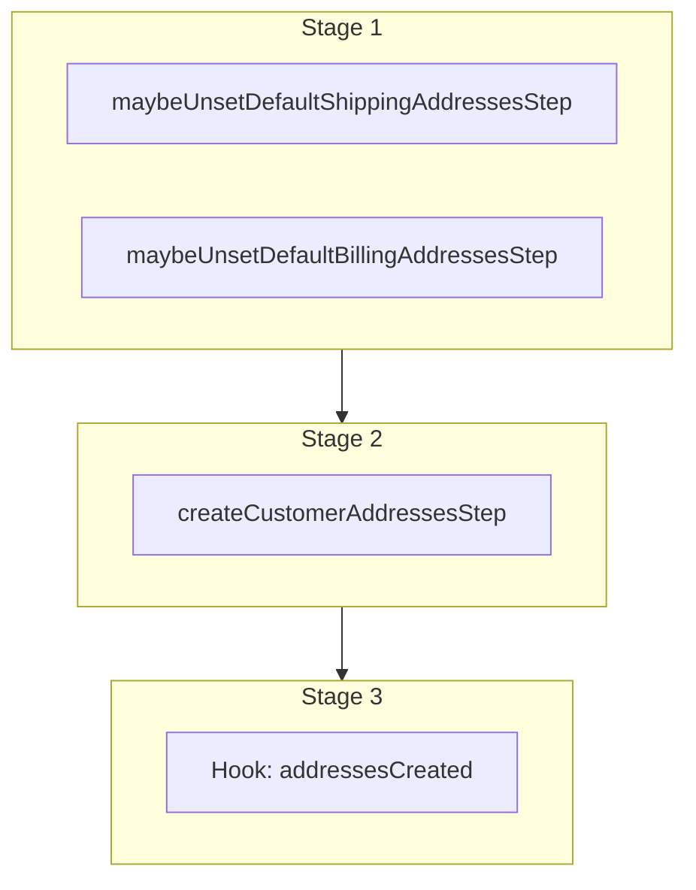

This documentation provides a reference to the `createCustomerAddressesWorkflow`. It belongs to the `@medusajs/medusa/core-flows` package.

This workflow creates one or more addresses for customers. It's used by the [Add Customer Address Admin API Route](/api/admin/customers/add-address)
and the [Add Customer Address Store API Route](/api/store/customers/create-address).

This workflow has a hook that allows you to perform custom actions on the created customer addresses. For example, you can pass under `additional_data` custom data that
allows you to create custom data models linked to the addresses.

You can also use this workflow within your customizations or your own custom workflows, allowing you to wrap custom logic around creating customer addresses.

[View source code](https://github.com/medusajs/medusa/blob/0ed927bdb7a396a8fd5f6447ed69b7b354b150d3/packages/core/core-flows/src/customer/workflows/create-addresses.ts#L75)

## Examples

**API Route**

```ts title="src/api/workflow/route.ts"
import type {
  MedusaRequest,
  MedusaResponse,
} from "@medusajs/framework/http"
import { createCustomerAddressesWorkflow } from "@medusajs/medusa/core-flows"

export async function POST(
  req: MedusaRequest,
  res: MedusaResponse
) {
  const { result } = await createCustomerAddressesWorkflow(req.scope)
    .run({
      input: {
        addresses: [{
            customer_id: "cus_123",
            address_1: "456 Elm St",
            city: "Los Angeles",
            country_code: "us",
            postal_code: "90001",
            first_name: "Jane",
            last_name: "Smith",
          },
          {
            customer_id: "cus_321",
            address_1: "789 Oak St",
            city: "New York",
            country_code: "us",
            postal_code: "10001",
            first_name: "Alice",
            last_name: "Johnson",
          }
        ],
        additional_data: {
          crm_id: "123"
        }
      }
    })

  res.send(result)
}
```

**Subscriber**

```ts title="src/subscribers/order-placed.ts"
import {
  type SubscriberConfig,
  type SubscriberArgs,
} from "@medusajs/framework"
import { createCustomerAddressesWorkflow } from "@medusajs/medusa/core-flows"

export default async function handleOrderPlaced({
  event: { data },
  container,
}: SubscriberArgs < { id: string } > ) {
  const { result } = await createCustomerAddressesWorkflow(container)
    .run({
      input: {
        addresses: [{
            customer_id: "cus_123",
            address_1: "456 Elm St",
            city: "Los Angeles",
            country_code: "us",
            postal_code: "90001",
            first_name: "Jane",
            last_name: "Smith",
          },
          {
            customer_id: "cus_321",
            address_1: "789 Oak St",
            city: "New York",
            country_code: "us",
            postal_code: "10001",
            first_name: "Alice",
            last_name: "Johnson",
          }
        ],
        additional_data: {
          crm_id: "123"
        }
      }
    })

  console.log(result)
}

export const config: SubscriberConfig = {
  event: "order.placed",
}
```

**Scheduled Job**

```ts title="src/jobs/message-daily.ts"
import { MedusaContainer } from "@medusajs/framework/types"
import { createCustomerAddressesWorkflow } from "@medusajs/medusa/core-flows"

export default async function myCustomJob(
  container: MedusaContainer
) {
  const { result } = await createCustomerAddressesWorkflow(container)
    .run({
      input: {
        addresses: [{
            customer_id: "cus_123",
            address_1: "456 Elm St",
            city: "Los Angeles",
            country_code: "us",
            postal_code: "90001",
            first_name: "Jane",
            last_name: "Smith",
          },
          {
            customer_id: "cus_321",
            address_1: "789 Oak St",
            city: "New York",
            country_code: "us",
            postal_code: "10001",
            first_name: "Alice",
            last_name: "Johnson",
          }
        ],
        additional_data: {
          crm_id: "123"
        }
      }
    })

  console.log(result)
}

export const config = {
  name: "run-once-a-day",
  schedule: "0 0 * * *",
}
```

**Another Workflow**

```ts title="src/workflows/my-workflow.ts"
import { createWorkflow } from "@medusajs/framework/workflows-sdk"
import { createCustomerAddressesWorkflow } from "@medusajs/medusa/core-flows"

const myWorkflow = createWorkflow(
  "my-workflow",
  () => {
    const result = createCustomerAddressesWorkflow
      .runAsStep({
        input: {
          addresses: [{
              customer_id: "cus_123",
              address_1: "456 Elm St",
              city: "Los Angeles",
              country_code: "us",
              postal_code: "90001",
              first_name: "Jane",
              last_name: "Smith",
            },
            {
              customer_id: "cus_321",
              address_1: "789 Oak St",
              city: "New York",
              country_code: "us",
              postal_code: "10001",
              first_name: "Alice",
              last_name: "Johnson",
            }
          ],
          additional_data: {
            crm_id: "123"
          }
        }
      })
  }
)
```

<a id="createcustomeraddressesworkflow-steps" />

## Steps



Stages follow the order in the workflow definition. Conditional steps run only when their condition is met. The step descriptions below include the conditions and reference links.

- [maybeUnsetDefaultShippingAddressesStep](/resources/references/medusa-workflows/steps/maybeUnsetDefaultShippingAddressesStep): This step unsets the `is_default_billing` property of existing customer addresses if the `is_default_billing` property in the addresses in the input is set to `true`.
- [maybeUnsetDefaultBillingAddressesStep](/resources/references/medusa-workflows/steps/maybeUnsetDefaultBillingAddressesStep): This step unsets the `is_default_billing` property of existing customer addresses if the `is_default_billing` property in the addresses in the input is set to `true`.
  - [createCustomerAddressesStep](/resources/references/medusa-workflows/steps/createCustomerAddressesStep): This step creates one or more customer addresses.
    - [addressesCreated](/resources/references/medusa-workflows/createCustomerAddressesWorkflow#addressescreated): This hook is executed after the addresses are created. You can consume this hook to perform custom actions on the created addresses.

<a id="createcustomeraddressesworkflow-input" />

## Input

**createCustomerAddressesWorkflow**

- `CreateCustomerAddressesWorkflowInput`: [CreateCustomerAddressesWorkflowInput](/resources/references/core_flows/core_core_flows_src/types/core_flowscore_core_flows_srcCreateCustomerAddressesWorkflowInput)
  - `addresses`: [CreateCustomerAddressDTO](/resources/references/customer/interfaces/customerCreateCustomerAddressDTO)\[] — The addresses to create.
    - `address_name`: `null` | `string` (optional) — The address's name.
    - `is_default_shipping`: `boolean` (optional) — Whether the address is default shipping.
    - `is_default_billing`: `boolean` (optional) — Whether the address is the default for billing.
    - `customer_id`: `string` — The associated customer's ID.
    - `company`: `null` | `string` (optional) — The company.
    - `first_name`: `null` | `string` (optional) — The first name.
    - `last_name`: `null` | `string` (optional) — The last name.
    - `address_1`: `null` | `string` (optional) — The address 1.
    - `address_2`: `null` | `string` (optional) — The address 2.
    - `city`: `null` | `string` (optional) — The city.
    - `country_code`: `null` | `string` (optional) — The country code.
    - `province`: `null` | `string` (optional) — The lower-case [ISO 3166-2](https://en.wikipedia.org/wiki/ISO_3166-2) province of the address.
    - `postal_code`: `null` | `string` (optional) — The postal code.
    - `phone`: `null` | `string` (optional) — The phone.
    - `metadata`: [MetadataType](/resources/references/customer/types/customerMetadataType) (optional) — Holds custom data in key-value pairs.
  - `additional_data`: `Record<string, unknown>` (optional) — Additional data that can be passed through the `additional_data` property in HTTP requests. Learn more in [this documentation](/learn/fundamentals/api-routes/additional-data).

<a id="createcustomeraddressesworkflow-output" />

## Output

**createCustomerAddressesWorkflow**

- `CustomerAddressDTO[]`: [CustomerAddressDTO](/resources/references/customer/interfaces/customerCustomerAddressDTO)\[]
  - `id`: `string` — The ID of the customer address.
  - `address_name`: `string` (optional) — The address name of the customer address.
  - `is_default_shipping`: `boolean` — Whether the customer address is default shipping.
  - `is_default_billing`: `boolean` — Whether the customer address is default billing.
  - `customer_id`: `string` — The associated customer's ID.
  - `company`: `string` (optional) — The company of the customer address.
  - `first_name`: `string` (optional) — The first name of the customer address.
  - `last_name`: `string` (optional) — The last name of the customer address.
  - `address_1`: `string` (optional) — The address 1 of the customer address.
  - `address_2`: `string` (optional) — The address 2 of the customer address.
  - `city`: `string` (optional) — The city of the customer address.
  - `country_code`: `string` (optional) — The country code of the customer address.
  - `province`: `string` (optional) — The lower-case [ISO 3166-2](https://en.wikipedia.org/wiki/ISO_3166-2) province of the customer address.
  - `postal_code`: `string` (optional) — The postal code of the customer address.
  - `phone`: `string` (optional) — The phone of the customer address.
  - `metadata`: `Record<string, unknown>` (optional) — Holds custom data in key-value pairs.
  - `created_at`: `string` — The created at of the customer address.
  - `updated_at`: `string` — The updated at of the customer address.

## Hooks

Hooks allow you to inject custom functionalities into the workflow. You'll receive data from the workflow, as well as additional data sent through an HTTP request.

Learn more about [Hooks](/learn/fundamentals/workflows/workflow-hooks) and [Additional Data](/learn/fundamentals/api-routes/additional-data).

### addressesCreated

This hook is executed after the addresses are created. You can consume this hook to perform custom actions on the created addresses.

#### Example

```ts
import { createCustomerAddressesWorkflow } from "@medusajs/medusa/core-flows"

createCustomerAddressesWorkflow.hooks.addressesCreated(
  (async ({ addresses, additional_data }, { container }) => {
    //TODO
  })
)
```

<a id="input" />

#### Input

Handlers consuming this hook accept the following input.

**addressesCreated**

- `input`: object — The input data for the hook.
  - `addresses`: [WorkflowDataProperties](/resources/references/workflows/types/workflowsWorkflowDataProperties)\<[CustomerAddressDTO](/resources/references/customer/interfaces/customerCustomerAddressDTO)\[]>
    - `__step__`: `string`
  - `additional_data`: `Record<string, unknown> | undefined` — Additional data that can be passed through the `additional_data` property in HTTP requests. Learn more in [this documentation](/learn/fundamentals/api-routes/additional-data).
