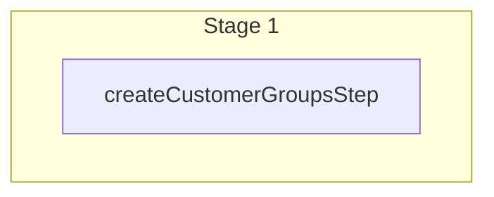

This documentation provides a reference to the `createCustomerGroupsWorkflow`. It belongs to the `@medusajs/medusa/core-flows` package.

This workflow creates one or more customer groups. It's used by the
[Create Customer Group Admin API Route](/api/admin/customer-groups/create-customer-group).

You can use this workflow within your customizations or your own custom workflows, allowing you to
create customer groups within your custom flows. For example, you can create customer groups to segregate
customers by age group or purchase habits.

[View source code](https://github.com/medusajs/medusa/blob/0ed927bdb7a396a8fd5f6447ed69b7b354b150d3/packages/core/core-flows/src/customer-group/workflows/create-customer-groups.ts#L52)

## Examples

**API Route**

```ts title="src/api/workflow/route.ts"
import type {
  MedusaRequest,
  MedusaResponse,
} from "@medusajs/framework/http"
import { createCustomerGroupsWorkflow } from "@medusajs/medusa/core-flows"

export async function POST(
  req: MedusaRequest,
  res: MedusaResponse
) {
  const { result } = await createCustomerGroupsWorkflow(req.scope)
    .run({
      input: {
        customersData: [{
          name: "VIP"
        }]
      }
    })

  res.send(result)
}
```

**Subscriber**

```ts title="src/subscribers/order-placed.ts"
import {
  type SubscriberConfig,
  type SubscriberArgs,
} from "@medusajs/framework"
import { createCustomerGroupsWorkflow } from "@medusajs/medusa/core-flows"

export default async function handleOrderPlaced({
  event: { data },
  container,
}: SubscriberArgs < { id: string } > ) {
  const { result } = await createCustomerGroupsWorkflow(container)
    .run({
      input: {
        customersData: [{
          name: "VIP"
        }]
      }
    })

  console.log(result)
}

export const config: SubscriberConfig = {
  event: "order.placed",
}
```

**Scheduled Job**

```ts title="src/jobs/message-daily.ts"
import { MedusaContainer } from "@medusajs/framework/types"
import { createCustomerGroupsWorkflow } from "@medusajs/medusa/core-flows"

export default async function myCustomJob(
  container: MedusaContainer
) {
  const { result } = await createCustomerGroupsWorkflow(container)
    .run({
      input: {
        customersData: [{
          name: "VIP"
        }]
      }
    })

  console.log(result)
}

export const config = {
  name: "run-once-a-day",
  schedule: "0 0 * * *",
}
```

**Another Workflow**

```ts title="src/workflows/my-workflow.ts"
import { createWorkflow } from "@medusajs/framework/workflows-sdk"
import { createCustomerGroupsWorkflow } from "@medusajs/medusa/core-flows"

const myWorkflow = createWorkflow(
  "my-workflow",
  () => {
    const result = createCustomerGroupsWorkflow
      .runAsStep({
        input: {
          customersData: [{
            name: "VIP"
          }]
        }
      })
  }
)
```

<a id="createcustomergroupsworkflow-steps" />

## Steps



Stages follow the order in the workflow definition. Conditional steps run only when their condition is met. The step descriptions below include the conditions and reference links.

- [createCustomerGroupsStep](/resources/references/medusa-workflows/steps/createCustomerGroupsStep): This step creates one or more customer groups.

<a id="createcustomergroupsworkflow-input" />

## Input

**createCustomerGroupsWorkflow**

- `CreateCustomerGroupsWorkflowInput`: [CreateCustomerGroupsWorkflowInput](/resources/references/core_flows/core_core_flows_src/types/core_flowscore_core_flows_srcCreateCustomerGroupsWorkflowInput)
  - `customersData`: [CreateCustomerGroupDTO](/resources/references/customer/interfaces/customerCreateCustomerGroupDTO)\[] — The customer groups to create.
    - `name`: `string` — The name of the customer group.
    - `metadata`: [MetadataType](/resources/references/customer/types/customerMetadataType) (optional) — Holds custom data in key-value pairs.
    - `created_by`: `string` (optional) — Who created the customer group. For example, the ID of the user that created the customer group.

<a id="createcustomergroupsworkflow-output" />

## Output

**createCustomerGroupsWorkflow**

- `CreateCustomerGroupsWorkflowOutput`: [CreateCustomerGroupsWorkflowOutput](/resources/references/core_flows/core_core_flows_src/types/core_flowscore_core_flows_srcCreateCustomerGroupsWorkflowOutput)
  - `id`: `string` — The ID of the customer group.
  - `name`: `string` — The name of the customer group.
  - `customers`: Partial\<[CustomerDTO](/resources/references/customer/interfaces/customerCustomerDTO)>\[] (optional) — The customers of the customer group.
    - `id`: `string` — The ID of the customer.
    - `email`: `string` — The email of the customer.
    - `has_account`: `boolean` — A flag indicating if customer has an account or not.
    - `default_billing_address_id`: `null` | `string` — The associated default billing address's ID.
    - `default_shipping_address_id`: `null` | `string` — The associated default shipping address's ID.
    - `company_name`: `null` | `string` — The company name of the customer.
    - `first_name`: `null` | `string` — The first name of the customer.
    - `last_name`: `null` | `string` — The last name of the customer.
    - `addresses`: [CustomerAddressDTO](/resources/references/customer/interfaces/customerCustomerAddressDTO)\[] — The addresses of the customer.
      - `id`: `string` — The ID of the customer address.
      - `address_name`: `string` (optional) — The address name of the customer address.
      - `is_default_shipping`: `boolean` — Whether the customer address is default shipping.
      - `is_default_billing`: `boolean` — Whether the customer address is default billing.
      - `customer_id`: `string` — The associated customer's ID.
      - `company`: `string` (optional) — The company of the customer address.
      - `first_name`: `string` (optional) — The first name of the customer address.
      - `last_name`: `string` (optional) — The last name of the customer address.
      - `address_1`: `string` (optional) — The address 1 of the customer address.
      - `address_2`: `string` (optional) — The address 2 of the customer address.
      - `city`: `string` (optional) — The city of the customer address.
      - `country_code`: `string` (optional) — The country code of the customer address.
      - `province`: `string` (optional) — The lower-case [ISO 3166-2](https://en.wikipedia.org/wiki/ISO_3166-2) province of the customer address.
      - `postal_code`: `string` (optional) — The postal code of the customer address.
      - `phone`: `string` (optional) — The phone of the customer address.
      - `metadata`: `Record<string, unknown>` (optional) — Holds custom data in key-value pairs.
      - `created_at`: `string` — The created at of the customer address.
      - `updated_at`: `string` — The updated at of the customer address.
    - `phone`: `null` | `string` — The phone of the customer.
    - `groups`: `object`\[] — The groups of the customer.
      - `id`: `string` — The ID of the group.
      - `name`: `string` — The name of the group.
    - `metadata`: `Record<string, unknown>` — Holds custom data in key-value pairs.
    - `created_by`: `null` | `string` — Who created the customer.
    - `deleted_at`: `null` | `string` | `Date` — The deletion date of the customer.
    - `created_at`: `string` | `Date` — The creation date of the customer.
    - `updated_at`: `string` | `Date` — The update date of the customer.
  - `metadata`: `Record<string, unknown>` (optional) — Holds custom data in key-value pairs.
  - `created_by`: `null` | `string` (optional) — Who created the customer group.
  - `deleted_at`: `null` | `string` | `Date` (optional) — The deletion date of the customer group.
  - `created_at`: `string` | `Date` (optional) — The creation date of the customer group.
  - `updated_at`: `string` | `Date` (optional) — The update date of the customer group.
