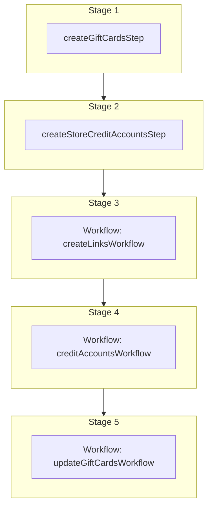

This documentation provides a reference to the `createGiftCardsWorkflow`. It belongs to the `@medusajs/medusa/core-flows` package.

This workflow creates gift cards and automatically sets up their backing store credit accounts.
It creates the gift cards, generates anonymous store credit accounts linked to each gift card,
credits the accounts with the gift card values, and marks the gift cards as redeemed.

You can use this workflow within your own customizations or custom workflows,
allowing you to wrap custom logic around gift card creation.

[View source code](https://github.com/medusajs/medusa/blob/0ed927bdb7a396a8fd5f6447ed69b7b354b150d3/packages/plugins/loyalty/src/workflows/gift-cards/workflows/create-gift-cards.ts#L53)

## Examples

**API Route**

```ts title="src/api/workflow/route.ts"
import type {
  MedusaRequest,
  MedusaResponse,
} from "@medusajs/framework/http"
import { createGiftCardsWorkflow } from "@medusajs/loyalty-plugin/workflows"

export async function POST(
  req: MedusaRequest,
  res: MedusaResponse
) {
  const { result } = await createGiftCardsWorkflow(req.scope)
    .run({
      input: [{
        code: "GC-XXXX-XXXX",
        value: 100,
        currency_code: "usd",
        expires_at: null,
        reference: "order",
        reference_id: "order_123",
        line_item_id: "li_123",
        customer_id: "cust_123",
        metadata: { custom_key: "custom_value" },
      }, ],
    })

  res.send(result)
}
```

**Subscriber**

```ts title="src/subscribers/order-placed.ts"
import {
  type SubscriberConfig,
  type SubscriberArgs,
} from "@medusajs/framework"
import { createGiftCardsWorkflow } from "@medusajs/loyalty-plugin/workflows"

export default async function handleOrderPlaced({
  event: { data },
  container,
}: SubscriberArgs < { id: string } > ) {
  const { result } = await createGiftCardsWorkflow(container)
    .run({
      input: [{
        code: "GC-XXXX-XXXX",
        value: 100,
        currency_code: "usd",
        expires_at: null,
        reference: "order",
        reference_id: "order_123",
        line_item_id: "li_123",
        customer_id: "cust_123",
        metadata: { custom_key: "custom_value" },
      }, ],
    })

  console.log(result)
}

export const config: SubscriberConfig = {
  event: "order.placed",
}
```

**Scheduled Job**

```ts title="src/jobs/message-daily.ts"
import { MedusaContainer } from "@medusajs/framework/types"
import { createGiftCardsWorkflow } from "@medusajs/loyalty-plugin/workflows"

export default async function myCustomJob(
  container: MedusaContainer
) {
  const { result } = await createGiftCardsWorkflow(container)
    .run({
      input: [{
        code: "GC-XXXX-XXXX",
        value: 100,
        currency_code: "usd",
        expires_at: null,
        reference: "order",
        reference_id: "order_123",
        line_item_id: "li_123",
        customer_id: "cust_123",
        metadata: { custom_key: "custom_value" },
      }, ],
    })

  console.log(result)
}

export const config = {
  name: "run-once-a-day",
  schedule: "0 0 * * *",
}
```

**Another Workflow**

```ts title="src/workflows/my-workflow.ts"
import { createWorkflow } from "@medusajs/framework/workflows-sdk"
import { createGiftCardsWorkflow } from "@medusajs/loyalty-plugin/workflows"

const myWorkflow = createWorkflow(
  "my-workflow",
  () => {
    const result = createGiftCardsWorkflow
      .runAsStep({
        input: [{
          code: "GC-XXXX-XXXX",
          value: 100,
          currency_code: "usd",
          expires_at: null,
          reference: "order",
          reference_id: "order_123",
          line_item_id: "li_123",
          customer_id: "cust_123",
          metadata: { custom_key: "custom_value" },
        }, ],
      })
  }
)
```

<a id="creategiftcardsworkflow-steps" />

## Steps



Stages follow the order in the workflow definition. Conditional steps run only when their condition is met. The step descriptions below include the conditions and reference links.

- [createGiftCardsStep](/resources/references/medusa-workflows/steps/createGiftCardsStep): This step creates gift cards. If no code is provided for a gift card, a unique code is automatically generated. The step supports rollback by deleting the created gift cards.
  - [createStoreCreditAccountsStep](/resources/references/medusa-workflows/steps/createStoreCreditAccountsStep): This step creates store credit accounts. If no code is provided, a unique code prefixed with "SC" is automatically generated. The step supports rollback by deleting the created accounts.
    - [createLinksWorkflow](/resources/references/medusa-workflows/createLinksWorkflow): Create links between two records of linked data models.
      - [creditAccountsWorkflow](/resources/references/medusa-workflows/creditAccountsWorkflow): Credit one or more store credit accounts.
        - [updateGiftCardsWorkflow](/resources/references/medusa-workflows/updateGiftCardsWorkflow): Update gift cards.

<a id="creategiftcardsworkflow-input" />

## Input

**createGiftCardsWorkflow**

- `CreateGiftCardsWorkflowInput`: [CreateGiftCardsWorkflowInput](/resources/references/core_flows/plugins_loyalty_src_workflows/types/core_flowsplugins_loyalty_src_workflowsCreateGiftCardsWorkflowInput)
  - `code`: `string` — The unique redemption code for the gift card. If not provided, one is auto-generated.
  - `value`: `number` — The monetary value of the gift card.
  - `currency_code`: `string` — The three-letter ISO currency code for the gift card's value.

    Example:

    ```
    usd
    ```
  - `expires_at`: `string` | `null` — The expiration date of the gift card, or null if it does not expire.
  - `reference_id`: `string` | `null` — The ID of the resource this gift card is associated with.
  - `reference`: `string` | `null` — The resource type this gift card is associated with (e.g. "order").
  - `line_item_id`: `string` — The ID of the line item this gift card was purchased as.
  - `customer_id`: `string` | `null` — The ID of the customer to associate with the gift card.
  - `metadata`: `Record<string, unknown>` — Custom key-value pairs to attach to the gift card.

<a id="creategiftcardsworkflow-output" />

## Output

**createGiftCardsWorkflow**

- `ModuleGiftCard[]`: [ModuleGiftCard](/resources/references/loyalty/types/loyaltyModuleGiftCard)\[]
  - `id`: `string` — The gift card's ID.
  - `code`: `string` — The unique redemption code for the gift card.
  - `status`: [GiftCardStatus](/resources/references/loyalty/enums/loyaltyGiftCardStatus) — The current status of the gift card.
    - `PENDING`: `"pending"` (optional)
    - `REDEEMED`: `"redeemed"` (optional)
  - `value`: `number` — The monetary value of the gift card.
  - `currency_code`: `string` — The three-letter ISO currency code of the gift card's value.
  - `customer_id`: `string` — The ID of the customer who owns this gift card.
  - `customer`: [CustomerDTO](/resources/references/loyalty/interfaces/loyaltyCustomerDTO) — The customer who owns this gift card.
    - `id`: `string` — The ID of the customer.
    - `email`: `string` — The email of the customer.
    - `has_account`: `boolean` — A flag indicating if customer has an account or not.
    - `default_billing_address_id`: `null` | `string` — The associated default billing address's ID.
    - `default_shipping_address_id`: `null` | `string` — The associated default shipping address's ID.
    - `company_name`: `null` | `string` — The company name of the customer.
    - `first_name`: `null` | `string` — The first name of the customer.
    - `last_name`: `null` | `string` — The last name of the customer.
    - `addresses`: [CustomerAddressDTO](/resources/references/loyalty/interfaces/loyaltyCustomerAddressDTO)\[] — The addresses of the customer.
      - `id`: `string` — The ID of the customer address.
      - `address_name`: `string` (optional) — The address name of the customer address.
      - `is_default_shipping`: `boolean` — Whether the customer address is default shipping.
      - `is_default_billing`: `boolean` — Whether the customer address is default billing.
      - `customer_id`: `string` — The associated customer's ID.
      - `company`: `string` (optional) — The company of the customer address.
      - `first_name`: `string` (optional) — The first name of the customer address.
      - `last_name`: `string` (optional) — The last name of the customer address.
      - `address_1`: `string` (optional) — The address 1 of the customer address.
      - `address_2`: `string` (optional) — The address 2 of the customer address.
      - `city`: `string` (optional) — The city of the customer address.
      - `country_code`: `string` (optional) — The country code of the customer address.
      - `province`: `string` (optional) — The lower-case [ISO 3166-2](https://en.wikipedia.org/wiki/ISO_3166-2) province of the customer address.
      - `postal_code`: `string` (optional) — The postal code of the customer address.
      - `phone`: `string` (optional) — The phone of the customer address.
      - `metadata`: `Record<string, unknown>` (optional) — Holds custom data in key-value pairs.
      - `created_at`: `string` — The created at of the customer address.
      - `updated_at`: `string` — The updated at of the customer address.
    - `phone`: `null` | `string` — The phone of the customer.
    - `groups`: `object`\[] — The groups of the customer.
      - `id`: `string` — The ID of the group.
      - `name`: `string` — The name of the group.
    - `metadata`: `Record<string, unknown>` — Holds custom data in key-value pairs.
    - `created_by`: `null` | `string` — Who created the customer.
    - `deleted_at`: `null` | `string` | `Date` — The deletion date of the customer.
    - `created_at`: `string` | `Date` — The creation date of the customer.
    - `updated_at`: `string` | `Date` — The update date of the customer.
  - `reference_id`: `string` | `null` — The ID of the resource this gift card was created from (e.g. an order ID).
  - `note`: `string` | `null` — An optional note about the gift card.
  - `reference`: `string` | `null` — The resource type this gift card references (e.g. "order").
  - `expires_at`: `string` | `null` — The date the gift card expires, or null if it does not expire.
  - `created_at`: `string` — The date the gift card was created.
  - `updated_at`: `string` — The date the gift card was last updated.
