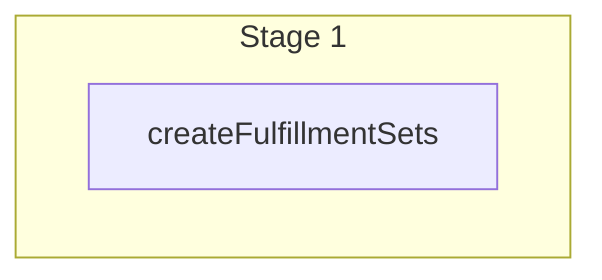

This documentation provides a reference to the `createLocationFulfillmentSetWorkflow`. It belongs to the `@medusajs/medusa/core-flows` package.

This workflow adds a fulfillment set to a stock location. It's used by the
[Add Fulfillment Set to Stock Location Admin API Route](/api/admin/stock-locations/add-fulfillment-set).

You can use this workflow within your own customizations or custom workflows, allowing you
to add fulfillment sets to a stock location in your custom flows.

[View source code](https://github.com/medusajs/medusa/blob/0ed927bdb7a396a8fd5f6447ed69b7b354b150d3/packages/core/core-flows/src/stock-location/workflows/create-location-fulfillment-set.ts#L35)

## Examples

**API Route**

```ts title="src/api/workflow/route.ts"
import type {
  MedusaRequest,
  MedusaResponse,
} from "@medusajs/framework/http"
import { createLocationFulfillmentSetWorkflow } from "@medusajs/medusa/core-flows"

export async function POST(
  req: MedusaRequest,
  res: MedusaResponse
) {
  const { result } = await createLocationFulfillmentSetWorkflow(req.scope)
    .run({
      input: {
        location_id: "sloc_123",
        fulfillment_set_data: {
          name: "Shipping",
          type: "shipping",
        }
      }
    })

  res.send(result)
}
```

**Subscriber**

```ts title="src/subscribers/order-placed.ts"
import {
  type SubscriberConfig,
  type SubscriberArgs,
} from "@medusajs/framework"
import { createLocationFulfillmentSetWorkflow } from "@medusajs/medusa/core-flows"

export default async function handleOrderPlaced({
  event: { data },
  container,
}: SubscriberArgs < { id: string } > ) {
  const { result } = await createLocationFulfillmentSetWorkflow(container)
    .run({
      input: {
        location_id: "sloc_123",
        fulfillment_set_data: {
          name: "Shipping",
          type: "shipping",
        }
      }
    })

  console.log(result)
}

export const config: SubscriberConfig = {
  event: "order.placed",
}
```

**Scheduled Job**

```ts title="src/jobs/message-daily.ts"
import { MedusaContainer } from "@medusajs/framework/types"
import { createLocationFulfillmentSetWorkflow } from "@medusajs/medusa/core-flows"

export default async function myCustomJob(
  container: MedusaContainer
) {
  const { result } = await createLocationFulfillmentSetWorkflow(container)
    .run({
      input: {
        location_id: "sloc_123",
        fulfillment_set_data: {
          name: "Shipping",
          type: "shipping",
        }
      }
    })

  console.log(result)
}

export const config = {
  name: "run-once-a-day",
  schedule: "0 0 * * *",
}
```

**Another Workflow**

```ts title="src/workflows/my-workflow.ts"
import { createWorkflow } from "@medusajs/framework/workflows-sdk"
import { createLocationFulfillmentSetWorkflow } from "@medusajs/medusa/core-flows"

const myWorkflow = createWorkflow(
  "my-workflow",
  () => {
    const result = createLocationFulfillmentSetWorkflow
      .runAsStep({
        input: {
          location_id: "sloc_123",
          fulfillment_set_data: {
            name: "Shipping",
            type: "shipping",
          }
        }
      })
  }
)
```

<a id="createlocationfulfillmentsetworkflow-steps" />

## Steps



Stages follow the order in the workflow definition. Conditional steps run only when their condition is met. The step descriptions below include the conditions and reference links.

- [createFulfillmentSets](/resources/references/medusa-workflows/steps/createFulfillmentSets): This step creates one or more fulfillment sets.

<a id="createlocationfulfillmentsetworkflow-input" />

## Input

**createLocationFulfillmentSetWorkflow**

- `CreateLocationFulfillmentSetWorkflowInputDTO`: [CreateLocationFulfillmentSetWorkflowInputDTO](/resources/references/types/interfaces/typesCreateLocationFulfillmentSetWorkflowInputDTO) — The data to add a fulfillment set to a stock location.
  - `location_id`: `string` — The ID of the stock location to add the fulfillment set to.
  - `fulfillment_set_data`: `object` — The data of the fulfillment set to add.
    - `name`: `string` — The name of the fulfillment set.
    - `type`: `string` — The type of the fulfillment set.
