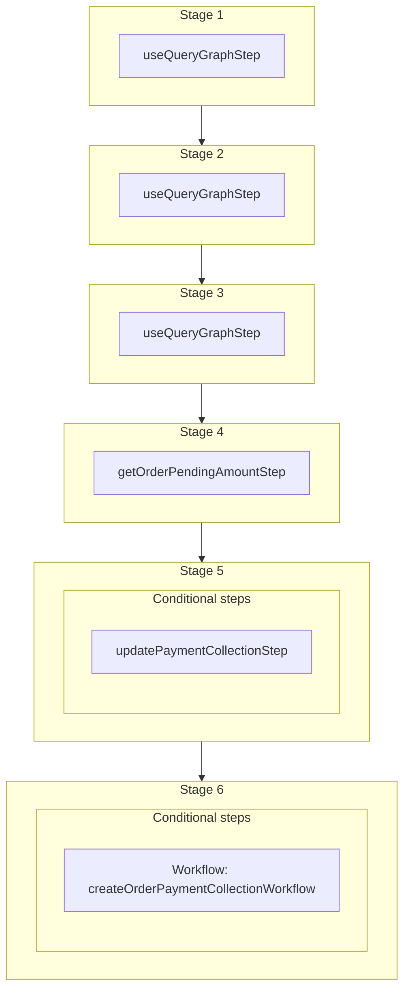

This documentation provides a reference to the `createOrUpdateOrderPaymentCollectionWorkflow`. It belongs to the `@medusajs/medusa/core-flows` package.

This workflow creates or updates payment collection for an order. It's used by other order-related workflows,
such as [createOrderPaymentCollectionWorkflow](/resources/references/medusa-workflows/createOrderPaymentCollectionWorkflow) to update an order's payment collections based on changes made to the order.

You can use this workflow within your customizations or your own custom workflows, allowing you to wrap custom logic around
creating or updating payment collections for an order.

[View source code](https://github.com/medusajs/medusa/blob/0ed927bdb7a396a8fd5f6447ed69b7b354b150d3/packages/core/core-flows/src/order/workflows/create-or-update-order-payment-collection.ts#L88)

## Examples

**API Route**

```ts title="src/api/workflow/route.ts"
import type {
  MedusaRequest,
  MedusaResponse,
} from "@medusajs/framework/http"
import { createOrUpdateOrderPaymentCollectionWorkflow } from "@medusajs/medusa/core-flows"

export async function POST(
  req: MedusaRequest,
  res: MedusaResponse
) {
  const { result } = await createOrUpdateOrderPaymentCollectionWorkflow(req
      .scope)
    .run({
      input: {
        order_id: "order_123",
        amount: 20
      }
    })

  res.send(result)
}
```

**Subscriber**

```ts title="src/subscribers/order-placed.ts"
import {
  type SubscriberConfig,
  type SubscriberArgs,
} from "@medusajs/framework"
import { createOrUpdateOrderPaymentCollectionWorkflow } from "@medusajs/medusa/core-flows"

export default async function handleOrderPlaced({
  event: { data },
  container,
}: SubscriberArgs < { id: string } > ) {
  const { result } = await createOrUpdateOrderPaymentCollectionWorkflow(
      container)
    .run({
      input: {
        order_id: "order_123",
        amount: 20
      }
    })

  console.log(result)
}

export const config: SubscriberConfig = {
  event: "order.placed",
}
```

**Scheduled Job**

```ts title="src/jobs/message-daily.ts"
import { MedusaContainer } from "@medusajs/framework/types"
import { createOrUpdateOrderPaymentCollectionWorkflow } from "@medusajs/medusa/core-flows"

export default async function myCustomJob(
  container: MedusaContainer
) {
  const { result } = await createOrUpdateOrderPaymentCollectionWorkflow(
      container)
    .run({
      input: {
        order_id: "order_123",
        amount: 20
      }
    })

  console.log(result)
}

export const config = {
  name: "run-once-a-day",
  schedule: "0 0 * * *",
}
```

**Another Workflow**

```ts title="src/workflows/my-workflow.ts"
import { createWorkflow } from "@medusajs/framework/workflows-sdk"
import { createOrUpdateOrderPaymentCollectionWorkflow } from "@medusajs/medusa/core-flows"

const myWorkflow = createWorkflow(
  "my-workflow",
  () => {
    const result = createOrUpdateOrderPaymentCollectionWorkflow
      .runAsStep({
        input: {
          order_id: "order_123",
          amount: 20
        }
      })
  }
)
```

<a id="createorupdateorderpaymentcollectionworkflow-steps" />

## Steps



Stages follow the order in the workflow definition. Conditional steps run only when their condition is met. The step descriptions below include the conditions and reference links.

- [useQueryGraphStep](/resources/references/medusa-workflows/steps/useQueryGraphStep): This step fetches data across modules using the Query. Learn more in the [Query documentation](/learn/fundamentals/module-links/query).
  - [useQueryGraphStep](/resources/references/medusa-workflows/steps/useQueryGraphStep): This step fetches data across modules using the Query. Learn more in the [Query documentation](/learn/fundamentals/module-links/query).
    - [useQueryGraphStep](/resources/references/medusa-workflows/steps/useQueryGraphStep): This step fetches data across modules using the Query. Learn more in the [Query documentation](/learn/fundamentals/module-links/query).
      - [getOrderPendingAmountStep](/resources/references/medusa-workflows/getOrderPendingAmountStep): This step resolves an order's pending amount and validates the requested charge against it. It throws an error if the amount to charge is greater than the order's pending amount.
        - **when** (when: \{
          return (
          !!existingPaymentCollection?.id &&
          !shouldRecreate &&
          MathBN.gte(amountPending, 0)
          )
          })
        - [updatePaymentCollectionStep](/resources/references/medusa-workflows/steps/updatePaymentCollectionStep): This step updates payment collections matching the specified filters.
          - **when** (when: \{
            return (
            (!existingPaymentCollection?.id || shouldRecreate) &&
            MathBN.gt(amountPending, 0)
            )
            })
          - [createOrderPaymentCollectionWorkflow](/resources/references/medusa-workflows/createOrderPaymentCollectionWorkflow): Create a payment collection for an order.

<a id="createorupdateorderpaymentcollectionworkflow-input" />

## Input

**createOrUpdateOrderPaymentCollectionWorkflow**

- `order_id`: `string`
- `amount`: `number` (optional)

<a id="createorupdateorderpaymentcollectionworkflow-output" />

## Output

**createOrUpdateOrderPaymentCollectionWorkflow**

- `PaymentCollectionDTO[]`: [PaymentCollectionDTO](/resources/references/payment/interfaces/paymentPaymentCollectionDTO)\[]
  - `id`: `string` — The ID of the payment collection.
  - `currency_code`: `string` — The ISO 3 character currency code of the payment sessions and payments associated with payment collection.
  - `amount`: [BigNumberValue](/resources/references/payment/types/paymentBigNumberValue) — The total amount to be authorized and captured.
    - `numeric`: `number`
    - `raw`: [BigNumberRawValue](/resources/references/payment/types/paymentBigNumberRawValue) (optional)
    - `bigNumber`: `BigNumber` (optional)
  - `authorized_amount`: [BigNumberValue](/resources/references/payment/types/paymentBigNumberValue) (optional) — The amount authorized within the associated payment sessions.
    - `numeric`: `number`
    - `raw`: [BigNumberRawValue](/resources/references/payment/types/paymentBigNumberRawValue) (optional)
    - `bigNumber`: `BigNumber` (optional)
  - `refunded_amount`: [BigNumberValue](/resources/references/payment/types/paymentBigNumberValue) (optional) — The amount refunded within the associated payments.
    - `numeric`: `number`
    - `raw`: [BigNumberRawValue](/resources/references/payment/types/paymentBigNumberRawValue) (optional)
    - `bigNumber`: `BigNumber` (optional)
  - `captured_amount`: [BigNumberValue](/resources/references/payment/types/paymentBigNumberValue) (optional) — The amount captured within the associated payments.
    - `numeric`: `number`
    - `raw`: [BigNumberRawValue](/resources/references/payment/types/paymentBigNumberRawValue) (optional)
    - `bigNumber`: `BigNumber` (optional)
  - `completed_at`: `string` | `Date` (optional) — When the payment collection was completed.
  - `created_at`: `string` | `Date` (optional) — When the payment collection was created.
  - `updated_at`: `string` | `Date` (optional) — When the payment collection was updated.
  - `metadata`: `Record<string, unknown>` (optional) — Holds custom data in key-value pairs.
  - `status`: [PaymentCollectionStatus](/resources/references/payment/types/paymentPaymentCollectionStatus) — The status of the payment collection.
  - `payment_providers`: [PaymentProviderDTO](/resources/references/payment/interfaces/paymentPaymentProviderDTO)\[] — The payment provider used to process the associated payment sessions and payments.
    - `id`: `string` — The ID of the payment provider.
    - `is_enabled`: `boolean` — Whether the payment provider is enabled.
  - `payment_sessions`: [PaymentSessionDTO](/resources/references/payment/interfaces/paymentPaymentSessionDTO)\[] (optional) — The associated payment sessions.
    - `id`: `string` — The ID of the payment session.
    - `amount`: [BigNumberValue](/resources/references/payment/types/paymentBigNumberValue) — The amount to authorize.
    - `currency_code`: `string` — The 3 character currency code of the payment session.
    - `provider_id`: `string` — The ID of the associated payment provider.
    - `data`: `Record<string, unknown>` — The data necessary for the payment provider to process the payment session.
    - `context`: `Record<string, unknown>` (optional) — The context necessary for the payment provider.
    - `status`: [PaymentSessionStatus](/resources/references/payment/types/paymentPaymentSessionStatus) — The status of the payment session.
    - `authorized_at`: `Date` (optional) — When the payment session was authorized.
    - `created_at`: `string` | `Date` — When the payment session was created
    - `updated_at`: `string` | `Date` — When the payment session was updated
    - `payment_collection_id`: `string` — The ID of the associated payment collection.
    - `payment_collection`: [PaymentCollectionDTO](/resources/references/payment/interfaces/paymentPaymentCollectionDTO) (optional) — The payment collection the session is associated with.
    - `payment`: [PaymentDTO](/resources/references/payment/interfaces/paymentPaymentDTO) (optional) — The payment created from the session.
    - `metadata`: `Record<string, unknown>` (optional) — Holds custom data in key-value pairs.
  - `payments`: [PaymentDTO](/resources/references/payment/interfaces/paymentPaymentDTO)\[] (optional) — The associated payments.
    - `id`: `string` — The ID of the payment.
    - `amount`: [BigNumberValue](/resources/references/payment/types/paymentBigNumberValue) — The payment's total amount.
    - `raw_amount`: [BigNumberValue](/resources/references/payment/types/paymentBigNumberValue) (optional) — The raw amount of the payment.
    - `authorized_amount`: [BigNumberValue](/resources/references/payment/types/paymentBigNumberValue) (optional) — The authorized amount of the payment.
    - `raw_authorized_amount`: [BigNumberValue](/resources/references/payment/types/paymentBigNumberValue) (optional) — The raw authorized amount of the payment.
    - `currency_code`: `string` — The ISO 3 character currency code of the payment.
    - `provider_id`: `string` — The ID of the associated payment provider.
    - `data`: `Record<string, unknown>` (optional) — The data relevant for the payment provider to process the payment.
    - `created_at`: `string` | `Date` (optional) — When the payment was created.
    - `updated_at`: `string` | `Date` (optional) — When the payment was updated.
    - `captured_at`: `string` | `Date` (optional) — When the payment was captured.
    - `canceled_at`: `string` | `Date` (optional) — When the payment was canceled.
    - `captured_amount`: [BigNumberValue](/resources/references/payment/types/paymentBigNumberValue) (optional) — The sum of the associated captures' amounts.
    - `raw_captured_amount`: [BigNumberValue](/resources/references/payment/types/paymentBigNumberValue) (optional) — The sum of the associated captures' raw amounts.
    - `refunded_amount`: [BigNumberValue](/resources/references/payment/types/paymentBigNumberValue) (optional) — The sum of the associated refunds' amounts.
    - `raw_refunded_amount`: [BigNumberValue](/resources/references/payment/types/paymentBigNumberValue) (optional) — The sum of the associated refunds' raw amounts.
    - `captures`: [CaptureDTO](/resources/references/payment/interfaces/paymentCaptureDTO)\[] (optional) — The associated captures.
    - `refunds`: [RefundDTO](/resources/references/payment/interfaces/paymentRefundDTO)\[] (optional) — The associated refunds.
    - `payment_collection_id`: `string` — The ID of the associated payment collection.
    - `payment_collection`: [PaymentCollectionDTO](/resources/references/payment/interfaces/paymentPaymentCollectionDTO) (optional) — The associated payment collection.
    - `payment_session`: [PaymentSessionDTO](/resources/references/payment/interfaces/paymentPaymentSessionDTO) (optional) — The payment session from which the payment is created.
