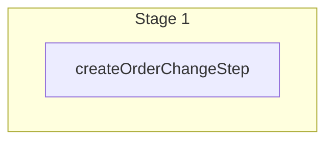

This documentation provides a reference to the `createOrderChangeWorkflow`. It belongs to the `@medusajs/medusa/core-flows` package.

This workflow creates an order change.

You can use this workflow within your customizations or your own custom workflows, allowing you to wrap custom logic around
creating an order change.

[View source code](https://github.com/medusajs/medusa/blob/0ed927bdb7a396a8fd5f6447ed69b7b354b150d3/packages/core/core-flows/src/order/workflows/create-order-change.ts#L23)

## Examples

**API Route**

```ts title="src/api/workflow/route.ts"
import type {
  MedusaRequest,
  MedusaResponse,
} from "@medusajs/framework/http"
import { createOrderChangeWorkflow } from "@medusajs/medusa/core-flows"

export async function POST(
  req: MedusaRequest,
  res: MedusaResponse
) {
  const { result } = await createOrderChangeWorkflow(req.scope)
    .run({
      input: {
        "order_id": "order_123"
      }
    })

  res.send(result)
}
```

**Subscriber**

```ts title="src/subscribers/order-placed.ts"
import {
  type SubscriberConfig,
  type SubscriberArgs,
} from "@medusajs/framework"
import { createOrderChangeWorkflow } from "@medusajs/medusa/core-flows"

export default async function handleOrderPlaced({
  event: { data },
  container,
}: SubscriberArgs < { id: string } > ) {
  const { result } = await createOrderChangeWorkflow(container)
    .run({
      input: {
        "order_id": "order_123"
      }
    })

  console.log(result)
}

export const config: SubscriberConfig = {
  event: "order.placed",
}
```

**Scheduled Job**

```ts title="src/jobs/message-daily.ts"
import { MedusaContainer } from "@medusajs/framework/types"
import { createOrderChangeWorkflow } from "@medusajs/medusa/core-flows"

export default async function myCustomJob(
  container: MedusaContainer
) {
  const { result } = await createOrderChangeWorkflow(container)
    .run({
      input: {
        "order_id": "order_123"
      }
    })

  console.log(result)
}

export const config = {
  name: "run-once-a-day",
  schedule: "0 0 * * *",
}
```

**Another Workflow**

```ts title="src/workflows/my-workflow.ts"
import { createWorkflow } from "@medusajs/framework/workflows-sdk"
import { createOrderChangeWorkflow } from "@medusajs/medusa/core-flows"

const myWorkflow = createWorkflow(
  "my-workflow",
  () => {
    const result = createOrderChangeWorkflow
      .runAsStep({
        input: {
          "order_id": "order_123"
        }
      })
  }
)
```

<a id="createorderchangeworkflow-steps" />

## Steps



Stages follow the order in the workflow definition. Conditional steps run only when their condition is met. The step descriptions below include the conditions and reference links.

- [createOrderChangeStep](/resources/references/medusa-workflows/steps/createOrderChangeStep): This step creates an order change.

<a id="createorderchangeworkflow-input" />

## Input

**createOrderChangeWorkflow**

- `CreateOrderChangeDTO`: [CreateOrderChangeDTO](/resources/references/order/interfaces/orderCreateOrderChangeDTO) — The data of the order change to be created.
  - `order_id`: `string` — The associated order's ID.
  - `return_id`: `string` (optional) — The associated return's ID.
  - `claim_id`: `string` (optional) — The associated claim's ID.
  - `exchange_id`: `string` (optional) — The associated exchange's ID.
  - `change_type`: [OrderChangeType](/resources/references/order/types/orderOrderChangeType) (optional) — The type of the order change.
  - `description`: `string` (optional) — The description of the order change.
  - `internal_note`: `null` | `string` (optional) — The internal note of the order change.
  - `carry_over_promotions`: `null` | `boolean` (optional) — Whether to carry over promotions (apply promotions to outbound exchange items).
  - `no_notification`: `null` | `boolean` (optional) — Whether the customer shouldn't be notified of the order change.
  - `requested_by`: `string` (optional) — The user or customer that requested the order change.
  - `requested_at`: `Date` (optional) — The date that the order change was requested.
  - `created_by`: `null` | `string` (optional) — The user that created the order change.
  - `metadata`: `null` | `Record<string, unknown>` (optional) — Holds custom data in key-value pairs.
  - `actions`: [CreateOrderChangeActionDTO](/resources/references/order/interfaces/orderCreateOrderChangeActionDTO)\[] (optional) — The actions of the order change.
    - `order_change_id`: `string` (optional) — The associated order change's ID.
    - `order_id`: `string` (optional) — The associated order's ID.
    - `return_id`: `string` (optional) — The associated return's ID.
    - `claim_id`: `string` (optional) — The associated claim's ID.
    - `exchange_id`: `string` (optional) — The associated exchange's ID.
    - `version`: `number` (optional) — The version of the order change action. Once the order change action is confirmed, this becomes the order's version.
    - `reference`: `string` (optional) — The name of the data model that this action references. For example, `return`.
    - `reference_id`: `string` (optional) — The ID of the record references of the data model specified in [reference](/resources/references/order/interfaces/orderCreateOrderChangeActionDTO#reference). For example, if `reference` is `return`, the `reference_id` is the ID of the return.
    - `action`: [ChangeActionType](/resources/references/order/types/orderChangeActionType) — The type of action.
    - `internal_note`: `null` | `string` (optional) — The internal note of the order change action.
    - `amount`: [BigNumberInput](/resources/references/order/types/orderBigNumberInput) (optional) — The amount of the order change action.
    - `details`: `Record<string, unknown>` (optional) — The details of the order change action. This could include the returned items or their changed quantity, based on the type of this action.
    - `applied`: `boolean` (optional) — Whether the action has been applied.

<a id="createorderchangeworkflow-output" />

## Output

**createOrderChangeWorkflow**

- `OrderChangeDTO`: [OrderChangeDTO](/resources/references/fulfillment/interfaces/fulfillmentOrderChangeDTO) — The order change details.
  - `id`: `string` — The ID of the order change
  - `version`: `number` — The version of the order change
  - `change_type`: `"return"` | `"exchange"` | `"claim"` | `"edit"` | `"transfer"` (optional) — The type of the order change
  - `carry_over_promotions`: `null` | `boolean` (optional) — Whether to carry over promotions (apply promotions to outbound exchange items).
  - `no_notification`: `null` | `boolean` (optional) — Whether the customer shouldn't be notified of the order change.
  - `order_id`: `string` — The ID of the associated order
  - `return_id`: `string` — The ID of the associated return order
  - `exchange_id`: `string` — The ID of the associated exchange order
  - `claim_id`: `string` — The ID of the associated claim order
  - `order`: [OrderDTO](/resources/references/fulfillment/interfaces/fulfillmentOrderDTO) — The associated order
    - `id`: `string` — The ID of the order.
    - `version`: `number` — The version of the order.
    - `display_id`: `number` — The order's display ID.
    - `custom_display_id`: `string` (optional) — The order's custom display ID.
    - `order_change`: [OrderChangeDTO](/resources/references/fulfillment/interfaces/fulfillmentOrderChangeDTO) (optional) — The active order change, if any.
    - `status`: [OrderStatus](/resources/references/fulfillment/types/fulfillmentOrderStatus) — The status of the order.
    - `region_id`: `string` (optional) — The ID of the region the order belongs to.
    - `customer_id`: `string` (optional) — The ID of the customer on the order.
    - `sales_channel_id`: `string` (optional) — The ID of the sales channel the order belongs to.
    - `email`: `string` (optional) — The email of the order.
    - `currency_code`: `string` — The currency of the order
    - `shipping_address`: [OrderAddressDTO](/resources/references/fulfillment/interfaces/fulfillmentOrderAddressDTO) (optional) — The associated shipping address.
    - `billing_address`: [OrderAddressDTO](/resources/references/fulfillment/interfaces/fulfillmentOrderAddressDTO) (optional) — The associated billing address.
    - `items`: [OrderLineItemDTO](/resources/references/fulfillment/interfaces/fulfillmentOrderLineItemDTO)\[] (optional) — The associated order details / line items.
    - `shipping_methods`: [OrderShippingMethodDTO](/resources/references/fulfillment/interfaces/fulfillmentOrderShippingMethodDTO)\[] (optional) — The associated shipping methods
    - `transactions`: [OrderTransactionDTO](/resources/references/fulfillment/interfaces/fulfillmentOrderTransactionDTO)\[] (optional) — The tramsactions associated with the order
    - `credit_lines`: [OrderCreditLineDTO](/resources/references/fulfillment/interfaces/fulfillmentOrderCreditLineDTO)\[] (optional) — The credit lines for an order
    - `summary`: [OrderSummaryDTO](/resources/references/fulfillment/interfaces/fulfillmentOrderSummaryDTO) (optional) — The summary of the order totals.
    - `is_draft_order`: `boolean` (optional) — Whether the order is a draft order.
    - `locale`: `string` (optional) — The locale of the order.
    - `metadata`: `null` | `Record<string, unknown>` (optional) — Holds custom data in key-value pairs.
    - `canceled_at`: `string` | `Date` (optional) — When the order was canceled.
    - `created_at`: `string` | `Date` — When the order was created.
    - `updated_at`: `string` | `Date` — When the order was updated.
    - `deleted_at`: `string` | `Date` (optional) — When the order was deleted.
    - `original_item_total`: [BigNumberValue](/resources/references/fulfillment/types/fulfillmentBigNumberValue) — The original item total of the order.
    - `original_item_subtotal`: [BigNumberValue](/resources/references/fulfillment/types/fulfillmentBigNumberValue) — The original item subtotal of the order.
    - `original_item_tax_total`: [BigNumberValue](/resources/references/fulfillment/types/fulfillmentBigNumberValue) — The original item tax total of the order.
    - `item_total`: [BigNumberValue](/resources/references/fulfillment/types/fulfillmentBigNumberValue) — The item total of the order.
    - `item_subtotal`: [BigNumberValue](/resources/references/fulfillment/types/fulfillmentBigNumberValue) — The item subtotal of the order.
    - `item_tax_total`: [BigNumberValue](/resources/references/fulfillment/types/fulfillmentBigNumberValue) — The item tax total of the order.
    - `item_discount_total`: [BigNumberValue](/resources/references/fulfillment/types/fulfillmentBigNumberValue) — The item discount total of the order.
    - `original_total`: [BigNumberValue](/resources/references/fulfillment/types/fulfillmentBigNumberValue) — The original total of the order.
    - `original_subtotal`: [BigNumberValue](/resources/references/fulfillment/types/fulfillmentBigNumberValue) — The original subtotal of the order.
    - `original_tax_total`: [BigNumberValue](/resources/references/fulfillment/types/fulfillmentBigNumberValue) — The original tax total of the order.
    - `total`: [BigNumberValue](/resources/references/fulfillment/types/fulfillmentBigNumberValue) — The total of the order.
    - `subtotal`: [BigNumberValue](/resources/references/fulfillment/types/fulfillmentBigNumberValue) — The subtotal of the order. (Excluding taxes)
    - `tax_total`: [BigNumberValue](/resources/references/fulfillment/types/fulfillmentBigNumberValue) — The tax total of the order.
    - `discount_subtotal`: [BigNumberValue](/resources/references/fulfillment/types/fulfillmentBigNumberValue) — The discount subtotal of the order.
    - `discount_total`: [BigNumberValue](/resources/references/fulfillment/types/fulfillmentBigNumberValue) — The discount total of the order.
    - `discount_tax_total`: [BigNumberValue](/resources/references/fulfillment/types/fulfillmentBigNumberValue) — The discount tax total of the order.
    - `credit_line_total`: [BigNumberValue](/resources/references/fulfillment/types/fulfillmentBigNumberValue) — The credit line total of the order.
    - `gift_card_total`: [BigNumberValue](/resources/references/fulfillment/types/fulfillmentBigNumberValue) — The gift card total of the order.
    - `gift_card_tax_total`: [BigNumberValue](/resources/references/fulfillment/types/fulfillmentBigNumberValue) — The gift card tax total of the order.
    - `shipping_total`: [BigNumberValue](/resources/references/fulfillment/types/fulfillmentBigNumberValue) — The shipping total of the order.
    - `shipping_subtotal`: [BigNumberValue](/resources/references/fulfillment/types/fulfillmentBigNumberValue) — The shipping subtotal of the order.
    - `shipping_tax_total`: [BigNumberValue](/resources/references/fulfillment/types/fulfillmentBigNumberValue) — The shipping tax total of the order.
    - `shipping_discount_total`: [BigNumberValue](/resources/references/fulfillment/types/fulfillmentBigNumberValue) — The shipping discount total of the order.
    - `original_shipping_total`: [BigNumberValue](/resources/references/fulfillment/types/fulfillmentBigNumberValue) — The original shipping total of the order.
    - `original_shipping_subtotal`: [BigNumberValue](/resources/references/fulfillment/types/fulfillmentBigNumberValue) — The original shipping subtotal of the order.
    - `original_shipping_tax_total`: [BigNumberValue](/resources/references/fulfillment/types/fulfillmentBigNumberValue) — The original shipping tax total of the order.
  - `return_order`: [ReturnDTO](/resources/references/fulfillment/interfaces/fulfillmentReturnDTO) — The associated return order
    - `id`: `string` — The ID of the return.
    - `status`: [ReturnStatus](/resources/references/fulfillment/types/fulfillmentReturnStatus) — The status of the return.
    - `refund_amount`: [BigNumberValue](/resources/references/fulfillment/types/fulfillmentBigNumberValue) (optional) — The refund amount of the return.
    - `raw_refund_amount`: [BigNumberValue](/resources/references/fulfillment/types/fulfillmentBigNumberValue) (optional) — The raw refund amount of the return.
    - `order_id`: `string` — The associated order's ID.
    - `order`: [OrderDTO](/resources/references/fulfillment/interfaces/fulfillmentOrderDTO) (optional) — The associated order.
    - `items`: [OrderReturnItemDTO](/resources/references/fulfillment/interfaces/fulfillmentOrderReturnItemDTO)\[] — The items of the return
    - `exchange_id`: `string` (optional) — The associated exchange's ID.
    - `exchange`: [OrderExchangeDTO](/resources/references/fulfillment/interfaces/fulfillmentOrderExchangeDTO) (optional) — The associated exchange.
    - `claim_id`: `string` (optional) — The associated claim's ID.
    - `claim`: [OrderClaimDTO](/resources/references/fulfillment/interfaces/fulfillmentOrderClaimDTO) (optional) — The associated claim.
    - `display_id`: `number` — The return's display ID.
    - `location_id`: `string` (optional) — The ID of the location to return the items to.
    - `no_notification`: `boolean` (optional) — Whether the customer should receive notifications related to updates on the return.
    - `created_by`: `null` | `string` (optional) — The id of the user that created the return
    - `shipping_methods`: [OrderShippingMethodDTO](/resources/references/fulfillment/interfaces/fulfillmentOrderShippingMethodDTO)\[] (optional) — The shipping methods used to receive the returned items.
    - `transactions`: [OrderTransactionDTO](/resources/references/fulfillment/interfaces/fulfillmentOrderTransactionDTO)\[] (optional) — The return's transactions if refund is required.
    - `metadata`: `null` | `Record<string, unknown>` — Holds custom data in key-value pairs.
    - `created_at`: `string` | `Date` (optional) — The creation date of the return.
    - `updated_at`: `string` | `Date` (optional) — The update date of the return.
    - `deleted_at`: `string` | `Date` (optional) — The deletion date of the return.
    - `canceled_at`: `string` | `Date` (optional) — The cancelation date of the return.
    - `requested_at`: `string` | `Date` (optional) — The request date of the return.
    - `received_at`: `string` | `Date` (optional) — The receival date of the return.
  - `exchange`: [OrderExchangeDTO](/resources/references/fulfillment/interfaces/fulfillmentOrderExchangeDTO) — The associated exchange order
    - `id`: `string` — The exchange's ID.
    - `order_id`: `string` — The associated order's ID.
    - `order`: [OrderDTO](/resources/references/fulfillment/interfaces/fulfillmentOrderDTO) (optional) — The associated order.
    - `order_version`: `number` — The version of the order when the exchange is applied.
    - `display_id`: `number` — The exchange's display ID.
    - `additional_items`: `any`\[] — The items to be sent to the customer.
    - `no_notification`: `boolean` (optional) — Whether the customer should receive notifications related to updates on the exchange.
    - `difference_due`: [BigNumberValue](/resources/references/fulfillment/types/fulfillmentBigNumberValue) (optional) — The difference due of the order exchange. - If less than `0`, the merchant owes the customer this amount. - If greater than `0`, the customer owes the merchange this amount. - If equal to `0`, no payment is required by either sides.
    - `raw_difference_due`: [BigNumberValue](/resources/references/fulfillment/types/fulfillmentBigNumberValue) (optional) — The raw difference due of the order exchange. - If less than `0`, the merchant owes the customer this amount. - If greater than `0`, the customer owes the merchange this amount. - If equal to `0`, no payment is required by either sides.
    - `allow_backorder`: `boolean` (optional) — Whether the variants that are out of stock can be added to the exchange.
    - `return`: [ReturnDTO](/resources/references/fulfillment/interfaces/fulfillmentReturnDTO) (optional) — The associated return.
    - `return_id`: `string` (optional) — The associated return's ID.
    - `created_by`: `null` | `string` (optional) — The id of the user that created the order exchange
    - `shipping_methods`: [OrderShippingMethodDTO](/resources/references/fulfillment/interfaces/fulfillmentOrderShippingMethodDTO)\[] (optional) — The shipping methods used to send the additional items.
    - `transactions`: [OrderTransactionDTO](/resources/references/fulfillment/interfaces/fulfillmentOrderTransactionDTO)\[] (optional) — The exchange's transactions if additional payment is required.
    - `metadata`: `null` | `Record<string, unknown>` — Holds custom data in key-value pairs.
    - `created_at`: `string` | `Date` (optional) — The creation date of the exchange.
    - `updated_at`: `string` | `Date` (optional) — The update date of the exchange.
    - `deleted_at`: `string` | `Date` (optional) — The deletion date of the exchange.
    - `canceled_at`: `string` | `Date` (optional) — The cancelation date of the exchange.
  - `claim`: [OrderClaimDTO](/resources/references/fulfillment/interfaces/fulfillmentOrderClaimDTO) — The associated claim order
    - `id`: `string` — The claim's ID.
    - `type`: [OrderClaimType](/resources/references/fulfillment/types/fulfillmentOrderClaimType) — The claim's type.
    - `order_id`: `string` — The ID of the associated order.
    - `order`: [OrderDTO](/resources/references/fulfillment/interfaces/fulfillmentOrderDTO) (optional) — The associated order.
    - `order_version`: `number` — The version of the order when the claim is applied.
    - `display_id`: `number` — The claim's display ID.
    - `claim_items`: `any`\[] — The items to be received from the customer.
    - `additional_items`: `any`\[] — The items to be sent to the customer if the claim's type is `replace`.
    - `return`: [ReturnDTO](/resources/references/fulfillment/interfaces/fulfillmentReturnDTO) (optional) — The associated return, if the claim's type is `replace`.
    - `return_id`: `string` (optional) — The ID of the associated return, if the claim's type is `replace`.
    - `no_notification`: `boolean` (optional) — Whether the customer should receive notifications related to updates on the claim.
    - `refund_amount`: [BigNumberValue](/resources/references/fulfillment/types/fulfillmentBigNumberValue) (optional) — The refund amount of the claim.
    - `raw_refund_amount`: [BigNumberValue](/resources/references/fulfillment/types/fulfillmentBigNumberValue) (optional) — The raw refund amount of the claim.
    - `created_by`: `null` | `string` (optional) — The id of the user that created the order claim
    - `shipping_methods`: [OrderShippingMethodDTO](/resources/references/fulfillment/interfaces/fulfillmentOrderShippingMethodDTO)\[] (optional) — The shipping methods used to send the additional items.
    - `transactions`: [OrderTransactionDTO](/resources/references/fulfillment/interfaces/fulfillmentOrderTransactionDTO)\[] (optional) — The claim's transactions if additional payment is required.
    - `metadata`: `null` | `Record<string, unknown>` — Holds custom data in key-value pairs.
    - `created_at`: `string` | `Date` (optional) — The creation date of the claim.
    - `updated_at`: `string` | `Date` (optional) — The update date of the claim.
    - `deleted_at`: `string` | `Date` (optional) — The deletion date of the claim.
    - `canceled_at`: `string` | `Date` (optional) — The cancelation date of the claim.
  - `actions`: [OrderChangeActionDTO](/resources/references/fulfillment/interfaces/fulfillmentOrderChangeActionDTO)\[] — The actions of the order change
    - `id`: `string` — The ID of the order change action
    - `order_change_id`: `null` | `string` — The ID of the associated order change
    - `order_change`: `null` | [OrderChangeDTO](/resources/references/fulfillment/interfaces/fulfillmentOrderChangeDTO) — The associated order change
    - `order_id`: `null` | `string` — The ID of the associated order
    - `return_id`: `null` | `string` — The ID of the associated return.
    - `claim_id`: `null` | `string` — The ID of the associated claim.
    - `exchange_id`: `null` | `string` — The ID of the associated exchange.
    - `order`: `null` | [OrderDTO](/resources/references/fulfillment/interfaces/fulfillmentOrderDTO) — The associated order
    - `reference`: `string` — The reference of the order change action
    - `reference_id`: `string` — The ID of the reference
    - `action`: [ChangeActionType](/resources/references/fulfillment/types/fulfillmentChangeActionType) — The action of the order change action
    - `details`: `null` | `Record<string, unknown>` — The details of the order change action
    - `internal_note`: `null` | `string` — The internal note of the order change action
    - `ordering`: `number` — The ordering of the order change action
    - `created_at`: `string` | `Date` — When the order change action was created
    - `updated_at`: `string` | `Date` — When the order change action was updated
  - `status`: [OrderChangeStatus](/resources/references/fulfillment/types/fulfillmentOrderChangeStatus) — The status of the order change
  - `requested_by`: `null` | `string` — The requested by of the order change
  - `requested_at`: `null` | `string` | `Date` — When the order change was requested
  - `confirmed_by`: `null` | `string` — The confirmed by of the order change
  - `confirmed_at`: `null` | `string` | `Date` — When the order change was confirmed
  - `declined_by`: `null` | `string` — The declined by of the order change
  - `declined_reason`: `null` | `string` — The declined reason of the order change
  - `metadata`: `null` | `Record<string, unknown>` — The metadata of the order change
  - `declined_at`: `null` | `string` | `Date` — When the order change was declined
  - `canceled_by`: `null` | `string` — The canceled by of the order change
  - `canceled_at`: `null` | `string` | `Date` — When the order change was canceled
  - `created_at`: `string` | `Date` — When the order change was created
  - `updated_at`: `string` | `Date` — When the order change was updated
