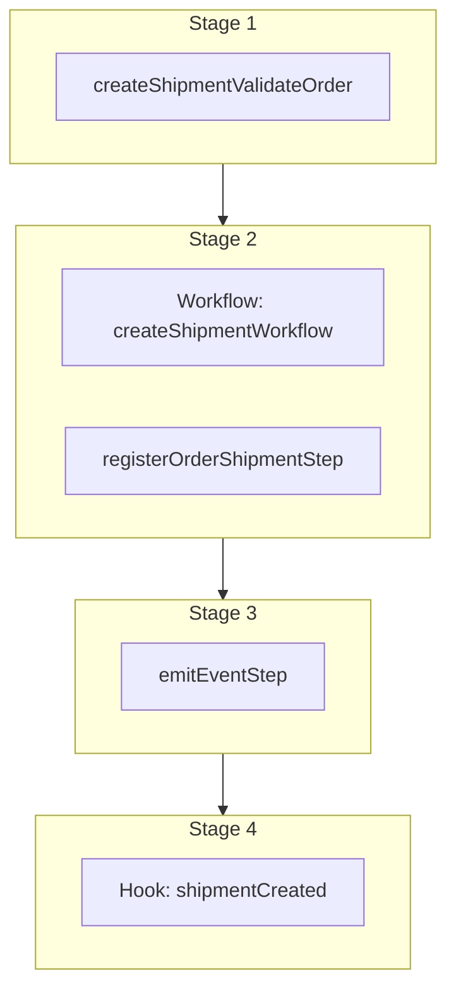

This documentation provides a reference to the `createOrderShipmentWorkflow`. It belongs to the `@medusajs/medusa/core-flows` package.

This workflow creates a shipment for an order. It's used by the [Create Order Shipment Admin API Route](/api/admin/orders/create-shipment).

This workflow has a hook that allows you to perform custom actions on the created shipment. For example, you can pass under `additional_data` custom data that
allows you to create custom data models linked to the shipment.

You can also use this workflow within your customizations or your own custom workflows, allowing you to wrap custom logic around creating a shipment.

[View source code](https://github.com/medusajs/medusa/blob/0ed927bdb7a396a8fd5f6447ed69b7b354b150d3/packages/core/core-flows/src/order/workflows/create-shipment.ts#L202)

## Examples

**API Route**

```ts title="src/api/workflow/route.ts"
import type {
  MedusaRequest,
  MedusaResponse,
} from "@medusajs/framework/http"
import { createOrderShipmentWorkflow } from "@medusajs/medusa/core-flows"

export async function POST(
  req: MedusaRequest,
  res: MedusaResponse
) {
  const { result } = await createOrderShipmentWorkflow(req.scope)
    .run({
      input: {
        order_id: "order_123",
        fulfillment_id: "fulfillment_123",
        items: [{
          id: "orli_123",
          quantity: 1
        }],
        additional_data: {
          oms_id: "123"
        }
      }
    })

  res.send(result)
}
```

**Subscriber**

```ts title="src/subscribers/order-placed.ts"
import {
  type SubscriberConfig,
  type SubscriberArgs,
} from "@medusajs/framework"
import { createOrderShipmentWorkflow } from "@medusajs/medusa/core-flows"

export default async function handleOrderPlaced({
  event: { data },
  container,
}: SubscriberArgs < { id: string } > ) {
  const { result } = await createOrderShipmentWorkflow(container)
    .run({
      input: {
        order_id: "order_123",
        fulfillment_id: "fulfillment_123",
        items: [{
          id: "orli_123",
          quantity: 1
        }],
        additional_data: {
          oms_id: "123"
        }
      }
    })

  console.log(result)
}

export const config: SubscriberConfig = {
  event: "order.placed",
}
```

**Scheduled Job**

```ts title="src/jobs/message-daily.ts"
import { MedusaContainer } from "@medusajs/framework/types"
import { createOrderShipmentWorkflow } from "@medusajs/medusa/core-flows"

export default async function myCustomJob(
  container: MedusaContainer
) {
  const { result } = await createOrderShipmentWorkflow(container)
    .run({
      input: {
        order_id: "order_123",
        fulfillment_id: "fulfillment_123",
        items: [{
          id: "orli_123",
          quantity: 1
        }],
        additional_data: {
          oms_id: "123"
        }
      }
    })

  console.log(result)
}

export const config = {
  name: "run-once-a-day",
  schedule: "0 0 * * *",
}
```

**Another Workflow**

```ts title="src/workflows/my-workflow.ts"
import { createWorkflow } from "@medusajs/framework/workflows-sdk"
import { createOrderShipmentWorkflow } from "@medusajs/medusa/core-flows"

const myWorkflow = createWorkflow(
  "my-workflow",
  () => {
    const result = createOrderShipmentWorkflow
      .runAsStep({
        input: {
          order_id: "order_123",
          fulfillment_id: "fulfillment_123",
          items: [{
            id: "orli_123",
            quantity: 1
          }],
          additional_data: {
            oms_id: "123"
          }
        }
      })
  }
)
```

<a id="createordershipmentworkflow-steps" />

## Steps



Stages follow the order in the workflow definition. Conditional steps run only when their condition is met. The step descriptions below include the conditions and reference links.

- [createShipmentValidateOrder](/resources/references/medusa-workflows/createShipmentValidateOrder): This step validates that a shipment can be created for an order. If the order is cancelled, the items don't exist in the order, or the fulfillment doesn't exist in the order, the step will throw an error. :::note You can retrieve an order's details using [Query](/learn/fundamentals/module-links/query), or [useQueryGraphStep](/resources/references/medusa-workflows/steps/useQueryGraphStep). :::
  - [createShipmentWorkflow](/resources/references/medusa-workflows/createShipmentWorkflow): Create a shipment for a fulfillment.
  - [registerOrderShipmentStep](/resources/references/medusa-workflows/steps/registerOrderShipmentStep): This step registers a shipment for an order.
    - [emitEventStep](/resources/references/medusa-workflows/steps/emitEventStep): This step emits an event, which you can listen to in a [subscriber](/learn/fundamentals/events-and-subscribers). You can pass data to the subscriber by including it in the `data` property. The event is only emitted after the workflow has finished successfully. So, even if it's executed in the middle of the workflow, it won't actually emit the event until the workflow has completed successfully. If the workflow fails, it won't emit the event at all.
      - [shipmentCreated](/resources/references/medusa-workflows/createOrderShipmentWorkflow#shipmentcreated): This hook is executed after the shipment is created. You can consume this hook to perform custom actions on the created shipment.

<a id="createordershipmentworkflow-input" />

## Input

**createOrderShipmentWorkflow**

- `CreateOrderShipmentWorkflowInput`: [CreateOrderShipmentWorkflowInput](/resources/references/core_flows/core_core_flows_src/types/core_flowscore_core_flows_srcCreateOrderShipmentWorkflowInput)
  - `order_id`: `string` — The ID of the order to create a shipment for.
  - `fulfillment_id`: `string` — The ID of the fulfillment to create a shipment for.
  - `created_by`: `string` (optional) — The ID of the user creating the shipment.
  - `items`: [CreateOrderShipmentItem](/resources/references/types/interfaces/typesCreateOrderShipmentItem)\[] — The items to create a shipment for.
    - `id`: `string` — The ID of the order's item to ship.
    - `quantity`: [BigNumberInput](/resources/references/types/types/typesBigNumberInput) — The quantity of the item to ship.
  - `labels`: [CreateFulfillmentLabelWorkflowDTO](/resources/references/types/WorkflowTypes/FulfillmentWorkflow/types/typesWorkflowTypesFulfillmentWorkflowCreateFulfillmentLabelWorkflowDTO)\[] (optional) — The shipment's labels.
    - `tracking_number`: `string` — The tracking number of the fulfillment label.
    - `tracking_url`: `string` — The tracking URL of the fulfillment label.
    - `label_url`: `string` — The URL of the label.
  - `no_notification`: `boolean` (optional) — Whether to notify the customer about the shipment.
  - `metadata`: [MetadataType](/resources/references/types/CommonTypes/types/typesCommonTypesMetadataType) (optional) — Custom key-value pairs related to the shipment.
  - `additional_data`: `Record<string, unknown>` (optional) — Additional data that can be passed through the `additional_data` property in HTTP requests. Learn more in [this documentation](/learn/fundamentals/api-routes/additional-data).

## Hooks

Hooks allow you to inject custom functionalities into the workflow. You'll receive data from the workflow, as well as additional data sent through an HTTP request.

Learn more about [Hooks](/learn/fundamentals/workflows/workflow-hooks) and [Additional Data](/learn/fundamentals/api-routes/additional-data).

### shipmentCreated

This hook is executed after the shipment is created. You can consume this hook to perform custom actions on the created shipment.

#### Example

```ts
import { createOrderShipmentWorkflow } from "@medusajs/medusa/core-flows"

createOrderShipmentWorkflow.hooks.shipmentCreated(
  (async ({ shipment, additional_data }, { container }) => {
    //TODO
  })
)
```

<a id="input" />

#### Input

Handlers consuming this hook accept the following input.

**shipmentCreated**

- `input`: object — The input data for the hook.
  - `shipment`: [WorkflowDataProperties](/resources/references/workflows/types/workflowsWorkflowDataProperties)\<[FulfillmentDTO](/resources/references/fulfillment/interfaces/fulfillmentFulfillmentDTO)>
  - `additional_data`: `Record<string, unknown> | undefined` — Additional data that can be passed through the `additional_data` property in HTTP requests. Learn more in [this documentation](/learn/fundamentals/api-routes/additional-data).

<a id="createordershipmentworkflow-emitted-events" />

## Emitted Events

- `shipment.created`: Emitted when a shipment is created for an order.

  ```ts
  {
    id, // the ID of the fulfillment
    no_notification, // (boolean) whether to notify the customer
  }
  ```
