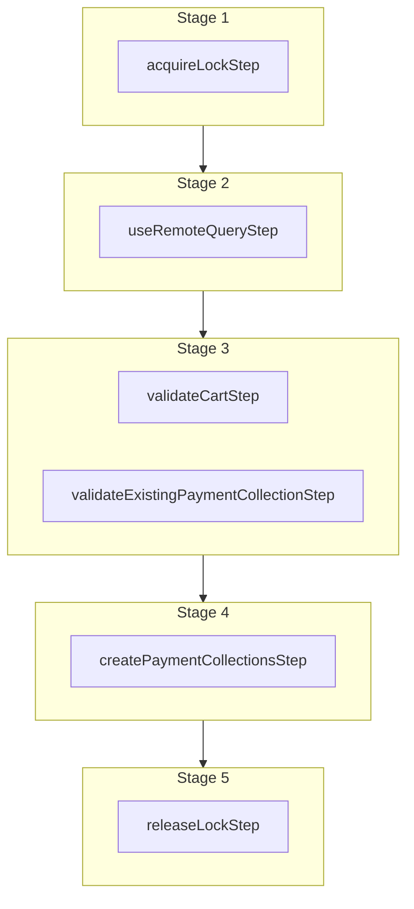

This documentation provides a reference to the `createPaymentCollectionForCartWorkflow`. It belongs to the `@medusajs/medusa/core-flows` package.

This workflow creates a payment collection for a cart. It's executed by the
[Create Payment Collection Store API Route](/api/store/payment-collections/create-payment-collection).

You can use this workflow within your own customizations or custom workflows, allowing you to wrap custom logic around adding creating a payment collection for a cart.

> **Note**
>
> If you use this workflow in another, you must acquire a lock before running it and release the lock after. Learn more in the [Locking Operations in Workflows](/learn/fundamentals/workflows/locks#locks-in-nested-workflows) guide.

[View source code](https://github.com/medusajs/medusa/blob/0ed927bdb7a396a8fd5f6447ed69b7b354b150d3/packages/core/core-flows/src/cart/workflows/create-payment-collection-for-cart.ts#L84)

## Examples

**API Route**

```ts title="src/api/workflow/route.ts"
import type {
  MedusaRequest,
  MedusaResponse,
} from "@medusajs/framework/http"
import { createPaymentCollectionForCartWorkflow } from "@medusajs/medusa/core-flows"

export async function POST(
  req: MedusaRequest,
  res: MedusaResponse
) {
  const { result } = await createPaymentCollectionForCartWorkflow(req.scope)
    .run({
      input: {
        cart_id: "cart_123",
        metadata: {
          sandbox: true
        }
      }
    })

  res.send(result)
}
```

**Subscriber**

```ts title="src/subscribers/order-placed.ts"
import {
  type SubscriberConfig,
  type SubscriberArgs,
} from "@medusajs/framework"
import { createPaymentCollectionForCartWorkflow } from "@medusajs/medusa/core-flows"

export default async function handleOrderPlaced({
  event: { data },
  container,
}: SubscriberArgs < { id: string } > ) {
  const { result } = await createPaymentCollectionForCartWorkflow(container)
    .run({
      input: {
        cart_id: "cart_123",
        metadata: {
          sandbox: true
        }
      }
    })

  console.log(result)
}

export const config: SubscriberConfig = {
  event: "order.placed",
}
```

**Scheduled Job**

```ts title="src/jobs/message-daily.ts"
import { MedusaContainer } from "@medusajs/framework/types"
import { createPaymentCollectionForCartWorkflow } from "@medusajs/medusa/core-flows"

export default async function myCustomJob(
  container: MedusaContainer
) {
  const { result } = await createPaymentCollectionForCartWorkflow(container)
    .run({
      input: {
        cart_id: "cart_123",
        metadata: {
          sandbox: true
        }
      }
    })

  console.log(result)
}

export const config = {
  name: "run-once-a-day",
  schedule: "0 0 * * *",
}
```

**Another Workflow**

```ts title="src/workflows/my-workflow.ts"
import { createWorkflow } from "@medusajs/framework/workflows-sdk"
import { createPaymentCollectionForCartWorkflow } from "@medusajs/medusa/core-flows"

const myWorkflow = createWorkflow(
  "my-workflow",
  () => {
    // Acquire lock from nested workflow here
    // acquireLockStep({  key: input.cart_id,  timeout: 2,  ttl: 10,  })
    const result = createPaymentCollectionForCartWorkflow
      .runAsStep({
        input: {
          cart_id: "cart_123",
          metadata: {
            sandbox: true
          }
        }
      })
    // Release lock here
    // releaseLockStep({ key: input.cart_id })
  }
)
```

<a id="createpaymentcollectionforcartworkflow-steps" />

## Steps



Stages follow the order in the workflow definition. Conditional steps run only when their condition is met. The step descriptions below include the conditions and reference links.

- [acquireLockStep](/resources/references/medusa-workflows/steps/acquireLockStep): This step acquires a lock for a given key. Learn more about locks in the [Locking Module](/resources/infrastructure-modules/locking) guide.
  - [useRemoteQueryStep](/resources/references/medusa-workflows/steps/useRemoteQueryStep): This step fetches data across modules using the remote query. Learn more in the [Remote Query documentation](/learn/fundamentals/module-links/query). :::note This step is deprecated. Use [useQueryGraphStep](/resources/references/medusa-workflows/steps/useQueryGraphStep) instead. :::
    - [validateCartStep](/resources/references/medusa-workflows/steps/validateCartStep): This step validates a cart to ensure it exists and is not completed. If not valid, the step throws an error. :::tip You can use the [retrieveCartStep](/resources/references/medusa-workflows/steps/retrieveCartStep) to retrieve a cart's details. :::
    - [validateExistingPaymentCollectionStep](/resources/references/medusa-workflows/validateExistingPaymentCollectionStep): This step validates that a cart doesn't have a payment collection. If the cart has a payment collection, the step throws an error. :::tip You can use the [retrieveCartStep](/resources/references/medusa-workflows/steps/retrieveCartStep) to retrieve a cart's details. :::
      - [createPaymentCollectionsStep](/resources/references/medusa-workflows/steps/createPaymentCollectionsStep): This step creates payment collections in a cart.
        - [releaseLockStep](/resources/references/medusa-workflows/steps/releaseLockStep): This step releases a lock for a given key. Learn more about locks in the [Locking Module](/resources/infrastructure-modules/locking) guide.

<a id="createpaymentcollectionforcartworkflow-input" />

## Input

**createPaymentCollectionForCartWorkflow**

- `CreatePaymentCollectionForCartWorkflowInputDTO`: [CreatePaymentCollectionForCartWorkflowInputDTO](/resources/references/types/interfaces/typesCreatePaymentCollectionForCartWorkflowInputDTO) — The details to create the payment collection.
  - `cart_id`: `string` — The ID of the cart to create a payment collection for.
  - `metadata`: `Record<string, unknown>` (optional) — Custom key-value pairs to store in the payment collection.

<a id="createpaymentcollectionforcartworkflow-output" />

## Output

**createPaymentCollectionForCartWorkflow**

- `PaymentCollectionDTO`: [PaymentCollectionDTO](/resources/references/payment/interfaces/paymentPaymentCollectionDTO) — The payment collection details.
  - `id`: `string` — The ID of the payment collection.
  - `currency_code`: `string` — The ISO 3 character currency code of the payment sessions and payments associated with payment collection.
  - `amount`: [BigNumberValue](/resources/references/payment/types/paymentBigNumberValue) — The total amount to be authorized and captured.
    - `numeric`: `number`
    - `raw`: [BigNumberRawValue](/resources/references/payment/types/paymentBigNumberRawValue) (optional)
      - `value`: `string` | `number`
    - `bigNumber`: `BigNumber` (optional)
  - `authorized_amount`: [BigNumberValue](/resources/references/payment/types/paymentBigNumberValue) (optional) — The amount authorized within the associated payment sessions.
    - `numeric`: `number`
    - `raw`: [BigNumberRawValue](/resources/references/payment/types/paymentBigNumberRawValue) (optional)
      - `value`: `string` | `number`
    - `bigNumber`: `BigNumber` (optional)
  - `refunded_amount`: [BigNumberValue](/resources/references/payment/types/paymentBigNumberValue) (optional) — The amount refunded within the associated payments.
    - `numeric`: `number`
    - `raw`: [BigNumberRawValue](/resources/references/payment/types/paymentBigNumberRawValue) (optional)
      - `value`: `string` | `number`
    - `bigNumber`: `BigNumber` (optional)
  - `captured_amount`: [BigNumberValue](/resources/references/payment/types/paymentBigNumberValue) (optional) — The amount captured within the associated payments.
    - `numeric`: `number`
    - `raw`: [BigNumberRawValue](/resources/references/payment/types/paymentBigNumberRawValue) (optional)
      - `value`: `string` | `number`
    - `bigNumber`: `BigNumber` (optional)
  - `completed_at`: `string` | `Date` (optional) — When the payment collection was completed.
  - `created_at`: `string` | `Date` (optional) — When the payment collection was created.
  - `updated_at`: `string` | `Date` (optional) — When the payment collection was updated.
  - `metadata`: `Record<string, unknown>` (optional) — Holds custom data in key-value pairs.
  - `status`: [PaymentCollectionStatus](/resources/references/payment/types/paymentPaymentCollectionStatus) — The status of the payment collection.
  - `payment_providers`: [PaymentProviderDTO](/resources/references/payment/interfaces/paymentPaymentProviderDTO)\[] — The payment provider used to process the associated payment sessions and payments.
    - `id`: `string` — The ID of the payment provider.
    - `is_enabled`: `boolean` — Whether the payment provider is enabled.
  - `payment_sessions`: [PaymentSessionDTO](/resources/references/payment/interfaces/paymentPaymentSessionDTO)\[] (optional) — The associated payment sessions.
    - `id`: `string` — The ID of the payment session.
    - `amount`: [BigNumberValue](/resources/references/payment/types/paymentBigNumberValue) — The amount to authorize.
      - `numeric`: `number`
      - `raw`: [BigNumberRawValue](/resources/references/payment/types/paymentBigNumberRawValue) (optional)
      - `bigNumber`: `BigNumber` (optional)
    - `currency_code`: `string` — The 3 character currency code of the payment session.
    - `provider_id`: `string` — The ID of the associated payment provider.
    - `data`: `Record<string, unknown>` — The data necessary for the payment provider to process the payment session.
    - `context`: `Record<string, unknown>` (optional) — The context necessary for the payment provider.
    - `status`: [PaymentSessionStatus](/resources/references/payment/types/paymentPaymentSessionStatus) — The status of the payment session.
    - `authorized_at`: `Date` (optional) — When the payment session was authorized.
    - `created_at`: `string` | `Date` — When the payment session was created
    - `updated_at`: `string` | `Date` — When the payment session was updated
    - `payment_collection_id`: `string` — The ID of the associated payment collection.
    - `payment_collection`: [PaymentCollectionDTO](/resources/references/payment/interfaces/paymentPaymentCollectionDTO) (optional) — The payment collection the session is associated with.
      - `id`: `string` — The ID of the payment collection.
      - `currency_code`: `string` — The ISO 3 character currency code of the payment sessions and payments associated with payment collection.
      - `amount`: [BigNumberValue](/resources/references/payment/types/paymentBigNumberValue) — The total amount to be authorized and captured.
      - `authorized_amount`: [BigNumberValue](/resources/references/payment/types/paymentBigNumberValue) (optional) — The amount authorized within the associated payment sessions.
      - `refunded_amount`: [BigNumberValue](/resources/references/payment/types/paymentBigNumberValue) (optional) — The amount refunded within the associated payments.
      - `captured_amount`: [BigNumberValue](/resources/references/payment/types/paymentBigNumberValue) (optional) — The amount captured within the associated payments.
      - `completed_at`: `string` | `Date` (optional) — When the payment collection was completed.
      - `created_at`: `string` | `Date` (optional) — When the payment collection was created.
      - `updated_at`: `string` | `Date` (optional) — When the payment collection was updated.
      - `metadata`: `Record<string, unknown>` (optional) — Holds custom data in key-value pairs.
      - `status`: [PaymentCollectionStatus](/resources/references/payment/types/paymentPaymentCollectionStatus) — The status of the payment collection.
      - `payment_providers`: [PaymentProviderDTO](/resources/references/payment/interfaces/paymentPaymentProviderDTO)\[] — The payment provider used to process the associated payment sessions and payments.
      - `payment_sessions`: [PaymentSessionDTO](/resources/references/payment/interfaces/paymentPaymentSessionDTO)\[] (optional) — The associated payment sessions.
      - `payments`: [PaymentDTO](/resources/references/payment/interfaces/paymentPaymentDTO)\[] (optional) — The associated payments.
    - `payment`: [PaymentDTO](/resources/references/payment/interfaces/paymentPaymentDTO) (optional) — The payment created from the session.
      - `id`: `string` — The ID of the payment.
      - `amount`: [BigNumberValue](/resources/references/payment/types/paymentBigNumberValue) — The payment's total amount.
      - `raw_amount`: [BigNumberValue](/resources/references/payment/types/paymentBigNumberValue) (optional) — The raw amount of the payment.
      - `authorized_amount`: [BigNumberValue](/resources/references/payment/types/paymentBigNumberValue) (optional) — The authorized amount of the payment.
      - `raw_authorized_amount`: [BigNumberValue](/resources/references/payment/types/paymentBigNumberValue) (optional) — The raw authorized amount of the payment.
      - `currency_code`: `string` — The ISO 3 character currency code of the payment.
      - `provider_id`: `string` — The ID of the associated payment provider.
      - `data`: `Record<string, unknown>` (optional) — The data relevant for the payment provider to process the payment.
      - `created_at`: `string` | `Date` (optional) — When the payment was created.
      - `updated_at`: `string` | `Date` (optional) — When the payment was updated.
      - `captured_at`: `string` | `Date` (optional) — When the payment was captured.
      - `canceled_at`: `string` | `Date` (optional) — When the payment was canceled.
      - `captured_amount`: [BigNumberValue](/resources/references/payment/types/paymentBigNumberValue) (optional) — The sum of the associated captures' amounts.
      - `raw_captured_amount`: [BigNumberValue](/resources/references/payment/types/paymentBigNumberValue) (optional) — The sum of the associated captures' raw amounts.
      - `refunded_amount`: [BigNumberValue](/resources/references/payment/types/paymentBigNumberValue) (optional) — The sum of the associated refunds' amounts.
      - `raw_refunded_amount`: [BigNumberValue](/resources/references/payment/types/paymentBigNumberValue) (optional) — The sum of the associated refunds' raw amounts.
      - `captures`: [CaptureDTO](/resources/references/payment/interfaces/paymentCaptureDTO)\[] (optional) — The associated captures.
      - `refunds`: [RefundDTO](/resources/references/payment/interfaces/paymentRefundDTO)\[] (optional) — The associated refunds.
      - `payment_collection_id`: `string` — The ID of the associated payment collection.
      - `payment_collection`: [PaymentCollectionDTO](/resources/references/payment/interfaces/paymentPaymentCollectionDTO) (optional) — The associated payment collection.
      - `payment_session`: [PaymentSessionDTO](/resources/references/payment/interfaces/paymentPaymentSessionDTO) (optional) — The payment session from which the payment is created.
    - `metadata`: `Record<string, unknown>` (optional) — Holds custom data in key-value pairs.
  - `payments`: [PaymentDTO](/resources/references/payment/interfaces/paymentPaymentDTO)\[] (optional) — The associated payments.
    - `id`: `string` — The ID of the payment.
    - `amount`: [BigNumberValue](/resources/references/payment/types/paymentBigNumberValue) — The payment's total amount.
      - `numeric`: `number`
      - `raw`: [BigNumberRawValue](/resources/references/payment/types/paymentBigNumberRawValue) (optional)
      - `bigNumber`: `BigNumber` (optional)
    - `raw_amount`: [BigNumberValue](/resources/references/payment/types/paymentBigNumberValue) (optional) — The raw amount of the payment.
      - `numeric`: `number`
      - `raw`: [BigNumberRawValue](/resources/references/payment/types/paymentBigNumberRawValue) (optional)
      - `bigNumber`: `BigNumber` (optional)
    - `authorized_amount`: [BigNumberValue](/resources/references/payment/types/paymentBigNumberValue) (optional) — The authorized amount of the payment.
      - `numeric`: `number`
      - `raw`: [BigNumberRawValue](/resources/references/payment/types/paymentBigNumberRawValue) (optional)
      - `bigNumber`: `BigNumber` (optional)
    - `raw_authorized_amount`: [BigNumberValue](/resources/references/payment/types/paymentBigNumberValue) (optional) — The raw authorized amount of the payment.
      - `numeric`: `number`
      - `raw`: [BigNumberRawValue](/resources/references/payment/types/paymentBigNumberRawValue) (optional)
      - `bigNumber`: `BigNumber` (optional)
    - `currency_code`: `string` — The ISO 3 character currency code of the payment.
    - `provider_id`: `string` — The ID of the associated payment provider.
    - `data`: `Record<string, unknown>` (optional) — The data relevant for the payment provider to process the payment.
    - `created_at`: `string` | `Date` (optional) — When the payment was created.
    - `updated_at`: `string` | `Date` (optional) — When the payment was updated.
    - `captured_at`: `string` | `Date` (optional) — When the payment was captured.
    - `canceled_at`: `string` | `Date` (optional) — When the payment was canceled.
    - `captured_amount`: [BigNumberValue](/resources/references/payment/types/paymentBigNumberValue) (optional) — The sum of the associated captures' amounts.
      - `numeric`: `number`
      - `raw`: [BigNumberRawValue](/resources/references/payment/types/paymentBigNumberRawValue) (optional)
      - `bigNumber`: `BigNumber` (optional)
    - `raw_captured_amount`: [BigNumberValue](/resources/references/payment/types/paymentBigNumberValue) (optional) — The sum of the associated captures' raw amounts.
      - `numeric`: `number`
      - `raw`: [BigNumberRawValue](/resources/references/payment/types/paymentBigNumberRawValue) (optional)
      - `bigNumber`: `BigNumber` (optional)
    - `refunded_amount`: [BigNumberValue](/resources/references/payment/types/paymentBigNumberValue) (optional) — The sum of the associated refunds' amounts.
      - `numeric`: `number`
      - `raw`: [BigNumberRawValue](/resources/references/payment/types/paymentBigNumberRawValue) (optional)
      - `bigNumber`: `BigNumber` (optional)
    - `raw_refunded_amount`: [BigNumberValue](/resources/references/payment/types/paymentBigNumberValue) (optional) — The sum of the associated refunds' raw amounts.
      - `numeric`: `number`
      - `raw`: [BigNumberRawValue](/resources/references/payment/types/paymentBigNumberRawValue) (optional)
      - `bigNumber`: `BigNumber` (optional)
    - `captures`: [CaptureDTO](/resources/references/payment/interfaces/paymentCaptureDTO)\[] (optional) — The associated captures.
      - `id`: `string` — The ID of the capture.
      - `amount`: [BigNumberValue](/resources/references/payment/types/paymentBigNumberValue) — The captured amount.
      - `raw_amount`: [BigNumberValue](/resources/references/payment/types/paymentBigNumberValue) (optional) — The raw captured amount.
      - `created_at`: `Date` — The creation date of the capture.
      - `created_by`: `string` (optional) — Who the capture was created by. For example, the ID of a user.
      - `payment`: [PaymentDTO](/resources/references/payment/interfaces/paymentPaymentDTO) — The associated payment.
    - `refunds`: [RefundDTO](/resources/references/payment/interfaces/paymentRefundDTO)\[] (optional) — The associated refunds.
      - `id`: `string` — The ID of the refund
      - `amount`: [BigNumberValue](/resources/references/payment/types/paymentBigNumberValue) — The refunded amount.
      - `raw_amount`: [BigNumberValue](/resources/references/payment/types/paymentBigNumberValue) (optional) — The raw refunded amount.
      - `refund_reason_id`: `null` | `string` (optional) — The id of the refund\_reason that is associated with the refund
      - `refund_reason`: `null` | [RefundReasonDTO](/resources/references/payment/interfaces/paymentRefundReasonDTO) (optional) — The id of the refund\_reason that is associated with the refund
      - `note`: `null` | `string` (optional) — A field to add some additional information about the refund
      - `created_at`: `Date` — The creation date of the refund.
      - `created_by`: `string` (optional) — Who created the refund. For example, the user's ID.
      - `payment`: [PaymentDTO](/resources/references/payment/interfaces/paymentPaymentDTO) — The associated payment.
    - `payment_collection_id`: `string` — The ID of the associated payment collection.
    - `payment_collection`: [PaymentCollectionDTO](/resources/references/payment/interfaces/paymentPaymentCollectionDTO) (optional) — The associated payment collection.
      - `id`: `string` — The ID of the payment collection.
      - `currency_code`: `string` — The ISO 3 character currency code of the payment sessions and payments associated with payment collection.
      - `amount`: [BigNumberValue](/resources/references/payment/types/paymentBigNumberValue) — The total amount to be authorized and captured.
      - `authorized_amount`: [BigNumberValue](/resources/references/payment/types/paymentBigNumberValue) (optional) — The amount authorized within the associated payment sessions.
      - `refunded_amount`: [BigNumberValue](/resources/references/payment/types/paymentBigNumberValue) (optional) — The amount refunded within the associated payments.
      - `captured_amount`: [BigNumberValue](/resources/references/payment/types/paymentBigNumberValue) (optional) — The amount captured within the associated payments.
      - `completed_at`: `string` | `Date` (optional) — When the payment collection was completed.
      - `created_at`: `string` | `Date` (optional) — When the payment collection was created.
      - `updated_at`: `string` | `Date` (optional) — When the payment collection was updated.
      - `metadata`: `Record<string, unknown>` (optional) — Holds custom data in key-value pairs.
      - `status`: [PaymentCollectionStatus](/resources/references/payment/types/paymentPaymentCollectionStatus) — The status of the payment collection.
      - `payment_providers`: [PaymentProviderDTO](/resources/references/payment/interfaces/paymentPaymentProviderDTO)\[] — The payment provider used to process the associated payment sessions and payments.
      - `payment_sessions`: [PaymentSessionDTO](/resources/references/payment/interfaces/paymentPaymentSessionDTO)\[] (optional) — The associated payment sessions.
      - `payments`: [PaymentDTO](/resources/references/payment/interfaces/paymentPaymentDTO)\[] (optional) — The associated payments.
    - `payment_session`: [PaymentSessionDTO](/resources/references/payment/interfaces/paymentPaymentSessionDTO) (optional) — The payment session from which the payment is created.
      - `id`: `string` — The ID of the payment session.
      - `amount`: [BigNumberValue](/resources/references/payment/types/paymentBigNumberValue) — The amount to authorize.
      - `currency_code`: `string` — The 3 character currency code of the payment session.
      - `provider_id`: `string` — The ID of the associated payment provider.
      - `data`: `Record<string, unknown>` — The data necessary for the payment provider to process the payment session.
      - `context`: `Record<string, unknown>` (optional) — The context necessary for the payment provider.
      - `status`: [PaymentSessionStatus](/resources/references/payment/types/paymentPaymentSessionStatus) — The status of the payment session.
      - `authorized_at`: `Date` (optional) — When the payment session was authorized.
      - `created_at`: `string` | `Date` — When the payment session was created
      - `updated_at`: `string` | `Date` — When the payment session was updated
      - `payment_collection_id`: `string` — The ID of the associated payment collection.
      - `payment_collection`: [PaymentCollectionDTO](/resources/references/payment/interfaces/paymentPaymentCollectionDTO) (optional) — The payment collection the session is associated with.
      - `payment`: [PaymentDTO](/resources/references/payment/interfaces/paymentPaymentDTO) (optional) — The payment created from the session.
      - `metadata`: `Record<string, unknown>` (optional) — Holds custom data in key-value pairs.
