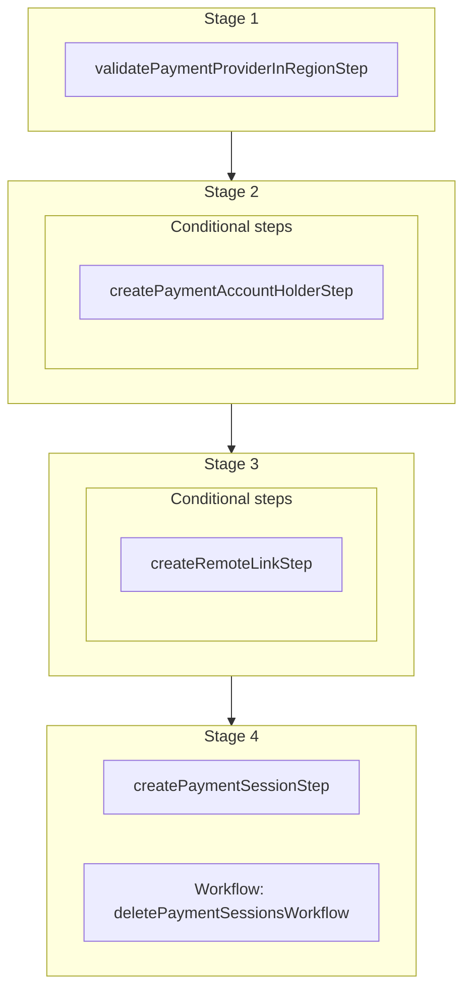

This documentation provides a reference to the `createPaymentSessionsWorkflow`. It belongs to the `@medusajs/medusa/core-flows` package.

This workflow creates payment sessions. It's used by the
[Initialize Payment Session Store API Route](/api/store/payment-collections/initialize-payment-session).

You can use this workflow within your own customizations or custom workflows, allowing you
to create payment sessions in your custom flows.

[View source code](https://github.com/medusajs/medusa/blob/0ed927bdb7a396a8fd5f6447ed69b7b354b150d3/packages/core/core-flows/src/payment-collection/workflows/create-payment-session.ts#L74)

## Examples

**API Route**

```ts title="src/api/workflow/route.ts"
import type {
  MedusaRequest,
  MedusaResponse,
} from "@medusajs/framework/http"
import { createPaymentSessionsWorkflow } from "@medusajs/medusa/core-flows"

export async function POST(
  req: MedusaRequest,
  res: MedusaResponse
) {
  const { result } = await createPaymentSessionsWorkflow(req.scope)
    .run({
      input: {
        payment_collection_id: "paycol_123",
        provider_id: "pp_system"
      }
    })

  res.send(result)
}
```

**Subscriber**

```ts title="src/subscribers/order-placed.ts"
import {
  type SubscriberConfig,
  type SubscriberArgs,
} from "@medusajs/framework"
import { createPaymentSessionsWorkflow } from "@medusajs/medusa/core-flows"

export default async function handleOrderPlaced({
  event: { data },
  container,
}: SubscriberArgs < { id: string } > ) {
  const { result } = await createPaymentSessionsWorkflow(container)
    .run({
      input: {
        payment_collection_id: "paycol_123",
        provider_id: "pp_system"
      }
    })

  console.log(result)
}

export const config: SubscriberConfig = {
  event: "order.placed",
}
```

**Scheduled Job**

```ts title="src/jobs/message-daily.ts"
import { MedusaContainer } from "@medusajs/framework/types"
import { createPaymentSessionsWorkflow } from "@medusajs/medusa/core-flows"

export default async function myCustomJob(
  container: MedusaContainer
) {
  const { result } = await createPaymentSessionsWorkflow(container)
    .run({
      input: {
        payment_collection_id: "paycol_123",
        provider_id: "pp_system"
      }
    })

  console.log(result)
}

export const config = {
  name: "run-once-a-day",
  schedule: "0 0 * * *",
}
```

**Another Workflow**

```ts title="src/workflows/my-workflow.ts"
import { createWorkflow } from "@medusajs/framework/workflows-sdk"
import { createPaymentSessionsWorkflow } from "@medusajs/medusa/core-flows"

const myWorkflow = createWorkflow(
  "my-workflow",
  () => {
    const result = createPaymentSessionsWorkflow
      .runAsStep({
        input: {
          payment_collection_id: "paycol_123",
          provider_id: "pp_system"
        }
      })
  }
)
```

<a id="createpaymentsessionsworkflow-steps" />

## Steps



Stages follow the order in the workflow definition. Conditional steps run only when their condition is met. The step descriptions below include the conditions and reference links.

- [validatePaymentProviderInRegionStep](/resources/references/medusa-workflows/steps/validatePaymentProviderInRegionStep): This step validates that a payment provider can be used for a payment collection. If the payment collection belongs to an active (not yet completed) cart, the payment provider must be enabled in the cart's region. If not, the step throws an error. Payment collections that aren't linked to an active cart, such as those of an order, aren't affected by this validation.
  - **when** (when: \{
    return !!data.input.customer\_id
    })
  - [createPaymentAccountHolderStep](/resources/references/medusa-workflows/steps/createPaymentAccountHolderStep): This step creates the account holder in the payment provider.
    - **when** (when: \{
      return !isPresent(existingAccountHolder) && isPresent(accountHolder)
      })
    - [createRemoteLinkStep](/resources/references/medusa-workflows/steps/createRemoteLinkStep): This step creates links between two records of linked data models. Learn more in the [Link documentation.](/learn/fundamentals/module-links/link#create-link).
      - [createPaymentSessionStep](/resources/references/medusa-workflows/steps/createPaymentSessionStep): This step creates a payment session.
      - [deletePaymentSessionsWorkflow](/resources/references/medusa-workflows/deletePaymentSessionsWorkflow): Delete payment sessions.

<a id="createpaymentsessionsworkflow-input" />

## Input

**createPaymentSessionsWorkflow**

- `CreatePaymentSessionsWorkflowInput`: [CreatePaymentSessionsWorkflowInput](/resources/references/core_flows/core_core_flows_src/interfaces/core_flowscore_core_flows_srcCreatePaymentSessionsWorkflowInput)
  - `payment_collection_id`: `string` — The ID of the payment collection to create payment sessions for.
  - `provider_id`: `string` — The ID of the payment provider that the payment sessions are associated with. This provider is used to later process the payment sessions and their payments.
  - `customer_id`: `string` (optional) — The ID of the customer that the payment session should be associated with.
  - `data`: `Record<string, unknown>` (optional) — Custom data relevant for the payment provider to process the payment session. Learn more in [this documentation](/resources/commerce-modules/payment/payment-session#data-property).
  - `context`: `Record<string, unknown>` (optional) — Additional context that's useful for the payment provider to process the payment session. Currently all of the context is calculated within the workflow.

<a id="createpaymentsessionsworkflow-output" />

## Output

**createPaymentSessionsWorkflow**

- `PaymentSessionDTO`: [PaymentSessionDTO](/resources/references/payment/interfaces/paymentPaymentSessionDTO) — The payment session details.
  - `id`: `string` — The ID of the payment session.
  - `amount`: [BigNumberValue](/resources/references/payment/types/paymentBigNumberValue) — The amount to authorize.
    - `numeric`: `number`
    - `raw`: [BigNumberRawValue](/resources/references/payment/types/paymentBigNumberRawValue) (optional)
      - `value`: `string` | `number`
    - `bigNumber`: `BigNumber` (optional)
  - `currency_code`: `string` — The 3 character currency code of the payment session.
  - `provider_id`: `string` — The ID of the associated payment provider.
  - `data`: `Record<string, unknown>` — The data necessary for the payment provider to process the payment session.
  - `context`: `Record<string, unknown>` (optional) — The context necessary for the payment provider.
  - `status`: [PaymentSessionStatus](/resources/references/payment/types/paymentPaymentSessionStatus) — The status of the payment session.
  - `authorized_at`: `Date` (optional) — When the payment session was authorized.
  - `created_at`: `string` | `Date` — When the payment session was created
  - `updated_at`: `string` | `Date` — When the payment session was updated
  - `payment_collection_id`: `string` — The ID of the associated payment collection.
  - `payment_collection`: [PaymentCollectionDTO](/resources/references/payment/interfaces/paymentPaymentCollectionDTO) (optional) — The payment collection the session is associated with.
    - `id`: `string` — The ID of the payment collection.
    - `currency_code`: `string` — The ISO 3 character currency code of the payment sessions and payments associated with payment collection.
    - `amount`: [BigNumberValue](/resources/references/payment/types/paymentBigNumberValue) — The total amount to be authorized and captured.
      - `numeric`: `number`
      - `raw`: [BigNumberRawValue](/resources/references/payment/types/paymentBigNumberRawValue) (optional)
      - `bigNumber`: `BigNumber` (optional)
    - `authorized_amount`: [BigNumberValue](/resources/references/payment/types/paymentBigNumberValue) (optional) — The amount authorized within the associated payment sessions.
      - `numeric`: `number`
      - `raw`: [BigNumberRawValue](/resources/references/payment/types/paymentBigNumberRawValue) (optional)
      - `bigNumber`: `BigNumber` (optional)
    - `refunded_amount`: [BigNumberValue](/resources/references/payment/types/paymentBigNumberValue) (optional) — The amount refunded within the associated payments.
      - `numeric`: `number`
      - `raw`: [BigNumberRawValue](/resources/references/payment/types/paymentBigNumberRawValue) (optional)
      - `bigNumber`: `BigNumber` (optional)
    - `captured_amount`: [BigNumberValue](/resources/references/payment/types/paymentBigNumberValue) (optional) — The amount captured within the associated payments.
      - `numeric`: `number`
      - `raw`: [BigNumberRawValue](/resources/references/payment/types/paymentBigNumberRawValue) (optional)
      - `bigNumber`: `BigNumber` (optional)
    - `completed_at`: `string` | `Date` (optional) — When the payment collection was completed.
    - `created_at`: `string` | `Date` (optional) — When the payment collection was created.
    - `updated_at`: `string` | `Date` (optional) — When the payment collection was updated.
    - `metadata`: `Record<string, unknown>` (optional) — Holds custom data in key-value pairs.
    - `status`: [PaymentCollectionStatus](/resources/references/payment/types/paymentPaymentCollectionStatus) — The status of the payment collection.
    - `payment_providers`: [PaymentProviderDTO](/resources/references/payment/interfaces/paymentPaymentProviderDTO)\[] — The payment provider used to process the associated payment sessions and payments.
      - `id`: `string` — The ID of the payment provider.
      - `is_enabled`: `boolean` — Whether the payment provider is enabled.
    - `payment_sessions`: [PaymentSessionDTO](/resources/references/payment/interfaces/paymentPaymentSessionDTO)\[] (optional) — The associated payment sessions.
      - `id`: `string` — The ID of the payment session.
      - `amount`: [BigNumberValue](/resources/references/payment/types/paymentBigNumberValue) — The amount to authorize.
      - `currency_code`: `string` — The 3 character currency code of the payment session.
      - `provider_id`: `string` — The ID of the associated payment provider.
      - `data`: `Record<string, unknown>` — The data necessary for the payment provider to process the payment session.
      - `context`: `Record<string, unknown>` (optional) — The context necessary for the payment provider.
      - `status`: [PaymentSessionStatus](/resources/references/payment/types/paymentPaymentSessionStatus) — The status of the payment session.
      - `authorized_at`: `Date` (optional) — When the payment session was authorized.
      - `created_at`: `string` | `Date` — When the payment session was created
      - `updated_at`: `string` | `Date` — When the payment session was updated
      - `payment_collection_id`: `string` — The ID of the associated payment collection.
      - `payment_collection`: [PaymentCollectionDTO](/resources/references/payment/interfaces/paymentPaymentCollectionDTO) (optional) — The payment collection the session is associated with.
      - `payment`: [PaymentDTO](/resources/references/payment/interfaces/paymentPaymentDTO) (optional) — The payment created from the session.
      - `metadata`: `Record<string, unknown>` (optional) — Holds custom data in key-value pairs.
    - `payments`: [PaymentDTO](/resources/references/payment/interfaces/paymentPaymentDTO)\[] (optional) — The associated payments.
      - `id`: `string` — The ID of the payment.
      - `amount`: [BigNumberValue](/resources/references/payment/types/paymentBigNumberValue) — The payment's total amount.
      - `raw_amount`: [BigNumberValue](/resources/references/payment/types/paymentBigNumberValue) (optional) — The raw amount of the payment.
      - `authorized_amount`: [BigNumberValue](/resources/references/payment/types/paymentBigNumberValue) (optional) — The authorized amount of the payment.
      - `raw_authorized_amount`: [BigNumberValue](/resources/references/payment/types/paymentBigNumberValue) (optional) — The raw authorized amount of the payment.
      - `currency_code`: `string` — The ISO 3 character currency code of the payment.
      - `provider_id`: `string` — The ID of the associated payment provider.
      - `data`: `Record<string, unknown>` (optional) — The data relevant for the payment provider to process the payment.
      - `created_at`: `string` | `Date` (optional) — When the payment was created.
      - `updated_at`: `string` | `Date` (optional) — When the payment was updated.
      - `captured_at`: `string` | `Date` (optional) — When the payment was captured.
      - `canceled_at`: `string` | `Date` (optional) — When the payment was canceled.
      - `captured_amount`: [BigNumberValue](/resources/references/payment/types/paymentBigNumberValue) (optional) — The sum of the associated captures' amounts.
      - `raw_captured_amount`: [BigNumberValue](/resources/references/payment/types/paymentBigNumberValue) (optional) — The sum of the associated captures' raw amounts.
      - `refunded_amount`: [BigNumberValue](/resources/references/payment/types/paymentBigNumberValue) (optional) — The sum of the associated refunds' amounts.
      - `raw_refunded_amount`: [BigNumberValue](/resources/references/payment/types/paymentBigNumberValue) (optional) — The sum of the associated refunds' raw amounts.
      - `captures`: [CaptureDTO](/resources/references/payment/interfaces/paymentCaptureDTO)\[] (optional) — The associated captures.
      - `refunds`: [RefundDTO](/resources/references/payment/interfaces/paymentRefundDTO)\[] (optional) — The associated refunds.
      - `payment_collection_id`: `string` — The ID of the associated payment collection.
      - `payment_collection`: [PaymentCollectionDTO](/resources/references/payment/interfaces/paymentPaymentCollectionDTO) (optional) — The associated payment collection.
      - `payment_session`: [PaymentSessionDTO](/resources/references/payment/interfaces/paymentPaymentSessionDTO) (optional) — The payment session from which the payment is created.
  - `payment`: [PaymentDTO](/resources/references/payment/interfaces/paymentPaymentDTO) (optional) — The payment created from the session.
    - `id`: `string` — The ID of the payment.
    - `amount`: [BigNumberValue](/resources/references/payment/types/paymentBigNumberValue) — The payment's total amount.
      - `numeric`: `number`
      - `raw`: [BigNumberRawValue](/resources/references/payment/types/paymentBigNumberRawValue) (optional)
      - `bigNumber`: `BigNumber` (optional)
    - `raw_amount`: [BigNumberValue](/resources/references/payment/types/paymentBigNumberValue) (optional) — The raw amount of the payment.
      - `numeric`: `number`
      - `raw`: [BigNumberRawValue](/resources/references/payment/types/paymentBigNumberRawValue) (optional)
      - `bigNumber`: `BigNumber` (optional)
    - `authorized_amount`: [BigNumberValue](/resources/references/payment/types/paymentBigNumberValue) (optional) — The authorized amount of the payment.
      - `numeric`: `number`
      - `raw`: [BigNumberRawValue](/resources/references/payment/types/paymentBigNumberRawValue) (optional)
      - `bigNumber`: `BigNumber` (optional)
    - `raw_authorized_amount`: [BigNumberValue](/resources/references/payment/types/paymentBigNumberValue) (optional) — The raw authorized amount of the payment.
      - `numeric`: `number`
      - `raw`: [BigNumberRawValue](/resources/references/payment/types/paymentBigNumberRawValue) (optional)
      - `bigNumber`: `BigNumber` (optional)
    - `currency_code`: `string` — The ISO 3 character currency code of the payment.
    - `provider_id`: `string` — The ID of the associated payment provider.
    - `data`: `Record<string, unknown>` (optional) — The data relevant for the payment provider to process the payment.
    - `created_at`: `string` | `Date` (optional) — When the payment was created.
    - `updated_at`: `string` | `Date` (optional) — When the payment was updated.
    - `captured_at`: `string` | `Date` (optional) — When the payment was captured.
    - `canceled_at`: `string` | `Date` (optional) — When the payment was canceled.
    - `captured_amount`: [BigNumberValue](/resources/references/payment/types/paymentBigNumberValue) (optional) — The sum of the associated captures' amounts.
      - `numeric`: `number`
      - `raw`: [BigNumberRawValue](/resources/references/payment/types/paymentBigNumberRawValue) (optional)
      - `bigNumber`: `BigNumber` (optional)
    - `raw_captured_amount`: [BigNumberValue](/resources/references/payment/types/paymentBigNumberValue) (optional) — The sum of the associated captures' raw amounts.
      - `numeric`: `number`
      - `raw`: [BigNumberRawValue](/resources/references/payment/types/paymentBigNumberRawValue) (optional)
      - `bigNumber`: `BigNumber` (optional)
    - `refunded_amount`: [BigNumberValue](/resources/references/payment/types/paymentBigNumberValue) (optional) — The sum of the associated refunds' amounts.
      - `numeric`: `number`
      - `raw`: [BigNumberRawValue](/resources/references/payment/types/paymentBigNumberRawValue) (optional)
      - `bigNumber`: `BigNumber` (optional)
    - `raw_refunded_amount`: [BigNumberValue](/resources/references/payment/types/paymentBigNumberValue) (optional) — The sum of the associated refunds' raw amounts.
      - `numeric`: `number`
      - `raw`: [BigNumberRawValue](/resources/references/payment/types/paymentBigNumberRawValue) (optional)
      - `bigNumber`: `BigNumber` (optional)
    - `captures`: [CaptureDTO](/resources/references/payment/interfaces/paymentCaptureDTO)\[] (optional) — The associated captures.
      - `id`: `string` — The ID of the capture.
      - `amount`: [BigNumberValue](/resources/references/payment/types/paymentBigNumberValue) — The captured amount.
      - `raw_amount`: [BigNumberValue](/resources/references/payment/types/paymentBigNumberValue) (optional) — The raw captured amount.
      - `created_at`: `Date` — The creation date of the capture.
      - `created_by`: `string` (optional) — Who the capture was created by. For example, the ID of a user.
      - `payment`: [PaymentDTO](/resources/references/payment/interfaces/paymentPaymentDTO) — The associated payment.
    - `refunds`: [RefundDTO](/resources/references/payment/interfaces/paymentRefundDTO)\[] (optional) — The associated refunds.
      - `id`: `string` — The ID of the refund
      - `amount`: [BigNumberValue](/resources/references/payment/types/paymentBigNumberValue) — The refunded amount.
      - `raw_amount`: [BigNumberValue](/resources/references/payment/types/paymentBigNumberValue) (optional) — The raw refunded amount.
      - `refund_reason_id`: `null` | `string` (optional) — The id of the refund\_reason that is associated with the refund
      - `refund_reason`: `null` | [RefundReasonDTO](/resources/references/payment/interfaces/paymentRefundReasonDTO) (optional) — The id of the refund\_reason that is associated with the refund
      - `note`: `null` | `string` (optional) — A field to add some additional information about the refund
      - `created_at`: `Date` — The creation date of the refund.
      - `created_by`: `string` (optional) — Who created the refund. For example, the user's ID.
      - `payment`: [PaymentDTO](/resources/references/payment/interfaces/paymentPaymentDTO) — The associated payment.
    - `payment_collection_id`: `string` — The ID of the associated payment collection.
    - `payment_collection`: [PaymentCollectionDTO](/resources/references/payment/interfaces/paymentPaymentCollectionDTO) (optional) — The associated payment collection.
      - `id`: `string` — The ID of the payment collection.
      - `currency_code`: `string` — The ISO 3 character currency code of the payment sessions and payments associated with payment collection.
      - `amount`: [BigNumberValue](/resources/references/payment/types/paymentBigNumberValue) — The total amount to be authorized and captured.
      - `authorized_amount`: [BigNumberValue](/resources/references/payment/types/paymentBigNumberValue) (optional) — The amount authorized within the associated payment sessions.
      - `refunded_amount`: [BigNumberValue](/resources/references/payment/types/paymentBigNumberValue) (optional) — The amount refunded within the associated payments.
      - `captured_amount`: [BigNumberValue](/resources/references/payment/types/paymentBigNumberValue) (optional) — The amount captured within the associated payments.
      - `completed_at`: `string` | `Date` (optional) — When the payment collection was completed.
      - `created_at`: `string` | `Date` (optional) — When the payment collection was created.
      - `updated_at`: `string` | `Date` (optional) — When the payment collection was updated.
      - `metadata`: `Record<string, unknown>` (optional) — Holds custom data in key-value pairs.
      - `status`: [PaymentCollectionStatus](/resources/references/payment/types/paymentPaymentCollectionStatus) — The status of the payment collection.
      - `payment_providers`: [PaymentProviderDTO](/resources/references/payment/interfaces/paymentPaymentProviderDTO)\[] — The payment provider used to process the associated payment sessions and payments.
      - `payment_sessions`: [PaymentSessionDTO](/resources/references/payment/interfaces/paymentPaymentSessionDTO)\[] (optional) — The associated payment sessions.
      - `payments`: [PaymentDTO](/resources/references/payment/interfaces/paymentPaymentDTO)\[] (optional) — The associated payments.
    - `payment_session`: [PaymentSessionDTO](/resources/references/payment/interfaces/paymentPaymentSessionDTO) (optional) — The payment session from which the payment is created.
      - `id`: `string` — The ID of the payment session.
      - `amount`: [BigNumberValue](/resources/references/payment/types/paymentBigNumberValue) — The amount to authorize.
      - `currency_code`: `string` — The 3 character currency code of the payment session.
      - `provider_id`: `string` — The ID of the associated payment provider.
      - `data`: `Record<string, unknown>` — The data necessary for the payment provider to process the payment session.
      - `context`: `Record<string, unknown>` (optional) — The context necessary for the payment provider.
      - `status`: [PaymentSessionStatus](/resources/references/payment/types/paymentPaymentSessionStatus) — The status of the payment session.
      - `authorized_at`: `Date` (optional) — When the payment session was authorized.
      - `created_at`: `string` | `Date` — When the payment session was created
      - `updated_at`: `string` | `Date` — When the payment session was updated
      - `payment_collection_id`: `string` — The ID of the associated payment collection.
      - `payment_collection`: [PaymentCollectionDTO](/resources/references/payment/interfaces/paymentPaymentCollectionDTO) (optional) — The payment collection the session is associated with.
      - `payment`: [PaymentDTO](/resources/references/payment/interfaces/paymentPaymentDTO) (optional) — The payment created from the session.
      - `metadata`: `Record<string, unknown>` (optional) — Holds custom data in key-value pairs.
  - `metadata`: `Record<string, unknown>` (optional) — Holds custom data in key-value pairs.
