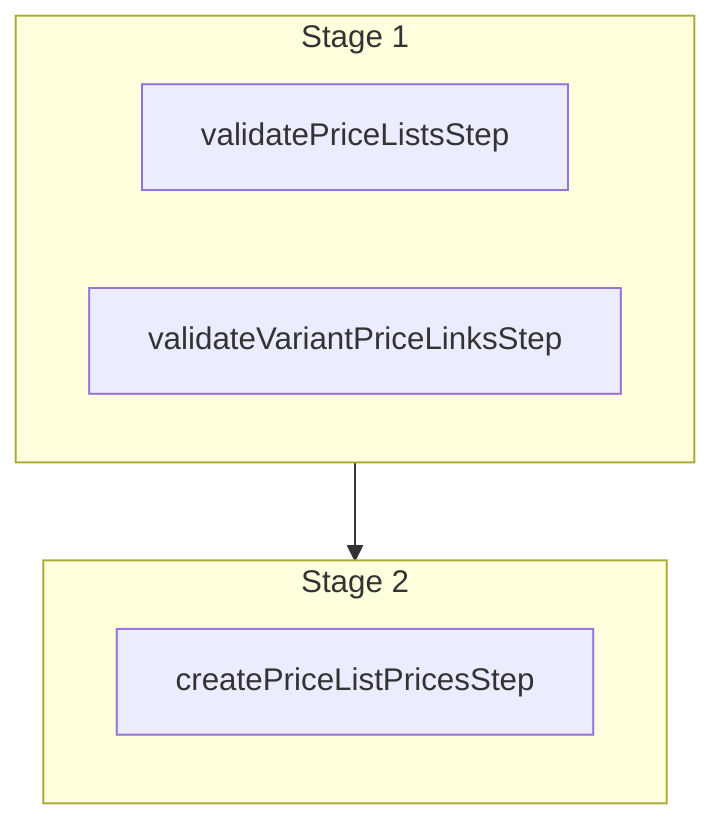

This documentation provides a reference to the `createPriceListPricesWorkflow`. It belongs to the `@medusajs/medusa/core-flows` package.

This workflow creates prices in price lists. It's used by other workflows, such as
[batchPriceListPricesWorkflow](/resources/references/medusa-workflows/batchPriceListPricesWorkflow).

You can use this workflow within your customizations or your own custom workflows, allowing you to
create prices in price lists in your custom flows.

[View source code](https://github.com/medusajs/medusa/blob/0ed927bdb7a396a8fd5f6447ed69b7b354b150d3/packages/core/core-flows/src/price-list/workflows/create-price-list-prices.ts#L59)

## Examples

**API Route**

```ts title="src/api/workflow/route.ts"
import type {
  MedusaRequest,
  MedusaResponse,
} from "@medusajs/framework/http"
import { createPriceListPricesWorkflow } from "@medusajs/medusa/core-flows"

export async function POST(
  req: MedusaRequest,
  res: MedusaResponse
) {
  const { result } = await createPriceListPricesWorkflow(req.scope)
    .run({
      input: {
        data: [{
          id: "plist_123",
          prices: [{
            amount: 10,
            currency_code: "usd",
            variant_id: "variant_123"
          }],
        }]
      }
    })

  res.send(result)
}
```

**Subscriber**

```ts title="src/subscribers/order-placed.ts"
import {
  type SubscriberConfig,
  type SubscriberArgs,
} from "@medusajs/framework"
import { createPriceListPricesWorkflow } from "@medusajs/medusa/core-flows"

export default async function handleOrderPlaced({
  event: { data },
  container,
}: SubscriberArgs < { id: string } > ) {
  const { result } = await createPriceListPricesWorkflow(container)
    .run({
      input: {
        data: [{
          id: "plist_123",
          prices: [{
            amount: 10,
            currency_code: "usd",
            variant_id: "variant_123"
          }],
        }]
      }
    })

  console.log(result)
}

export const config: SubscriberConfig = {
  event: "order.placed",
}
```

**Scheduled Job**

```ts title="src/jobs/message-daily.ts"
import { MedusaContainer } from "@medusajs/framework/types"
import { createPriceListPricesWorkflow } from "@medusajs/medusa/core-flows"

export default async function myCustomJob(
  container: MedusaContainer
) {
  const { result } = await createPriceListPricesWorkflow(container)
    .run({
      input: {
        data: [{
          id: "plist_123",
          prices: [{
            amount: 10,
            currency_code: "usd",
            variant_id: "variant_123"
          }],
        }]
      }
    })

  console.log(result)
}

export const config = {
  name: "run-once-a-day",
  schedule: "0 0 * * *",
}
```

**Another Workflow**

```ts title="src/workflows/my-workflow.ts"
import { createWorkflow } from "@medusajs/framework/workflows-sdk"
import { createPriceListPricesWorkflow } from "@medusajs/medusa/core-flows"

const myWorkflow = createWorkflow(
  "my-workflow",
  () => {
    const result = createPriceListPricesWorkflow
      .runAsStep({
        input: {
          data: [{
            id: "plist_123",
            prices: [{
              amount: 10,
              currency_code: "usd",
              variant_id: "variant_123"
            }],
          }]
        }
      })
  }
)
```

<a id="createpricelistpricesworkflow-steps" />

## Steps



Stages follow the order in the workflow definition. Conditional steps run only when their condition is met. The step descriptions below include the conditions and reference links.

- [validatePriceListsStep](/resources/references/medusa-workflows/steps/validatePriceListsStep): This step validates that the specified price lists exist. If not valid, the step throws an error.
- [validateVariantPriceLinksStep](/resources/references/medusa-workflows/steps/validateVariantPriceLinksStep): This step validates that the specified variants have prices. If not valid, the step throws an error.
  - [createPriceListPricesStep](/resources/references/medusa-workflows/steps/createPriceListPricesStep): This step creates prices for a price list.

<a id="createpricelistpricesworkflow-input" />

## Input

**createPriceListPricesWorkflow**

- `CreatePriceListPricesWorkflowInput`: [CreatePriceListPricesWorkflowInput](/resources/references/core_flows/core_core_flows_src/types/core_flowscore_core_flows_srcCreatePriceListPricesWorkflowInput)
  - `data`: [CreatePriceListPricesWorkflowDTO](/resources/references/types/interfaces/typesCreatePriceListPricesWorkflowDTO)\[] — The prices to create.
    - `id`: `string` — The ID of the price list.
    - `prices`: [CreatePriceListPriceWorkflowDTO](/resources/references/types/interfaces/typesCreatePriceListPriceWorkflowDTO)\[] — The prices to create in the price list.
      - `amount`: `number` — The amount for the price.
      - `currency_code`: `string` — The currency code for the price.

        Example:

        ```
        usd
        ```
      - `variant_id`: `string` — The ID of the variant that this price applies to.
      - `max_quantity`: `null` | `number` (optional) — The maximum quantity of the variant allowed in the cart for this price to be applied.
      - `min_quantity`: `null` | `number` (optional) — The minimum quantity of the variant required in the cart for this price to be applied.
      - `rules`: `Record<string, string>` (optional) — Additional rules for the price list.

<a id="createpricelistpricesworkflow-output" />

## Output

**createPriceListPricesWorkflow**

- `CreatePriceListPricesWorkflowOutput`: [CreatePriceListPricesWorkflowOutput](/resources/references/core_flows/core_core_flows_src/types/core_flowscore_core_flows_srcCreatePriceListPricesWorkflowOutput)
  - `id`: `string` — The ID of a price.
  - `title`: `string` (optional) — The title of the price.
  - `currency_code`: `string` (optional) — The currency code of this price.
  - `amount`: [BigNumberValue](/resources/references/pricing/types/pricingBigNumberValue) (optional) — The price of this price.
    - `numeric`: `number`
    - `raw`: [BigNumberRawValue](/resources/references/pricing/types/pricingBigNumberRawValue) (optional)
      - `value`: `string` | `number`
    - `bigNumber`: `BigNumber` (optional)
  - `min_quantity`: [BigNumberValue](/resources/references/pricing/types/pricingBigNumberValue) (optional) — The minimum quantity required to be purchased for this price to be applied.
    - `numeric`: `number`
    - `raw`: [BigNumberRawValue](/resources/references/pricing/types/pricingBigNumberRawValue) (optional)
      - `value`: `string` | `number`
    - `bigNumber`: `BigNumber` (optional)
  - `max_quantity`: [BigNumberValue](/resources/references/pricing/types/pricingBigNumberValue) (optional) — The maximum quantity required to be purchased for this price to be applied.
    - `numeric`: `number`
    - `raw`: [BigNumberRawValue](/resources/references/pricing/types/pricingBigNumberRawValue) (optional)
      - `value`: `string` | `number`
    - `bigNumber`: `BigNumber` (optional)
  - `price_set`: [PriceSetDTO](/resources/references/pricing/interfaces/pricingPriceSetDTO) (optional) — The price set associated with the price.
    - `id`: `string` — The ID of the price set.
    - `prices`: [MoneyAmountDTO](/resources/references/pricing/interfaces/pricingMoneyAmountDTO)\[] (optional) — The prices that belong to this price set.
      - `id`: `string` — The ID of the money amount.
      - `currency_code`: `string` (optional) — The currency code of this money amount.
      - `amount`: [BigNumberValue](/resources/references/pricing/types/pricingBigNumberValue) (optional) — The price of this money amount.
      - `min_quantity`: [BigNumberValue](/resources/references/pricing/types/pricingBigNumberValue) (optional) — The minimum quantity required to be purchased for this price to be applied.
      - `max_quantity`: [BigNumberValue](/resources/references/pricing/types/pricingBigNumberValue) (optional) — The maximum quantity required to be purchased for this price to be applied.
      - `rules_count`: `number` (optional) — The number of rules that apply to this price
      - `price_rules`: [PriceRuleDTO](/resources/references/pricing/interfaces/pricingPriceRuleDTO)\[] (optional) — The price rules that apply to this price
      - `created_at`: `Date` — When the money\_amount was created.
      - `updated_at`: `Date` — When the money\_amount was updated.
      - `deleted_at`: `null` | `Date` — When the money\_amount was deleted.
    - `calculated_price`: [CalculatedPriceSet](/resources/references/pricing/interfaces/pricingCalculatedPriceSet) (optional) — The calculated price based on the context.
      - `id`: `string` — The ID of the price set.
      - `is_calculated_price_price_list`: `boolean` (optional) — Whether the calculated price is associated with a price list. During the calculation process, if no valid price list is found, the calculated price is set to the original price, which doesn't belong to a price list. In that case, the value of this property is `false`.
      - `is_calculated_price_tax_inclusive`: `boolean` (optional) — Whether the calculated price is tax inclusive or not.
      - `calculated_amount`: `null` | [BigNumberValue](/resources/references/pricing/types/pricingBigNumberValue) — The amount of the calculated price, or `null` if there isn't a calculated price.
      - `raw_calculated_amount`: `null` | [BigNumberRawValue](/resources/references/pricing/types/pricingBigNumberRawValue)
      - `is_original_price_price_list`: `boolean` (optional) — Whether the original price is associated with a price list. During the calculation process, if the price list of the calculated price is of type override, the original price will be the same as the calculated price. In that case, the value of this property is `true`.
      - `is_original_price_tax_inclusive`: `boolean` (optional) — Whether the original price is tax inclusive or not.
      - `original_amount`: `null` | [BigNumberValue](/resources/references/pricing/types/pricingBigNumberValue) — The amount of the original price, or `null` if there isn't an original price. This happens when the price set has no default (non-price-list) price and only prices from price lists of type `sale` match the context.
      - `raw_original_amount`: `null` | [BigNumberRawValue](/resources/references/pricing/types/pricingBigNumberRawValue)
      - `currency_code`: `null` | `string` — The currency code of the calculated price, or null if there isn't a calculated price.
      - `calculated_price`: `object` (optional) — The details of the calculated price.
      - `original_price`: `object` (optional) — The details of the original price.
  - `price_list`: [PriceListDTO](/resources/references/pricing/interfaces/pricingPriceListDTO) (optional) — The price list associated with the price.
    - `id`: `string` — The price list's ID.
    - `title`: `string` (optional) — The price list's title.
    - `description`: `string` (optional) — The price list's description.
    - `starts_at`: `null` | `string` (optional) — The price list is enabled starting from this date.
    - `status`: [PriceListStatus](/resources/references/pricing/types/pricingPriceListStatus) (optional) — The price list's status.
    - `type`: [PriceListType](/resources/references/pricing/types/pricingPriceListType) (optional) — The price list's type.
    - `ends_at`: `null` | `string` (optional) — The price list expires after this date.
    - `rules_count`: `number` (optional) — The number of rules associated with this price list.
    - `prices`: [PriceDTO](/resources/references/pricing/interfaces/pricingPriceDTO)\[] (optional) — The associated price list money amounts.
      - `id`: `string` — The ID of a price.
      - `title`: `string` (optional) — The title of the price.
      - `currency_code`: `string` (optional) — The currency code of this price.
      - `amount`: [BigNumberValue](/resources/references/pricing/types/pricingBigNumberValue) (optional) — The price of this price.
      - `min_quantity`: [BigNumberValue](/resources/references/pricing/types/pricingBigNumberValue) (optional) — The minimum quantity required to be purchased for this price to be applied.
      - `max_quantity`: [BigNumberValue](/resources/references/pricing/types/pricingBigNumberValue) (optional) — The maximum quantity required to be purchased for this price to be applied.
      - `price_set`: [PriceSetDTO](/resources/references/pricing/interfaces/pricingPriceSetDTO) (optional) — The price set associated with the price.
      - `price_list`: [PriceListDTO](/resources/references/pricing/interfaces/pricingPriceListDTO) (optional) — The price list associated with the price.
      - `price_set_id`: `string` (optional) — The ID of the associated price set.
      - `price_rules`: [PriceRuleDTO](/resources/references/pricing/interfaces/pricingPriceRuleDTO)\[] (optional) — The price rules associated with the price.
      - `created_at`: `Date` — When the price was created.
      - `updated_at`: `Date` — When the price was updated.
      - `deleted_at`: `null` | `Date` — When the price was deleted.
    - `money_amounts`: [MoneyAmountDTO](/resources/references/pricing/interfaces/pricingMoneyAmountDTO)\[] (optional) — The associated money amounts.
      - `id`: `string` — The ID of the money amount.
      - `currency_code`: `string` (optional) — The currency code of this money amount.
      - `amount`: [BigNumberValue](/resources/references/pricing/types/pricingBigNumberValue) (optional) — The price of this money amount.
      - `min_quantity`: [BigNumberValue](/resources/references/pricing/types/pricingBigNumberValue) (optional) — The minimum quantity required to be purchased for this price to be applied.
      - `max_quantity`: [BigNumberValue](/resources/references/pricing/types/pricingBigNumberValue) (optional) — The maximum quantity required to be purchased for this price to be applied.
      - `rules_count`: `number` (optional) — The number of rules that apply to this price
      - `price_rules`: [PriceRuleDTO](/resources/references/pricing/interfaces/pricingPriceRuleDTO)\[] (optional) — The price rules that apply to this price
      - `created_at`: `Date` — When the money\_amount was created.
      - `updated_at`: `Date` — When the money\_amount was updated.
      - `deleted_at`: `null` | `Date` — When the money\_amount was deleted.
    - `price_list_rules`: [PriceListRuleDTO](/resources/references/pricing/interfaces/pricingPriceListRuleDTO)\[] (optional) — The price list's rules.
      - `id`: `string` — The price list rule's ID.
      - `attribute`: `string` — The attribute of the rule.
      - `value`: `string` | `string`\[] — The value of the rule.
      - `price_list`: [PriceListDTO](/resources/references/pricing/interfaces/pricingPriceListDTO) — The associated price list.
    - `metadata`: `null` | `Record<string, unknown>` (optional) — Holds custom data in key-value pairs.
  - `price_set_id`: `string` (optional) — The ID of the associated price set.
  - `price_rules`: [PriceRuleDTO](/resources/references/pricing/interfaces/pricingPriceRuleDTO)\[] (optional) — The price rules associated with the price.
    - `id`: `string` — The ID of the price rule.
    - `price_set_id`: `string` — The ID of the associated price set.
    - `price_set`: [PriceSetDTO](/resources/references/pricing/interfaces/pricingPriceSetDTO) — The associated price set.
      - `id`: `string` — The ID of the price set.
      - `prices`: [MoneyAmountDTO](/resources/references/pricing/interfaces/pricingMoneyAmountDTO)\[] (optional) — The prices that belong to this price set.
      - `calculated_price`: [CalculatedPriceSet](/resources/references/pricing/interfaces/pricingCalculatedPriceSet) (optional) — The calculated price based on the context.
    - `attribute`: `string` — The attribute of the price rule
    - `value`: `string` — The value of the price rule.
    - `priority`: `number` — The priority of the price rule in comparison to other applicable price rules.
    - `price_id`: `string` — The ID of the associated price.
    - `price_list_id`: `string` — The ID of the associated price list.
    - `created_at`: `Date` — When the price\_rule was created.
    - `updated_at`: `Date` — When the price\_rule was updated.
    - `deleted_at`: `null` | `Date` — When the price\_rule was deleted.
  - `created_at`: `Date` — When the price was created.
  - `updated_at`: `Date` — When the price was updated.
  - `deleted_at`: `null` | `Date` — When the price was deleted.
