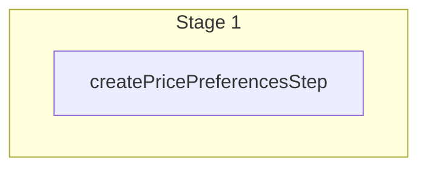

This documentation provides a reference to the `createPricePreferencesWorkflow`. It belongs to the `@medusajs/medusa/core-flows` package.

This workflow creates one or more price preferences. It's used by the
[Create Price Preferences Admin API Route](/api/admin/price-preferences/create-price-preference).

You can use this workflow within your customizations or your own custom workflows, allowing you to
create price preferences in your custom flows.

[View source code](https://github.com/medusajs/medusa/blob/0ed927bdb7a396a8fd5f6447ed69b7b354b150d3/packages/core/core-flows/src/pricing/workflows/create-price-preferences.ts#L39)

## Examples

**API Route**

```ts title="src/api/workflow/route.ts"
import type {
  MedusaRequest,
  MedusaResponse,
} from "@medusajs/framework/http"
import { createPricePreferencesWorkflow } from "@medusajs/medusa/core-flows"

export async function POST(
  req: MedusaRequest,
  res: MedusaResponse
) {
  const { result } = await createPricePreferencesWorkflow(req.scope)
    .run({
      input: [{
        attribute: "region_id",
        value: "reg_123",
        is_tax_inclusive: true
      }]
    })

  res.send(result)
}
```

**Subscriber**

```ts title="src/subscribers/order-placed.ts"
import {
  type SubscriberConfig,
  type SubscriberArgs,
} from "@medusajs/framework"
import { createPricePreferencesWorkflow } from "@medusajs/medusa/core-flows"

export default async function handleOrderPlaced({
  event: { data },
  container,
}: SubscriberArgs < { id: string } > ) {
  const { result } = await createPricePreferencesWorkflow(container)
    .run({
      input: [{
        attribute: "region_id",
        value: "reg_123",
        is_tax_inclusive: true
      }]
    })

  console.log(result)
}

export const config: SubscriberConfig = {
  event: "order.placed",
}
```

**Scheduled Job**

```ts title="src/jobs/message-daily.ts"
import { MedusaContainer } from "@medusajs/framework/types"
import { createPricePreferencesWorkflow } from "@medusajs/medusa/core-flows"

export default async function myCustomJob(
  container: MedusaContainer
) {
  const { result } = await createPricePreferencesWorkflow(container)
    .run({
      input: [{
        attribute: "region_id",
        value: "reg_123",
        is_tax_inclusive: true
      }]
    })

  console.log(result)
}

export const config = {
  name: "run-once-a-day",
  schedule: "0 0 * * *",
}
```

**Another Workflow**

```ts title="src/workflows/my-workflow.ts"
import { createWorkflow } from "@medusajs/framework/workflows-sdk"
import { createPricePreferencesWorkflow } from "@medusajs/medusa/core-flows"

const myWorkflow = createWorkflow(
  "my-workflow",
  () => {
    const result = createPricePreferencesWorkflow
      .runAsStep({
        input: [{
          attribute: "region_id",
          value: "reg_123",
          is_tax_inclusive: true
        }]
      })
  }
)
```

<a id="createpricepreferencesworkflow-steps" />

## Steps



Stages follow the order in the workflow definition. Conditional steps run only when their condition is met. The step descriptions below include the conditions and reference links.

- [createPricePreferencesStep](/resources/references/medusa-workflows/steps/createPricePreferencesStep): This step creates one or more price preferences.

<a id="createpricepreferencesworkflow-input" />

## Input

**createPricePreferencesWorkflow**

- `CreatePricePreferencesWorkflowInput`: [CreatePricePreferencesWorkflowInput](/resources/references/core_flows/core_core_flows_src/types/core_flowscore_core_flows_srcCreatePricePreferencesWorkflowInput)
  - `attribute`: `string` (optional) — The attribute of the price preference. For example, `region_id` or `currency_code`.
  - `value`: `string` (optional) — The value of the price preference. For example, `reg_123` or `usd`.
  - `is_tax_inclusive`: `boolean` (optional) — Whether prices matching this preference are tax inclusive. Learn more in [this documentation](/resources/commerce-modules/pricing/tax-inclusive-pricing).

<a id="createpricepreferencesworkflow-output" />

## Output

**createPricePreferencesWorkflow**

- `PricePreferenceDTO[]`: [PricePreferenceDTO](/resources/references/pricing/interfaces/pricingPricePreferenceDTO)\[]
  - `id`: `string` — The ID of a price preference.
  - `attribute`: `null` | `string` — The rule attribute for the preference
  - `value`: `null` | `string` — The rule value for the preference
  - `is_tax_inclusive`: `boolean` — Flag specifying whether prices for the specified rule are tax inclusive.
  - `created_at`: `Date` — When the price preference was created.
  - `updated_at`: `Date` — When the price preference was updated.
  - `deleted_at`: `null` | `Date` — When the price preference was deleted.
