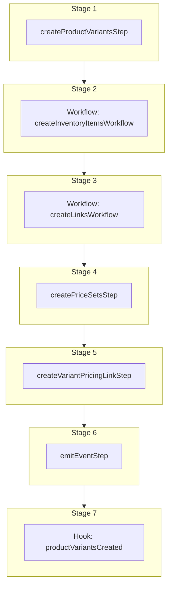

This documentation provides a reference to the `createProductVariantsWorkflow`. It belongs to the `@medusajs/medusa/core-flows` package.

This workflow creates one or more product variants. It's used by the [Create Product Variant Admin API Route](/api/admin/products/create-variant).

This workflow has a hook that allows you to perform custom actions on the created product variants. For example, you can pass under `additional_data` custom data that
allows you to create custom data models linked to the product variants.

You can also use this workflow within your customizations or your own custom workflows, allowing you to wrap custom logic around product-variant creation.

> **Note**
>
> Learn more about adding rules to the product variant's prices in the Pricing Module's
> [Price Rules](/resources/commerce-modules/pricing/price-rules) documentation.

[View source code](https://github.com/medusajs/medusa/blob/0ed927bdb7a396a8fd5f6447ed69b7b354b150d3/packages/core/core-flows/src/product/workflows/create-product-variants.ts#L249)

## Examples

**API Route**

```ts title="src/api/workflow/route.ts"
import type {
  MedusaRequest,
  MedusaResponse,
} from "@medusajs/framework/http"
import { createProductVariantsWorkflow } from "@medusajs/medusa/core-flows"

export async function POST(
  req: MedusaRequest,
  res: MedusaResponse
) {
  const { result } = await createProductVariantsWorkflow(req.scope)
    .run({
      input: {
        product_variants: [{
          product_id: "prod_123",
          sku: "SHIRT-123",
          title: "Small Shirt",
          prices: [{
            amount: 10,
            currency_code: "USD",
          }, ],
          options: {
            Size: "Small",
          },
        }, ],
        additional_data: {
          erp_id: "123"
        }
      }
    })

  res.send(result)
}
```

**Subscriber**

```ts title="src/subscribers/order-placed.ts"
import {
  type SubscriberConfig,
  type SubscriberArgs,
} from "@medusajs/framework"
import { createProductVariantsWorkflow } from "@medusajs/medusa/core-flows"

export default async function handleOrderPlaced({
  event: { data },
  container,
}: SubscriberArgs < { id: string } > ) {
  const { result } = await createProductVariantsWorkflow(container)
    .run({
      input: {
        product_variants: [{
          product_id: "prod_123",
          sku: "SHIRT-123",
          title: "Small Shirt",
          prices: [{
            amount: 10,
            currency_code: "USD",
          }, ],
          options: {
            Size: "Small",
          },
        }, ],
        additional_data: {
          erp_id: "123"
        }
      }
    })

  console.log(result)
}

export const config: SubscriberConfig = {
  event: "order.placed",
}
```

**Scheduled Job**

```ts title="src/jobs/message-daily.ts"
import { MedusaContainer } from "@medusajs/framework/types"
import { createProductVariantsWorkflow } from "@medusajs/medusa/core-flows"

export default async function myCustomJob(
  container: MedusaContainer
) {
  const { result } = await createProductVariantsWorkflow(container)
    .run({
      input: {
        product_variants: [{
          product_id: "prod_123",
          sku: "SHIRT-123",
          title: "Small Shirt",
          prices: [{
            amount: 10,
            currency_code: "USD",
          }, ],
          options: {
            Size: "Small",
          },
        }, ],
        additional_data: {
          erp_id: "123"
        }
      }
    })

  console.log(result)
}

export const config = {
  name: "run-once-a-day",
  schedule: "0 0 * * *",
}
```

**Another Workflow**

```ts title="src/workflows/my-workflow.ts"
import { createWorkflow } from "@medusajs/framework/workflows-sdk"
import { createProductVariantsWorkflow } from "@medusajs/medusa/core-flows"

const myWorkflow = createWorkflow(
  "my-workflow",
  () => {
    const result = createProductVariantsWorkflow
      .runAsStep({
        input: {
          product_variants: [{
            product_id: "prod_123",
            sku: "SHIRT-123",
            title: "Small Shirt",
            prices: [{
              amount: 10,
              currency_code: "USD",
            }, ],
            options: {
              Size: "Small",
            },
          }, ],
          additional_data: {
            erp_id: "123"
          }
        }
      })
  }
)
```

<a id="createproductvariantsworkflow-steps" />

## Steps



Stages follow the order in the workflow definition. Conditional steps run only when their condition is met. The step descriptions below include the conditions and reference links.

- [createProductVariantsStep](/resources/references/medusa-workflows/steps/createProductVariantsStep): This step creates one or more product variants.
  - [createInventoryItemsWorkflow](/resources/references/medusa-workflows/createInventoryItemsWorkflow): Create one or more inventory items.
    - [createLinksWorkflow](/resources/references/medusa-workflows/createLinksWorkflow): Create links between two records of linked data models.
      - [createPriceSetsStep](/resources/references/medusa-workflows/steps/createPriceSetsStep): This step creates one or more price sets.
        - [createVariantPricingLinkStep](/resources/references/medusa-workflows/steps/createVariantPricingLinkStep): This step creates links between variant and price set records.
          - [emitEventStep](/resources/references/medusa-workflows/steps/emitEventStep): This step emits an event, which you can listen to in a [subscriber](/learn/fundamentals/events-and-subscribers). You can pass data to the subscriber by including it in the `data` property. The event is only emitted after the workflow has finished successfully. So, even if it's executed in the middle of the workflow, it won't actually emit the event until the workflow has completed successfully. If the workflow fails, it won't emit the event at all.
            - [productVariantsCreated](/resources/references/medusa-workflows/createProductVariantsWorkflow#productvariantscreated): This hook is executed after the product variants are created. You can consume this hook to perform custom actions on the created product variants.

<a id="createproductvariantsworkflow-input" />

## Input

**createProductVariantsWorkflow**

- `CreateProductVariantsWorkflowInput`: [CreateProductVariantsWorkflowInput](/resources/references/core_flows/core_core_flows_src/types/core_flowscore_core_flows_srcCreateProductVariantsWorkflowInput)
  - `product_variants`: [CreateProductVariantDTO](/resources/references/product/interfaces/productCreateProductVariantDTO) & `object` & `object`\[] — The product variants to create.
    - `product_id`: `string` (optional) — The id of the product
    - `title`: `string` — The tile of the product variant.
    - `sku`: `null` | `string` (optional) — The SKU of the product variant.
    - `barcode`: `null` | `string` (optional) — The barcode of the product variant.
    - `ean`: `null` | `string` (optional) — The EAN of the product variant.
    - `upc`: `null` | `string` (optional) — The UPC of the product variant.
    - `allow_backorder`: `boolean` (optional) — Whether the product variant can be ordered when it's out of stock.
    - `manage_inventory`: `boolean` (optional) — Whether the product variant's inventory should be managed by the core system.
    - `inventory_items`: [CreateProductVariantInventoryKit](/resources/references/product/interfaces/productCreateProductVariantInventoryKit)\[] (optional) — The variant's inventory items. It's only available if `manage_inventory` is enabled.
      - `inventory_item_id`: `string`
      - `required_quantity`: `number` (optional)
    - `hs_code`: `null` | `string` (optional) — The HS Code of the product variant.
    - `origin_country`: `null` | `string` (optional) — The origin country of the product variant.
    - `mid_code`: `null` | `string` (optional) — The MID Code of the product variant.
    - `material`: `null` | `string` (optional) — The material of the product variant.
    - `weight`: `null` | `number` (optional) — The weight of the product variant.
    - `length`: `null` | `number` (optional) — The length of the product variant.
    - `height`: `null` | `number` (optional) — The height of the product variant.
    - `width`: `null` | `number` (optional) — The width of the product variant.
    - `options`: `Record<string, string>` (optional) — The options of the variant. Each key is an option's title, and value is an option's value. If an option with the specified title doesn't exist, a new one is created.

      Example:

      ```
      `{ Color: "Blue" }`
      ```
    - `metadata`: [MetadataType](/resources/references/product/types/productMetadataType) (optional) — Holds custom data in key-value pairs.
    - `prices`: [CreateMoneyAmountDTO](/resources/references/pricing/interfaces/pricingCreateMoneyAmountDTO)\[] (optional) — The product variant's prices.
      - `id`: `string` (optional) — The ID of the money amount.
      - `currency_code`: `string` — The currency code of this money amount.
      - `amount`: [BigNumberInput](/resources/references/pricing/types/pricingBigNumberInput) — The amount of this money amount.
      - `min_quantity`: `null` | [BigNumberInput](/resources/references/pricing/types/pricingBigNumberInput) (optional) — The minimum quantity required to be purchased for this money amount to be applied.
      - `max_quantity`: `null` | [BigNumberInput](/resources/references/pricing/types/pricingBigNumberInput) (optional) — The maximum quantity required to be purchased for this money amount to be applied.
    - `inventory_items`: `object`\[] (optional) — The inventory items to associate with managed product variants.
      - `inventory_item_id`: `string` — The inventory item's ID.
      - `required_quantity`: `number` (optional) — The number of units a single quantity is equivalent to. For example, if a customer orders one quantity of the variant, Medusa checks the availability of the quantity multiplied by the value set for `required_quantity`. When the customer orders the quantity, Medusa reserves the ordered quantity multiplied by the value set for `required_quantity`.
  - `additional_data`: `Record<string, unknown>` (optional) — Additional data that can be passed through the `additional_data` property in HTTP requests. Learn more in [this documentation](/learn/fundamentals/api-routes/additional-data).

<a id="createproductvariantsworkflow-output" />

## Output

**createProductVariantsWorkflow**

- `object[]`: `object`\[]
  - `prices`: [MoneyAmountDTO](/resources/references/pricing/interfaces/pricingMoneyAmountDTO)\[]
    - `id`: `string` — The ID of the money amount.
    - `currency_code`: `string` (optional) — The currency code of this money amount.
    - `amount`: [BigNumberValue](/resources/references/pricing/types/pricingBigNumberValue) (optional) — The price of this money amount.
      - `numeric`: `number`
      - `raw`: [BigNumberRawValue](/resources/references/pricing/types/pricingBigNumberRawValue) (optional)
      - `bigNumber`: `BigNumber` (optional)
    - `min_quantity`: [BigNumberValue](/resources/references/pricing/types/pricingBigNumberValue) (optional) — The minimum quantity required to be purchased for this price to be applied.
      - `numeric`: `number`
      - `raw`: [BigNumberRawValue](/resources/references/pricing/types/pricingBigNumberRawValue) (optional)
      - `bigNumber`: `BigNumber` (optional)
    - `max_quantity`: [BigNumberValue](/resources/references/pricing/types/pricingBigNumberValue) (optional) — The maximum quantity required to be purchased for this price to be applied.
      - `numeric`: `number`
      - `raw`: [BigNumberRawValue](/resources/references/pricing/types/pricingBigNumberRawValue) (optional)
      - `bigNumber`: `BigNumber` (optional)
    - `rules_count`: `number` (optional) — The number of rules that apply to this price
    - `price_rules`: [PriceRuleDTO](/resources/references/pricing/interfaces/pricingPriceRuleDTO)\[] (optional) — The price rules that apply to this price
      - `id`: `string` — The ID of the price rule.
      - `price_set_id`: `string` — The ID of the associated price set.
      - `price_set`: [PriceSetDTO](/resources/references/pricing/interfaces/pricingPriceSetDTO) — The associated price set.
      - `attribute`: `string` — The attribute of the price rule
      - `value`: `string` — The value of the price rule.
      - `priority`: `number` — The priority of the price rule in comparison to other applicable price rules.
      - `price_id`: `string` — The ID of the associated price.
      - `price_list_id`: `string` — The ID of the associated price list.
      - `created_at`: `Date` — When the price\_rule was created.
      - `updated_at`: `Date` — When the price\_rule was updated.
      - `deleted_at`: `null` | `Date` — When the price\_rule was deleted.
    - `created_at`: `Date` — When the money\_amount was created.
    - `updated_at`: `Date` — When the money\_amount was updated.
    - `deleted_at`: `null` | `Date` — When the money\_amount was deleted.
  - `id`: `string` — The ID of the product variant.
  - `title`: `string` — The tile of the product variant.
  - `sku`: `null` | `string` — The SKU of the product variant.
  - `barcode`: `null` | `string` — The barcode of the product variant.
  - `ean`: `null` | `string` — The EAN of the product variant.
  - `upc`: `null` | `string` — The UPC of the product variant.
  - `allow_backorder`: `boolean` — Whether the product variant can be ordered when it's out of stock.
  - `manage_inventory`: `boolean` — Whether the product variant's inventory should be managed by the core system.
  - `thumbnail`: `null` | `string` — The thumbnail of the product variant form the product images.
  - `requires_shipping`: `boolean` — Whether the product variant's requires shipping.
  - `hs_code`: `null` | `string` — The HS Code of the product variant.
  - `origin_country`: `null` | `string` — The origin country of the product variant.
  - `mid_code`: `null` | `string` — The MID Code of the product variant.
  - `material`: `null` | `string` — The material of the product variant.
  - `weight`: `null` | `number` — The weight of the product variant.
  - `length`: `null` | `number` — The length of the product variant.
  - `height`: `null` | `number` — The height of the product variant.
  - `width`: `null` | `number` — The width of the product variant.
  - `options`: [ProductOptionValueDTO](/resources/references/product/interfaces/productProductOptionValueDTO)\[] — The associated product options.
    - `id`: `string` — The ID of the product option value.
    - `value`: `string` — The value of the product option value.
    - `option`: `null` | [ProductOptionDTO](/resources/references/product/interfaces/productProductOptionDTO) (optional) — The associated product option. It may only be available if the `option` relation is expanded.
      - `id`: `string` — The ID of the product option.
      - `title`: `string` — The title of the product option.
      - `is_exclusive`: `boolean` — Whether the product option is exclusive to a product or shared across products.
      - `products`: `null` | [ProductDTO](/resources/references/product/interfaces/productProductDTO)\[] (optional) — The associated products.
      - `values`: [ProductOptionValueDTO](/resources/references/product/interfaces/productProductOptionValueDTO)\[] — The associated product option values.
      - `metadata`: [MetadataType](/resources/references/product/types/productMetadataType) (optional) — Holds custom data in key-value pairs.
      - `created_at`: `string` | `Date` — When the product option was created.
      - `updated_at`: `string` | `Date` — When the product option was updated.
      - `deleted_at`: `string` | `Date` (optional) — When the product option was deleted.
    - `option_id`: `null` | `string` (optional) — The associated product option id.
    - `metadata`: [MetadataType](/resources/references/product/types/productMetadataType) (optional) — Holds custom data in key-value pairs.
    - `created_at`: `string` | `Date` — When the product option value was created.
    - `updated_at`: `string` | `Date` — When the product option value was updated.
    - `deleted_at`: `string` | `Date` (optional) — When the product option value was deleted.
  - `images`: [ProductImageDTO](/resources/references/product/interfaces/productProductImageDTO)\[] — The associated product images.
    - `id`: `string` — The ID of the product image.
    - `url`: `string` — The URL of the product image.
    - `rank`: `number` — The rank of the product image.
    - `metadata`: [MetadataType](/resources/references/product/types/productMetadataType) (optional) — Holds custom data in key-value pairs.
    - `created_at`: `string` | `Date` — When the product image was created.
    - `updated_at`: `string` | `Date` — When the product image was updated.
    - `deleted_at`: `string` | `Date` (optional) — When the product image was deleted.
  - `metadata`: `null` | `Record<string, unknown>` — Holds custom data in key-value pairs.
  - `product`: `null` | [ProductDTO](/resources/references/product/interfaces/productProductDTO) (optional) — The associated product.
    - `id`: `string` — The ID of the product.
    - `title`: `string` — The title of the product.
    - `handle`: `string` — The handle of the product. The handle can be used to create slug URL paths.
    - `subtitle`: `null` | `string` — The subttle of the product.
    - `description`: `null` | `string` — The description of the product.
    - `is_giftcard`: `boolean` — Whether the product is a gift card.
    - `status`: [ProductStatus](/resources/references/product/types/productProductStatus) — The status of the product.
    - `thumbnail`: `null` | `string` — The URL of the product's thumbnail.
    - `width`: `null` | `number` — The width of the product.
    - `weight`: `null` | `number` — The weight of the product.
    - `length`: `null` | `number` — The length of the product.
    - `height`: `null` | `number` — The height of the product.
    - `origin_country`: `null` | `string` — The origin country of the product.
    - `hs_code`: `null` | `string` — The HS Code of the product.
    - `mid_code`: `null` | `string` — The MID Code of the product.
    - `material`: `null` | `string` — The material of the product.
    - `collection`: `null` | [ProductCollectionDTO](/resources/references/product/interfaces/productProductCollectionDTO) — The associated product collection.
      - `id`: `string` — The ID of the product collection.
      - `title`: `string` — The title of the product collection.
      - `handle`: `string` — The handle of the product collection. The handle can be used to create slug URL paths.
      - `metadata`: [MetadataType](/resources/references/product/types/productMetadataType) (optional) — Holds custom data in key-value pairs.
      - `created_at`: `string` | `Date` — When the product collection was created.
      - `updated_at`: `string` | `Date` — When the product collection was updated.
      - `deleted_at`: `string` | `Date` (optional) — When the product collection was deleted.
      - `products`: [ProductDTO](/resources/references/product/interfaces/productProductDTO)\[] (optional) — The associated products.
    - `collection_id`: `null` | `string` — The associated product collection id.
    - `categories`: `null` | [ProductCategoryDTO](/resources/references/product/interfaces/productProductCategoryDTO)\[] (optional) — The associated product categories.
      - `id`: `string` — The ID of the product category.
      - `name`: `string` — The name of the product category.
      - `description`: `string` — The description of the product category.
      - `handle`: `string` — The handle of the product category. The handle can be used to create slug URL paths.
      - `is_active`: `boolean` — Whether the product category is active.
      - `is_internal`: `boolean` — Whether the product category is internal. This can be used to only show the product category to admins and hide it from customers.
      - `rank`: `number` — The ranking of the product category among sibling categories.
      - `external_id`: `null` | `string` — An external identifier for the product category, such as an ID from a third-party system.
      - `metadata`: [MetadataType](/resources/references/product/types/productMetadataType) (optional) — The ranking of the product category among sibling categories.
      - `parent_category`: `null` | [ProductCategoryDTO](/resources/references/product/interfaces/productProductCategoryDTO) — The associated parent category.
      - `parent_category_id`: `null` | `string` — The associated parent category id.
      - `category_children`: [ProductCategoryDTO](/resources/references/product/interfaces/productProductCategoryDTO)\[] — The associated child categories.
      - `products`: [ProductDTO](/resources/references/product/interfaces/productProductDTO)\[] — The associated products.
      - `created_at`: `string` | `Date` — When the product category was created.
      - `updated_at`: `string` | `Date` — When the product category was updated.
      - `deleted_at`: `string` | `Date` (optional) — When the product category was deleted.
    - `type`: `null` | [ProductTypeDTO](/resources/references/product/interfaces/productProductTypeDTO) — The associated product type.
      - `id`: `string` — The ID of the product type.
      - `value`: `string` — The value of the product type.
      - `metadata`: [MetadataType](/resources/references/product/types/productMetadataType) (optional) — Holds custom data in key-value pairs.
      - `created_at`: `string` | `Date` — When the product type was created.
      - `updated_at`: `string` | `Date` — When the product type was updated.
      - `deleted_at`: `string` | `Date` (optional) — When the product type was deleted.
    - `type_id`: `null` | `string` — The associated product type id.
    - `tags`: [ProductTagDTO](/resources/references/product/interfaces/productProductTagDTO)\[] — The associated product tags.
      - `id`: `string` — The ID of the product tag.
      - `value`: `string` — The value of the product tag.
      - `metadata`: [MetadataType](/resources/references/product/types/productMetadataType) (optional) — Holds custom data in key-value pairs.
      - `products`: [ProductDTO](/resources/references/product/interfaces/productProductDTO)\[] (optional) — The associated products.
    - `variants`: [ProductVariantDTO](/resources/references/product/interfaces/productProductVariantDTO)\[] — The associated product variants.
      - `id`: `string` — The ID of the product variant.
      - `title`: `string` — The tile of the product variant.
      - `sku`: `null` | `string` — The SKU of the product variant.
      - `barcode`: `null` | `string` — The barcode of the product variant.
      - `ean`: `null` | `string` — The EAN of the product variant.
      - `upc`: `null` | `string` — The UPC of the product variant.
      - `allow_backorder`: `boolean` — Whether the product variant can be ordered when it's out of stock.
      - `manage_inventory`: `boolean` — Whether the product variant's inventory should be managed by the core system.
      - `thumbnail`: `null` | `string` — The thumbnail of the product variant form the product images.
      - `requires_shipping`: `boolean` — Whether the product variant's requires shipping.
      - `hs_code`: `null` | `string` — The HS Code of the product variant.
      - `origin_country`: `null` | `string` — The origin country of the product variant.
      - `mid_code`: `null` | `string` — The MID Code of the product variant.
      - `material`: `null` | `string` — The material of the product variant.
      - `weight`: `null` | `number` — The weight of the product variant.
      - `length`: `null` | `number` — The length of the product variant.
      - `height`: `null` | `number` — The height of the product variant.
      - `width`: `null` | `number` — The width of the product variant.
      - `options`: [ProductOptionValueDTO](/resources/references/product/interfaces/productProductOptionValueDTO)\[] — The associated product options.
      - `images`: [ProductImageDTO](/resources/references/product/interfaces/productProductImageDTO)\[] — The associated product images.
      - `metadata`: `null` | `Record<string, unknown>` — Holds custom data in key-value pairs.
      - `product`: `null` | [ProductDTO](/resources/references/product/interfaces/productProductDTO) (optional) — The associated product.
      - `product_id`: `null` | `string` — The associated product id.
      - `variant_rank`: `null` | `number` (optional) — he ranking of the variant among other variants associated with the product.
      - `created_at`: `string` | `Date` — When the product variant was created.
      - `updated_at`: `string` | `Date` — When the product variant was updated.
      - `deleted_at`: `string` | `Date` — When the product variant was deleted.
    - `options`: [ProductOptionDTO](/resources/references/product/interfaces/productProductOptionDTO)\[] — The associated product options.
      - `id`: `string` — The ID of the product option.
      - `title`: `string` — The title of the product option.
      - `is_exclusive`: `boolean` — Whether the product option is exclusive to a product or shared across products.
      - `products`: `null` | [ProductDTO](/resources/references/product/interfaces/productProductDTO)\[] (optional) — The associated products.
      - `values`: [ProductOptionValueDTO](/resources/references/product/interfaces/productProductOptionValueDTO)\[] — The associated product option values.
      - `metadata`: [MetadataType](/resources/references/product/types/productMetadataType) (optional) — Holds custom data in key-value pairs.
      - `created_at`: `string` | `Date` — When the product option was created.
      - `updated_at`: `string` | `Date` — When the product option was updated.
      - `deleted_at`: `string` | `Date` (optional) — When the product option was deleted.
    - `images`: [ProductImageDTO](/resources/references/product/interfaces/productProductImageDTO)\[] — The associated product images.
      - `id`: `string` — The ID of the product image.
      - `url`: `string` — The URL of the product image.
      - `rank`: `number` — The rank of the product image.
      - `metadata`: [MetadataType](/resources/references/product/types/productMetadataType) (optional) — Holds custom data in key-value pairs.
      - `created_at`: `string` | `Date` — When the product image was created.
      - `updated_at`: `string` | `Date` — When the product image was updated.
      - `deleted_at`: `string` | `Date` (optional) — When the product image was deleted.
    - `discountable`: `boolean` (optional) — Whether the product can be discounted.
    - `external_id`: `null` | `string` — The ID of the product in an external system. This is useful if you're integrating the product with a third-party service and want to maintain a reference to the ID in the integrated service.
    - `created_at`: `string` | `Date` — When the product was created.
    - `updated_at`: `string` | `Date` — When the product was updated.
    - `deleted_at`: `string` | `Date` — When the product was deleted.
    - `metadata`: [MetadataType](/resources/references/product/types/productMetadataType) (optional) — Holds custom data in key-value pairs.
  - `product_id`: `null` | `string` — The associated product id.
  - `variant_rank`: `null` | `number` (optional) — he ranking of the variant among other variants associated with the product.
  - `created_at`: `string` | `Date` — When the product variant was created.
  - `updated_at`: `string` | `Date` — When the product variant was updated.
  - `deleted_at`: `string` | `Date` — When the product variant was deleted.

## Hooks

Hooks allow you to inject custom functionalities into the workflow. You'll receive data from the workflow, as well as additional data sent through an HTTP request.

Learn more about [Hooks](/learn/fundamentals/workflows/workflow-hooks) and [Additional Data](/learn/fundamentals/api-routes/additional-data).

### productVariantsCreated

This hook is executed after the product variants are created. You can consume this hook to perform custom actions on the created product variants.

#### Example

```ts
import { createProductVariantsWorkflow } from "@medusajs/medusa/core-flows"

createProductVariantsWorkflow.hooks.productVariantsCreated(
  (async ({ product_variants, additional_data }, { container }) => {
    //TODO
  })
)
```

<a id="input" />

#### Input

Handlers consuming this hook accept the following input.

**productVariantsCreated**

- `input`: object — The input data for the hook.
  - `product_variants`: `object`\[]
    - `prices`: [MoneyAmountDTO](/resources/references/pricing/interfaces/pricingMoneyAmountDTO)\[]
    - `id`: `string` — The ID of the product variant.
    - `title`: `string` — The tile of the product variant.
    - `sku`: `null` | `string` — The SKU of the product variant.
    - `barcode`: `null` | `string` — The barcode of the product variant.
    - `ean`: `null` | `string` — The EAN of the product variant.
    - `upc`: `null` | `string` — The UPC of the product variant.
    - `allow_backorder`: `boolean` — Whether the product variant can be ordered when it's out of stock.
    - `manage_inventory`: `boolean` — Whether the product variant's inventory should be managed by the core system.
    - `thumbnail`: `null` | `string` — The thumbnail of the product variant form the product images.
    - `requires_shipping`: `boolean` — Whether the product variant's requires shipping.
    - `hs_code`: `null` | `string` — The HS Code of the product variant.
    - `origin_country`: `null` | `string` — The origin country of the product variant.
    - `mid_code`: `null` | `string` — The MID Code of the product variant.
    - `material`: `null` | `string` — The material of the product variant.
    - `weight`: `null` | `number` — The weight of the product variant.
    - `length`: `null` | `number` — The length of the product variant.
    - `height`: `null` | `number` — The height of the product variant.
    - `width`: `null` | `number` — The width of the product variant.
    - `options`: [ProductOptionValueDTO](/resources/references/product/interfaces/productProductOptionValueDTO)\[] — The associated product options.
    - `images`: [ProductImageDTO](/resources/references/product/interfaces/productProductImageDTO)\[] — The associated product images.
    - `metadata`: `null` | `Record<string, unknown>` — Holds custom data in key-value pairs.
    - `product_id`: `null` | `string` — The associated product id.
    - `created_at`: `string` | `Date` — When the product variant was created.
    - `updated_at`: `string` | `Date` — When the product variant was updated.
    - `deleted_at`: `string` | `Date` — When the product variant was deleted.
    - `product`: `null` | [ProductDTO](/resources/references/product/interfaces/productProductDTO) (optional) — The associated product.
    - `variant_rank`: `null` | `number` (optional) — he ranking of the variant among other variants associated with the product.
  - `additional_data`: `Record<string, unknown> | undefined` — Additional data that can be passed through the `additional_data` property in HTTP requests. Learn more in [this documentation](/learn/fundamentals/api-routes/additional-data).

<a id="createproductvariantsworkflow-emitted-events" />

## Emitted Events

- `product-variant.created`: Emitted when product variants are created.

  ```ts
  {
    id, // The ID of the product variant
  }
  ```
- `inventory-item.created` (since v2.18.0): Emitted when inventory items are created.

  ```ts
  {
    id, // The ID of the inventory item
  }
  ```
- `inventory-level.created` (since v2.18.0): Emitted when inventory levels are created.

  ```ts
  {
    id, // The ID of the inventory level
  }
  ```
