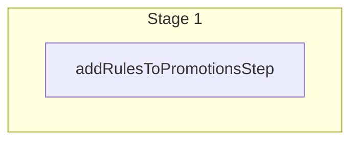

This documentation provides a reference to the `createPromotionRulesWorkflow`. It belongs to the `@medusajs/medusa/core-flows` package.

This workflow creates one or more promotion rules. It's used by other workflows,
such as [batchPromotionRulesWorkflow](/resources/references/medusa-workflows/batchPromotionRulesWorkflow) that manages the rules of a promotion.

You can use this workflow within your own customizations or custom workflows, allowing you to
create promotion rules within your custom flows.

[View source code](https://github.com/medusajs/medusa/blob/0ed927bdb7a396a8fd5f6447ed69b7b354b150d3/packages/core/core-flows/src/promotion/workflows/create-promotion-rules.ts#L43)

## Examples

**API Route**

```ts title="src/api/workflow/route.ts"
import type {
  MedusaRequest,
  MedusaResponse,
} from "@medusajs/framework/http"
import { createPromotionRulesWorkflow } from "@medusajs/medusa/core-flows"

export async function POST(
  req: MedusaRequest,
  res: MedusaResponse
) {
  const { result } = await createPromotionRulesWorkflow(req.scope)
    .run({
      input: {
        // import { RuleType } from "@medusajs/framework/utils"
        rule_type: RuleType.RULES,
        data: {
          id: "promo_123",
          rules: [{
            attribute: "cusgrp_123",
            operator: "eq",
            values: ["cusgrp_123"],
          }],
        }
      }
    })

  res.send(result)
}
```

**Subscriber**

```ts title="src/subscribers/order-placed.ts"
import {
  type SubscriberConfig,
  type SubscriberArgs,
} from "@medusajs/framework"
import { createPromotionRulesWorkflow } from "@medusajs/medusa/core-flows"

export default async function handleOrderPlaced({
  event: { data },
  container,
}: SubscriberArgs < { id: string } > ) {
  const { result } = await createPromotionRulesWorkflow(container)
    .run({
      input: {
        // import { RuleType } from "@medusajs/framework/utils"
        rule_type: RuleType.RULES,
        data: {
          id: "promo_123",
          rules: [{
            attribute: "cusgrp_123",
            operator: "eq",
            values: ["cusgrp_123"],
          }],
        }
      }
    })

  console.log(result)
}

export const config: SubscriberConfig = {
  event: "order.placed",
}
```

**Scheduled Job**

```ts title="src/jobs/message-daily.ts"
import { MedusaContainer } from "@medusajs/framework/types"
import { createPromotionRulesWorkflow } from "@medusajs/medusa/core-flows"

export default async function myCustomJob(
  container: MedusaContainer
) {
  const { result } = await createPromotionRulesWorkflow(container)
    .run({
      input: {
        // import { RuleType } from "@medusajs/framework/utils"
        rule_type: RuleType.RULES,
        data: {
          id: "promo_123",
          rules: [{
            attribute: "cusgrp_123",
            operator: "eq",
            values: ["cusgrp_123"],
          }],
        }
      }
    })

  console.log(result)
}

export const config = {
  name: "run-once-a-day",
  schedule: "0 0 * * *",
}
```

**Another Workflow**

```ts title="src/workflows/my-workflow.ts"
import { createWorkflow } from "@medusajs/framework/workflows-sdk"
import { createPromotionRulesWorkflow } from "@medusajs/medusa/core-flows"

const myWorkflow = createWorkflow(
  "my-workflow",
  () => {
    const result = createPromotionRulesWorkflow
      .runAsStep({
        input: {
          // import { RuleType } from "@medusajs/framework/utils"
          rule_type: RuleType.RULES,
          data: {
            id: "promo_123",
            rules: [{
              attribute: "cusgrp_123",
              operator: "eq",
              values: ["cusgrp_123"],
            }],
          }
        }
      })
  }
)
```

<a id="createpromotionrulesworkflow-steps" />

## Steps



Stages follow the order in the workflow definition. Conditional steps run only when their condition is met. The step descriptions below include the conditions and reference links.

- [addRulesToPromotionsStep](/resources/references/medusa-workflows/steps/addRulesToPromotionsStep): This step adds rules to a promotion.

<a id="createpromotionrulesworkflow-input" />

## Input

**createPromotionRulesWorkflow**

- `AddPromotionRulesWorkflowDTO`: [AddPromotionRulesWorkflowDTO](/resources/references/types/types/typesAddPromotionRulesWorkflowDTO) — The data to create rules for a promotion.
  - `rule_type`: `PromotionRuleTypes` — The type of rules to create.
  - `data`: `object` — The data to create the rules.
    - `id`: `string` — The ID of the promotion to create the rules for.
    - `rules`: [CreatePromotionRuleDTO](/resources/references/promotion/interfaces/promotionCreatePromotionRuleDTO)\[] — The rules to create.
      - `description`: `null` | `string` (optional) — The description of the promotion rule.
      - `attribute`: `string` — The attribute of the promotion rule.
      - `operator`: [PromotionRuleOperatorValues](/resources/references/promotion/types/promotionPromotionRuleOperatorValues) — The operator of the promotion rule.
      - `values`: `string` | `string`\[] — The values of the promotion rule. When provided, `PromotionRuleValue` records are created and associated with the promotion rule.

<a id="createpromotionrulesworkflow-output" />

## Output

**createPromotionRulesWorkflow**

- `PromotionRuleDTO[]`: [PromotionRuleDTO](/resources/references/promotion/interfaces/promotionPromotionRuleDTO)\[]
  - `id`: `string` — The ID of the promotion rule.
  - `description`: `null` | `string` (optional) — The description of the promotion rule.
  - `attribute`: `string` (optional) — The attribute of the promotion rule.
  - `operator`: [PromotionRuleOperatorValues](/resources/references/promotion/types/promotionPromotionRuleOperatorValues) (optional) — The operator of the promotion rule.
  - `values`: [PromotionRuleValueDTO](/resources/references/promotion/interfaces/promotionPromotionRuleValueDTO)\[] — The values of the promotion rule.
    - `id`: `string` — The ID of the promotion rule value.
    - `value`: `string` (optional) — The value of the promotion rule value.
