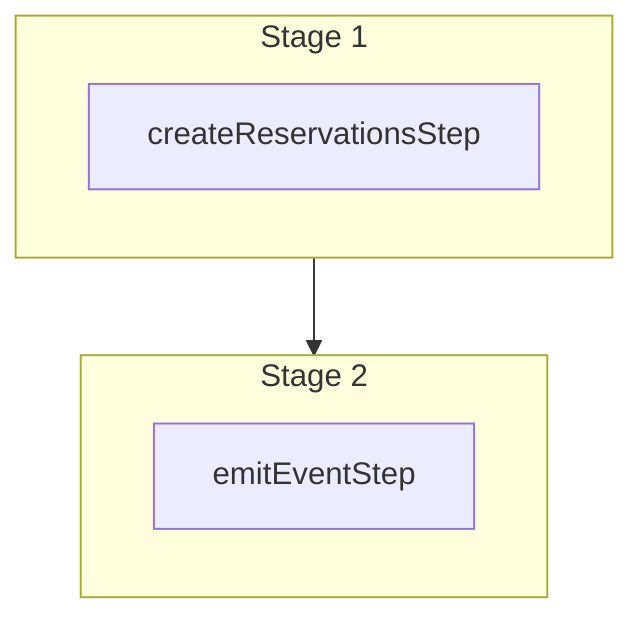

This documentation provides a reference to the `createReservationsWorkflow`. It belongs to the `@medusajs/medusa/core-flows` package.

This workflow creates one or more reservations. It's used by the
[Create Reservations Admin API Route](/api/admin/reservations/create-reservation).

You can use this workflow within your own customizations or custom workflows, allowing you
to create reservations in your custom flows.

[View source code](https://github.com/medusajs/medusa/blob/0ed927bdb7a396a8fd5f6447ed69b7b354b150d3/packages/core/core-flows/src/reservation/workflows/create-reservations.ts#L39)

## Examples

**API Route**

```ts title="src/api/workflow/route.ts"
import type {
  MedusaRequest,
  MedusaResponse,
} from "@medusajs/framework/http"
import { createReservationsWorkflow } from "@medusajs/medusa/core-flows"

export async function POST(
  req: MedusaRequest,
  res: MedusaResponse
) {
  const { result } = await createReservationsWorkflow(req.scope)
    .run({
      input: {
        reservations: [{
          inventory_item_id: "iitem_123",
          location_id: "sloc_123",
          quantity: 1,
        }]
      }
    })

  res.send(result)
}
```

**Subscriber**

```ts title="src/subscribers/order-placed.ts"
import {
  type SubscriberConfig,
  type SubscriberArgs,
} from "@medusajs/framework"
import { createReservationsWorkflow } from "@medusajs/medusa/core-flows"

export default async function handleOrderPlaced({
  event: { data },
  container,
}: SubscriberArgs < { id: string } > ) {
  const { result } = await createReservationsWorkflow(container)
    .run({
      input: {
        reservations: [{
          inventory_item_id: "iitem_123",
          location_id: "sloc_123",
          quantity: 1,
        }]
      }
    })

  console.log(result)
}

export const config: SubscriberConfig = {
  event: "order.placed",
}
```

**Scheduled Job**

```ts title="src/jobs/message-daily.ts"
import { MedusaContainer } from "@medusajs/framework/types"
import { createReservationsWorkflow } from "@medusajs/medusa/core-flows"

export default async function myCustomJob(
  container: MedusaContainer
) {
  const { result } = await createReservationsWorkflow(container)
    .run({
      input: {
        reservations: [{
          inventory_item_id: "iitem_123",
          location_id: "sloc_123",
          quantity: 1,
        }]
      }
    })

  console.log(result)
}

export const config = {
  name: "run-once-a-day",
  schedule: "0 0 * * *",
}
```

**Another Workflow**

```ts title="src/workflows/my-workflow.ts"
import { createWorkflow } from "@medusajs/framework/workflows-sdk"
import { createReservationsWorkflow } from "@medusajs/medusa/core-flows"

const myWorkflow = createWorkflow(
  "my-workflow",
  () => {
    const result = createReservationsWorkflow
      .runAsStep({
        input: {
          reservations: [{
            inventory_item_id: "iitem_123",
            location_id: "sloc_123",
            quantity: 1,
          }]
        }
      })
  }
)
```

<a id="createreservationsworkflow-steps" />

## Steps



Stages follow the order in the workflow definition. Conditional steps run only when their condition is met. The step descriptions below include the conditions and reference links.

- [createReservationsStep](/resources/references/medusa-workflows/steps/createReservationsStep): This step creates one or more reservations.
  - [emitEventStep](/resources/references/medusa-workflows/steps/emitEventStep): This step emits an event, which you can listen to in a [subscriber](/learn/fundamentals/events-and-subscribers). You can pass data to the subscriber by including it in the `data` property. The event is only emitted after the workflow has finished successfully. So, even if it's executed in the middle of the workflow, it won't actually emit the event until the workflow has completed successfully. If the workflow fails, it won't emit the event at all.

<a id="createreservationsworkflow-input" />

## Input

**createReservationsWorkflow**

- `CreateReservationsWorkflowInput`: [CreateReservationsWorkflowInput](/resources/references/types/WorkflowTypes/ReservationWorkflow/interfaces/typesWorkflowTypesReservationWorkflowCreateReservationsWorkflowInput)
  - `reservations`: [CreateReservationItemInput](/resources/references/types/InventoryTypes/interfaces/typesInventoryTypesCreateReservationItemInput)\[] — The reservations to create.
    - `line_item_id`: `null` | `string` (optional) — The ID of the associated line item.
    - `inventory_item_id`: `string` — The ID of the associated inventory item.
    - `location_id`: `string` — The ID of the associated location.
    - `quantity`: [BigNumberInput](/resources/references/types/types/typesBigNumberInput) — The reserved quantity.
      - `value`: `string` | `number`
      - `numeric`: `number`
      - `raw`: [BigNumberRawValue](/resources/references/types/types/typesBigNumberRawValue) (optional)
      - `bigNumber`: `BigNumber` (optional)
    - `allow_backorder`: `boolean` (optional) — Allow backorder of the item. If true, it won't check inventory levels before reserving it.
    - `description`: `null` | `string` (optional) — The description of the reservation.
    - `created_by`: `null` | `string` (optional) — The user or system that created the reservation. Can be any form of identification string.
    - `external_id`: `null` | `string` (optional) — An ID associated with an external third-party system that the reservation item is connected to.
    - `metadata`: `null` | `Record<string, unknown>` (optional) — Holds custom data in key-value pairs.

<a id="createreservationsworkflow-output" />

## Output

**createReservationsWorkflow**

- `CreateReservationsWorkflowOutput`: [CreateReservationsWorkflowOutput](/resources/references/types/WorkflowTypes/ReservationWorkflow/types/typesWorkflowTypesReservationWorkflowCreateReservationsWorkflowOutput)
  - `id`: `string` — The ID of the reservation item.
  - `location_id`: `string` — The associated location's ID.
  - `inventory_item_id`: `string` — The associated inventory item's ID.
  - `quantity`: [BigNumberInput](/resources/references/types/types/typesBigNumberInput) — The quantity of the reservation item.
    - `value`: `string` | `number`
    - `numeric`: `number`
    - `raw`: [BigNumberRawValue](/resources/references/types/types/typesBigNumberRawValue) (optional)
      - `value`: `string` | `number`
    - `bigNumber`: `BigNumber` (optional)
  - `line_item_id`: `null` | `string` (optional) — The associated line item's ID.
  - `description`: `null` | `string` (optional) — The description of the reservation item.
  - `allow_backorder`: `boolean` (optional) — Allow backorder of the item. If true, it won't check inventory levels before reserving it.
  - `created_by`: `null` | `string` (optional) — The created by of the reservation item.
  - `metadata`: `null` | `Record<string, unknown>` — Holds custom data in key-value pairs.
  - `created_at`: `string` | `Date` — The creation date of the reservation item.
  - `updated_at`: `string` | `Date` — The update date of the reservation item.
  - `deleted_at`: `null` | `string` | `Date` — The deletion date of the reservation item.

<a id="createreservationsworkflow-emitted-events" />

## Emitted Events

- `reservation-item.created` (since v2.18.0): Emitted when reservations are created.

  ```ts
  {
    id, // The ID of the reservation
    order_id, // (optional) The ID of the order, if the reservation was created by an order flow
  }
  ```
