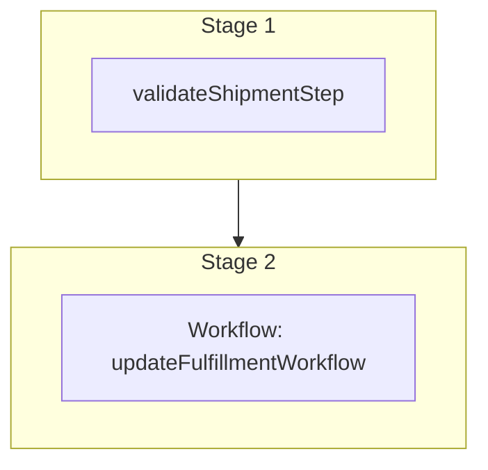

This documentation provides a reference to the `createShipmentWorkflow`. It belongs to the `@medusajs/medusa/core-flows` package.

This workflow creates shipments for a fulfillment. It's used by the
[Create Shipment Admin API Route](/api/admin/fulfillments/create-shipment).

You can use this workflow within your own customizations or custom workflows, allowing you to
create shipments within your custom flows.

[View source code](https://github.com/medusajs/medusa/blob/0ed927bdb7a396a8fd5f6447ed69b7b354b150d3/packages/core/core-flows/src/fulfillment/workflows/create-shipment.ts#L38)

## Examples

**API Route**

```ts title="src/api/workflow/route.ts"
import type {
  MedusaRequest,
  MedusaResponse,
} from "@medusajs/framework/http"
import { createShipmentWorkflow } from "@medusajs/medusa/core-flows"

export async function POST(
  req: MedusaRequest,
  res: MedusaResponse
) {
  const { result } = await createShipmentWorkflow(req.scope)
    .run({
      input: {
        id: "ful_123",
        labels: [{
          tracking_url: "https://example.com",
          tracking_number: "123",
          label_url: "https://example.com"
        }]
      }
    })

  res.send(result)
}
```

**Subscriber**

```ts title="src/subscribers/order-placed.ts"
import {
  type SubscriberConfig,
  type SubscriberArgs,
} from "@medusajs/framework"
import { createShipmentWorkflow } from "@medusajs/medusa/core-flows"

export default async function handleOrderPlaced({
  event: { data },
  container,
}: SubscriberArgs < { id: string } > ) {
  const { result } = await createShipmentWorkflow(container)
    .run({
      input: {
        id: "ful_123",
        labels: [{
          tracking_url: "https://example.com",
          tracking_number: "123",
          label_url: "https://example.com"
        }]
      }
    })

  console.log(result)
}

export const config: SubscriberConfig = {
  event: "order.placed",
}
```

**Scheduled Job**

```ts title="src/jobs/message-daily.ts"
import { MedusaContainer } from "@medusajs/framework/types"
import { createShipmentWorkflow } from "@medusajs/medusa/core-flows"

export default async function myCustomJob(
  container: MedusaContainer
) {
  const { result } = await createShipmentWorkflow(container)
    .run({
      input: {
        id: "ful_123",
        labels: [{
          tracking_url: "https://example.com",
          tracking_number: "123",
          label_url: "https://example.com"
        }]
      }
    })

  console.log(result)
}

export const config = {
  name: "run-once-a-day",
  schedule: "0 0 * * *",
}
```

**Another Workflow**

```ts title="src/workflows/my-workflow.ts"
import { createWorkflow } from "@medusajs/framework/workflows-sdk"
import { createShipmentWorkflow } from "@medusajs/medusa/core-flows"

const myWorkflow = createWorkflow(
  "my-workflow",
  () => {
    const result = createShipmentWorkflow
      .runAsStep({
        input: {
          id: "ful_123",
          labels: [{
            tracking_url: "https://example.com",
            tracking_number: "123",
            label_url: "https://example.com"
          }]
        }
      })
  }
)
```

<a id="createshipmentworkflow-steps" />

## Steps



Stages follow the order in the workflow definition. Conditional steps run only when their condition is met. The step descriptions below include the conditions and reference links.

- [validateShipmentStep](/resources/references/medusa-workflows/steps/validateShipmentStep): This step validates that a shipment can be created for a fulfillment. If the shipment has already been created, the fulfillment has been canceled, or the fulfillment does not have a shipping option, the step throws an error.
  - [updateFulfillmentWorkflow](/resources/references/medusa-workflows/updateFulfillmentWorkflow): Update a fulfillment.

<a id="createshipmentworkflow-input" />

## Input

**createShipmentWorkflow**

- `CreateShipmentWorkflowInput`: [CreateShipmentWorkflowInput](/resources/references/types/WorkflowTypes/FulfillmentWorkflow/interfaces/typesWorkflowTypesFulfillmentWorkflowCreateShipmentWorkflowInput)
  - `id`: `string` — The ID of the fulfillment
  - `labels`: [CreateFulfillmentLabelWorkflowDTO](/resources/references/types/WorkflowTypes/FulfillmentWorkflow/types/typesWorkflowTypesFulfillmentWorkflowCreateFulfillmentLabelWorkflowDTO)\[] — The labels associated with the fulfillment.
    - `tracking_number`: `string` — The tracking number of the fulfillment label.
    - `tracking_url`: `string` — The tracking URL of the fulfillment label.
    - `label_url`: `string` — The URL of the label.
  - `marked_shipped_by`: `null` | `string` (optional) — The id of the user that marked fulfillment as shipped

<a id="createshipmentworkflow-output" />

## Output

**createShipmentWorkflow**

- `FulfillmentDTO`: [FulfillmentDTO](/resources/references/fulfillment/interfaces/fulfillmentFulfillmentDTO) — The fulfillment details.
  - `id`: `string` — The ID of the fulfillment.
  - `location_id`: `string` — The associated location's ID.
  - `packed_at`: `null` | `Date` — The date the fulfillment was packed.
  - `shipped_at`: `null` | `Date` — The date the fulfillment was shipped.
  - `delivered_at`: `null` | `Date` — The date the fulfillment was delivered.
  - `canceled_at`: `null` | `Date` — The date the fulfillment was canceled.
  - `marked_shipped_by`: `null` | `string` (optional) — The id of the user that marked fulfillment as shipped
  - `created_by`: `null` | `string` (optional) — The id of the user that created the fulfillment
  - `data`: `null` | `Record<string, unknown>` — The data necessary for the fulfillment provider to process the fulfillment.
  - `provider_id`: `string` — The associated fulfillment provider's ID.
  - `shipping_option_id`: `null` | `string` — The associated shipping option's ID.
  - `metadata`: `null` | `Record<string, unknown>` — Holds custom data in key-value pairs.
  - `shipping_option`: `null` | [ShippingOptionDTO](/resources/references/fulfillment/interfaces/fulfillmentShippingOptionDTO) — The associated shipping option.
    - `id`: `string` — The ID of the shipping option.
    - `name`: `string` — The name of the shipping option.
    - `price_type`: [ShippingOptionPriceType](/resources/references/fulfillment/types/fulfillmentShippingOptionPriceType) — The type of the shipping option's price.
    - `service_zone_id`: `string` — The associated service zone's ID.
    - `shipping_profile_id`: `string` — The associated shipping profile's ID.
    - `provider_id`: `string` — The associated fulfillment provider's ID.
    - `shipping_option_type_id`: `null` | `string` — The associated shipping option type's ID.
    - `data`: `null` | `Record<string, unknown>` — The data necessary for the associated fulfillment provider to process the shipping option and, later, its associated fulfillments.
    - `metadata`: `null` | `Record<string, unknown>` — Holds custom data in key-value pairs.
    - `service_zone`: [ServiceZoneDTO](/resources/references/fulfillment/interfaces/fulfillmentServiceZoneDTO) — The associated service zone.
      - `id`: `string` — The ID of the service zone.
      - `name`: `string` — The name of the service zone.
      - `metadata`: `null` | `Record<string, unknown>` — Holds custom data in key-value pairs.
      - `fulfillment_set`: [FulfillmentSetDTO](/resources/references/fulfillment/interfaces/fulfillmentFulfillmentSetDTO) — The fulfillment set assoiated with the service zone.
      - `fulfillment_set_id`: `string` — The fulfillment set id of the service zone.
      - `geo_zones`: [GeoZoneDTO](/resources/references/fulfillment/interfaces/fulfillmentGeoZoneDTO)\[] — The geo zones assoiated with the service zone.
      - `shipping_options`: [ShippingOptionDTO](/resources/references/fulfillment/interfaces/fulfillmentShippingOptionDTO)\[] — The shipping options assoiated with the service zone.
      - `created_at`: `Date` — The creation date of the service zone.
      - `updated_at`: `Date` — The update date of the service zone.
      - `deleted_at`: `null` | `Date` — The deletion date of the service zone.
    - `shipping_profile`: [ShippingProfileDTO](/resources/references/fulfillment/interfaces/fulfillmentShippingProfileDTO) — The associated shipping profile.
      - `id`: `string` — The ID of the shipping profile.
      - `name`: `string` — The name of the shipping profile.
      - `type`: `string` — The type of the shipping profile.
      - `metadata`: `null` | `Record<string, unknown>` — Holds custom data in key-value pairs.
      - `shipping_options`: [ShippingOptionDTO](/resources/references/fulfillment/interfaces/fulfillmentShippingOptionDTO)\[] — The shipping options associated with the shipping profile.
      - `created_at`: `Date` — The creation date of the shipping profile.
      - `updated_at`: `Date` — The update date of the shipping profile.
      - `deleted_at`: `null` | `Date` — The deletion date of the shipping profile.
    - `fulfillment_provider`: [FulfillmentProviderDTO](/resources/references/fulfillment/interfaces/fulfillmentFulfillmentProviderDTO) — The associated fulfillment provider.
      - `id`: `string` — The ID of the fulfillment provider.
      - `name`: `string` — The name of the fulfillment provider.
      - `metadata`: `null` | `Record<string, unknown>` — Holds custom data in key-value pairs.
      - `shipping_options`: [ShippingOptionDTO](/resources/references/fulfillment/interfaces/fulfillmentShippingOptionDTO)\[] — The shipping options associated with the fulfillment provider.
      - `created_at`: `Date` — The creation date of the fulfillment provider.
      - `updated_at`: `Date` — The update date of the fulfillment provider.
      - `deleted_at`: `null` | `Date` — The deletion date of the fulfillment provider.
    - `type`: [ShippingOptionTypeDTO](/resources/references/fulfillment/interfaces/fulfillmentShippingOptionTypeDTO) — The associated shipping option type.
      - `id`: `string` — The ID of the shipping option type.
      - `label`: `string` — The label of the shipping option type.
      - `description`: `string` — The description of the shipping option type.
      - `code`: `string` — The code of the shipping option type.
      - `shipping_option_id`: `string` — The associated shipping option's ID.
      - `shipping_option`: [ShippingOptionDTO](/resources/references/fulfillment/interfaces/fulfillmentShippingOptionDTO) — The associated shipping option.
      - `created_at`: `Date` — The creation date of the shipping option type.
      - `updated_at`: `Date` — The update date of the shipping option type.
      - `deleted_at`: `null` | `Date` — The deletion date of the shipping option type.
    - `rules`: [ShippingOptionRuleDTO](/resources/references/fulfillment/interfaces/fulfillmentShippingOptionRuleDTO)\[] — The rules associated with the shipping option.
      - `id`: `string` — The ID of the shipping option rule.
      - `attribute`: `string` — The attribute of the shipping option rule.
      - `operator`: `string` — The operator of the shipping option rule.

        Example:

        ```
        in
        ```
      - `value`: `null` | `object` — The values of the shipping option rule.
      - `shipping_option_id`: `string` — The associated shipping option's ID.
      - `shipping_option`: [ShippingOptionDTO](/resources/references/fulfillment/interfaces/fulfillmentShippingOptionDTO) — The associated shipping option.
      - `created_at`: `Date` — The creation date of the shipping option rule.
      - `updated_at`: `Date` — The update date of the shipping option rule.
      - `deleted_at`: `null` | `Date` — The deletion date of the shipping option rule.
    - `fulfillments`: [FulfillmentDTO](/resources/references/fulfillment/interfaces/fulfillmentFulfillmentDTO)\[] — The fulfillments associated with the shipping option.
      - `id`: `string` — The ID of the fulfillment.
      - `location_id`: `string` — The associated location's ID.
      - `packed_at`: `null` | `Date` — The date the fulfillment was packed.
      - `shipped_at`: `null` | `Date` — The date the fulfillment was shipped.
      - `delivered_at`: `null` | `Date` — The date the fulfillment was delivered.
      - `canceled_at`: `null` | `Date` — The date the fulfillment was canceled.
      - `marked_shipped_by`: `null` | `string` (optional) — The id of the user that marked fulfillment as shipped
      - `created_by`: `null` | `string` (optional) — The id of the user that created the fulfillment
      - `data`: `null` | `Record<string, unknown>` — The data necessary for the fulfillment provider to process the fulfillment.
      - `provider_id`: `string` — The associated fulfillment provider's ID.
      - `shipping_option_id`: `null` | `string` — The associated shipping option's ID.
      - `metadata`: `null` | `Record<string, unknown>` — Holds custom data in key-value pairs.
      - `shipping_option`: `null` | [ShippingOptionDTO](/resources/references/fulfillment/interfaces/fulfillmentShippingOptionDTO) — The associated shipping option.
      - `requires_shipping`: `boolean` — Flag to indidcate whether shipping is required
      - `provider`: [FulfillmentProviderDTO](/resources/references/fulfillment/interfaces/fulfillmentFulfillmentProviderDTO) — The associated fulfillment provider.
      - `delivery_address`: [FulfillmentAddressDTO](/resources/references/fulfillment/interfaces/fulfillmentFulfillmentAddressDTO) — The associated fulfillment address used for delivery.
      - `items`: [FulfillmentItemDTO](/resources/references/fulfillment/interfaces/fulfillmentFulfillmentItemDTO)\[] — The items of the fulfillment.
      - `labels`: [FulfillmentLabelDTO](/resources/references/fulfillment/interfaces/fulfillmentFulfillmentLabelDTO)\[] — The labels of the fulfillment.
      - `created_at`: `Date` — The creation date of the fulfillment.
      - `updated_at`: `Date` — The update date of the fulfillment.
      - `deleted_at`: `null` | `Date` — The deletion date of the fulfillment.
    - `created_at`: `Date` — The creation date of the shipping option.
    - `updated_at`: `Date` — The update date of the shipping option.
    - `deleted_at`: `null` | `Date` — The deletion date of the shipping option.
  - `requires_shipping`: `boolean` — Flag to indidcate whether shipping is required
  - `provider`: [FulfillmentProviderDTO](/resources/references/fulfillment/interfaces/fulfillmentFulfillmentProviderDTO) — The associated fulfillment provider.
    - `id`: `string` — The ID of the fulfillment provider.
    - `name`: `string` — The name of the fulfillment provider.
    - `metadata`: `null` | `Record<string, unknown>` — Holds custom data in key-value pairs.
    - `shipping_options`: [ShippingOptionDTO](/resources/references/fulfillment/interfaces/fulfillmentShippingOptionDTO)\[] — The shipping options associated with the fulfillment provider.
      - `id`: `string` — The ID of the shipping option.
      - `name`: `string` — The name of the shipping option.
      - `price_type`: [ShippingOptionPriceType](/resources/references/fulfillment/types/fulfillmentShippingOptionPriceType) — The type of the shipping option's price.
      - `service_zone_id`: `string` — The associated service zone's ID.
      - `shipping_profile_id`: `string` — The associated shipping profile's ID.
      - `provider_id`: `string` — The associated fulfillment provider's ID.
      - `shipping_option_type_id`: `null` | `string` — The associated shipping option type's ID.
      - `data`: `null` | `Record<string, unknown>` — The data necessary for the associated fulfillment provider to process the shipping option and, later, its associated fulfillments.
      - `metadata`: `null` | `Record<string, unknown>` — Holds custom data in key-value pairs.
      - `service_zone`: [ServiceZoneDTO](/resources/references/fulfillment/interfaces/fulfillmentServiceZoneDTO) — The associated service zone.
      - `shipping_profile`: [ShippingProfileDTO](/resources/references/fulfillment/interfaces/fulfillmentShippingProfileDTO) — The associated shipping profile.
      - `fulfillment_provider`: [FulfillmentProviderDTO](/resources/references/fulfillment/interfaces/fulfillmentFulfillmentProviderDTO) — The associated fulfillment provider.
      - `type`: [ShippingOptionTypeDTO](/resources/references/fulfillment/interfaces/fulfillmentShippingOptionTypeDTO) — The associated shipping option type.
      - `rules`: [ShippingOptionRuleDTO](/resources/references/fulfillment/interfaces/fulfillmentShippingOptionRuleDTO)\[] — The rules associated with the shipping option.
      - `fulfillments`: [FulfillmentDTO](/resources/references/fulfillment/interfaces/fulfillmentFulfillmentDTO)\[] — The fulfillments associated with the shipping option.
      - `created_at`: `Date` — The creation date of the shipping option.
      - `updated_at`: `Date` — The update date of the shipping option.
      - `deleted_at`: `null` | `Date` — The deletion date of the shipping option.
    - `created_at`: `Date` — The creation date of the fulfillment provider.
    - `updated_at`: `Date` — The update date of the fulfillment provider.
    - `deleted_at`: `null` | `Date` — The deletion date of the fulfillment provider.
  - `delivery_address`: [FulfillmentAddressDTO](/resources/references/fulfillment/interfaces/fulfillmentFulfillmentAddressDTO) — The associated fulfillment address used for delivery.
    - `id`: `string` — The ID of the address.
    - `fulfillment_id`: `null` | `string` — The associated fulfillment's ID.
    - `company`: `null` | `string` — The company of the address.
    - `first_name`: `null` | `string` — The first name of the address.
    - `last_name`: `null` | `string` — The last name of the address.
    - `address_1`: `null` | `string` — The first line of the address.
    - `address_2`: `null` | `string` — The second line of the address.
    - `city`: `null` | `string` — The city of the address.
    - `country_code`: `null` | `string` — The ISO 2 character country code of the address.
    - `province`: `null` | `string` — The lower-case [ISO 3166-2](https://en.wikipedia.org/wiki/ISO_3166-2) province of the address.
    - `postal_code`: `null` | `string` — The postal code of the address.
    - `phone`: `null` | `string` — The phone of the address.
    - `metadata`: `null` | `Record<string, unknown>` — Holds custom data in key-value pairs.
    - `created_at`: `Date` — The creation date of the address.
    - `updated_at`: `Date` — The update date of the address.
    - `deleted_at`: `null` | `Date` — The deletion date of the address.
  - `items`: [FulfillmentItemDTO](/resources/references/fulfillment/interfaces/fulfillmentFulfillmentItemDTO)\[] — The items of the fulfillment.
    - `id`: `string` — The ID of the fulfillment item.
    - `title`: `string` — The title of the fulfillment item.
    - `quantity`: `number` — The quantity of the fulfillment item.
    - `sku`: `string` — The sku of the fulfillment item.
    - `barcode`: `string` — The barcode of the fulfillment item.
    - `line_item_id`: `null` | `string` — The associated line item's ID.
    - `inventory_item_id`: `null` | `string` — The associated inventory item's ID.
    - `fulfillment_id`: `string` — The associated fulfillment's ID.
    - `fulfillment`: [FulfillmentDTO](/resources/references/fulfillment/interfaces/fulfillmentFulfillmentDTO) — The associated fulfillment.
      - `id`: `string` — The ID of the fulfillment.
      - `location_id`: `string` — The associated location's ID.
      - `packed_at`: `null` | `Date` — The date the fulfillment was packed.
      - `shipped_at`: `null` | `Date` — The date the fulfillment was shipped.
      - `delivered_at`: `null` | `Date` — The date the fulfillment was delivered.
      - `canceled_at`: `null` | `Date` — The date the fulfillment was canceled.
      - `marked_shipped_by`: `null` | `string` (optional) — The id of the user that marked fulfillment as shipped
      - `created_by`: `null` | `string` (optional) — The id of the user that created the fulfillment
      - `data`: `null` | `Record<string, unknown>` — The data necessary for the fulfillment provider to process the fulfillment.
      - `provider_id`: `string` — The associated fulfillment provider's ID.
      - `shipping_option_id`: `null` | `string` — The associated shipping option's ID.
      - `metadata`: `null` | `Record<string, unknown>` — Holds custom data in key-value pairs.
      - `shipping_option`: `null` | [ShippingOptionDTO](/resources/references/fulfillment/interfaces/fulfillmentShippingOptionDTO) — The associated shipping option.
      - `requires_shipping`: `boolean` — Flag to indidcate whether shipping is required
      - `provider`: [FulfillmentProviderDTO](/resources/references/fulfillment/interfaces/fulfillmentFulfillmentProviderDTO) — The associated fulfillment provider.
      - `delivery_address`: [FulfillmentAddressDTO](/resources/references/fulfillment/interfaces/fulfillmentFulfillmentAddressDTO) — The associated fulfillment address used for delivery.
      - `items`: [FulfillmentItemDTO](/resources/references/fulfillment/interfaces/fulfillmentFulfillmentItemDTO)\[] — The items of the fulfillment.
      - `labels`: [FulfillmentLabelDTO](/resources/references/fulfillment/interfaces/fulfillmentFulfillmentLabelDTO)\[] — The labels of the fulfillment.
      - `created_at`: `Date` — The creation date of the fulfillment.
      - `updated_at`: `Date` — The update date of the fulfillment.
      - `deleted_at`: `null` | `Date` — The deletion date of the fulfillment.
    - `created_at`: `Date` — The creation date of the fulfillment item.
    - `updated_at`: `Date` — The update date of the fulfillment item.
    - `deleted_at`: `null` | `Date` — The deletion date of the fulfillment item.
  - `labels`: [FulfillmentLabelDTO](/resources/references/fulfillment/interfaces/fulfillmentFulfillmentLabelDTO)\[] — The labels of the fulfillment.
    - `id`: `string` — The ID of the fulfillment label.
    - `tracking_number`: `string` — The tracking number of the fulfillment label.
    - `tracking_url`: `string` — The tracking URL of the fulfillment label.
    - `label_url`: `string` — The label's URL.
    - `fulfillment_id`: `string` — The associated fulfillment's ID.
    - `fulfillment`: [FulfillmentDTO](/resources/references/fulfillment/interfaces/fulfillmentFulfillmentDTO) — The associated fulfillment.
      - `id`: `string` — The ID of the fulfillment.
      - `location_id`: `string` — The associated location's ID.
      - `packed_at`: `null` | `Date` — The date the fulfillment was packed.
      - `shipped_at`: `null` | `Date` — The date the fulfillment was shipped.
      - `delivered_at`: `null` | `Date` — The date the fulfillment was delivered.
      - `canceled_at`: `null` | `Date` — The date the fulfillment was canceled.
      - `marked_shipped_by`: `null` | `string` (optional) — The id of the user that marked fulfillment as shipped
      - `created_by`: `null` | `string` (optional) — The id of the user that created the fulfillment
      - `data`: `null` | `Record<string, unknown>` — The data necessary for the fulfillment provider to process the fulfillment.
      - `provider_id`: `string` — The associated fulfillment provider's ID.
      - `shipping_option_id`: `null` | `string` — The associated shipping option's ID.
      - `metadata`: `null` | `Record<string, unknown>` — Holds custom data in key-value pairs.
      - `shipping_option`: `null` | [ShippingOptionDTO](/resources/references/fulfillment/interfaces/fulfillmentShippingOptionDTO) — The associated shipping option.
      - `requires_shipping`: `boolean` — Flag to indidcate whether shipping is required
      - `provider`: [FulfillmentProviderDTO](/resources/references/fulfillment/interfaces/fulfillmentFulfillmentProviderDTO) — The associated fulfillment provider.
      - `delivery_address`: [FulfillmentAddressDTO](/resources/references/fulfillment/interfaces/fulfillmentFulfillmentAddressDTO) — The associated fulfillment address used for delivery.
      - `items`: [FulfillmentItemDTO](/resources/references/fulfillment/interfaces/fulfillmentFulfillmentItemDTO)\[] — The items of the fulfillment.
      - `labels`: [FulfillmentLabelDTO](/resources/references/fulfillment/interfaces/fulfillmentFulfillmentLabelDTO)\[] — The labels of the fulfillment.
      - `created_at`: `Date` — The creation date of the fulfillment.
      - `updated_at`: `Date` — The update date of the fulfillment.
      - `deleted_at`: `null` | `Date` — The deletion date of the fulfillment.
    - `created_at`: `Date` — The creation date of the fulfillment label.
    - `updated_at`: `Date` — The update date of the fulfillment label.
    - `deleted_at`: `null` | `Date` — The deletion date of the fulfillment label.
  - `created_at`: `Date` — The creation date of the fulfillment.
  - `updated_at`: `Date` — The update date of the fulfillment.
  - `deleted_at`: `null` | `Date` — The deletion date of the fulfillment.
