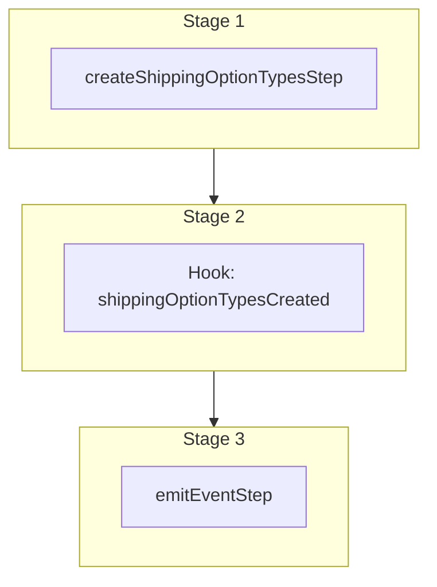

This documentation provides a reference to the `createShippingOptionTypesWorkflow`. It belongs to the `@medusajs/medusa/core-flows` package.

This workflow creates one or more shipping option types. It's used by the
[Create Shipping Option Type Admin API Route](/api/admin/shipping-option-types/create-shipping-option-type).

This workflow has a hook that allows you to perform custom actions on the created shipping option types. For example, you can pass under `additional_data` custom data that
allows you to create custom data models linked to the shipping option types.

You can also use this workflow within your own custom workflows, allowing you to wrap custom logic around shipping option type creation.

> **Note**
>
> This is available starting from [Medusa v2.10.0](https://github.com/medusajs/medusa/releases/tag/v2.10.0).

[View source code](https://github.com/medusajs/medusa/blob/0ed927bdb7a396a8fd5f6447ed69b7b354b150d3/packages/core/core-flows/src/shipping-options/workflows/create-shipping-option-types.ts#L62)

## Examples

**API Route**

```ts title="src/api/workflow/route.ts"
import type {
  MedusaRequest,
  MedusaResponse,
} from "@medusajs/framework/http"
import { createShippingOptionTypesWorkflow } from "@medusajs/medusa/core-flows"

export async function POST(
  req: MedusaRequest,
  res: MedusaResponse
) {
  const { result } = await createShippingOptionTypesWorkflow(req.scope)
    .run({
      input: {
        shipping_option_types: [{
          label: "Standard",
          code: "standard",
          description: "Ship in 2-3 days."
        }],
        additional_data: {
          erp_id: "123"
        }
      }
    })

  res.send(result)
}
```

**Subscriber**

```ts title="src/subscribers/order-placed.ts"
import {
  type SubscriberConfig,
  type SubscriberArgs,
} from "@medusajs/framework"
import { createShippingOptionTypesWorkflow } from "@medusajs/medusa/core-flows"

export default async function handleOrderPlaced({
  event: { data },
  container,
}: SubscriberArgs < { id: string } > ) {
  const { result } = await createShippingOptionTypesWorkflow(container)
    .run({
      input: {
        shipping_option_types: [{
          label: "Standard",
          code: "standard",
          description: "Ship in 2-3 days."
        }],
        additional_data: {
          erp_id: "123"
        }
      }
    })

  console.log(result)
}

export const config: SubscriberConfig = {
  event: "order.placed",
}
```

**Scheduled Job**

```ts title="src/jobs/message-daily.ts"
import { MedusaContainer } from "@medusajs/framework/types"
import { createShippingOptionTypesWorkflow } from "@medusajs/medusa/core-flows"

export default async function myCustomJob(
  container: MedusaContainer
) {
  const { result } = await createShippingOptionTypesWorkflow(container)
    .run({
      input: {
        shipping_option_types: [{
          label: "Standard",
          code: "standard",
          description: "Ship in 2-3 days."
        }],
        additional_data: {
          erp_id: "123"
        }
      }
    })

  console.log(result)
}

export const config = {
  name: "run-once-a-day",
  schedule: "0 0 * * *",
}
```

**Another Workflow**

```ts title="src/workflows/my-workflow.ts"
import { createWorkflow } from "@medusajs/framework/workflows-sdk"
import { createShippingOptionTypesWorkflow } from "@medusajs/medusa/core-flows"

const myWorkflow = createWorkflow(
  "my-workflow",
  () => {
    const result = createShippingOptionTypesWorkflow
      .runAsStep({
        input: {
          shipping_option_types: [{
            label: "Standard",
            code: "standard",
            description: "Ship in 2-3 days."
          }],
          additional_data: {
            erp_id: "123"
          }
        }
      })
  }
)
```

<a id="createshippingoptiontypesworkflow-steps" />

## Steps



Stages follow the order in the workflow definition. Conditional steps run only when their condition is met. The step descriptions below include the conditions and reference links.

- [createShippingOptionTypesStep](/resources/references/medusa-workflows/steps/createShippingOptionTypesStep): This step creates one or more shipping option types.
  - [shippingOptionTypesCreated](/resources/references/medusa-workflows/createShippingOptionTypesWorkflow#shippingoptiontypescreated): This hook is executed after the shipping option types are created. You can consume this hook to perform custom actions on the created shipping option types.
    - [emitEventStep](/resources/references/medusa-workflows/steps/emitEventStep): This step emits an event, which you can listen to in a [subscriber](/learn/fundamentals/events-and-subscribers). You can pass data to the subscriber by including it in the `data` property. The event is only emitted after the workflow has finished successfully. So, even if it's executed in the middle of the workflow, it won't actually emit the event until the workflow has completed successfully. If the workflow fails, it won't emit the event at all.

<a id="createshippingoptiontypesworkflow-input" />

## Input

**createShippingOptionTypesWorkflow**

- `CreateShippingOptionTypesWorkflowInput`: [CreateShippingOptionTypesWorkflowInput](/resources/references/core_flows/core_core_flows_src/types/core_flowscore_core_flows_srcCreateShippingOptionTypesWorkflowInput)
  - `shipping_option_types`: [CreateShippingOptionTypeDTO](/resources/references/fulfillment/interfaces/fulfillmentCreateShippingOptionTypeDTO)\[] — The shipping option types to create.
    - `label`: `string` — The label of the shipping option type.
    - `description`: `string` (optional) — The description of the shipping option type.
    - `code`: `string` — The code of the shipping option type.
  - `additional_data`: `Record<string, unknown>` (optional) — Additional data that can be passed through the `additional_data` property in HTTP requests. Learn more in [this documentation](/learn/fundamentals/api-routes/additional-data).

<a id="createshippingoptiontypesworkflow-output" />

## Output

**createShippingOptionTypesWorkflow**

- `ShippingOptionTypeDTO[]`: [ShippingOptionTypeDTO](/resources/references/fulfillment/interfaces/fulfillmentShippingOptionTypeDTO)\[]
  - `id`: `string` — The ID of the shipping option type.
  - `label`: `string` — The label of the shipping option type.
  - `description`: `string` — The description of the shipping option type.
  - `code`: `string` — The code of the shipping option type.
  - `shipping_option_id`: `string` — The associated shipping option's ID.
  - `shipping_option`: [ShippingOptionDTO](/resources/references/fulfillment/interfaces/fulfillmentShippingOptionDTO) — The associated shipping option.
    - `id`: `string` — The ID of the shipping option.
    - `name`: `string` — The name of the shipping option.
    - `price_type`: [ShippingOptionPriceType](/resources/references/fulfillment/types/fulfillmentShippingOptionPriceType) — The type of the shipping option's price.
    - `service_zone_id`: `string` — The associated service zone's ID.
    - `shipping_profile_id`: `string` — The associated shipping profile's ID.
    - `provider_id`: `string` — The associated fulfillment provider's ID.
    - `shipping_option_type_id`: `null` | `string` — The associated shipping option type's ID.
    - `data`: `null` | `Record<string, unknown>` — The data necessary for the associated fulfillment provider to process the shipping option and, later, its associated fulfillments.
    - `metadata`: `null` | `Record<string, unknown>` — Holds custom data in key-value pairs.
    - `service_zone`: [ServiceZoneDTO](/resources/references/fulfillment/interfaces/fulfillmentServiceZoneDTO) — The associated service zone.
      - `id`: `string` — The ID of the service zone.
      - `name`: `string` — The name of the service zone.
      - `metadata`: `null` | `Record<string, unknown>` — Holds custom data in key-value pairs.
      - `fulfillment_set`: [FulfillmentSetDTO](/resources/references/fulfillment/interfaces/fulfillmentFulfillmentSetDTO) — The fulfillment set assoiated with the service zone.
      - `fulfillment_set_id`: `string` — The fulfillment set id of the service zone.
      - `geo_zones`: [GeoZoneDTO](/resources/references/fulfillment/interfaces/fulfillmentGeoZoneDTO)\[] — The geo zones assoiated with the service zone.
      - `shipping_options`: [ShippingOptionDTO](/resources/references/fulfillment/interfaces/fulfillmentShippingOptionDTO)\[] — The shipping options assoiated with the service zone.
      - `created_at`: `Date` — The creation date of the service zone.
      - `updated_at`: `Date` — The update date of the service zone.
      - `deleted_at`: `null` | `Date` — The deletion date of the service zone.
    - `shipping_profile`: [ShippingProfileDTO](/resources/references/fulfillment/interfaces/fulfillmentShippingProfileDTO) — The associated shipping profile.
      - `id`: `string` — The ID of the shipping profile.
      - `name`: `string` — The name of the shipping profile.
      - `type`: `string` — The type of the shipping profile.
      - `metadata`: `null` | `Record<string, unknown>` — Holds custom data in key-value pairs.
      - `shipping_options`: [ShippingOptionDTO](/resources/references/fulfillment/interfaces/fulfillmentShippingOptionDTO)\[] — The shipping options associated with the shipping profile.
      - `created_at`: `Date` — The creation date of the shipping profile.
      - `updated_at`: `Date` — The update date of the shipping profile.
      - `deleted_at`: `null` | `Date` — The deletion date of the shipping profile.
    - `fulfillment_provider`: [FulfillmentProviderDTO](/resources/references/fulfillment/interfaces/fulfillmentFulfillmentProviderDTO) — The associated fulfillment provider.
      - `id`: `string` — The ID of the fulfillment provider.
      - `name`: `string` — The name of the fulfillment provider.
      - `metadata`: `null` | `Record<string, unknown>` — Holds custom data in key-value pairs.
      - `shipping_options`: [ShippingOptionDTO](/resources/references/fulfillment/interfaces/fulfillmentShippingOptionDTO)\[] — The shipping options associated with the fulfillment provider.
      - `created_at`: `Date` — The creation date of the fulfillment provider.
      - `updated_at`: `Date` — The update date of the fulfillment provider.
      - `deleted_at`: `null` | `Date` — The deletion date of the fulfillment provider.
    - `type`: [ShippingOptionTypeDTO](/resources/references/fulfillment/interfaces/fulfillmentShippingOptionTypeDTO) — The associated shipping option type.
      - `id`: `string` — The ID of the shipping option type.
      - `label`: `string` — The label of the shipping option type.
      - `description`: `string` — The description of the shipping option type.
      - `code`: `string` — The code of the shipping option type.
      - `shipping_option_id`: `string` — The associated shipping option's ID.
      - `shipping_option`: [ShippingOptionDTO](/resources/references/fulfillment/interfaces/fulfillmentShippingOptionDTO) — The associated shipping option.
      - `created_at`: `Date` — The creation date of the shipping option type.
      - `updated_at`: `Date` — The update date of the shipping option type.
      - `deleted_at`: `null` | `Date` — The deletion date of the shipping option type.
    - `rules`: [ShippingOptionRuleDTO](/resources/references/fulfillment/interfaces/fulfillmentShippingOptionRuleDTO)\[] — The rules associated with the shipping option.
      - `id`: `string` — The ID of the shipping option rule.
      - `attribute`: `string` — The attribute of the shipping option rule.
      - `operator`: `string` — The operator of the shipping option rule.

        Example:

        ```
        in
        ```
      - `value`: `null` | `object` — The values of the shipping option rule.
      - `shipping_option_id`: `string` — The associated shipping option's ID.
      - `shipping_option`: [ShippingOptionDTO](/resources/references/fulfillment/interfaces/fulfillmentShippingOptionDTO) — The associated shipping option.
      - `created_at`: `Date` — The creation date of the shipping option rule.
      - `updated_at`: `Date` — The update date of the shipping option rule.
      - `deleted_at`: `null` | `Date` — The deletion date of the shipping option rule.
    - `fulfillments`: [FulfillmentDTO](/resources/references/fulfillment/interfaces/fulfillmentFulfillmentDTO)\[] — The fulfillments associated with the shipping option.
      - `id`: `string` — The ID of the fulfillment.
      - `location_id`: `string` — The associated location's ID.
      - `packed_at`: `null` | `Date` — The date the fulfillment was packed.
      - `shipped_at`: `null` | `Date` — The date the fulfillment was shipped.
      - `delivered_at`: `null` | `Date` — The date the fulfillment was delivered.
      - `canceled_at`: `null` | `Date` — The date the fulfillment was canceled.
      - `marked_shipped_by`: `null` | `string` (optional) — The id of the user that marked fulfillment as shipped
      - `created_by`: `null` | `string` (optional) — The id of the user that created the fulfillment
      - `data`: `null` | `Record<string, unknown>` — The data necessary for the fulfillment provider to process the fulfillment.
      - `provider_id`: `string` — The associated fulfillment provider's ID.
      - `shipping_option_id`: `null` | `string` — The associated shipping option's ID.
      - `metadata`: `null` | `Record<string, unknown>` — Holds custom data in key-value pairs.
      - `shipping_option`: `null` | [ShippingOptionDTO](/resources/references/fulfillment/interfaces/fulfillmentShippingOptionDTO) — The associated shipping option.
      - `requires_shipping`: `boolean` — Flag to indidcate whether shipping is required
      - `provider`: [FulfillmentProviderDTO](/resources/references/fulfillment/interfaces/fulfillmentFulfillmentProviderDTO) — The associated fulfillment provider.
      - `delivery_address`: [FulfillmentAddressDTO](/resources/references/fulfillment/interfaces/fulfillmentFulfillmentAddressDTO) — The associated fulfillment address used for delivery.
      - `items`: [FulfillmentItemDTO](/resources/references/fulfillment/interfaces/fulfillmentFulfillmentItemDTO)\[] — The items of the fulfillment.
      - `labels`: [FulfillmentLabelDTO](/resources/references/fulfillment/interfaces/fulfillmentFulfillmentLabelDTO)\[] — The labels of the fulfillment.
      - `created_at`: `Date` — The creation date of the fulfillment.
      - `updated_at`: `Date` — The update date of the fulfillment.
      - `deleted_at`: `null` | `Date` — The deletion date of the fulfillment.
    - `created_at`: `Date` — The creation date of the shipping option.
    - `updated_at`: `Date` — The update date of the shipping option.
    - `deleted_at`: `null` | `Date` — The deletion date of the shipping option.
  - `created_at`: `Date` — The creation date of the shipping option type.
  - `updated_at`: `Date` — The update date of the shipping option type.
  - `deleted_at`: `null` | `Date` — The deletion date of the shipping option type.

## Hooks

Hooks allow you to inject custom functionalities into the workflow. You'll receive data from the workflow, as well as additional data sent through an HTTP request.

Learn more about [Hooks](/learn/fundamentals/workflows/workflow-hooks) and [Additional Data](/learn/fundamentals/api-routes/additional-data).

### shippingOptionTypesCreated

This hook is executed after the shipping option types are created. You can consume this hook to perform custom actions on the created shipping option types.

#### Example

```ts
import { createShippingOptionTypesWorkflow } from "@medusajs/medusa/core-flows"

createShippingOptionTypesWorkflow.hooks.shippingOptionTypesCreated(
  (async ({ shipping_option_types, additional_data }, { container }) => {
    //TODO
  })
)
```

<a id="input" />

#### Input

Handlers consuming this hook accept the following input.

**shippingOptionTypesCreated**

- `input`: object — The input data for the hook.
  - `shipping_option_types`: [WorkflowDataProperties](/resources/references/workflows/types/workflowsWorkflowDataProperties)\<[ShippingOptionTypeDTO](/resources/references/fulfillment/interfaces/fulfillmentShippingOptionTypeDTO)\[]>
    - `__step__`: `string`
  - `additional_data`: `Record<string, unknown> | undefined` — Additional data that can be passed through the `additional_data` property in HTTP requests. Learn more in [this documentation](/learn/fundamentals/api-routes/additional-data).

<a id="createshippingoptiontypesworkflow-emitted-events" />

## Emitted Events

- `shipping-option-type.created` (since v2.10.0): Emitted when shipping option types are created.

  ```ts
  {
    id, // The ID of the shipping option type
  }
  ```
