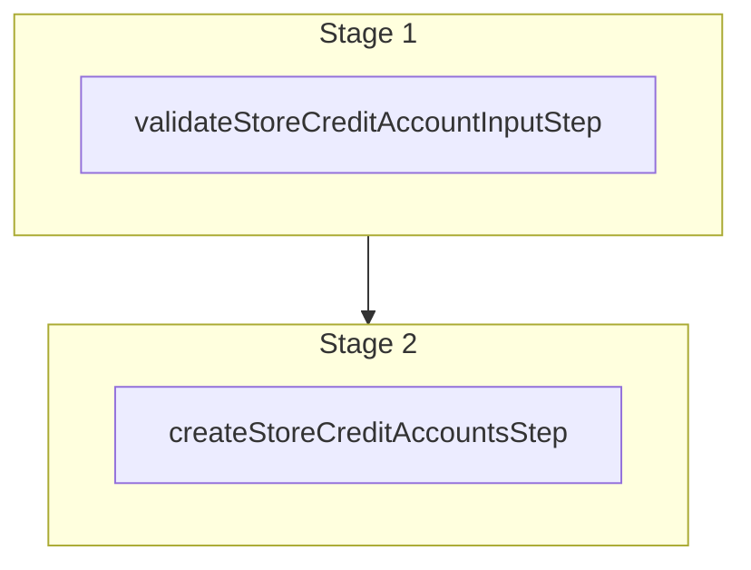

This documentation provides a reference to the `createStoreCreditAccountsWorkflow`. It belongs to the `@medusajs/medusa/core-flows` package.

This workflow creates one or more store credit accounts after validating the input.

You can use this workflow within your own customizations or custom workflows,
allowing you to wrap custom logic around store credit account creation.

[View source code](https://github.com/medusajs/medusa/blob/0ed927bdb7a396a8fd5f6447ed69b7b354b150d3/packages/plugins/loyalty/src/workflows/store-credit/workflows/create-store-credit-accounts.ts#L77)

## Examples

**API Route**

```ts title="src/api/workflow/route.ts"
import type {
  MedusaRequest,
  MedusaResponse,
} from "@medusajs/framework/http"
import { createStoreCreditAccountsWorkflow } from "@medusajs/loyalty-plugin/workflows"

export async function POST(
  req: MedusaRequest,
  res: MedusaResponse
) {
  const { result } = await createStoreCreditAccountsWorkflow(req.scope)
    .run({
      input: [{
        customer_id: "cust_123",
        currency_code: "usd",
      }, ],
    })

  res.send(result)
}
```

**Subscriber**

```ts title="src/subscribers/order-placed.ts"
import {
  type SubscriberConfig,
  type SubscriberArgs,
} from "@medusajs/framework"
import { createStoreCreditAccountsWorkflow } from "@medusajs/loyalty-plugin/workflows"

export default async function handleOrderPlaced({
  event: { data },
  container,
}: SubscriberArgs < { id: string } > ) {
  const { result } = await createStoreCreditAccountsWorkflow(container)
    .run({
      input: [{
        customer_id: "cust_123",
        currency_code: "usd",
      }, ],
    })

  console.log(result)
}

export const config: SubscriberConfig = {
  event: "order.placed",
}
```

**Scheduled Job**

```ts title="src/jobs/message-daily.ts"
import { MedusaContainer } from "@medusajs/framework/types"
import { createStoreCreditAccountsWorkflow } from "@medusajs/loyalty-plugin/workflows"

export default async function myCustomJob(
  container: MedusaContainer
) {
  const { result } = await createStoreCreditAccountsWorkflow(container)
    .run({
      input: [{
        customer_id: "cust_123",
        currency_code: "usd",
      }, ],
    })

  console.log(result)
}

export const config = {
  name: "run-once-a-day",
  schedule: "0 0 * * *",
}
```

**Another Workflow**

```ts title="src/workflows/my-workflow.ts"
import { createWorkflow } from "@medusajs/framework/workflows-sdk"
import { createStoreCreditAccountsWorkflow } from "@medusajs/loyalty-plugin/workflows"

const myWorkflow = createWorkflow(
  "my-workflow",
  () => {
    const result = createStoreCreditAccountsWorkflow
      .runAsStep({
        input: [{
          customer_id: "cust_123",
          currency_code: "usd",
        }, ],
      })
  }
)
```

<a id="createstorecreditaccountsworkflow-steps" />

## Steps



Stages follow the order in the workflow definition. Conditional steps run only when their condition is met. The step descriptions below include the conditions and reference links.

- [validateStoreCreditAccountInputStep](/resources/references/medusa-workflows/validateStoreCreditAccountInputStep): This step validates the input for creating store credit accounts. It throws an error if no input is provided or if any entry is missing a currency code.
  - [createStoreCreditAccountsStep](/resources/references/medusa-workflows/steps/createStoreCreditAccountsStep): This step creates store credit accounts. If no code is provided, a unique code prefixed with "SC" is automatically generated. The step supports rollback by deleting the created accounts.

<a id="createstorecreditaccountsworkflow-input" />

## Input

**createStoreCreditAccountsWorkflow**

- `CreateStoreCreditAccountsWorkflowInput`: [CreateStoreCreditAccountsWorkflowInput](/resources/references/core_flows/plugins_loyalty_src_workflows/types/core_flowsplugins_loyalty_src_workflowsCreateStoreCreditAccountsWorkflowInput)
  - `code`: `string` (optional) — An optional code for the store credit account. If not provided, one is auto-generated.
  - `customer_id`: `string` — The ID of the customer who owns the store credit account.
  - `currency_code`: `string` — The currency of the store credit account.

<a id="createstorecreditaccountsworkflow-output" />

## Output

**createStoreCreditAccountsWorkflow**

- `ModuleStoreCreditAccount[]`: [ModuleStoreCreditAccount](/resources/references/store_credit/types/store_creditModuleStoreCreditAccount)\[]
  - `id`: `string` — The store credit account's ID.
  - `customer_id`: `string` (optional) — The ID of the customer who owns this account, if any.
  - `code`: `string` (optional) — The unique code that identifies this account, used for anonymous or gift card accounts.
  - `currency_code`: `string` — The three-letter ISO currency code of the account's balance.

    Example:

    ```
    usd
    ```
  - `credits`: [BigNumberValue](/resources/references/store_credit/types/store_creditBigNumberValue) — The total amount credited to this account.
    - `numeric`: `number`
    - `raw`: [BigNumberRawValue](/resources/references/store_credit/types/store_creditBigNumberRawValue) (optional)
      - `value`: `string` | `number`
    - `bigNumber`: `BigNumber` (optional)
  - `debits`: [BigNumberValue](/resources/references/store_credit/types/store_creditBigNumberValue) — The total amount debited from this account.
    - `numeric`: `number`
    - `raw`: [BigNumberRawValue](/resources/references/store_credit/types/store_creditBigNumberRawValue) (optional)
      - `value`: `string` | `number`
    - `bigNumber`: `BigNumber` (optional)
  - `balance`: [BigNumberValue](/resources/references/store_credit/types/store_creditBigNumberValue) — The current balance of this account (credits minus debits).
    - `numeric`: `number`
    - `raw`: [BigNumberRawValue](/resources/references/store_credit/types/store_creditBigNumberRawValue) (optional)
      - `value`: `string` | `number`
    - `bigNumber`: `BigNumber` (optional)
  - `metadata`: `Record<string, unknown>` — Custom key-value pairs attached to this account.
  - `created_at`: `string` — The date the account was created.
  - `updated_at`: `string` — The date the account was last updated.
