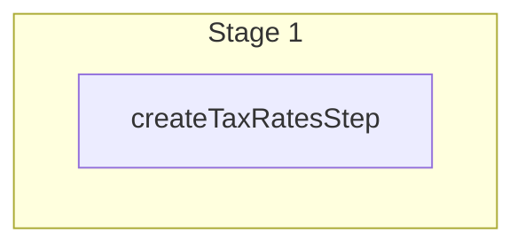

This documentation provides a reference to the `createTaxRatesWorkflow`. It belongs to the `@medusajs/medusa/core-flows` package.

This workflow creates one or more tax rates. It's used by the
[Create Tax Rates Admin API Route](/api/admin/tax-rates/create-tax-rate).

You can use this workflow within your own customizations or custom workflows, allowing you
to create tax rates in your custom flows.

[View source code](https://github.com/medusajs/medusa/blob/0ed927bdb7a396a8fd5f6447ed69b7b354b150d3/packages/core/core-flows/src/tax/workflows/create-tax-rates.ts#L42)

## Examples

**API Route**

```ts title="src/api/workflow/route.ts"
import type {
  MedusaRequest,
  MedusaResponse,
} from "@medusajs/framework/http"
import { createTaxRatesWorkflow } from "@medusajs/medusa/core-flows"

export async function POST(
  req: MedusaRequest,
  res: MedusaResponse
) {
  const { result } = await createTaxRatesWorkflow(req.scope)
    .run({
      input: [{
        tax_region_id: "txreg_123",
        name: "Default"
      }]
    })

  res.send(result)
}
```

**Subscriber**

```ts title="src/subscribers/order-placed.ts"
import {
  type SubscriberConfig,
  type SubscriberArgs,
} from "@medusajs/framework"
import { createTaxRatesWorkflow } from "@medusajs/medusa/core-flows"

export default async function handleOrderPlaced({
  event: { data },
  container,
}: SubscriberArgs < { id: string } > ) {
  const { result } = await createTaxRatesWorkflow(container)
    .run({
      input: [{
        tax_region_id: "txreg_123",
        name: "Default"
      }]
    })

  console.log(result)
}

export const config: SubscriberConfig = {
  event: "order.placed",
}
```

**Scheduled Job**

```ts title="src/jobs/message-daily.ts"
import { MedusaContainer } from "@medusajs/framework/types"
import { createTaxRatesWorkflow } from "@medusajs/medusa/core-flows"

export default async function myCustomJob(
  container: MedusaContainer
) {
  const { result } = await createTaxRatesWorkflow(container)
    .run({
      input: [{
        tax_region_id: "txreg_123",
        name: "Default"
      }]
    })

  console.log(result)
}

export const config = {
  name: "run-once-a-day",
  schedule: "0 0 * * *",
}
```

**Another Workflow**

```ts title="src/workflows/my-workflow.ts"
import { createWorkflow } from "@medusajs/framework/workflows-sdk"
import { createTaxRatesWorkflow } from "@medusajs/medusa/core-flows"

const myWorkflow = createWorkflow(
  "my-workflow",
  () => {
    const result = createTaxRatesWorkflow
      .runAsStep({
        input: [{
          tax_region_id: "txreg_123",
          name: "Default"
        }]
      })
  }
)
```

<a id="createtaxratesworkflow-steps" />

## Steps



Stages follow the order in the workflow definition. Conditional steps run only when their condition is met. The step descriptions below include the conditions and reference links.

- [createTaxRatesStep](/resources/references/medusa-workflows/steps/createTaxRatesStep): This step creates one or more tax rates.

<a id="createtaxratesworkflow-input" />

## Input

**createTaxRatesWorkflow**

- `CreateTaxRatesWorkflowInput`: [CreateTaxRatesWorkflowInput](/resources/references/core_flows/core_core_flows_src/types/core_flowscore_core_flows_srcCreateTaxRatesWorkflowInput)
  - `tax_region_id`: `string` — The associated tax region's ID.
  - `rate`: `null` | `number` (optional) — The rate to charge.

    Example:

    ```
    10
    ```
  - `code`: `null` | `string` (optional) — The code of the tax rate.
  - `name`: `string` — The name of the tax rate.
  - `rules`: Omit\<[CreateTaxRateRuleDTO](/resources/references/tax/interfaces/taxCreateTaxRateRuleDTO), "tax\_rate\_id">\[] (optional) — The rules of the tax rate.
    - `reference`: `string` — The snake-case name of the data model that the tax rule references. For example, `product`. Learn more in [this guide](/resources/commerce-modules/tax/tax-rates-and-rules#override-tax-rates-with-rules).
    - `reference_id`: `string` — The ID of the record of the data model that the tax rule references. For example, `prod_123`. Learn more in [this guide](/resources/commerce-modules/tax/tax-rates-and-rules#override-tax-rates-with-rules).
    - `metadata`: [MetadataType](/resources/references/tax/types/taxMetadataType) (optional) — Holds custom data in key-value pairs.
    - `created_by`: `null` | `string` (optional) — Who created the tax rate rule. For example, the ID of the user that created it.
  - `is_default`: `boolean` (optional) — Whether the tax rate is default.
  - `created_by`: `string` (optional) — Who created the tax rate. For example, the ID of the user that created the tax rate.
  - `metadata`: [MetadataType](/resources/references/tax/types/taxMetadataType) (optional) — Holds custom data in key-value pairs.

<a id="createtaxratesworkflow-output" />

## Output

**createTaxRatesWorkflow**

- `CreateTaxRatesWorkflowOutput`: [CreateTaxRatesWorkflowOutput](/resources/references/core_flows/core_core_flows_src/types/core_flowscore_core_flows_srcCreateTaxRatesWorkflowOutput)
  - `id`: `string` — The ID of the tax rate.
  - `rate`: `null` | `number` — The rate to charge.

    Example:

    ```
    10
    ```
  - `code`: `null` | `string` — The code the tax rate is identified by.
  - `name`: `string` — The name of the Tax Rate.

    Example:

    ```
    VAT
    ```
  - `metadata`: `null` | `Record<string, unknown>` — Holds custom data in key-value pairs.
  - `tax_region_id`: `string` — The ID of the associated tax region.
  - `is_combinable`: `boolean` — Whether the tax rate should be combined with parent rates. Learn more [here](/resources/commerce-modules/tax/tax-rates-and-rules#combinable-tax-rates).
  - `is_default`: `boolean` — Whether the tax rate is the default rate for the region.
  - `created_at`: `string` | `Date` — The creation date of the tax rate.
  - `updated_at`: `string` | `Date` — The update date of the tax rate.
  - `deleted_at`: `null` | `Date` — The deletion date of the tax rate.
  - `created_by`: `null` | `string` — Who created the tax rate. For example, the ID of the user that created the tax rate.
