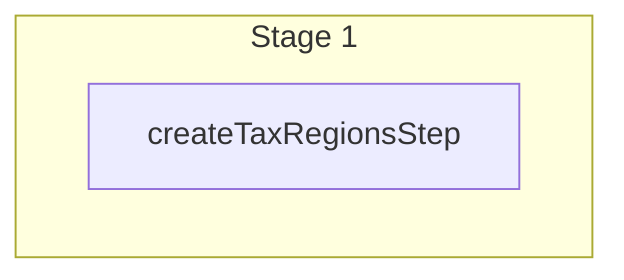

This documentation provides a reference to the `createTaxRegionsWorkflow`. It belongs to the `@medusajs/medusa/core-flows` package.

This workflow creates one or more tax regions. It's used by the
[Create Tax Region Admin API Route](/api/admin/tax-regions/create-tax-region).

You can use this workflow within your own customizations or custom workflows, allowing you
to create tax regions in your custom flows.

[View source code](https://github.com/medusajs/medusa/blob/0ed927bdb7a396a8fd5f6447ed69b7b354b150d3/packages/core/core-flows/src/tax/workflows/create-tax-regions.ts#L44)

## Examples

**API Route**

```ts title="src/api/workflow/route.ts"
import type {
  MedusaRequest,
  MedusaResponse,
} from "@medusajs/framework/http"
import { createTaxRegionsWorkflow } from "@medusajs/medusa/core-flows"

export async function POST(
  req: MedusaRequest,
  res: MedusaResponse
) {
  const { result } = await createTaxRegionsWorkflow(req.scope)
    .run({
      input: [{
        country_code: "us",
      }]
    })

  res.send(result)
}
```

**Subscriber**

```ts title="src/subscribers/order-placed.ts"
import {
  type SubscriberConfig,
  type SubscriberArgs,
} from "@medusajs/framework"
import { createTaxRegionsWorkflow } from "@medusajs/medusa/core-flows"

export default async function handleOrderPlaced({
  event: { data },
  container,
}: SubscriberArgs < { id: string } > ) {
  const { result } = await createTaxRegionsWorkflow(container)
    .run({
      input: [{
        country_code: "us",
      }]
    })

  console.log(result)
}

export const config: SubscriberConfig = {
  event: "order.placed",
}
```

**Scheduled Job**

```ts title="src/jobs/message-daily.ts"
import { MedusaContainer } from "@medusajs/framework/types"
import { createTaxRegionsWorkflow } from "@medusajs/medusa/core-flows"

export default async function myCustomJob(
  container: MedusaContainer
) {
  const { result } = await createTaxRegionsWorkflow(container)
    .run({
      input: [{
        country_code: "us",
      }]
    })

  console.log(result)
}

export const config = {
  name: "run-once-a-day",
  schedule: "0 0 * * *",
}
```

**Another Workflow**

```ts title="src/workflows/my-workflow.ts"
import { createWorkflow } from "@medusajs/framework/workflows-sdk"
import { createTaxRegionsWorkflow } from "@medusajs/medusa/core-flows"

const myWorkflow = createWorkflow(
  "my-workflow",
  () => {
    const result = createTaxRegionsWorkflow
      .runAsStep({
        input: [{
          country_code: "us",
        }]
      })
  }
)
```

<a id="createtaxregionsworkflow-steps" />

## Steps



Stages follow the order in the workflow definition. Conditional steps run only when their condition is met. The step descriptions below include the conditions and reference links.

- [createTaxRegionsStep](/resources/references/medusa-workflows/steps/createTaxRegionsStep): This step creates one or more tax regions.

<a id="createtaxregionsworkflow-input" />

## Input

**createTaxRegionsWorkflow**

- `CreateTaxRegionsWorkflowInput`: [CreateTaxRegionsWorkflowInput](/resources/references/core_flows/core_core_flows_src/types/core_flowscore_core_flows_srcCreateTaxRegionsWorkflowInput)
  - `country_code`: `string` — The ISO 3 character country code of the tax region.
  - `province_code`: `null` | `string` (optional) — The lower-case [ISO 3166-2](https://en.wikipedia.org/wiki/ISO_3166-2) province or state code of the tax region.
  - `parent_id`: `null` | `string` (optional) — The ID of the tax region's parent.
  - `provider_id`: `null` | `string` (optional) — The ID of the tax provider for the region.
  - `metadata`: [MetadataType](/resources/references/tax/types/taxMetadataType) (optional) — Holds custom data in key-value pairs.
  - `created_by`: `string` (optional) — Who created the tax region. For example, the ID of the user that created the tax region.
  - `default_tax_rate`: `object` (optional) — The default tax rate of the tax region.
    - `rate`: `null` | `number` (optional) — The rate to charge.

      Example:

      ```
      10
      ```
    - `code`: `null` | `string` (optional) — The code of the tax rate.
    - `name`: `string` — The name of the tax rate.
    - `metadata`: [MetadataType](/resources/references/tax/types/taxMetadataType) (optional) — Holds custom data in key-value pairs.

<a id="createtaxregionsworkflow-output" />

## Output

**createTaxRegionsWorkflow**

- `CreateTaxRegionsWorkflowOutput`: [CreateTaxRegionsWorkflowOutput](/resources/references/core_flows/core_core_flows_src/types/core_flowscore_core_flows_srcCreateTaxRegionsWorkflowOutput)
  - `id`: `string` — The ID of the tax region.
  - `country_code`: `string` — The ISO 2 character country code of the tax region.
  - `province_code`: `null` | `string` — The lower-case [ISO 3166-2](https://en.wikipedia.org/wiki/ISO_3166-2) province or state code of the tax region.
  - `parent_id`: `null` | `string` — The ID of the tax region's parent tax region.
  - `provider_id`: `null` | `string` — The ID of the tax provider for the region.
  - `metadata`: `null` | `Record<string, unknown>` — Holds custom data in key-value pairs.
  - `created_at`: `string` | `Date` — The creation date of the tax region.
  - `updated_at`: `string` | `Date` — The update date of the tax region.
  - `created_by`: `null` | `string` — Who created the tax region. For example, the ID of the user that created the tax region.
  - `deleted_at`: `null` | `string` | `Date` — The deletion date of the tax region.
