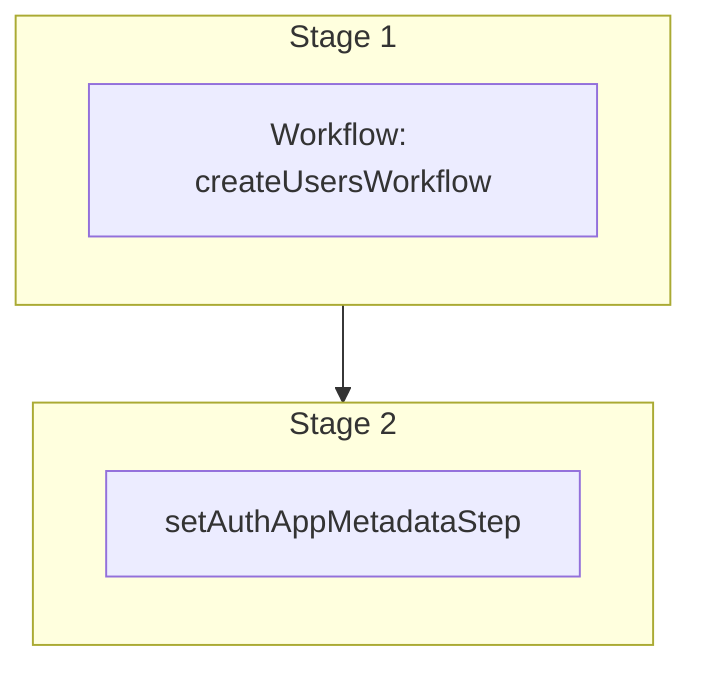

This documentation provides a reference to the `createUserAccountWorkflow`. It belongs to the `@medusajs/medusa/core-flows` package.

This workflow creates a user and attaches it to an auth identity.

You can create an auth identity first using the [Retrieve Registration JWT Token API Route](/api/admin/auth/retrieve-registration-jwt-token).
Learn more about basic authentication flows in [this documentation](/resources/commerce-modules/auth/authentication-route).

You can use this workflow within your customizations or your own custom workflows, allowing you to
register or create user accounts within your custom flows.

[View source code](https://github.com/medusajs/medusa/blob/0ed927bdb7a396a8fd5f6447ed69b7b354b150d3/packages/core/core-flows/src/user/workflows/create-user-account.ts#L52)

## Examples

**API Route**

```ts title="src/api/workflow/route.ts"
import type {
  MedusaRequest,
  MedusaResponse,
} from "@medusajs/framework/http"
import { createUserAccountWorkflow } from "@medusajs/medusa/core-flows"

export async function POST(
  req: MedusaRequest,
  res: MedusaResponse
) {
  const { result } = await createUserAccountWorkflow(req.scope)
    .run({
      input: {
        authIdentityId: "au_123",
        userData: {
          email: "example@gmail.com",
          first_name: "John",
          last_name: "Doe",
        }
      }
    })

  res.send(result)
}
```

**Subscriber**

```ts title="src/subscribers/order-placed.ts"
import {
  type SubscriberConfig,
  type SubscriberArgs,
} from "@medusajs/framework"
import { createUserAccountWorkflow } from "@medusajs/medusa/core-flows"

export default async function handleOrderPlaced({
  event: { data },
  container,
}: SubscriberArgs < { id: string } > ) {
  const { result } = await createUserAccountWorkflow(container)
    .run({
      input: {
        authIdentityId: "au_123",
        userData: {
          email: "example@gmail.com",
          first_name: "John",
          last_name: "Doe",
        }
      }
    })

  console.log(result)
}

export const config: SubscriberConfig = {
  event: "order.placed",
}
```

**Scheduled Job**

```ts title="src/jobs/message-daily.ts"
import { MedusaContainer } from "@medusajs/framework/types"
import { createUserAccountWorkflow } from "@medusajs/medusa/core-flows"

export default async function myCustomJob(
  container: MedusaContainer
) {
  const { result } = await createUserAccountWorkflow(container)
    .run({
      input: {
        authIdentityId: "au_123",
        userData: {
          email: "example@gmail.com",
          first_name: "John",
          last_name: "Doe",
        }
      }
    })

  console.log(result)
}

export const config = {
  name: "run-once-a-day",
  schedule: "0 0 * * *",
}
```

**Another Workflow**

```ts title="src/workflows/my-workflow.ts"
import { createWorkflow } from "@medusajs/framework/workflows-sdk"
import { createUserAccountWorkflow } from "@medusajs/medusa/core-flows"

const myWorkflow = createWorkflow(
  "my-workflow",
  () => {
    const result = createUserAccountWorkflow
      .runAsStep({
        input: {
          authIdentityId: "au_123",
          userData: {
            email: "example@gmail.com",
            first_name: "John",
            last_name: "Doe",
          }
        }
      })
  }
)
```

<a id="createuseraccountworkflow-steps" />

## Steps



Stages follow the order in the workflow definition. Conditional steps run only when their condition is met. The step descriptions below include the conditions and reference links.

- [createUsersWorkflow](/resources/references/medusa-workflows/createUsersWorkflow): Create one or more users with optional role assignment.
  - [setAuthAppMetadataStep](/resources/references/medusa-workflows/steps/setAuthAppMetadataStep): This step sets the `app_metadata` property of an auth identity. This is useful to associate a user (whether it's an admin user or customer) with an auth identity that allows them to authenticate into Medusa. You can learn more about auth identites in [this documentation](/resources/commerce-modules/auth/auth-identity-and-actor-types). To use this for a custom actor type, check out [this guide](/resources/commerce-modules/auth/create-actor-type) that explains how to create a custom `manager` actor type and manage its users.

<a id="createuseraccountworkflow-input" />

## Input

**createUserAccountWorkflow**

- `CreateUserAccountWorkflowInput`: [CreateUserAccountWorkflowInput](/resources/references/core_flows/core_core_flows_src/types/core_flowscore_core_flows_srcCreateUserAccountWorkflowInput)
  - `authIdentityId`: `string` — The ID of the auth identity to attach the user to.
  - `userData`: [CreateUserDTO](/resources/references/user/interfaces/userCreateUserDTO) — The details of the user to create.
    - `email`: `string` — The email of the user.
    - `first_name`: `null` | `string` (optional) — The first name of the user.
    - `last_name`: `null` | `string` (optional) — The last name of the user.
    - `avatar_url`: `null` | `string` (optional) — The avatar URL of the user.
    - `metadata`: `null` | `Record<string, unknown>` (optional) — Holds custom data in key-value pairs.

<a id="createuseraccountworkflow-output" />

## Output

**createUserAccountWorkflow**

- `UserDTO`: [UserDTO](/resources/references/user/interfaces/userUserDTO) — The user details.
  - `id`: `string` — The ID of the user.
  - `email`: `string` — The email of the user.
  - `first_name`: `null` | `string` — The first name of the user.
  - `last_name`: `null` | `string` — The last name of the user.
  - `avatar_url`: `null` | `string` — The avatar URL of the user.
  - `metadata`: `null` | `Record<string, unknown>` — Holds custom data in key-value pairs.
  - `roles`: `null` | `string`\[] (optional) — The RBAC roles assigned to the user.
  - `created_at`: `Date` — The creation date of the user.
  - `updated_at`: `Date` — The updated date of the user.
  - `deleted_at`: `null` | `Date` — The deletion date of the user.

<a id="createuseraccountworkflow-emitted-events" />

## Emitted Events

- `user.created`: Emitted when users are created.

  ```ts
  {
    id, // The ID of the user
  }
  ```
