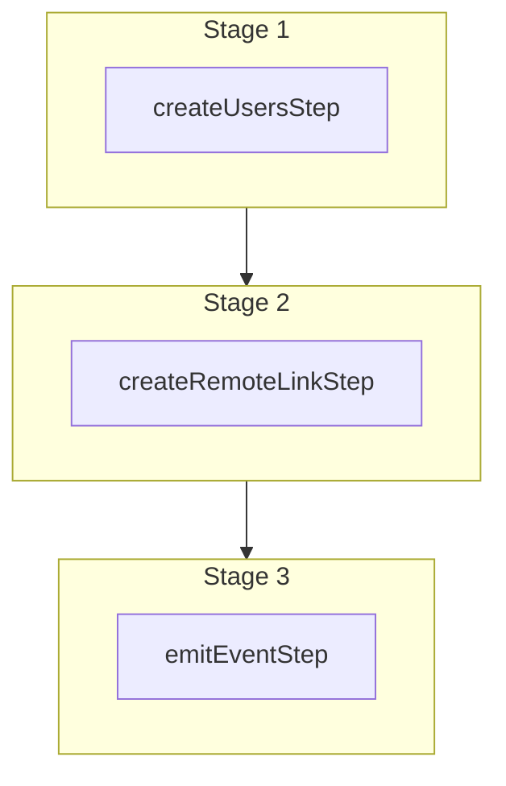

This documentation provides a reference to the `createUsersWorkflow`. It belongs to the `@medusajs/medusa/core-flows` package.

This workflow creates one or more users. It's used by other workflows, such
as [acceptInviteWorkflow](/resources/references/medusa-workflows/acceptInviteWorkflow) to create a user for an invite.

You can attach an auth identity to each user to allow the user to log in using the
[setAuthAppMetadataStep](/resources/references/medusa-workflows/steps/setAuthAppMetadataStep). Learn more about auth identities in
[this documentation](/resources/commerce-modules/auth/auth-identity-and-actor-types).

You can provide roles to be assigned to each user during creation.

You can use this workflow within your customizations or your own custom workflows, allowing you to
create users within your custom flows.

[View source code](https://github.com/medusajs/medusa/blob/0ed927bdb7a396a8fd5f6447ed69b7b354b150d3/packages/core/core-flows/src/user/workflows/create-users.ts#L45)

## Examples

**API Route**

```ts title="src/api/workflow/route.ts"
import type {
  MedusaRequest,
  MedusaResponse,
} from "@medusajs/framework/http"
import { createUsersWorkflow } from "@medusajs/medusa/core-flows"

export async function POST(
  req: MedusaRequest,
  res: MedusaResponse
) {
  const { result } = await createUsersWorkflow(req.scope)
    .run({
      input: {
        users: [{
          email: "example@gmail.com",
          first_name: "John",
          last_name: "Doe",
          roles: ["role_super_admin"]
        }]
      }
    })

  res.send(result)
}
```

**Subscriber**

```ts title="src/subscribers/order-placed.ts"
import {
  type SubscriberConfig,
  type SubscriberArgs,
} from "@medusajs/framework"
import { createUsersWorkflow } from "@medusajs/medusa/core-flows"

export default async function handleOrderPlaced({
  event: { data },
  container,
}: SubscriberArgs < { id: string } > ) {
  const { result } = await createUsersWorkflow(container)
    .run({
      input: {
        users: [{
          email: "example@gmail.com",
          first_name: "John",
          last_name: "Doe",
          roles: ["role_super_admin"]
        }]
      }
    })

  console.log(result)
}

export const config: SubscriberConfig = {
  event: "order.placed",
}
```

**Scheduled Job**

```ts title="src/jobs/message-daily.ts"
import { MedusaContainer } from "@medusajs/framework/types"
import { createUsersWorkflow } from "@medusajs/medusa/core-flows"

export default async function myCustomJob(
  container: MedusaContainer
) {
  const { result } = await createUsersWorkflow(container)
    .run({
      input: {
        users: [{
          email: "example@gmail.com",
          first_name: "John",
          last_name: "Doe",
          roles: ["role_super_admin"]
        }]
      }
    })

  console.log(result)
}

export const config = {
  name: "run-once-a-day",
  schedule: "0 0 * * *",
}
```

**Another Workflow**

```ts title="src/workflows/my-workflow.ts"
import { createWorkflow } from "@medusajs/framework/workflows-sdk"
import { createUsersWorkflow } from "@medusajs/medusa/core-flows"

const myWorkflow = createWorkflow(
  "my-workflow",
  () => {
    const result = createUsersWorkflow
      .runAsStep({
        input: {
          users: [{
            email: "example@gmail.com",
            first_name: "John",
            last_name: "Doe",
            roles: ["role_super_admin"]
          }]
        }
      })
  }
)
```

<a id="createusersworkflow-steps" />

## Steps



Stages follow the order in the workflow definition. Conditional steps run only when their condition is met. The step descriptions below include the conditions and reference links.

- [createUsersStep](/resources/references/medusa-workflows/steps/createUsersStep): This step creates one or more users. To allow these users to log in, you must attach an auth identity to each user using the [setAuthAppMetadataStep](/resources/references/medusa-workflows/steps/setAuthAppMetadataStep).
  - [createRemoteLinkStep](/resources/references/medusa-workflows/steps/createRemoteLinkStep): This step creates links between two records of linked data models. Learn more in the [Link documentation.](/learn/fundamentals/module-links/link#create-link).
    - [emitEventStep](/resources/references/medusa-workflows/steps/emitEventStep): This step emits an event, which you can listen to in a [subscriber](/learn/fundamentals/events-and-subscribers). You can pass data to the subscriber by including it in the `data` property. The event is only emitted after the workflow has finished successfully. So, even if it's executed in the middle of the workflow, it won't actually emit the event until the workflow has completed successfully. If the workflow fails, it won't emit the event at all.

<a id="createusersworkflow-input" />

## Input

**createUsersWorkflow**

- `CreateUsersWorkflowInputDTO`: [CreateUsersWorkflowInputDTO](/resources/references/types/WorkflowTypes/UserWorkflow/interfaces/typesWorkflowTypesUserWorkflowCreateUsersWorkflowInputDTO)
  - `users`: [CreateUserDTO](/resources/references/user/interfaces/userCreateUserDTO)\[] — The users to create.
    - `email`: `string` — The email of the user.
    - `first_name`: `null` | `string` (optional) — The first name of the user.
    - `last_name`: `null` | `string` (optional) — The last name of the user.
    - `avatar_url`: `null` | `string` (optional) — The avatar URL of the user.
    - `metadata`: `null` | `Record<string, unknown>` (optional) — Holds custom data in key-value pairs.

<a id="createusersworkflow-output" />

## Output

**createUsersWorkflow**

- `UserDTO[]`: [UserDTO](/resources/references/user/interfaces/userUserDTO)\[]
  - `id`: `string` — The ID of the user.
  - `email`: `string` — The email of the user.
  - `first_name`: `null` | `string` — The first name of the user.
  - `last_name`: `null` | `string` — The last name of the user.
  - `avatar_url`: `null` | `string` — The avatar URL of the user.
  - `metadata`: `null` | `Record<string, unknown>` — Holds custom data in key-value pairs.
  - `roles`: `null` | `string`\[] (optional) — The RBAC roles assigned to the user.
  - `created_at`: `Date` — The creation date of the user.
  - `updated_at`: `Date` — The updated date of the user.
  - `deleted_at`: `null` | `Date` — The deletion date of the user.

<a id="createusersworkflow-emitted-events" />

## Emitted Events

- `user.created`: Emitted when users are created.

  ```ts
  {
    id, // The ID of the user
  }
  ```
