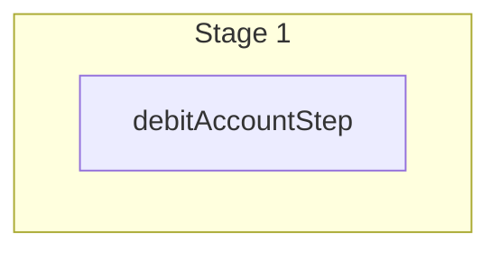

This documentation provides a reference to the `debitAccountsWorkflow`. It belongs to the `@medusajs/medusa/core-flows` package.

This workflow debits one or more store credit accounts by creating debit transactions.

You can use this workflow within your own customizations or custom workflows,
allowing you to wrap custom logic around debiting store credit accounts.

[View source code](https://github.com/medusajs/medusa/blob/0ed927bdb7a396a8fd5f6447ed69b7b354b150d3/packages/plugins/loyalty/src/workflows/store-credit/workflows/debit-accounts.ts#L33)

## Examples

**API Route**

```ts title="src/api/workflow/route.ts"
import type {
  MedusaRequest,
  MedusaResponse,
} from "@medusajs/framework/http"
import { debitAccountsWorkflow } from "@medusajs/loyalty-plugin/workflows"

export async function POST(
  req: MedusaRequest,
  res: MedusaResponse
) {
  const { result } = await debitAccountsWorkflow(req.scope)
    .run({
      input: [{
        account_id: "sca_123",
        amount: 50,
        reference: "cart",
        reference_id: "cart_123",
      }, ],
    })

  res.send(result)
}
```

**Subscriber**

```ts title="src/subscribers/order-placed.ts"
import {
  type SubscriberConfig,
  type SubscriberArgs,
} from "@medusajs/framework"
import { debitAccountsWorkflow } from "@medusajs/loyalty-plugin/workflows"

export default async function handleOrderPlaced({
  event: { data },
  container,
}: SubscriberArgs < { id: string } > ) {
  const { result } = await debitAccountsWorkflow(container)
    .run({
      input: [{
        account_id: "sca_123",
        amount: 50,
        reference: "cart",
        reference_id: "cart_123",
      }, ],
    })

  console.log(result)
}

export const config: SubscriberConfig = {
  event: "order.placed",
}
```

**Scheduled Job**

```ts title="src/jobs/message-daily.ts"
import { MedusaContainer } from "@medusajs/framework/types"
import { debitAccountsWorkflow } from "@medusajs/loyalty-plugin/workflows"

export default async function myCustomJob(
  container: MedusaContainer
) {
  const { result } = await debitAccountsWorkflow(container)
    .run({
      input: [{
        account_id: "sca_123",
        amount: 50,
        reference: "cart",
        reference_id: "cart_123",
      }, ],
    })

  console.log(result)
}

export const config = {
  name: "run-once-a-day",
  schedule: "0 0 * * *",
}
```

**Another Workflow**

```ts title="src/workflows/my-workflow.ts"
import { createWorkflow } from "@medusajs/framework/workflows-sdk"
import { debitAccountsWorkflow } from "@medusajs/loyalty-plugin/workflows"

const myWorkflow = createWorkflow(
  "my-workflow",
  () => {
    const result = debitAccountsWorkflow
      .runAsStep({
        input: [{
          account_id: "sca_123",
          amount: 50,
          reference: "cart",
          reference_id: "cart_123",
        }, ],
      })
  }
)
```

<a id="debitaccountsworkflow-steps" />

## Steps



Stages follow the order in the workflow definition. Conditional steps run only when their condition is met. The step descriptions below include the conditions and reference links.

- [debitAccountStep](/resources/references/medusa-workflows/steps/debitAccountStep): This step debits one or more store credit accounts by creating debit transactions. The step supports rollback by deleting the created transactions.

<a id="debitaccountsworkflow-input" />

## Input

**debitAccountsWorkflow**

- `DebitAccountsWorkflowInput`: [DebitAccountsWorkflowInput](/resources/references/core_flows/plugins_loyalty_src_workflows/types/core_flowsplugins_loyalty_src_workflowsDebitAccountsWorkflowInput)
  - `account_id`: `string` — The ID of the store credit account to debit.
  - `amount`: [BigNumberValue](/resources/references/store_credit/types/store_creditBigNumberValue) — The amount to debit.
    - `numeric`: `number`
    - `raw`: [BigNumberRawValue](/resources/references/store_credit/types/store_creditBigNumberRawValue) (optional)
      - `value`: `string` | `number`
    - `bigNumber`: `BigNumber` (optional)
  - `note`: `string` (optional) — An optional note describing the debit.
  - `reference`: `string` — The resource type this debit references (for example, "cart", "order").
  - `reference_id`: `string` — The ID of the referenced resource.

<a id="debitaccountsworkflow-output" />

## Output

**debitAccountsWorkflow**

- `ModuleAccountTransaction[]`: [ModuleAccountTransaction](/resources/references/store_credit/types/store_creditModuleAccountTransaction)\[]
  - `id`: `string` — The transaction's ID.
  - `account_id`: `string` — The ID of the store credit account this transaction belongs to.
  - `type`: [TransactionTypeValues](/resources/references/store_credit/types/store_creditTransactionTypeValues) — Whether this is a credit or debit transaction.
  - `amount`: [BigNumberValue](/resources/references/store_credit/types/store_creditBigNumberValue) — The transaction amount.
    - `numeric`: `number`
    - `raw`: [BigNumberRawValue](/resources/references/store_credit/types/store_creditBigNumberRawValue) (optional)
      - `value`: `string` | `number`
    - `bigNumber`: `BigNumber` (optional)
  - `account`: [ModuleStoreCreditAccount](/resources/references/store_credit/types/store_creditModuleStoreCreditAccount) — The store credit account this transaction belongs to.
    - `id`: `string` — The store credit account's ID.
    - `customer_id`: `string` (optional) — The ID of the customer who owns this account, if any.
    - `code`: `string` (optional) — The unique code that identifies this account, used for anonymous or gift card accounts.
    - `currency_code`: `string` — The three-letter ISO currency code of the account's balance.

      Example:

      ```
      usd
      ```
    - `credits`: [BigNumberValue](/resources/references/store_credit/types/store_creditBigNumberValue) — The total amount credited to this account.
      - `numeric`: `number`
      - `raw`: [BigNumberRawValue](/resources/references/store_credit/types/store_creditBigNumberRawValue) (optional)
      - `bigNumber`: `BigNumber` (optional)
    - `debits`: [BigNumberValue](/resources/references/store_credit/types/store_creditBigNumberValue) — The total amount debited from this account.
      - `numeric`: `number`
      - `raw`: [BigNumberRawValue](/resources/references/store_credit/types/store_creditBigNumberRawValue) (optional)
      - `bigNumber`: `BigNumber` (optional)
    - `balance`: [BigNumberValue](/resources/references/store_credit/types/store_creditBigNumberValue) — The current balance of this account (credits minus debits).
      - `numeric`: `number`
      - `raw`: [BigNumberRawValue](/resources/references/store_credit/types/store_creditBigNumberRawValue) (optional)
      - `bigNumber`: `BigNumber` (optional)
    - `metadata`: `Record<string, unknown>` — Custom key-value pairs attached to this account.
    - `created_at`: `string` — The date the account was created.
    - `updated_at`: `string` — The date the account was last updated.
  - `note`: `string` (optional) — An optional note describing the transaction.
  - `reference`: `string` (optional) — The resource type this transaction references (for example, "order", "cart").
  - `reference_id`: `string` (optional) — The ID of the referenced resource.
  - `metadata`: `Record<string, unknown>` — Custom key-value pairs attached to this transaction.
  - `created_at`: `string` — The date the transaction was created.
  - `updated_at`: `string` — The date the transaction was last updated.
