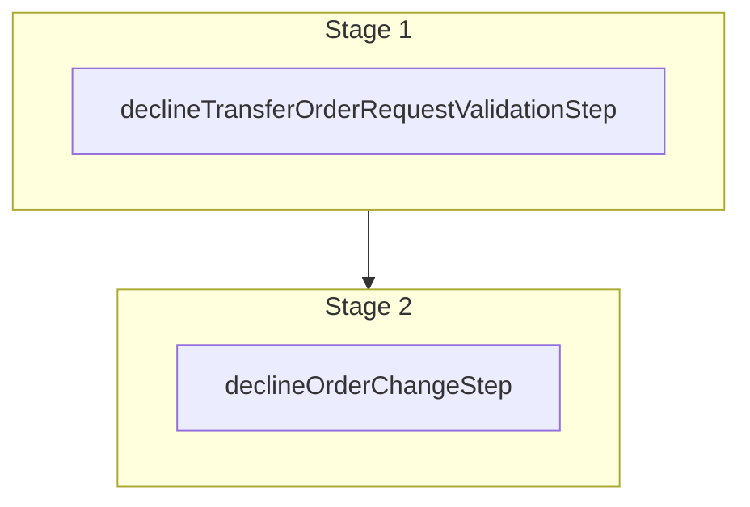

This documentation provides a reference to the `declineOrderTransferRequestWorkflow`. It belongs to the `@medusajs/medusa/core-flows` package.

This workflow declines a requested order transfer by its token. It's used by the
[Decline Order Transfer Store API Route](/api/store/orders/decline-transfer).

You can use this workflow within your customizations or your own custom workflows, allowing you to wrap custom logic around declining an order transfer request.

[View source code](https://github.com/medusajs/medusa/blob/0ed927bdb7a396a8fd5f6447ed69b7b354b150d3/packages/core/core-flows/src/order/workflows/transfer/decline-order-transfer.ts#L112)

## Examples

**API Route**

```ts title="src/api/workflow/route.ts"
import type {
  MedusaRequest,
  MedusaResponse,
} from "@medusajs/framework/http"
import { declineOrderTransferRequestWorkflow } from "@medusajs/medusa/core-flows"

export async function POST(
  req: MedusaRequest,
  res: MedusaResponse
) {
  const { result } = await declineOrderTransferRequestWorkflow(req.scope)
    .run({
      input: {
        token: "token_123",
        order_id: "order_123",
      }
    })

  res.send(result)
}
```

**Subscriber**

```ts title="src/subscribers/order-placed.ts"
import {
  type SubscriberConfig,
  type SubscriberArgs,
} from "@medusajs/framework"
import { declineOrderTransferRequestWorkflow } from "@medusajs/medusa/core-flows"

export default async function handleOrderPlaced({
  event: { data },
  container,
}: SubscriberArgs < { id: string } > ) {
  const { result } = await declineOrderTransferRequestWorkflow(container)
    .run({
      input: {
        token: "token_123",
        order_id: "order_123",
      }
    })

  console.log(result)
}

export const config: SubscriberConfig = {
  event: "order.placed",
}
```

**Scheduled Job**

```ts title="src/jobs/message-daily.ts"
import { MedusaContainer } from "@medusajs/framework/types"
import { declineOrderTransferRequestWorkflow } from "@medusajs/medusa/core-flows"

export default async function myCustomJob(
  container: MedusaContainer
) {
  const { result } = await declineOrderTransferRequestWorkflow(container)
    .run({
      input: {
        token: "token_123",
        order_id: "order_123",
      }
    })

  console.log(result)
}

export const config = {
  name: "run-once-a-day",
  schedule: "0 0 * * *",
}
```

**Another Workflow**

```ts title="src/workflows/my-workflow.ts"
import { createWorkflow } from "@medusajs/framework/workflows-sdk"
import { declineOrderTransferRequestWorkflow } from "@medusajs/medusa/core-flows"

const myWorkflow = createWorkflow(
  "my-workflow",
  () => {
    const result = declineOrderTransferRequestWorkflow
      .runAsStep({
        input: {
          token: "token_123",
          order_id: "order_123",
        }
      })
  }
)
```

<a id="declineordertransferrequestworkflow-steps" />

## Steps



Stages follow the order in the workflow definition. Conditional steps run only when their condition is met. The step descriptions below include the conditions and reference links.

- [declineTransferOrderRequestValidationStep](/resources/references/medusa-workflows/declineTransferOrderRequestValidationStep): This step validates that a requested order transfer can be declineed. If the provided token doesn't match the token of the transfer request, the step throws an error. :::note You can retrieve an order and order change details using [Query](/learn/fundamentals/module-links/query), or [useQueryGraphStep](/resources/references/medusa-workflows/steps/useQueryGraphStep). :::
  - [declineOrderChangeStep](/resources/references/medusa-workflows/steps/declineOrderChangeStep): This step declines an order change.

<a id="declineordertransferrequestworkflow-input" />

## Input

**declineOrderTransferRequestWorkflow**

- `DeclineTransferOrderRequestWorkflowInput`: [DeclineTransferOrderRequestWorkflowInput](/resources/references/types/WorkflowTypes/OrderWorkflow/types/typesWorkflowTypesOrderWorkflowDeclineTransferOrderRequestWorkflowInput)
  - `order_id`: `string` — The ID of the order to decline the transfer for.
  - `token`: `string` — The token of the order transfer request.
