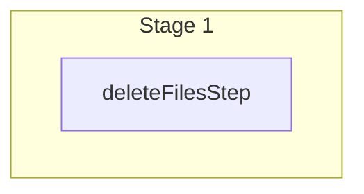

This documentation provides a reference to the `deleteFilesWorkflow`. It belongs to the `@medusajs/medusa/core-flows` package.

This workflow deletes one or more files. It's used by the
[Delete File Upload Admin API Route](/api/admin/uploads/delete-a-file).

The [File Module Provider](/resources/infrastructure-modules/file) installed
in your application will be used to delete the file from storage.

You can use this workflow within your customizations or your own custom workflows, allowing you to
delete files within your custom flows.

[View source code](https://github.com/medusajs/medusa/blob/0ed927bdb7a396a8fd5f6447ed69b7b354b150d3/packages/core/core-flows/src/file/workflows/delete-files.ts#L29)

## Examples

**API Route**

```ts title="src/api/workflow/route.ts"
import type {
  MedusaRequest,
  MedusaResponse,
} from "@medusajs/framework/http"
import { deleteFilesWorkflow } from "@medusajs/medusa/core-flows"

export async function POST(
  req: MedusaRequest,
  res: MedusaResponse
) {
  const { result } = await deleteFilesWorkflow(req.scope)
    .run({
      input: {
        ids: ["123"]
      }
    })

  res.send(result)
}
```

**Subscriber**

```ts title="src/subscribers/order-placed.ts"
import {
  type SubscriberConfig,
  type SubscriberArgs,
} from "@medusajs/framework"
import { deleteFilesWorkflow } from "@medusajs/medusa/core-flows"

export default async function handleOrderPlaced({
  event: { data },
  container,
}: SubscriberArgs < { id: string } > ) {
  const { result } = await deleteFilesWorkflow(container)
    .run({
      input: {
        ids: ["123"]
      }
    })

  console.log(result)
}

export const config: SubscriberConfig = {
  event: "order.placed",
}
```

**Scheduled Job**

```ts title="src/jobs/message-daily.ts"
import { MedusaContainer } from "@medusajs/framework/types"
import { deleteFilesWorkflow } from "@medusajs/medusa/core-flows"

export default async function myCustomJob(
  container: MedusaContainer
) {
  const { result } = await deleteFilesWorkflow(container)
    .run({
      input: {
        ids: ["123"]
      }
    })

  console.log(result)
}

export const config = {
  name: "run-once-a-day",
  schedule: "0 0 * * *",
}
```

**Another Workflow**

```ts title="src/workflows/my-workflow.ts"
import { createWorkflow } from "@medusajs/framework/workflows-sdk"
import { deleteFilesWorkflow } from "@medusajs/medusa/core-flows"

const myWorkflow = createWorkflow(
  "my-workflow",
  () => {
    const result = deleteFilesWorkflow
      .runAsStep({
        input: {
          ids: ["123"]
        }
      })
  }
)
```

<a id="deletefilesworkflow-steps" />

## Steps



Stages follow the order in the workflow definition. Conditional steps run only when their condition is met. The step descriptions below include the conditions and reference links.

- [deleteFilesStep](/resources/references/medusa-workflows/steps/deleteFilesStep): This step deletes one or more files using the installed [File Module Provider](/resources/infrastructure-modules/file). The files will be removed from the database and the storage.

<a id="deletefilesworkflow-input" />

## Input

**deleteFilesWorkflow**

- `DeleteFilesWorkflowInput`: [DeleteFilesWorkflowInput](/resources/references/core_flows/core_core_flows_src/types/core_flowscore_core_flows_srcDeleteFilesWorkflowInput)
  - `ids`: `string`\[]
